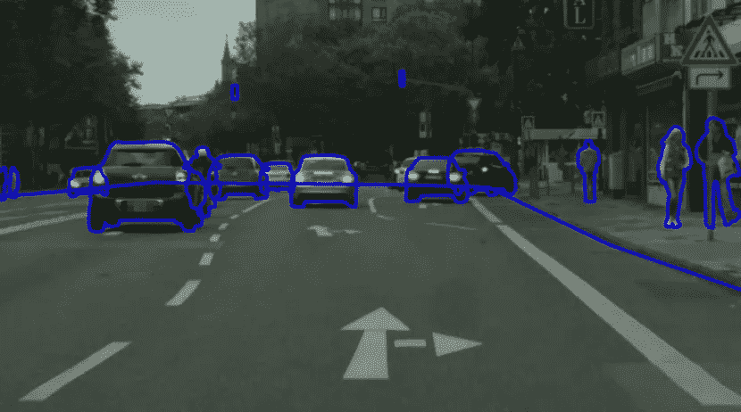

# 图像注释服务-智能汽车可驾驶区域分割项目

> 原文：<https://medium.com/nerd-for-tech/image-annotation-service-smart-cars-drivable-area-segmentation-project-eb6be849cc24?source=collection_archive---------1----------------------->

# **注释要求概述**

(1)当图像中存在不匹配、黑色块、模糊和其他损坏的场景时，不要标记它们

(2)对于路口区域，如果本车通过停止线，跳过图像；如果自我车辆没有通过停止线，行驶区域应标记为正常

(3)自我车辆在路口掉头时，不要标注行驶区域

(4)当自我车辆完全进入服务站或加油站时，不要标示行驶区域

(5)导流线内部需要标注为导流线区域

(6)无需标示非机动车道的可行驶区域

(7)仅在相同方向的可驾驶区域做标记

(8)一个多边形中可以标注的区域不要一分为二。尽量保持一个完整的区域

(9)障碍物小于 60 像素时，不需要标注，可以直接标注为行驶区域。附近的路边障碍物还是需要绕行的，不能用 60 像素的大小来判断

(10)对于小区域，不要框选小于 225 像素的区域

(11)应标记可驾驶区域，直到道路边缘。如果主路和辅路都没有道路边缘，按照主路的分割线标注，分割线以外的区域不需要标注

(12)同一车道和路缘内的所有道路都应贴上标签

(13)当自车辆在分流线附近时，可驾驶区域被标记在标记车道线的任何地方

(14)不需要在隔离墩和交通锥内标示可行驶区域。

# **标注可行驶区域的规则**

1、标注实际道路的轮廓(道路边缘)。

2、路上的障碍物需要绕开。作为一个整体，障碍的挖空部分没有被标记。一个看不清楚、分不开的远处障碍物，可以作为一个整体来标注。

3、可整体标注的区域应整体标注(行驶区域不能用一个区域标注的，应绕过挡路障碍物，分两个区域标注)

# **特例**

1、没有正常路面的图像不需要标注

2、损坏的地面可以标记为可行驶区域边缘

3、关于护栏标注，需要配合护栏的轮廓，车辆无法驶过的区域不需要标注

4、移动护栏或固定护栏的标识应与路缘的标识相同

# 结束

把你的数据标注任务外包给 [ByteBridge](https://tinyurl.com/4ekhjey7) ，你可以更便宜更快的获得高质量的 ML 训练数据集！

*   无需信用卡的免费试用:您可以快速获得样品结果，检查输出，并直接向我们的项目经理反馈。
*   100%人工验证
*   透明和标准定价:[有明确的定价](https://www.bytebridge.io/#/?module=price)(包括人工成本)

## 为什么不试一试？