# 使用 Keras 对胃肠道疾病进行图像分类并使用 StratifiedKFoldSplit 处理不平衡标签

> 原文：<https://medium.com/nerd-for-tech/image-classification-of-gastrointestinal-tract-disorders-using-keras-and-handling-imbalanced-labels-313722d7e422?source=collection_archive---------5----------------------->

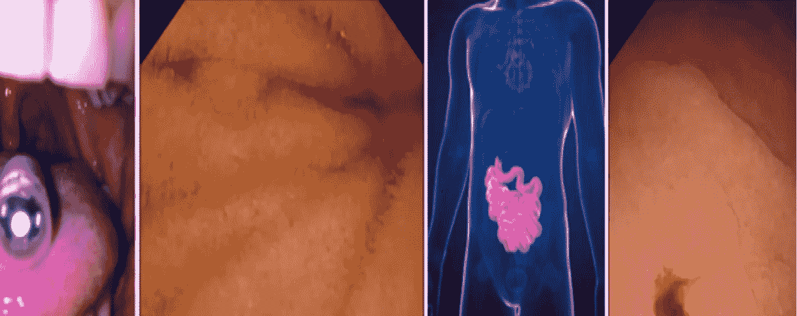

[https://research data . springer nature . com/posts/a-dataset-for-next-level-capsule-endoscope-ai-methods](https://researchdata.springernature.com/posts/a-dataset-for-next-level-capsule-endoscopy-ai-methods)

# 问题陈述

人工智能(AI)预计将对视频胶囊内窥镜(VCE)技术的未来产生深远的影响。潜力在于改进异常检测，同时减少人工劳动。然而，医学数据通常很少，研究团体无法获得，合格的医务人员很少有时间进行繁琐的标签工作。

对人体内部的视觉检查称为内窥镜检查，是几种医学专业中常用的诊断技术。当检查胃肠道内部时，可以从上方进入，称为食管胃十二指肠镜检查，用于可视化食管、胃和小肠上部(称为十二指肠)。

这里使用的数据集是“ **Kvasir-Capsule** ”数据集，它是胶囊内窥镜镜头的最大图像和视频集合之一，可用于开发检测胃肠道疾病的方法。

Kvasir-Capsule 由 117 个视频组成，可用于提取超过 470 万个图像帧。我们已经对 47，238 帧进行了标记和医学验证，并在代表 14 个不同类别的发现周围添加了边框。除了这些标记的图像，数据集中还包括 4，694，266 个未标记的帧。他们可以探索无监督或自我监督的学习。

在这里，我们将执行监督学习。

# 目标

建立机器学习模型来识别各个图像的疾病标签。

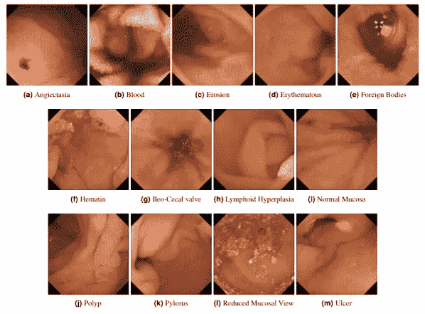

【https://paperswithcode.com/dataset/kvasir-capsule 

# 内容

小肠构成胃肠道的中部，位于胃和大肠之间。它有三到四米长，有大约 30 米的表面，包括绒毛的表面，在吸收营养方面起着至关重要的作用。因此，小肠疾病可能会导致儿童严重发育迟缓以及儿童和成人营养缺乏。

这个器官可能会受到**慢性病**的影响，比如

*   克罗恩病，
*   腹腔疾病，和
*   血管扩张

或者像恶性疾病一样

*   淋巴瘤和
*   腺癌。

这些疾病对患者和社会都是一个巨大的健康挑战，为了诊断和治疗这些疾病，经常需要对管腔进行彻底的检查。然而，由于小肠的解剖位置，通常用于上消化道和大肠的柔性内窥镜不太容易检查到小肠。自 2000 年初以来，视频胶囊内镜(VCE)已被使用，通常作为消化道出血患者的补充检查。

VCE 由一个小胶囊组成，里面有广角相机、光源、电池和其他电子设备。患者吞下胶囊，然后在胶囊被动通过胃肠道时拍摄视频。由患者携带或包含在胶囊中的记录器存储视频，然后医学专家在手术后对其进行评估。

[信息来源:[研究论文:Kvasir-Capsule，一个视频胶囊内窥镜数据集](https://www.nature.com/articles/s41597-021-00920-z)

# 图像分类发展模型

# 下载图片

```
**from google_drive_downloader import GoogleDriveDownloader as gdd****gdd.download_file_from_google_drive(file_id=’1yDcNMTI-8Zq2Mvs8qe7pLNpPx4BW5Yta’,****dest_path=’/content/drive/MyDrive/dphi/Kvasir/The Kvasir-Capsule.zip’,unzip=True)**
```

# 导入所需的包以读取培训数据

```
**import os
import pandas as pd
import numpy as np
import PIL
import cv2
#
import seaborn as sns
import matplotlib.pyplot as plt
#
import warnings
warnings.filterwarnings(“ignore”)
#
%matplotlib inline**
```

# 将数据加载到数据框架中

```
**train_data = pd.read_csv(“/content/drive/MyDrive/dphi/Kvasir/The Kvasir-Capsule/Training_set.csv”)****test_data = pd.read_csv(“/content/drive/MyDrive/dphi/Kvasir/The Kvasir-Capsule/Testing_set.csv”)****train_data.head()**
```

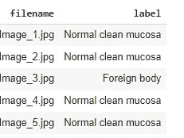

**样本数据**

# 添加训练图像的完整路径

```
**paths = [os.path.join(“/content/drive/MyDrive/dphi/Kvasir/The Kvasir-Capsule/train”, x) for x in train_data[‘filename’]]****test_paths = [os.path.join(“/content/drive/MyDrive/dphi/Kvasir/The Kvasir-Capsule/test”, x) for x in test_data[‘filename’]]****train_data[‘image_path’] = paths****test_data[‘image_path’] = test_paths****train_data.drop([‘filename’], axis = 1, inplace=True)****test_data.drop([‘filename’], axis = 1, inplace=True)****file_paths = train_data.image_path.values.tolist()****labels = train_data.label.values.tolist()
train_data = train_data[['image_path','label']]
train_data.head()**
```


**处理后的训练数据**

```
test_data.head()
```


**处理后的测试数据**

# 标签的分发

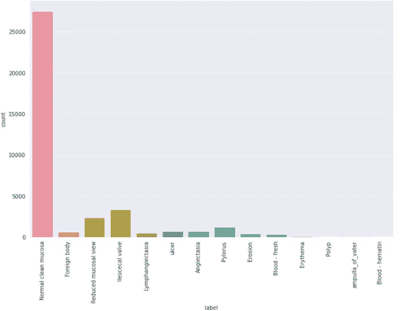

图像平衡数据集

# 图像标签

*   *‘正常清洁黏膜’，*
*   *‘异物’，*
*   *“减少的粘膜视图”，*
*   *‘回盲瓣’，*
*   *“淋巴管扩张症”，*
*   *‘溃疡’，*
*   *‘血管扩张’，*
*   *‘幽门’，*
*   *‘糜烂’，*
*   *‘新鲜血液’，*
*   *‘红斑’，*
*   *‘息肉’，*
*   *‘壶腹 _ of _ Vater’，*
*   *‘血——血红素’*

# 检查训练数据中的某些图像文件是否为空(0KB)

```
**import tqdm
import os
img_list = train_data.image_path.values.tolist()
empty_images = []
empty_index = []
for i,img in tqdm.tqdm(enumerate(img_list)):
   if os.stat(img).st_size == 0:
      try:
          empty_images.append(img)
          empty_index.append(i)
      except:
           pass**
```

有 14 个这样的大小为 0KB 的图像。从训练数据集中移除那些图像

# 导入深度学习包

```
**from sklearn.model_selection import KFold, StratifiedKFold
import tensorflow as tf
from tensorflow.keras.preproce0ssing.image import ImageDataGenerator
from tensorflow.keras import backend as K****from tensorflow.keras.layers import Dense, Activation,Dropout,Conv2D, MaxPooling2D,BatchNormalization
from tensorflow.keras.optimizers import Adam, Adamax
from tensorflow.keras.metrics import categorical_crossentropy
from tensorflow.keras import regularizers
from tensorflow.keras.preprocessing.image import ImageDataGenerator
from tensorflow.keras.models import Model, load_model, Sequential****from tensorflow.keras.layers import Dense, Dropout, Conv2D, Input, Lambda, Flatten, TimeDistributed, Activation, MaxPool2D
from tensorflow.keras.layers import Add, Reshape, MaxPooling2D, Concatenate, Embedding, RepeatVector, BatchNormalization
from tensorflow.keras.callbacks import ModelCheckpoint, EarlyStopping, ReduceLROnPlateau
from keras.regularizers import *****#
import matplotlib.pyplot as plt
from matplotlib.pyplot import imshow
import seaborn as sns
sns.set_style(‘darkgrid’)****#****import os
import shutil
import cv2
import glob****from tqdm.notebook import tqdm
from tqdm import tqdm
from PIL import Image****#
import gc
#****import warnings
warnings.filterwarnings(‘ignore’)**
```

# 创建 ImageDataGenerator 类的培训实例

```
**generator = ImageDataGenerator(rescale=1./255)**
```

# 创建 ImageDataGenerator 类的测试实例

```
test_datagen=ImageDataGenerator(rescale=1./255)test_generator=test_datagen.flow_from_dataframe(
                 dataframe=test_data,               
                 directory=None,
                 x_col=”image_path”,
                 y_col=None,
                 batch_size=1,
                 seed=42,
                 shuffle=False,
                 class_mode=None,
                 target_size=(229,229))STEP_SIZE_TEST=test_generator.n//test_generator.batch_size
```

# 用于在 k 次迭代中获取模型名称的辅助函数

```
def get_model_name(k):
      return ‘model_’+str(k)+’.h5'
```

# 定义一个函数来校准 F1 分数

```
**import keras.backend as K****def get_f1(y_true, y_pred): #taken from old keras source code
     true_positives = K.sum(K.round(K.clip(y_true * y_pred, 0, 1)))              possible_positives = K.sum(K.round(K.clip(y_true, 0, 1)))
     predicted_positives = K.sum(K.round(K.clip(y_pred, 0, 1)))
     precision = true_positives / (predicted_positives + K.epsilon())
     recall = true_positives / (possible_positives + K.epsilon())
     f1_val = 2*(precision*recall)/(precision+recall+K.epsilon())****return f1_val**
```

# 创建模型

```
**def create_model():** **model = Sequential()** **conv_base = tf.keras.applications.DenseNet121(input_shape=     (229,229,3), include_top=False, pooling=’max’,weights=’imagenet’)** **model.add(conv_base)** **model.add(BatchNormalization())** **model.add(Dense(2048, activation=’relu’,  kernel_regularizer=l1_l2(0.01)))** **model.add(BatchNormalization())** **model.add(Dense(14, activation=’softmax’))** **train_layers = [layer for layer in conv_base.layers[::-1][:5]]** **for layer in conv_base.layers:** **if layer in train_layers:** **layer.trainable = True** **return model**
```

# 模型摘要

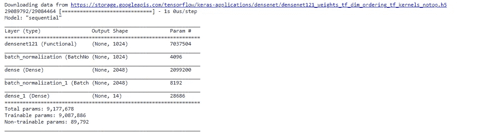

# 生成折叠并创建数据生成器，我们将使用这些生成器来训练和评估模型

```
**VALIDATION_ACCURACY = []****VALIDAITON_LOSS = []****all_preds = []****dropout=.3****lr=.001****num_epochs = 15****save_dir = ‘/content/drive/MyDrive/dphi/Kvasir/saved_models/’****fold_var = 2****n_class = 14****for train_index, val_index in skf.split(train_data,train_data.label):****training_data = train_data.iloc[train_index]****validation_data = train_data.iloc[val_index]****train_data_generator = generator.flow_from_dataframe(training_data,****directory = None,****x_col = “image_path”,****y_col = “label”,****class_mode = class_mode,****batch_size = 32,****seed = 42,****shuffle = True,****target_size=(229,229))****valid_data_generator = generator.flow_from_dataframe(validation_data,****directory = None,****x_col = “image_path”,****y_col = “label”,****class_mode = class_mode,****batch_size = 32,****seed = 42,****shuffle = True,****target_size=(229,229))****# CREATE NEW MODEL****model = create_model()****# COMPILE NEW MODEL****model.compile(optimizer =tf.keras.optimizers.Adam(learning_rate=0.001,decay=0.0001),****metrics=[“accuracy”,get_f1],****loss= tf.keras.losses.CategoricalCrossentropy(label_smoothing=0.1))****# CREATE CALLBACKS****my_callbacks = [****tf.keras.callbacks.ModelCheckpoint(save_dir+get_model_name(fold_var), monitor = ‘val_loss’,verbose = 1,save_weights_only=True, save_best_only = True),****EarlyStopping(monitor=’val_loss’, patience=5, verbose=0, mode=’min’),****ReduceLROnPlateau(monitor=’val_loss’, factor=0.1, patience=5, verbose=1, mode=’min’,min_delta=1e-4)****]****# There can be other callbacks, but just showing one because it involves the model name****# This saves the best model****# FIT THE MODEL****STEP_SIZE_TRAIN = train_data_generator.n//train_data_generator.batch_size****STEP_SIZE_VALID = valid_data_generator.n//valid_data_generator.batch_size****history = model.fit(****train_data_generator,****steps_per_epoch= STEP_SIZE_TRAIN,****epochs=10,****validation_data=valid_data_generator,****validation_steps= STEP_SIZE_VALID,****callbacks=[my_callbacks],****)****#PLOT HISTORY****# :****plt.plot(history.history[‘accuracy’],label=’Training Accuracy’)****plt.plot(history.history[‘val_accuracy’],label=’Validation Accuracy’)****plt.xlabel(‘Epochs’)****plt.ylabel(‘Accuracy’)****plt.title(‘Training Accuracy Vs Validation Accuracy’)****plt.legend()****plt.show()****#****plt.plot(history.history[‘loss’],label=’Training Loss’)****plt.plot(history.history[‘val_loss’],label=’Validation Loss’)****plt.xlabel(‘Epochs’)****plt.ylabel(‘Loss’)****plt.title(‘Training Loss Vs Validation Loss’)****plt.legend()****plt.show()****# :****# LOAD BEST MODEL to evaluate the performance of the model****model.load_weights(“/content/drive/MyDrive/dphi/Kvasir/saved_models/model_”+str(fold_var)+”.h5")****results = model.evaluate(valid_data_generator)****results = dict(zip(model.metrics_names,results))****VALIDATION_ACCURACY.append(results[‘accuracy’])****VALIDAITON_LOSS.append(results[‘loss’])****preds = model.predict(test_generator,steps=STEP_SIZE_TEST,verbose=1)****all_preds.append(preds)****#clear cache****tf.keras.backend.clear_session()****gc.collect()****fold_var += 1**
```

# 各个折叠的训练准确度与验证准确度以及训练损失与验证损失

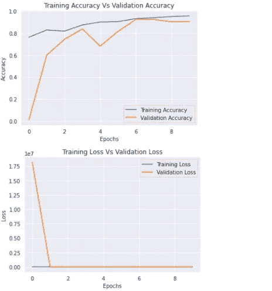

**KFOLD-0**

*   发现了 30220 个经过验证的图像文件名，属于 14 个类别。
*   发现 7556 个有效的图像文件名属于 14 类。

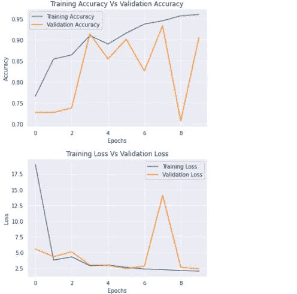

**KFOLD-1**

*   发现 30221 个验证的图像文件名属于 14 类。
*   找到了 7555 个有效的图像文件名，属于 14 个类别。

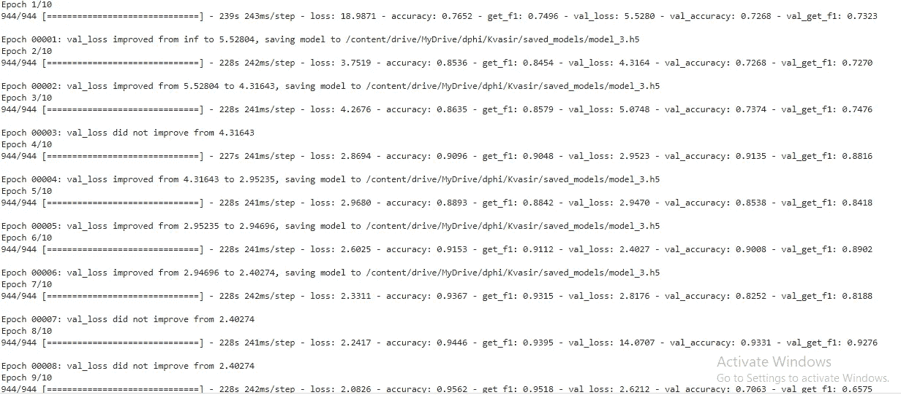

**KFOLD -2**

*   发现 30221 个验证的图像文件名属于 14 类。
*   找到了 7555 个有效的图像文件名，属于 14 个类别。

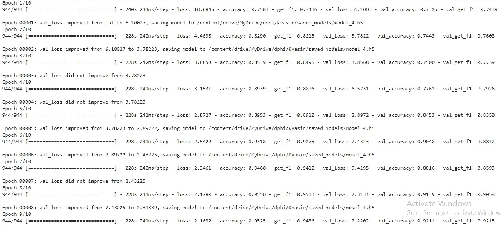

**KFOLD-3**

*   发现 30221 个验证的图像文件名属于 14 类。
*   找到了 7555 个有效的图像文件名，属于 14 个类别。

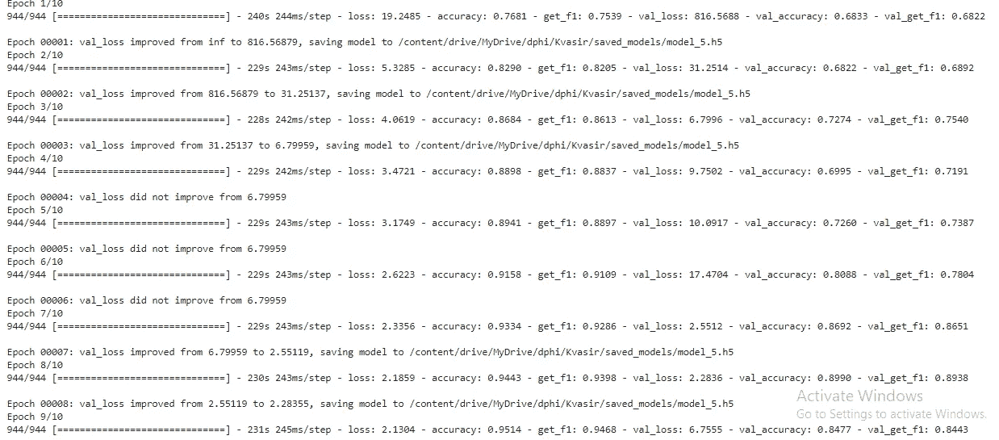

**KFOLD-4**

*   发现 30221 个验证的图像文件名属于 14 类。
*   找到了 7555 个有效的图像文件名，属于 14 个类别。

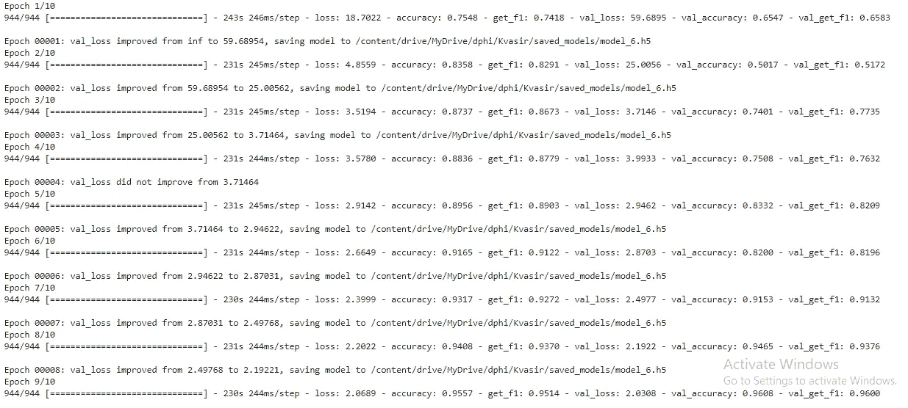

# 最终预测

平均所有折叠的预测，并校准最终预测

```
**final_pred = (all_preds[0] + all_preds[1] + all_preds[2] + all_preds[3] + all_preds[4])/5****predictions = np.argmax(final_pred,axis=1)****prediction_mapper = { v: k for k,v in valid_data_generator.class_indices.items()}**
```


# 格式化预测

```
**test['label'] = predictions****test['label'] = test['label'].map(prediction_mapper)**
```

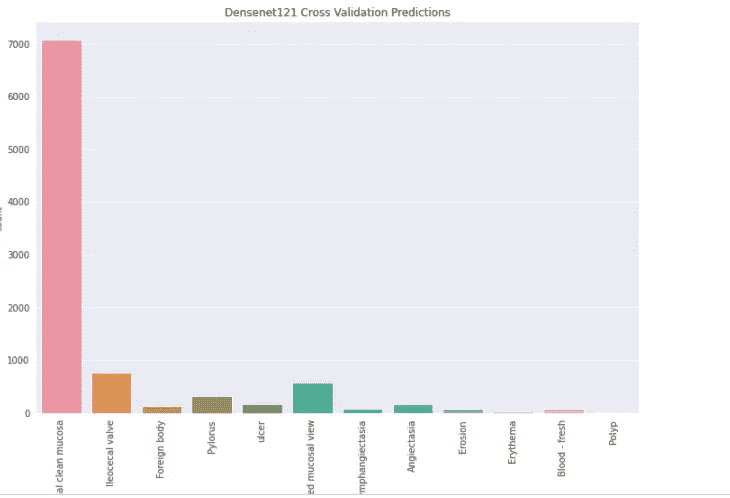

**测试图像的预测**

# 结论

在这里，由于标签的分布是严重偏斜的，很可能一个或多个折叠将很少或没有来自少数类的样本。这意味着一些或者可能许多模型评估将是误导的，因为模型只需要正确地预测多数类。

使用 StartifiedKFoldSplit 有助于按类别标签对采样进行分层，因此所有标签将在折叠中按比例分布，并且模型将学习与相应标签相关的所有可能的数据组合

# ***参考文献***

[](https://dphi.tech/challenges/data-sprint-38-the-kvasir-capsule-dataset/129/overview/about) [## A.信息和数据科学挑战| DPhi

### 通过解决模拟现实世界问题的数据科学和人工智能挑战来竞争和展示您的技能。组织…

dphi.tech](https://dphi.tech/challenges/data-sprint-38-the-kvasir-capsule-dataset/129/overview/about) 

*   [https://machine learning mastery . com/cross-validation-for-unbalanced-class ification/](https://machinelearningmastery.com/cross-validation-for-imbalanced-classification/)
*   [*https://medium . com/@ vijayabhaskar 96/tutorial-on-keras-imagedata generator-with-flow-from-data frame-8bd 5776 e45 c 1*](/@vijayabhaskar96/tutorial-on-keras-imagedatagenerator-with-flow-from-dataframe-8bd5776e45c1)