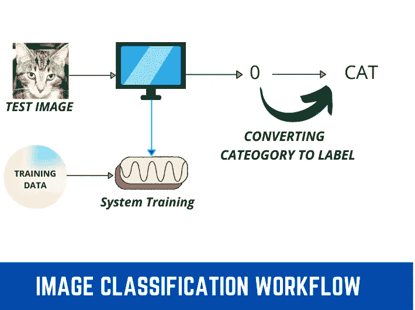
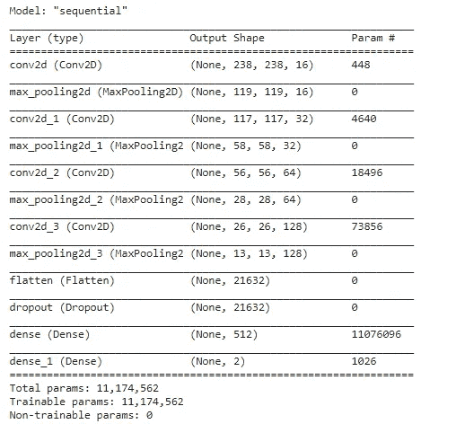

# 使用卷积神经网络(CNN)的图像分类

> 原文：<https://medium.com/nerd-for-tech/image-classification-using-convolutional-neural-networks-cnn-eef587ed0c1?source=collection_archive---------4----------------------->

众所周知，目前图像分类正变得越来越流行，其应用也在迅速增加。在这篇博客中，我们将使用卷积神经网络对皮肤癌数据进行图像分类。

> “我们将从 google colab 开始，因为 python 库、它们的依赖关系以及它的云环境都没有问题，所以我们不需要太多配置。”



影像分类工作流程

**注意** : 让我们开始实现吧，如果你按照教程一步一步来做，最后就不会出错了。

**第一步**:我们需要在 google drive 中创建一个名为“ ***【图片分类】*** 的文件夹。这不是必需的名称，您也可以用另一个名称创建文件夹。


文件夹创建视图

**Step-2** :现在，我们需要在图像分类文件夹中创建一个文件夹，里面是“***dataset”***，我们将在其中存储我们的训练和测试数据。这不是必需的名称，您也可以用另一个名称创建文件夹。


文件夹创建视图。

> 您可以使用任何数据集，但在本文中，我将重点关注二元分类，这意味着我将使用的数据集有两个类。对于多类分类，程序将是相同的，但在一些步骤需要很少的变化，我会在下面提到的每一步。

**第三步:**现在我们需要在 ***【数据集】*** 文件夹内添加数据，可以使用任何数据集，而我用过的数据集是来自 Kaggle，数据是关于 ***【皮肤癌二级分类】*** 。可以从 [***链接***](https://drive.google.com/drive/folders/1Aid67MXI7ks0l3y3CsLv4om4n_5zG9dG?usp=sharing) 下载数据集。


数据集子文件夹

**步骤 4:** 现在，我们需要在 ***【图像分类】*** 文件夹中制作一个笔记本，因为我们将在该文件中编写代码，并且还将能够从 google drive 访问数据集。

您可以打开 ***【图像分类】*** 文件夹然后点击

*新- >更多- >谷歌实验室(在文件夹中制作谷歌实验室文件的过程)*


Google-Colab 文件创建

> 现在，我们已经设置了数据集路径和创建的笔记本文件。让我们从皮肤癌症的分类代码开始。

**第五步:**打开 Google-Colab 文件，这里我们首先需要挂载 google drive 来访问 ***【图像分类】*** 文件夹中存储的数据集。您可以使用下面编写的代码来安装 google drive。

```
from google.colab import drivedrive.mount(‘/content/drive’)
```

一旦你运行了上面的代码。它会要求您输入授权码，一旦您添加了授权码，您的 google drive 就会被安装。

> **注意:** google drive 和 google colab 账号必须相同才能授权。如果 google 帐户更改，google drive 将无法安装。


Google drive 已安装

**Step-6:** 现在，我们需要导入库，用于数据集读取和 CNN(卷积神经网络)模型创建。

```
import osimport cv2from PIL import Imageimport tensorflow as tffrom keras import backend as Kfrom keras.models import load_modelfrom keras.preprocessing.image import img_to_arrayfrom tensorflow.keras.optimizers import Adam, RMSpropfrom tensorflow.keras.callbacks import ReduceLROnPlateaufrom tensorflow.keras.preprocessing.image import ImageDataGenerator
```

**步骤 7:** 现在，我们需要设置训练、测试和验证目录的路径。您可以只使用(测试和训练文件夹)，不需要使用验证文件夹。

```
base_dir = '/content/drive/MyDrive/Image Classification/dataset/Skin cancer dataset'train_dir = '/content/drive/MyDrive/Image Classification/dataset/Skin cancer dataset/train'train_benign_dir = '/content/drive/MyDrive/Image Classification/dataset/Skin cancer dataset/train/benign'train_malign_dir = '/content/drive/MyDrive/Image Classification/dataset/Skin cancer dataset/train/malignant'test_dir = '/content/drive/MyDrive/Image Classification/dataset/Skin cancer dataset/test'test_benign_dir = '/content/drive/MyDrive/Image Classification/dataset/Skin cancer dataset/test/benign'test_malign_dir = '/content/drive/MyDrive/Image Classification/dataset/Skin cancer dataset/test/malignant'valid_dir = '/content/drive/MyDrive/Image Classification/dataset/Skin cancer dataset/validation'valid_benign_dir = '/content/drive/MyDrive/Image Classification/dataset/Skin cancer dataset/validation/benign'valid_malign_dir = '/content/drive/MyDrive/Image Classification/dataset/Skin cancer dataset/validation/malignant'
```

> **注意**:点击左侧垂直标签 **- >驱动- >我的驱动- >文件夹路径**中的文件夹，可以选择路径

**步骤 8:** 现在，我们需要在操作系统库的帮助下从这些文件夹中获取数据。

```
num_benign_train = len(os.listdir(train_benign_dir))num_malignant_train = len(os.listdir(train_malign_dir))num_benign_validaition = len(os.listdir(valid_benign_dir))num_malignant_validation= len(os.listdir(valid_malign_dir))num_benign_test = len(os.listdir(test_benign_dir))num_malignant_test= len(os.listdir(test_malign_dir))
```

到目前为止，我们的 Google-Colab 有四个包含代码的单元格，如下图所示。


前两个单元格


最后两个单元格

**步骤 9:** 现在，让我们看看，我们的数据集中有多少训练和测试图像？

```
print("Total Training Benign Images",num_benign_train)print("Total Training Malignant Images",num_malignant_train)print("--")print("Total validation Benign Images",num_benign_validaition)print("Total validation Malignant Images",num_malignant_validation)print("--")print("Total Test Benign Images", num_benign_test)print("Total Test Malignant Images",num_malignant_test)total_train = num_benign_train+num_malignant_traintotal_validation = num_benign_validaition+num_malignant_validationtotal_test = num_benign_test+num_malignant_testprint("Total Training Images",total_train)print("--")print("Total Validation Images",total_validation)print("--")print("Total Testing Images",total_test)
```


数据集信息

步骤 10: 现在，我们需要设置图片的尺寸(高度，宽度)。当数据集图像具有不同大小时，最需要这一步骤，而如果所有数据具有相同的大小时，则我们不需要设置图像大小，但是最好使用小的图像大小，这将加快训练过程。我使用了(240，240)的图像形状。

```
IMG_SHAPE  = 240batch_size = 32
```

**步骤-11:** 现在，我们需要对数据进行预处理(训练、测试、验证)，这包括，重缩放和洗牌。

```
image_gen_train = ImageDataGenerator(rescale = 1./255)train_data_gen = image_gen_train.flow_from_directory(batch_size = batch_size,directory = train_dir,shuffle= True,target_size = (IMG_SHAPE,IMG_SHAPE),class_mode = 'binary')image_generator_validation = ImageDataGenerator(rescale=1./255)val_data_gen = image_generator_validation.flow_from_directory(batch_size=batch_size,directory=valid_dir,target_size=(IMG_SHAPE, IMG_SHAPE),class_mode='binary')image_gen_test = ImageDataGenerator(rescale=1./255)test_data_gen = image_gen_test.flow_from_directory(batch_size=batch_size,directory=test_dir,target_size=(IMG_SHAPE, IMG_SHAPE),class_mode='binary')
```

**Step-12:** 在训练之前，我们先检查一下类名，图像数据生成器会使用文件夹名作为类名。

```
train_data_gen.class_indices
```


类别名称

**第 13 步:**现在，我们需要构建我们定制的 CNN(卷积神经网络)架构，它将包括不同的(CNN，dropout，polling，flatten，dense)层。

```
skin_classifier = tf.keras.Sequential([tf.keras.layers.Conv2D(16,(3,3),activation = tf.nn.relu,input_shape=(IMG_SHAPE,IMG_SHAPE, 3)),tf.keras.layers.MaxPooling2D(2,2),tf.keras.layers.Conv2D(32,(3,3),activation = tf.nn.relu),tf.keras.layers.MaxPooling2D(2,2),tf.keras.layers.Conv2D(64,(3,3),activation = tf.nn.relu),tf.keras.layers.MaxPooling2D(2,2),tf.keras.layers.Conv2D(128,(3,3),activation = tf.nn.relu),tf.keras.layers.MaxPooling2D(2,2),tf.keras.layers.Flatten(),tf.keras.layers.Dropout(0.5),tf.keras.layers.Dense(512,kernel_regularizer = tf.keras.regularizers.l2(0.001), activation = tf.nn.relu),tf.keras.layers.Dense(2,activation = tf.nn.sigmoid)])
```

> ***注:*** *以上架构并非取自任何预先训练好的模型，你可以根据自己的需求改变这个架构。*

现在，我们需要编译我们定制的 CNN(卷积神经网络)模型。

```
skin_classifier.compile(optimizer='adam', loss=tf.keras.losses.sparse_categorical_crossentropy, metrics=['acc'])
```

**第 15 步:**在开始我们的训练过程之前，让我们检查一下编译模型的概要。

```
skin_classifier.summary()
```



模型架构视图

**第 16 步:**最后，我们需要开始我们的训练过程。

```
history_skin_classifier = skin_classifier.fit(train_data_gen,steps_per_epoch=(total_train//batch_size),epochs = 5,validation_data=val_data_gen,validation_steps=(total_validation//batch_size),batch_size = batch_size,verbose = 1)
```

> ***注:*** *我在五个历元上训练模型。为了获得更好的结果，可以测试 50-60 个时期，以达到 85%的测试数据准确性。*

***如果，你遵循了以上所有步骤，那么现在，你可以看到 epochs 运行后的第 16 步代码也显示在下图中。***


纪元运行视图

**步骤 17:** 现在，我们可以在测试数据上测试我们的模型了。

```
results = skin_classifier.evaluate(test_data_gen,batch_size=batch_size)print("test_loss, test accuracy",results)
```

> ***注意:*** 在训练和测试数据上的精度，在 5 个历元上不会很好，但是如果在大历元上训练的话精度会更好。我只训练模型为您提供了一个途径来建立和训练您自己的定制 CNN(卷积神经网络)架构。


测试准确度

**步骤-18:** 现在，我们可以将我们的模型文件(weights，JSON)保存在 google drive 中，以备将来对图像数据进行分类。

```
model_json = skin_classifier.to_json()with open("/content/drive/MyDrive/Image Classification/Skin_cancer_classification.json", "w") as json_file:json_file.write(model_json)skin_classifier.save("/content/drive/MyDrive/Image Classification/Skin_cancer_classification.h5")print("Saved model to disk")skin_classifier.save_weights("/content/drive/MyDrive/Image Classification/SCC-Weights.h5")
```

> **注:**恭喜你，你已经构建了你定制的 CNN(卷积神经网络)架构。本文只关注二进制分类，而您可以在自己的数据上进行测试(二进制或多类分类)。

如果你有视频，并想从这些视频中开发一个数据集，请阅读我关于这些的文章，

*   [***从单个视频中提取帧***](/nerd-for-tech/extraction-of-frames-from-a-single-video-2b9fdd901208)
*   [***从多个视频中提取帧***](/nerd-for-tech/extraction-of-frames-from-multiple-videos-3ddbced6f3c2)

如果你有数据，并想标记为对象检测，对象跟踪等，请阅读我的文章，

*   [***为对象检测标注数据***](/nerd-for-tech/labeling-data-for-object-detection-yolo-5a4fa4f05844)

**关于我:**

*我有一年多的软件开发工作经验。目前，我是一名软件工程师，通过使用零售分析、建立大数据分析工具、创建和维护模型以及加入引人注目的新数据集，为我们的客户改进产品和服务。之前，我是 Spark 基金会的计算机视觉实习生，在那里我体验了来自不同开源平台(如 kaggle、google images、open images 等)的视觉数据分析。)，并在该数据上训练不同的深度学习模型。*

*   [*在 LinkedIn 上联系我*](https://www.linkedin.com/in/muhammadrizwanmunawar/)
*   [*与我协商*](https://www.upwork.com/services/product/consultation-1477666319161577472?ref=project_share)
*   [我的 yolov5 服务 ](https://www.upwork.com/services/product/you-will-get-image-classification-projects-using-machine-learning-with-python-1323963101029052416?ref=project_share)

***如有任何问题请在下方随意评论***