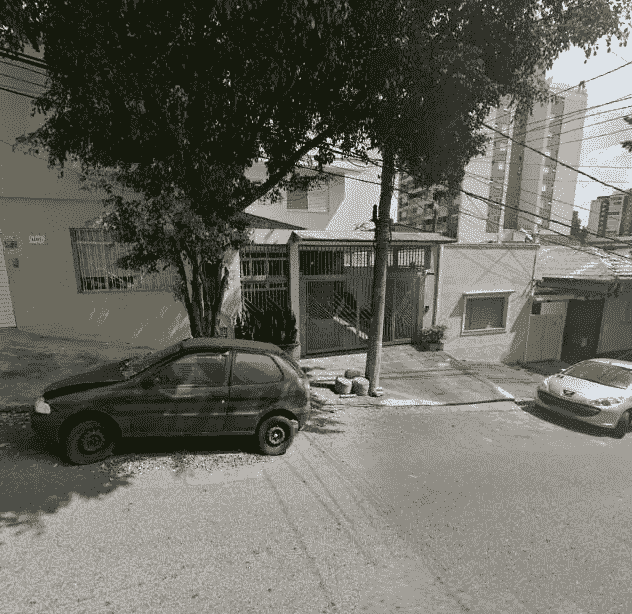
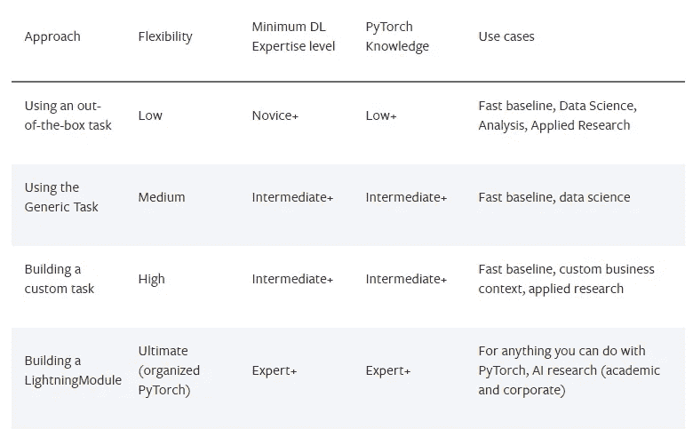
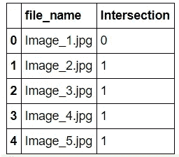
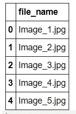
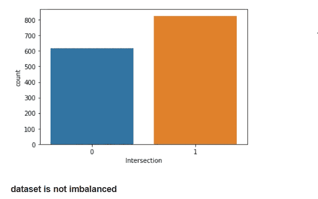
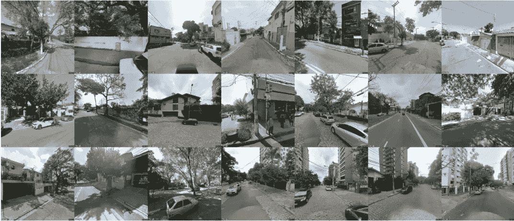
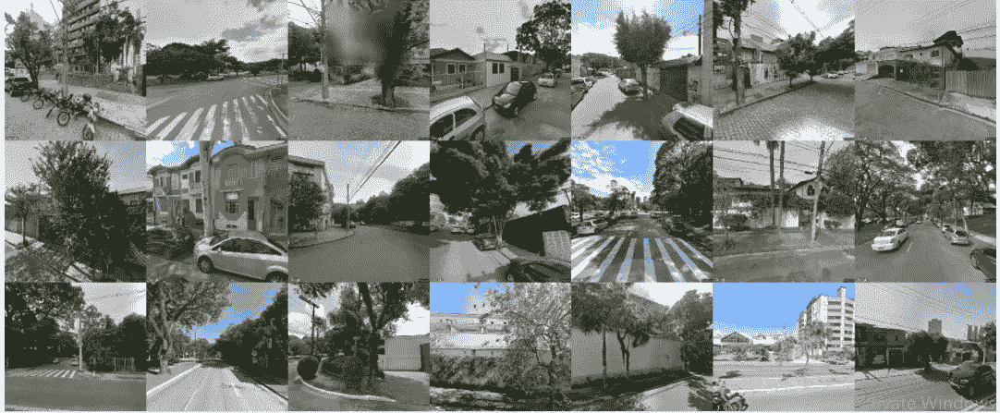
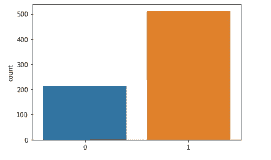

# 利用闪电进行图像分类

> 原文：<https://medium.com/nerd-for-tech/image-classification-using-lightning-flash-e549b6c4285f?source=collection_archive---------6----------------------->

**问题陈述:**生长在电线附近的树木可能会引起火灾，以及对在地面接触树木的任何人造成电击危险。树木并不一定要接触带电的电线才会有危险。在适当的条件下，电可以从电线传到附近的树上，比如附近雷击造成的电压浪涌。这种电流可以杀死任何靠近树的人，并可能引起火灾。



这种电弧放电也会导致断电。与树有关的停电不仅仅是不便。这些不仅会中断对你家或企业的服务，还会中断对医院、应急中心和生命支持设备上的病人的供电。

**目标**

建立一个机器学习模型，帮助电力部门检测电线和附近树木之间是否有任何交叉点，给定一个 spot 图像

标签:

*   **交点**值为 **1** ，如果电线与附近的树木有交点
*   **交点**值为 0，如果如果电线和附近的树木之间没有交点

**解决方案**:这里我们将使用闪电应用迁移学习来解决图像分类问题

## 闪电是什么？

Flash 是一个高级深度学习框架，用于快速原型化、基线化、微调和解决深度学习问题。它提供了一组任务供您进行推断和微调，并且提供了一个易于实现的 API 来定制该过程的每一步，以获得充分的灵活性。

Flash 是为初学者构建的，具有简单的 API，需要很少的深度学习背景，并且适合数据科学家、kagglers、应用 ML 实践者和深度学习研究人员，他们希望通过 [Pytorch Lightning](https://github.com/PyTorchLightning/pytorch-lightning) 提供的高级功能快速获得深度学习基线。

Flash 建立在 [Pytorch Lightning](https://github.com/PyTorchLightning/pytorch-lightning) 之上，用于提取不必要的样板文件:

*   数据科学
*   卡格尔
*   业务用例
*   应用研究

Flash 是高级库，Lightning 是低级库。

*   *闪光(高级)*
*   *闪电(中级)*
*   *PyTorch(低级)*

## 为什么是 Flash？

*   易于学习、提升技能和扩展
*   到达基线的最快方法

这是与 Keras 最相似的抽象层次



基本上，当使用一个几乎不需要深度学习和 PyTorch 知识的任务时，它是有帮助的。重点是尽快解决问题。这非常适合:

*   数据科学
*   分析
*   应用研究

## 解决方法

## 安装 Pytorch 闪电和其他所需的软件包

```
%%capture
!Pytorch Lightning Flash
```

# 安装所需的库

在[22]中:

```
!pip install torchtext==0.8.0 torch==1.7.1 pytorch-lightning==1.2.6!pip install lightning-flash -U
```

## 导入 Pytorch Lightning 包

```
*# pytorch lightning*
**import** **pytorch_lightning** **as** **pl**
**from** **pytorch_lightning.metrics.functional** **import** accuracy
**from** **pytorch_lightning.callbacks** **import** ModelCheckpoint,EarlyStopping
**from** **pl_bolts.models.self_supervised** **import** SwAV
*#pytorch*
**import** **torch**
**from** **torch** **import** nn
**import** **torch.nn.functional** **as** **F**
**from** **torch** **import** optim
**from** **torch.utils.data** **import** DataLoader,random_split
**from** **torchvision** **import** models,transforms,datasets
```

# 导入所需的库

```
**import** **flash**
**from** **flash** **import** download_data
**from** **flash.vision** **import** ImageClassificationData, ImageClassifier
print(flash.__version__)#0.2.1
*#*
**from** **torch** **import** nn, optim
**from** **torch.utils.data** **import** DataLoader, random_split
**from** **torchvision** **import** transforms, datasets
**import** **pytorch_lightning** **as** **pl**
print(pl.__version__)#1.2.0rc0
```

## 下载图片

```
**from** **google_drive_downloader** **import** GoogleDriveDownloader **as** gdd

gdd.download_file_from_google_drive(file_id='1ahtCipPXsX9BVRWi6nDG13tr4b_rMY97',
dest_path='content/detect_trees_near_electric_wires.zip',
unzip=**True**)
```

## 导入 Python 和相应的数据处理库

```
**import** **pandas** **as** **pd** *# Data analysis and manipultion tool*
**import** **numpy** **as** **np** *# Fundamental package for linear algebra and multidimensional arrays*
**import** **os** *# OS module in Python provides a way of using operating system dependent functionality*
**import** **shutil**
**import** **cv2** *# Library for image processing*
**from** **sklearn.model_selection** **import** train_test_split *# For splitting the data into train and validation set*
```

## 加载和准备培训数据

```
train = pd.read_csv("/content/content/detect_trees_near_electric_wires/train.csv") *# loading the labels*
train.head() *# will display the first five rows in labels dataframe*
```



```
test  = pd.read_csv("/content/content/detect_trees_near_electric_wires/Test.csv")
test.head()
```



## 检查训练数据是否平衡



## 数据可视化—训练图像



## 数据可视化—验证图像



# 训练数据预处理步骤

*   **列车试分裂**
*   **将图像移动到各自的文件夹中**
*   **文件夹号—无交集**
*   **文件夹是—存在交集**

```
!mkdir "/content/content/detect_trees_near_electric_wires/train/No"
!mkdir "/content/content/detect_trees_near_electric_wires/train/Yes"!mkdir "/content/content/detect_trees_near_electric_wires/val"
!mkdir "/content/content/detect_trees_near_electric_wires/val/No"
!mkdir "/content/content/detect_trees_near_electric_wires/val/Yes"train_data,val_data= train_test_split(train,test_size=0.1,stratify=train['Intersection'],random_state=42)print(train_data.shape,val_data.shape)train_data.Intersection.value_counts(normalize=**True**)
```

输出

```
1    0.57286
0    0.42714
Name: Intersection, dtype: float64val_data.Intersection.value_counts(normalize=**True**)
```

输出:

```
1    0.572414
0    0.427586
Name: Intersection, dtype: float64
```

# 加载数据并创建数据管道

`[ImageClassifier](https://lightning-flash.readthedocs.io/en/latest/reference/image_classification.html#flash.vision.ImageClassifier)`已经在 [ImageNet](http://www.image-net.org/) 上进行了预训练，这是一个超过 1400 万张图像的数据集。使用`[ImageClassifier](https://lightning-flash.readthedocs.io/en/latest/reference/image_classification.html#flash.vision.ImageClassifier)`预训练模型，通过`predict()`对任何字符串序列进行推理

```
datamodule = ImageClassificationData.from_folders(
    train_folder="/content/content/detect_trees_near_electric_wires/train/",
    valid_folder="/content/content/detect_trees_near_electric_wires/val/",
    predict_folder = "/content/content/detect_trees_near_electric_wires/test")
```

# 确定类别/标签的数量

```
datamodule.num_classes #returns the number of unique labels or classes
```

# 建立模型

```
*#model = ImageClassifier(backbone="densenet121", num_classes=datamodule.num_classes)*
model = ImageClassifier(backbone="resnet34", num_classes=datamodule.num_classes,learning_rate=0.001,optimizer=optim.Adam)
```

# 创建培训师。对训练数据运行 25 个时期

```
trainer = flash.Trainer(max_epochs=25,gpus=1)
```

# 训练模型

```
trainer.finetune(model, datamodule=datamodule, strategy="freeze_unfreeze")| Name     | Type       | Params
----------------------------------------
0 | metrics  | ModuleDict | 0     
1 | backbone | Sequential | 21.3 M
2 | head     | Sequential | 1.0 K 
----------------------------------------
1.0 K     Trainable params
21.3 M    Non-trainable params
21.3 M    Total params
85.143    Total estimated model params size (MB)
```

# 验证准确性

*   10 个时期值精度= 64.5% — Densenet121
*   25 个历元值精度= 67.5% — Densenet121
*   25 个历元值精度= 73.6% — resnet34

## 训练模型

```
trainer.fit(model,datamodule=datamodule,)
```

# 保存模型

```
trainer.save_checkpoint("image_classification_model.pt")
```

# 从检查点加载模型

```
model = ImageClassifier.load_from_checkpoint("/content/image_classification_model.pt")
```

# 对看不见的图像进行预测

```
predictions = model.predict(test.file_name.values.tolist())**import** **seaborn** **as** **sns**
sns.countplot(predictions)
```



# 下载预测以供提交

```
res = pd.DataFrame({'prediction': predictions}) *# prediction is nothing but the final predictions of your model on input features of your new unseen test data*
res.to_csv("submission_flash.csv", index = **False**)*# To download the csv file locally*
**from** **google.colab** **import** files
files.download('submission_flash.csv')
```

# 提交分数

**提交成功！你的分数是 69.57298201936。- Resnet34**

## 参考资料:

 [## 图像分类- Flash 文档

### 识别图像中的内容的任务称为图像分类。通常，图像分类用于…

闪电闪电. readthedocs.io](https://lightning-flash.readthedocs.io/en/latest/reference/image_classification.html#) 

**数据来源:**[https://dphi . tech/challenges/Data-sprint-28-detect-trees-near-electric-wires/68/overview/about](https://dphi.tech/challenges/data-sprint-28-detect-trees-near-electric-wires/68/overview/about)