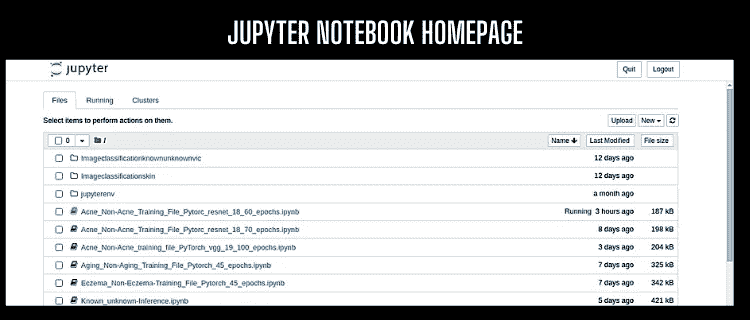
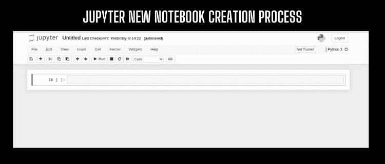

# 基于 PyTorch(Resnet18)❓迁移学习的图像分类

> 原文：<https://medium.com/nerd-for-tech/image-classification-using-transfer-learning-pytorch-resnet18-32b642148cbe?source=collection_archive---------0----------------------->

在开始之前，你只需要有一些关于卷积神经网络和 Jupyter-notebook 的知识。众所周知，目前图像分类正变得越来越流行，其应用也在迅速增加。在本文中，我们将使用并学习如何使用 PyTorch 框架的预训练模型来实现自定义数据的图像分类模型。我们将从 Jupyter-notebook 开始，因为这是一个非常简单的数据分析和深度学习工具。此外，它有许多 GUI 选项，使工作变得容易。


**RESNET18 转学工作流程**

*自定义数据，这一点我在本文中要用到的可以在这里找到*[](https://drive.google.com/drive/folders/1Aid67MXI7ks0l3y3CsLv4om4n_5zG9dG?usp=sharing)**。只需下载并存储在特定的文件夹中。我已经解决了一个具体的格式，让我们开始实施，如果你将遵循一步一步的教程，那么将不会有任何错误。此外，确保您安装的 Python 版本≤3.7**

***安装和使用***

***第一步**:在某个驱动器中创建一个文件夹，即图像分类，在该文件夹中打开终端/命令提示符。现在，我们需要安装 Jupyter 笔记本(不需要安装 Anaconda)，您可以使用下面的命令来安装笔记本。*

****对于 Linux:****

```
*sudo apt install python3-venv
python3 -m venv imageclassificationvenvpytorch
source imageclassificationvenvpytorch/bin/activate
pip install --upgrade pip
pip install jupyter*
```

****针对 Windows:****

```
*python3 -m venv imageclassificationvenvpytorch
cd imageclassificationvenvpytorch
cd Scripts
activate
cd ..
python3 -m pip install --upgrade pip
pip install jupyter*
```

***第二步:**现在，我们需要安装图像分类所需的包，然后才能导入并在笔记本中使用。您可以在已经打开的终端/命令提示符下使用以下命令来安装所需的模块。*

```
*pip install numpy
pip install torch torchvision   *#(must be greater than 1.7, I used torch 1.10+cu11)*
pip install scikit-build
pip install matplotlib*
```

***第三步:**现在，我们需要打开笔记本。您可以在已经打开的终端/命令提示符下使用下面的命令，在默认浏览器中打开笔记本。如果您尚未设置默认浏览器，您可以在终端/命令提示符下复制链接，并将其粘贴到浏览器中以运行笔记本。*

```
*python -m notebook*
```

**

*上述命令将打开当前文件夹中的笔记本。*

***步骤 4:** 现在，我们需要创建一个笔记本，我们将在其中编写图像分类的代码，在笔记本的主页中，单击右上角的新建按钮，如图所示，并从下拉菜单中选择 python3。这将在同一目录下创建一个新笔记本。*

***步骤 5:** 如果步骤 3 成功完成，您将能够看到下图所示的屏幕。*

**

***基本步骤&预处理***

***步骤 6:** 您可以根据自己的选择更改笔记本的文件名。现在，我们需要导入图像分类所需的库。*

```
*import torch
import torch.nn as nn
import torch.optim as optimimport torchvision
from torchvision import datasets, models, transformsimport numpy as np
import matplotlib.pyplot as plt
import cv2
import time
import osdevice = torch.device("cuda:0" if torch.cuda.is_available() else "cpu") # device object*
```

***步骤 7:** 我们需要为我们的数据定义预处理，这将包括随机水平翻转、旋转、归一化等。图像大小必须为(224 * 224)，因为 Resnet 接受(224 * 224)的输入图像大小。*

```
*transforms_train = transforms.Compose([
    transforms.Resize((224, 224)),   #must same as here
    transforms.RandomResizedCrop(224),
    transforms.RandomHorizontalFlip(), # data augmentation
    transforms.ToTensor(),
    transforms.Normalize([0.485, 0.456, 0.406], [0.229, 0.224, 0.225]) # normalization
])transforms_test = transforms.Compose([
    transforms.Resize((224, 224)),   #must same as here
     transforms.CenterCrop((224, 224)),
    transforms.ToTensor(),
    transforms.Normalize([0.485, 0.456, 0.406], [0.229, 0.224, 0.225])
])*
```

***步骤 8:** 现在，我们需要设置我们的培训和测试目录路径。您可以使用自己的数据，但要确保这些数据必须按照以下方式排列。*

```
**Datafol
    ----> trainfol
          ---->classafol
          ---->classbfol
    ----> testfol
          ---->classafol
          ---->classbfol**
```

*您可以使用下面的代码来设置训练和测试数据的路径。(*必要步骤)**

```
*train_dir = "/Datafol/trainfol/"
test_dir = "/Datafol/testfol/"
train_classa_dir = "/Datafol/trainfol/classafol/"
train_classb_dir = "/Datafol/trainfol/classbfol/"
test_classa_dir = "/Datafol/testfol/classafol/"
test_classb_dir = "/Datafol/testfol/classbfol/"*
```

***第 9 步:**我们需要通过应用预处理，用[*torch vision . dataset . image folder*](https://pytorch.org/vision/stable/generated/torchvision.datasets.ImageFolder.html#torchvision.datasets.ImageFolder)函数加载数据集。*

```
*train_dataset = datasets.ImageFolder(train_dir, transforms_train)
test_dataset = datasets.ImageFolder(test_dir, transforms_test)train_dataloader = torch.utils.data.DataLoader(train_dataset, batch_size=12, shuffle=True, num_workers=8)
test_dataloader = torch.utils.data.DataLoader(test_dataset, batch_size=12, shuffle=False, num_workers=8)*
```

*你可以用下面的代码检查训练/测试图像的数量和它们的类名。*(非必要步骤)**

```
*print('Train dataset size:', len(train_dataset))
print('Test dataset size:', len(test_dataset))class_names = train_dataset.classes
print('Class names:', class_names)*
```

*您可以从训练数据集*(非必要步骤)*中可视化代码下面的随机图像*

```
*plt.rcParams['figure.figsize'] = [12, 8]
plt.rcParams['figure.dpi'] = 60
plt.rcParams.update({'font.size': 20})def imshow(input, title):
    # torch.Tensor => numpy
    input = input.numpy().transpose((1, 2, 0))
    # undo image normalization
    mean = np.array([0.485, 0.456, 0.406])
    std = np.array([0.229, 0.224, 0.225])
    input = std * input + mean
    input = np.clip(input, 0, 1)
    # display images
    plt.imshow(input)
    plt.title(title)
    plt.show()# load a batch of train image
iterator = iter(train_dataloader)# visualize a batch of train image
inputs, classes = next(iterator)
out = torchvision.utils.make_grid(inputs[:4])
imshow(out, title=[class_names[x] for x in classes[:4]])*
```

***训练步骤:***

***Step-10:** 我们需要下载 resnet18 预训练好的权值，并且改变它的层数，因为我们需要对具体的类进行分类，而 Resnet-18 是在很多类上进行训练的。你可以使用任何优化器和损失函数，我用过 SGD 优化器和交叉熵损失。您可以使用下面的代码下载 Resnet-18 模型并调整它的层。*

```
*model = models.resnet18(pretrained=True)   #load resnet18 model
num_features = model.fc.in_features     #extract fc layers features
model.fc = nn.Linear(num_features, 2)#(num_of_class == 2)
model = model.to(device) 
criterion = nn.CrossEntropyLoss()  #(set loss function)
optimizer = optim.SGD(model.parameters(), lr=0.001, momentum=0.9)*
```

***步骤-11:** 现在，我们需要开始训练，如果上面的步骤工作正常，那么你可以很容易地用下面的代码开始训练。*

```
*num_epochs = 60   #(set no of epochs)
start_time = time.time() #(for showing time)
for epoch in range(num_epochs): #(loop for every epoch)
    print("Epoch {} running".format(epoch)) #(printing message)
    """ Training Phase ""**"** model.train()    #(training model)
    running_loss = 0\.   #(set loss 0)
    running_corrects = 0 
    # load a batch data of images
    for i, (inputs, labels) in enumerate(train_dataloader):
        inputs = inputs.to(device)
        labels = labels.to(device) 
     # forward inputs and get output
        optimizer.zero_grad()
        outputs = model(inputs)
        _, preds = torch.max(outputs, 1)
        loss = criterion(outputs, labels)
        # get loss value and update the network weights
    loss.backward()
        optimizer.step()
        running_loss += loss.item() * inputs.size(0)
        running_corrects += torch.sum(preds == labels.data)
    epoch_loss = running_loss / len(train_dataset)
    epoch_acc = running_corrects / len(train_dataset) * 100.
    print('[Train #{}] Loss: {:.4f} Acc: {:.4f}% Time: {:.4f}s'.format(epoch, epoch_loss, epoch_acc, time.time() -start_time))

    """ Testing Phase """model.eval()
    with torch.no_grad():
        running_loss = 0.
        running_corrects = 0
        for inputs, labels in test_dataloader:
            inputs = inputs.to(device)
            labels = labels.to(device)
            outputs = model(inputs)
            _, preds = torch.max(outputs, 1)
            loss = criterion(outputs, labels)
            running_loss += loss.item() * inputs.size(0)
            running_corrects += torch.sum(preds == labels.data)
        epoch_loss = running_loss / len(test_dataset)
        epoch_acc = running_corrects / len(test_dataset) * 100.
        print('[Test #{}] Loss: {:.4f} Acc: {:.4f}% Time: {:.4f}s'.format(epoch, epoch_loss, epoch_acc, time.time()- start_time))*
```

***步骤 11:** 现在，我们需要保存我们训练好的模型，以供测试和进一步使用。您可以使用下面的代码将模型保存在文件中。*

```
*save_path = 'custom-classifier_resnet_18_final_60_last_tr_epochs.pth'
torch.save(model.state_dict(), save_path)*
```

***测试步骤***

***第 12 步:**为了测试，我们首先需要加载经过训练的模型。您可以将下面的代码用于加载模型。*

```
*model = models.resnet18(pretrained=True)   #load resnet18 model
num_features = model.fc.in_features #extract fc layers features
model.fc = nn.Linear(num_features, 2)#(num_of_class == 2)
model.load_state_dict(torch.load("Acne-classifier_resnet_18_final_60_last_tr_epochs.pth"))
model.to(device)*
```

*现在，我们可以在测试数据上测试我们的模型。*

```
*plt.rcParams['figure.figsize'] = [12, 8]
plt.rcParams['figure.dpi'] = 60
plt.rcParams.update({'font.size': 20})
def imshow(input, title):
    # torch.Tensor => numpy
   input = input.numpy().transpose((1, 2, 0))
    # undo image normalization
   mean = np.array([0.485, 0.456, 0.406])
    std = np.array([0.229, 0.224, 0.225])
    input = std * input + mean
    input = np.clip(input, 0, 1)
    # display images
   plt.imshow(input)
    plt.title(title)
    plt.show()##Testing
model.eval()
start_time = time.time()
criterion = nn.CrossEntropyLoss()
optimizer = optim.SGD(model.parameters(), lr=0.001, momentum=0.9)
with torch.no_grad():
    running_loss = 0.
    running_corrects = 0
    for i, (inputs, labels) in enumerate(test_dataloader):
        inputs = inputs.to(device)
        labels = labels.to(device)
        outputs = model(inputs)
        _, preds = torch.max(outputs, 1)
        loss = criterion(outputs, labels)
        running_loss += loss.item() * inputs.size(0)
        running_corrects += torch.sum(preds == labels.data)
        if i == 0:
            print('======>RESULTS<======')
            images = torchvision.utils.make_grid(inputs[:4])
            imshow(images.cpu(), title=[class_names[x] for x in labels[:4]])
    epoch_loss = running_loss / len(test_dataset)
    epoch_acc = running_corrects / len(test_dataset) * 100.
    print('[Test #{}] Loss: {:.4f} Acc: {:.4f}% Time: {:.4f}s'.
          format(epoch, epoch_loss, epoch_acc, time.time() - start_time))*
```

**我已经用 60 个时期的皮肤癌数据训练了该模型，当我测试它时，我得到了如下所述的准确性。**

```
*======>RESULTS<======
[Test #1] Loss: 0.0816 Acc: 96.9985% Time: 4.7761s*
```

**注意:纪元越多越好，但是你设置的纪元越大，就越有可能过拟合。**

> *关于**“使用迁移学习 pytorch(resnet18)进行图像分类”的问题都解决了吗**。您可以在自己的数据上尝试这样做。*

*   *利用卷积神经网络进行图像分类: [*文章链接*](/nerd-for-tech/image-classification-using-transfer-learning-vgg-16-2dc2221be34c)*
*   *利用迁移学习进行图像分类: [*文章链接*](/nerd-for-tech/image-classification-using-transfer-learning-vgg-16-2dc2221be34c)*
*   *从视频创建数据集:[*文章链接*](/nerd-for-tech/extraction-of-frames-from-a-single-video-2b9fdd901208)*
*   *自定义物体检测器训练的标注数据: [*文章链接*](/nerd-for-tech/labeling-data-for-object-detection-yolo-5a4fa4f05844)*

***关于我** ❓*

*我有超过 1 年半的软件开发工作经验。目前，我是一名软件工程师，通过使用零售分析、建立大数据分析工具、创建和维护模型以及加入引人注目的新数据集，为我们的客户改进产品和服务。之前，我是 Spark 基金会的计算机视觉实习生，在那里我体验了来自不同开源平台(如 Kaggle、google images、open images 等)的视觉数据分析。)，并在该数据上训练不同的深度学习模型。*

*   *[*在 LinkedIn 上联系我*](https://www.linkedin.com/in/muhammadrizwanmunawar/)*
*   *[*与我协商*](https://www.upwork.com/services/product/consultation-1477666319161577472?ref=project_share)*
*   *[*我的 yolov5 服务*](https://www.upwork.com/services/product/you-will-get-image-classification-projects-using-machine-learning-with-python-1323963101029052416?ref=project_share)*

****如有任何疑问，欢迎在下方评论****