# 使用迁移学习的图像分类(VGG-16)

> 原文：<https://medium.com/nerd-for-tech/image-classification-using-transfer-learning-vgg-16-2dc2221be34c?source=collection_archive---------0----------------------->

开始之前，您只需要了解一些关于 TensorFlow/Keras 卷积神经网络实现的知识。我已经写了一篇关于卷积神经网络的文章，你可以从 [**链接**](/nerd-for-tech/image-classification-using-convolutional-neural-networks-cnn-eef587ed0c1) **来看看。**

众所周知，目前图像分类正变得越来越流行，其应用也在迅速增加。在这篇博客中，我们将使用卷积神经网络对皮肤癌数据进行图像分类。

> “我们将从 google colab 开始，因为 python 库、它们的依赖关系以及它的云环境都没有问题，所以我们不需要太多配置。”
> 
> **注意**:让我们开始实现，如果你将遵循一步一步的教程，那么最终将不会有错误。

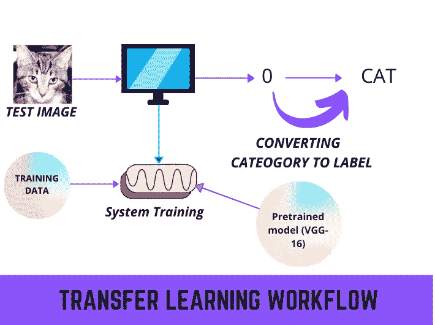

转移学习工作流

**Step-1** :我们需要在 google drive 中创建一个名为“ ***【图像分类】*** 的文件夹。这不是必需的名称，您也可以用另一个名称创建文件夹。

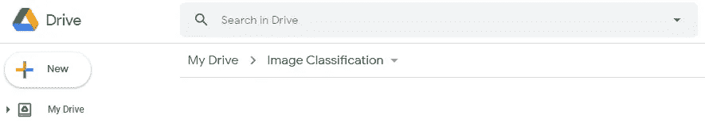

图像分类文件夹

**Step-2** :现在，我们需要在图像分类文件夹中制作一个文件夹，里面是“***dataset”***的文件夹，我们将在其中存储我们的训练和测试数据。这不是必需的名称，您也可以用另一个名称创建文件夹。


> 您可以使用任何数据集，但在本文中，我将重点关注二元分类，这意味着我将使用的数据集有两个类。对于多类分类，程序将是相同的，但在一些步骤需要很少的变化，我会在下面提到的每一步。

**第三步:**现在，我们需要在 ***【数据集】*** 文件夹内添加数据，可以使用任何数据集，而我用过的数据集是来自 Kaggle，数据是关于 ***【皮肤癌二级分类】*** 。可以从 [***链接***](https://drive.google.com/drive/folders/1Aid67MXI7ks0l3y3CsLv4om4n_5zG9dG?usp=sharing) 下载数据集。

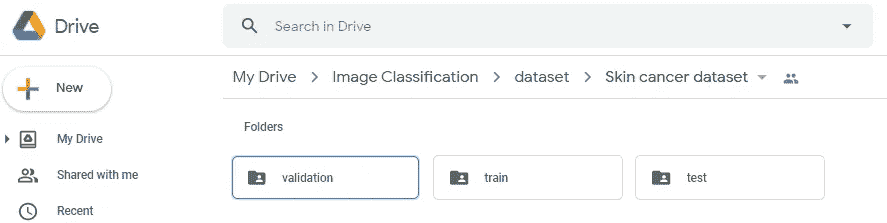

数据集子文件夹

**步骤 4:** 现在，我们需要在 ***【图像分类】*** 文件夹中制作一个笔记本，因为我们将在该文件中编写代码，并且还将能够从 google drive 访问数据集。

> 你可以打开**【图像分类】**文件夹然后点击
> 
> 新建->更多->Google 协作室(在文件夹中创建 google colab 文件的过程)

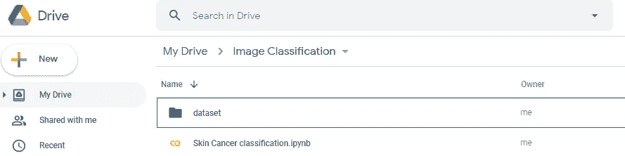

Google colab 文件创建

> 现在，我们已经设置了数据集路径和创建的笔记本文件。让我们从对皮肤中的癌症进行分类的代码开始。

**第 5 步:**打开 Google-Colab 文件，这里我们首先需要装载 google drive 来访问存储在 ***【图像分类】*** 文件夹中的数据集。你可以使用下面写的代码来安装谷歌驱动器。

```
from google.colab import drivedrive.mount(‘/content/drive’)
```

一旦你运行了上面的代码。它会问你一个授权码，一旦你添加了，你的谷歌驱动器将被安装。

> **注意:** google drive 和 google colab 帐户必须相同才能进行授权。如果谷歌帐户改变了，那么谷歌驱动器将不会安装。

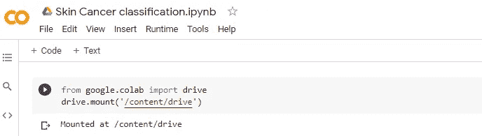

Google drive 已安装

**步骤 6:** 现在，我们需要导入用于数据集读取和 CNN(卷积神经网络)模型创建的库。

```
import osimport cv2from PIL import Imageimport tensorflow as tffrom keras import backend as Kfrom keras.models import load_modelfrom keras.preprocessing.image import img_to_arrayfrom tensorflow.keras.optimizers import Adam, RMSpropfrom tensorflow.keras.callbacks import ReduceLROnPlateaufrom tensorflow.keras.preprocessing.image import ImageDataGenerator
```

**第 7 步:**现在，我们需要设置培训、测试和验证目录路径。只能使用(测试和培训文件夹)，不需要使用验证文件夹。

```
base_dir = '/content/drive/MyDrive/Image Classification/dataset/Skin cancer dataset'train_dir = '/content/drive/MyDrive/Image Classification/dataset/Skin cancer dataset/train'train_benign_dir = '/content/drive/MyDrive/Image Classification/dataset/Skin cancer dataset/train/benign'train_malign_dir = '/content/drive/MyDrive/Image Classification/dataset/Skin cancer dataset/train/malignant'test_dir = '/content/drive/MyDrive/Image Classification/dataset/Skin cancer dataset/test'test_benign_dir = '/content/drive/MyDrive/Image Classification/dataset/Skin cancer dataset/test/benign'test_malign_dir = '/content/drive/MyDrive/Image Classification/dataset/Skin cancer dataset/test/malignant'valid_dir = '/content/drive/MyDrive/Image Classification/dataset/Skin cancer dataset/validation'valid_benign_dir = '/content/drive/MyDrive/Image Classification/dataset/Skin cancer dataset/validation/benign'valid_malign_dir = '/content/drive/MyDrive/Image Classification/dataset/Skin cancer dataset/validation/malignant'
```

> **备注**:点击左侧垂直页签**->Drive->My Drive->Folder Path**中的文件夹，可以选择路径

**步骤 8:** 现在，我们需要借助 os 库从这些文件夹中获取数据。

```
num_benign_train = len(os.listdir(train_benign_dir))num_malignant_train = len(os.listdir(train_malign_dir))num_benign_validaition = len(os.listdir(valid_benign_dir))num_malignant_validation= len(os.listdir(valid_malign_dir))num_benign_test = len(os.listdir(test_benign_dir))num_malignant_test= len(os.listdir(test_malign_dir))
```

> 到目前为止，我们的 colab 笔记本有四个包含代码的单元，如下图所示。

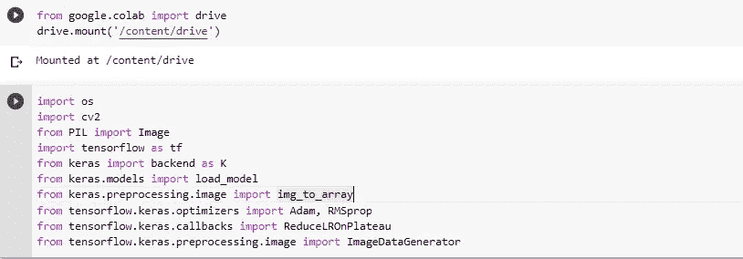

前两个单元

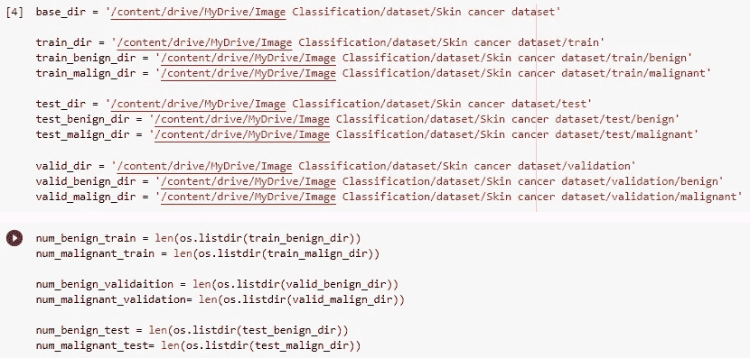

最后两个单元格

**步骤 9:** 现在，让我们看一看，我们的数据集中有多少个训练和测试图像？

```
print("Total Training Benign Images",num_benign_train)print("Total Training Malignant Images",num_malignant_train)print("--")print("Total validation Benign Images",num_benign_validaition)print("Total validation Malignant Images",num_malignant_validation)print("--")print("Total Test Benign Images", num_benign_test)print("Total Test Malignant Images",num_malignant_test)total_train = num_benign_train+num_malignant_traintotal_validation = num_benign_validaition+num_malignant_validationtotal_test = num_benign_test+num_malignant_testprint("Total Training Images",total_train)print("--")print("Total Validation Images",total_validation)print("--")print("Total Testing Images",total_test)
```

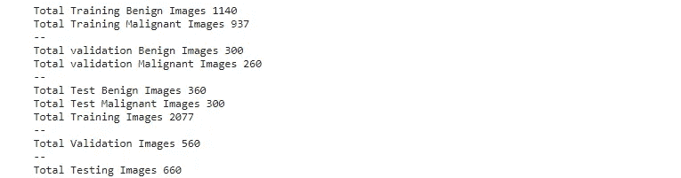

数据集信息

**Step-10:** 现在，我们需要设置图像的大小(高度、宽度)。当数据集图像具有不同的大小时，这一步是最需要的，它将加快训练过程。我使用了(224，224)的图像形状。

> **注意:我们需要调整图像大小到(224，224)，因为 VGG 16 只接受该图像大小。**

```
IMG_SHAPE  = 224batch_size = 32
```

**步骤 11:** 现在，我们需要对数据进行预处理(训练、测试、验证)，包括重新缩放和洗牌。

```
image_gen_train = ImageDataGenerator(rescale = 1./255)train_data_gen = image_gen_train.flow_from_directory(batch_size = batch_size,directory = train_dir,shuffle= True,target_size = (IMG_SHAPE,IMG_SHAPE),class_mode = 'binary')image_generator_validation = ImageDataGenerator(rescale=1./255)val_data_gen = image_generator_validation.flow_from_directory(batch_size=batch_size,directory=valid_dir,target_size=(IMG_SHAPE, IMG_SHAPE),class_mode='binary')image_gen_test = ImageDataGenerator(rescale=1./255)test_data_gen = image_gen_test.flow_from_directory(batch_size=batch_size,directory=test_dir,target_size=(IMG_SHAPE, IMG_SHAPE),class_mode='binary')
```

**步骤 12:** 继续下一步之前，让我们检查类名，图像数据生成器将使用文件夹名作为类名。

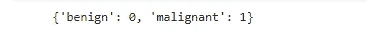

类名

> **现在，我们的数据预处理步骤已经完成，是时候下载 VGG-16 预训练权重了。**

**Step-13:** 让我们下载 VGG-16 权重，包括顶层参数为 false。

> 我们知道 VGG-16 是分多个班进行培训的，所以如果我们使用 **top_layer = True** ，那么我们需要在 VGG-16 培训的所有班上对其进行再培训，但是如果我们使用 **top_layer = False** ，那么在再培训中，我们只需要增加我们的培训班。

```
pre_trained_model = tf.keras.applications.VGG16(input_shape=(224, 224, 3), include_top=False, weights="imagenet")
```

**Step-14:** 现在，我们需要冻结 VGG-16 的训练层。(因为 VGG——16 岁，就已经在巨大的数据上接受过训练)。

```
for layer in pre_trained_model.layers:print(layer.name)layer.trainable = False
```

由于 VGG 16 的所有层都被冻结了，我们需要为我们的班级修改最后一层。我添加了一个最大轮询，一个密集层，一个下降，和一个输出与 VGG-16 的最后一层。

```
last_layer = pre_trained_model.get_layer('block5_pool')last_output = last_layer.outputx = tf.keras.layers.GlobalMaxPooling2D()(last_output)x = tf.keras.layers.Dense(512, activation='relu')(x)x = tf.keras.layers.Dropout(0.5)(x)x = tf.keras.layers.Dense(2, activation='sigmoid')(x)
```

> 对于“**多类分类**，将最后一个密集层值改为 3，用 softmax 激活。

```
x = tf.keras.layers.Dense(3, activation='softmax')(x)
```

**步骤 16:** 现在，我们需要合并原始的 VGG 16 层，与我们的自定义层。

```
model = tf.keras.Model(pre_trained_model.input, x)
```

**第 17 步:**在开始训练之前，我们先编译一下模型。

```
model.compile(optimizer='adam', loss=tf.keras.losses.sparse_categorical_crossentropy, metrics=['acc'])
```

> 对于“**多类分类**，用 categorical _ crossentropy 改变损失。

```
model.compile(optimizer='adam', loss=tf.keras.losses.categorical_crossentropy, metrics=['acc'])
```

**第 18 步:**我们来查看一下车型汇总。


模型摘要

**第 19 步:**最后，我们需要开始我们的培训过程。

```
vgg_classifier = model.fit(train_data_gen,steps_per_epoch=(total_train//batch_size),epochs = 5,validation_data=val_data_gen,validation_steps=(total_validation//batch_size),batch_size = batch_size,verbose = 1)
```

> **注意:**我在五个历元上训练模型。为了获得更好的结果，可以测试 50-60 个时期，以达到 85%的测试数据准确性。

***如果，你遵循了上面所有的步骤，那么现在，你可以看到 epochs 在步骤 19 之后运行的代码也显示在下面的图片中。***

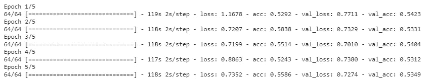

训练时代

**步骤 20:** 现在，我们可以在测试数据上测试我们的模型了。

```
result = model.evaluate(test_data_gen,batch_size=batch_size)print("test_loss, test accuracy",result)
```

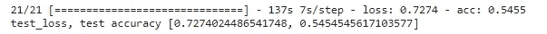

测试

现在，我们需要保存我们的模型。

```
model_json = model.to_json()with open("/content/drive/MyDrive/Image Classification/VGG_Skin_Classifier.json", "w") as json_file:json_file.write(model_json)model.save("/content/drive/MyDrive/Image Classification/VGG_Skin_Classifier.h5")print("Saved model to disk")model.save_weights("/content/drive/MyDrive/Image Classification/VGG_Skin.h5")
```

> **注:**恭喜你，你已经用自己的数据重新训练了 VGG-16。本文只关注二进制分类，而您可以在自己的数据上进行测试(二进制或多类分类)。

如果你有视频，并想从这些视频中开发一个数据集，请阅读我关于这些的文章，

*   [***从单个视频中提取帧***](/nerd-for-tech/extraction-of-frames-from-a-single-video-2b9fdd901208)
*   [***从多个视频中提取帧***](/nerd-for-tech/extraction-of-frames-from-multiple-videos-3ddbced6f3c2)

如果你有数据，并想标记为对象检测，对象跟踪等，请阅读我的文章，

*   [***为物体检测标注数据***](/nerd-for-tech/labeling-data-for-object-detection-yolo-5a4fa4f05844)