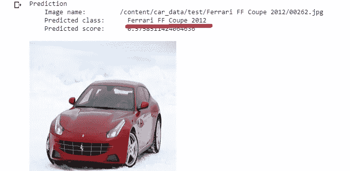

# 图像分类器—使用 MonkAi 库对斯坦福汽车品牌、型号和年份进行分类

> 原文：<https://medium.com/nerd-for-tech/image-classifier-car-make-model-and-year-classification-using-the-monkai-library-cb49ae121263?source=collection_archive---------2----------------------->

嘿，伙计们..！


[法比奥](https://unsplash.com/@fabioha?utm_source=medium&utm_medium=referral)在 [Unsplash](https://unsplash.com?utm_source=medium&utm_medium=referral) 上的照片

在这篇博客中，你将学习如何使用 Monk 库建立一个图像分类模型。

# **关于数据集**

*汽车*数据集包含 196 类汽车的 16，185 张图片。数据被分成 8，144 个训练图像和 8，041 个测试图像，其中每个类别被大致分成 50-50 个部分。类别通常处于*品牌、型号、年份*的水平，例如 2012 款 Tesla Model S 或 2012 款宝马 M3 Coupe。这个数据是斯坦福大学开源的。你在这里下载数据集[。](http://ai.stanford.edu/~jkrause/cars/car_dataset.html)

# 关于和尚图书馆

*   使用 Monk，您可以编写更少的代码并创建端到端的应用程序。
*   只学习一种语法，使用任何深度学习库——py torch、Mxnet、Keras、TensorFlow、Gluon 等，创建应用。
*   免费的、本地的、开源的 Monk AI 是一个既能迎合初学者又能迎合计算机视觉专家的工具
*   用几行代码进行多个实验，轻松管理整个项目。

这是在 Kaggle、Hacker Earth、Codalab 等平台举行的比赛中使用的最佳工具。

*好了好了，我们开始吧！*

# **所需工具和库**

在 collab 中安装 monk 库

```
!git clone [https://github.com/Tessellate-Imaging/monk_v1.git](https://github.com/Tessellate-Imaging/monk_v1.git)!cd monk_v1/installation/Misc && pip install -r requirements_colab.txt
```

上面两行代码将把所需的库从 GitHub 安装到您的本地工作区。

# 下载数据集

现在使用 [curlWget](https://chrome.google.com/webstore/detail/curlwget/jmocjfidanebdlinpbcdkcmgdifblncg?hl=en) 工具从服务器下载数据集。

```
!wget — header=”Host: imagenet.stanford.edu” — header=”User-Agent: Mozilla/5.0 (Windows NT 10.0; Win64; x64) AppleWebKit/537.36 (KHTML, like Gecko) Chrome/84.0.4147.105 Safari/537.36" — header=”Accept: text/html,application/xhtml+xml,application/xml;q=0.9,image/webp,image/apng,*/*;q=0.8,application/signed-exchange;v=b3;q=0.9" — header=”Accept-Language: en-US,en;q=0.9" “http://imagenet.stanford.edu/internal/car196/car_ims.tgz" -c -O ‘car_ims.tgz’
```

下载文件后，解压缩 zip 文件

```
tar -xvf '/content/cars_ims.tgz' -C '/content/'
```

**导入图像分类问题所需的其他库**

```
**import** **os**
**import** **sys
from** **monk.gluon_prototype** **import** prototype
**from** **pytorch_prototype** **import** prototype
```

使用任何深度学习框架创建原型。这里我用的是 **monk.gluon_prototype**

```
monk_gln = prototype(verbose=1);#name the prototype with the model you want to use
monk_gln.Prototype("Task", "resnet50");
```

初始化预训练的 Resnet-50 作为图像分类器模型和其他参数。

```
monk_gln.Default(dataset_path="/content/car_data/train", 
            model_name="resnet50", 
            freeze_base_network=**True**,
            use_gpu=True,
            num_epochs=20);
```

现在训练模型

```
monk_gln.Train();
```

在模型的训练之后，我们使用训练的模型进行预测。

```
img_name="/content/car_data/test/00262.jpg"
pred = monk_eval.Infer(img_name=img_name);
**from** **IPython.display** **import** Image
Image(filename=img_name, height=300, width=300)
```



完整的代码可以在 [GitHub](http://github.com/ratnasankeerthanreddy/monkai-cars-model-classification) 上找到。如果这篇文章对你有所帮助，请鼓掌或分享！

# 参考

1.  [ai.stanford.edu/~jkrause/cars/car_dataset.html](https://ai.stanford.edu/~jkrause/cars/car_dataset.html)为数据集

2.https://monkai.org/

3.【https://www.tessellateimaging.com/ 