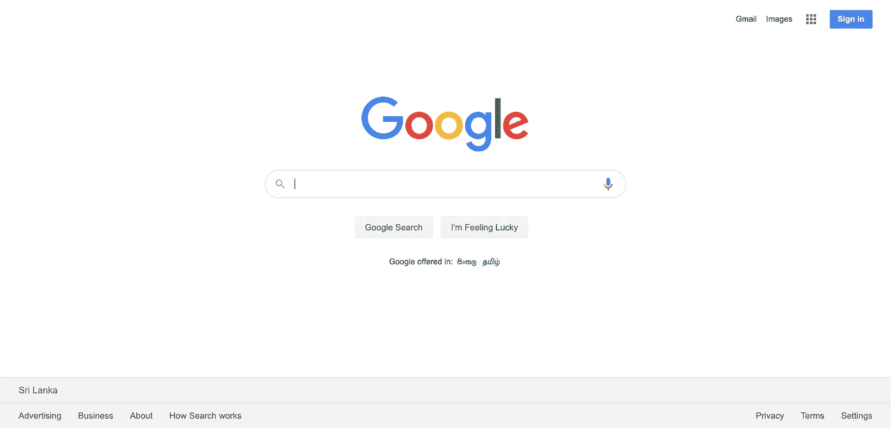
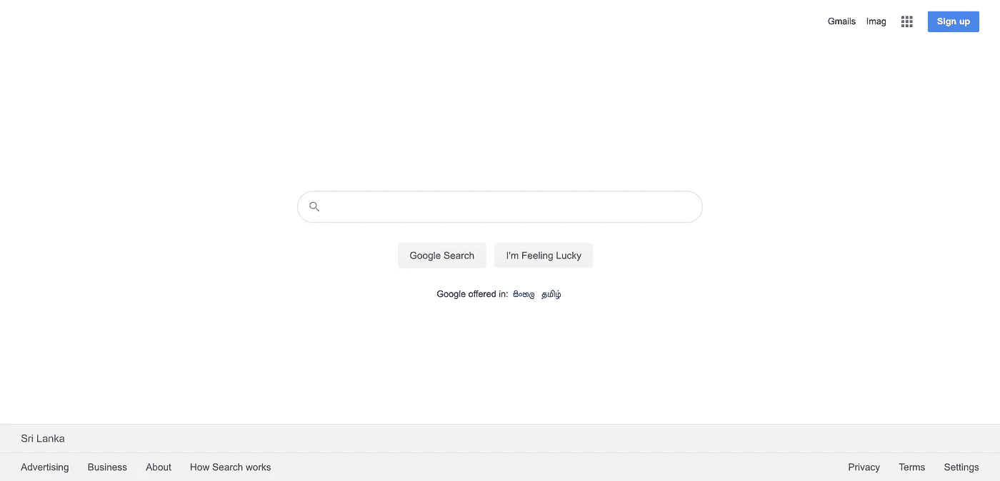
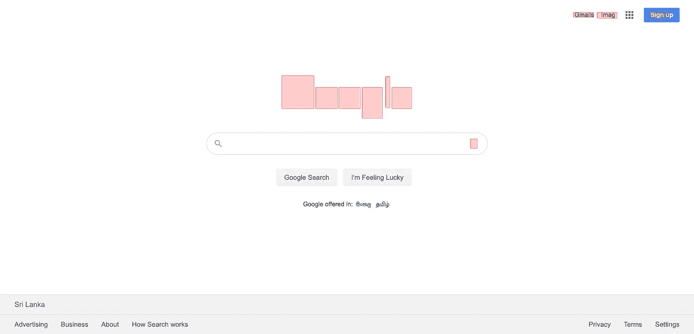

# 使用 Selenium-Shutterbug & romankh 3/image-Comparison 进行图像比较

> 原文：<https://medium.com/nerd-for-tech/image-comparison-using-selenium-shutterbug-romankh3-image-comparison-a94de7c9644?source=collection_archive---------0----------------------->

在这篇文章中，我将解释我们如何比较基础图像和修改后的图像。请参考以下图片:

原象

改变的图像

## 让我们找到可以作为自动化解决方案提供的技术

1.  [https://github.com/romankh3/image-comparison](https://github.com/romankh3/image-comparison)
2.  https://github.com/assertthat/selenium-shutterbug
3.  【https://www.selenium.dev/documentation/ 

## 然后让我们来看编码

首先，我们必须创建一个 maven java 项目。[https://dev . cloud buro . net/2017/06/18/Java-for-初学者-1-prepare-an-intellij-maven-project . html](https://dev.cloudburo.net/2017/06/18/java-for-beginners-1-prepare-an-intellij-maven-project.html)

然后，我们必须在 pom.xml 中插入以下依赖项

*<依赖关系>
<依赖关系>
<groupId>org . selenium HQ . selenium</groupId>
<artifactId>selenium-Java</artifactId>
<版本>3 . 141 . 59</版本>
</依赖关系> <groupId>org . selenium HQ . selenium</groupId>
<artifactId>selenium-remote-driver</artifactId>
<版本>3 . 141 . 59</版本>
</依赖关系>
<依赖关系>
<*

然后创建一个名为 snapshot 的类

然后，我们必须实现一个方法，使用这些图像的路径来比较两个图像。

*public static void compare images(String expected path，String actualPath){
//加载要比较的图像
buffered image expected image = image comparison util . readimagefromresources(expected path)；
buffered image actual image = image comparison util . readimagefromresources(actual path)；*

*//保存结果的位置(如果想在 UI 中看到结果请留空)
File result destination = new File(" src/main/resources/Images/result . png ")；*

*//为其创建 ImageComparison 对象。
image comparison image comparison = new image comparison(expected image，actualImage，result destination)；*

*//也可以在比较下一个属性之前配置:*

*//Threshold——不相等像素之间的最大距离。默认情况下是 5。
image comparison . setthreshold(5)；
image comparison . getthreshold()；*

*//RectangleListWidth —在矩形中绘制的线条的宽度。默认情况下是 1。
image comparison . setrectanglelinewidth(1)；
image comparison . getrectanglelinewidth()；*

*//differencertanglefilling—用透明填充填充差异矩形的内部。默认情况下，它是假的，不透明度为 20.0%。
image comparison . setdifferencertanglefilling(true，20.0)；
image comparison . isfilldeffecterangles()；
image comparison . getpercentopacitydifferencertangles()；*

*//ExcludedRectangleFilling—用透明填充填充排除的矩形内部。默认情况下，它是假的，不透明度为 20.0%。
image comparison . setexcludedrectanglefilling(true，20.0)；
image comparison . isfillexcludedrectangles()；
image comparison . getpercentopacityexcluded rectangles()；*

*//目的地。在比较之前，也可以为结果图像添加目标文件。
image comparison . set destination(结果目的地)；
image comparison . get destination()；*

*//MaximalRectangleCount——表示将获得前 x 个最大的矩形进行绘制。
//默认情况下，所有的矩形都会被绘制出来。
image comparison . setmaximalrectanglecount(10)；
image comparison . getmaximalrectanglecount()；*

*//MinimalRectangleSize —最小矩形尺寸的数量。计为(宽 x 高)。
//默认为 1。
image comparison . setminimalrectanglesize(1)；
image comparison . getminimalrectanglesize()；*

*//改变像素容差的级别:
image comparison . setpixeltolerancelevel(0.2)；
image comparison . getpixeltlerancelevel()；*

*//配置完 ImageComparison 对象后，可以执行 compare()方法:
ImageComparisonResult ImageComparisonResult = image comparison . compare images()；*

*//可以找到 ComparisonState。
ImageComparisonState ImageComparisonState = imagecomparisonresult . getimagecomparisonstate()；*

*//和结果图像
buffered Image Result Image = imagecomparisonresult . get Result()；*

*//比较后可以保存图像，使用 ImageComparisonUtil。
if(imagecomparisonresult . getdifference percent()>0.0)imagecomparisonutil . save image(result destination，result image)；
}*

然后，我们必须编写可执行代码块来捕获预期的和实际的图像。

[*@ Test*](http://twitter.com/Test) *public static void take screen shot(){*

*system . set property(" web driver . chrome . driver "，" src/main/resources/chrome driver ")；*

*web driver driver = new chrome driver()；*

*driver.manage()。窗口()。最大化()；*

*driver.navigate()。到("*[*)https://www . Google . lk*](https://www.google.lk)*)；*

*试试{
imageio . write(shutterbug . shootpage(driver，ScrollStrategy。全 _ 页)。getImage()，“PNG”，新文件(“src/main/resources/Images/expected . PNG”)；*

*} catch(Exception e){
system . out . println(e)；
}
试试{* ***imageio . write(shutterbug . shootpage(driver，ScrollStrategy。全 _ 页)。getImage()，“PNG”，新文件(“src/main/resources/Images/actual . PNG”)；***

*} catch(Exception e){
system . out . println(e)；
}
比较图像(" src/main/resources/Images/expected . png "，" src/main/resources/Images/actual . png ")；
driver . quit()；
}*

现在将调试点设置在加粗的代码块前面，并在调试模式下运行测试。捕获第一张图像后，将停止执行。然后，您必须使用 dev 工具修改图像。请参考上面更改后的图像。完成更改后，请继续执行。

最后，您可以在执行成功完成后获得对比图像。

结果图像