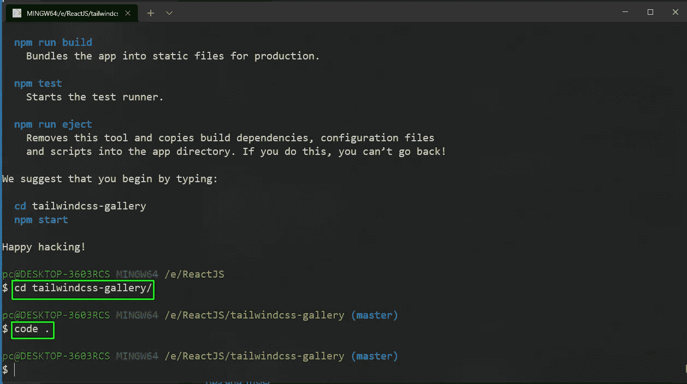
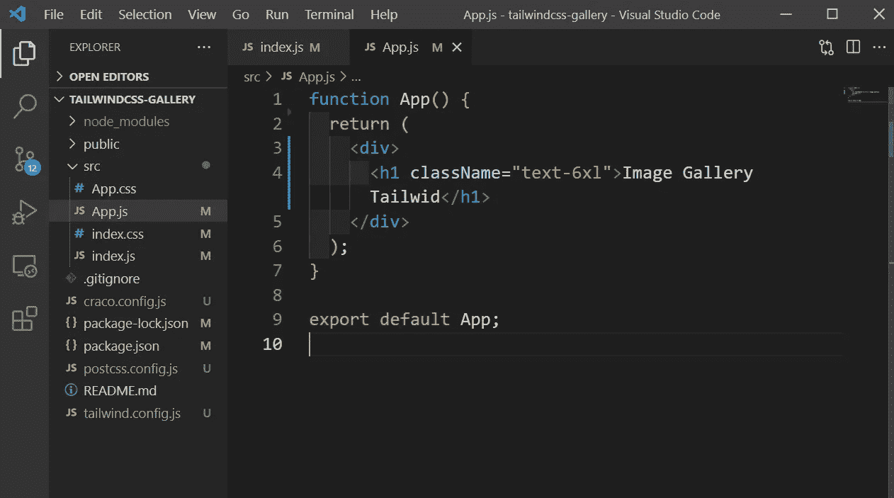
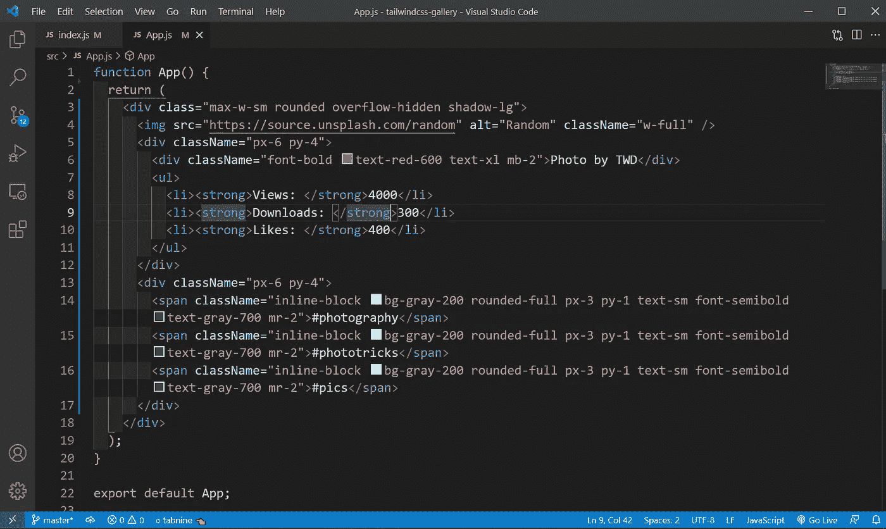
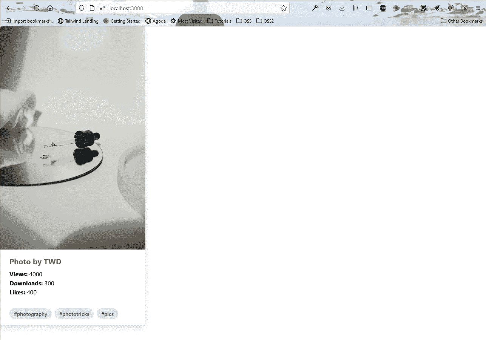
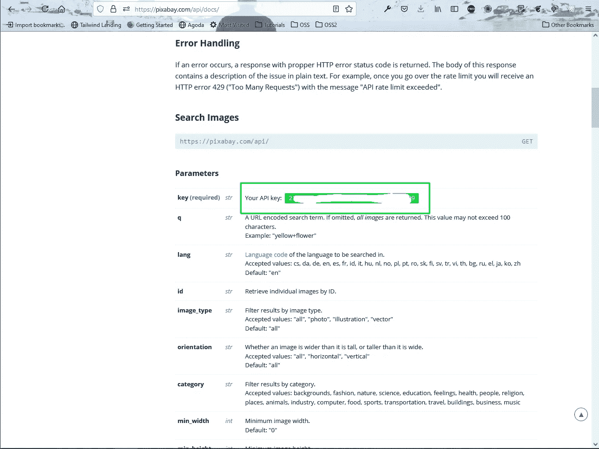
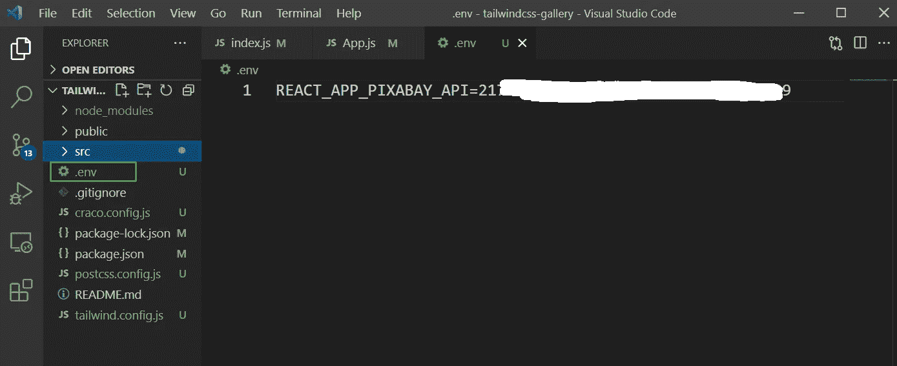
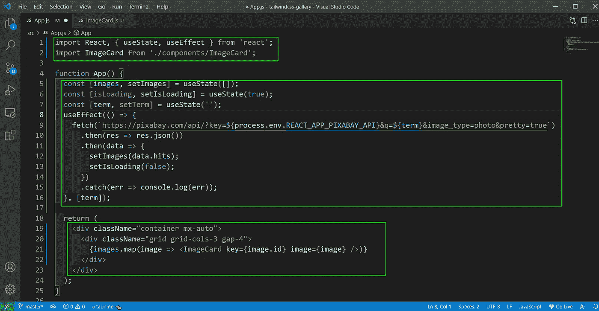
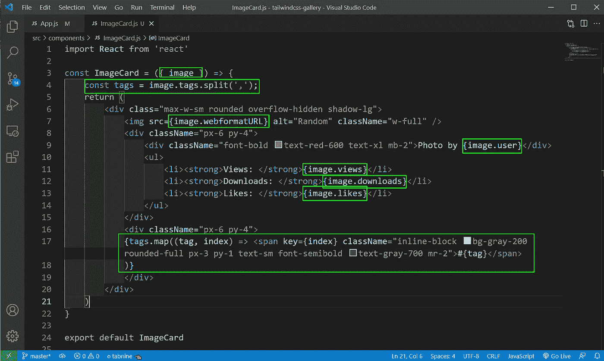
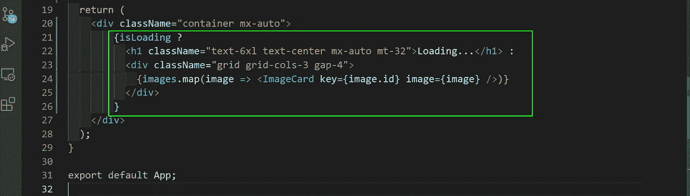
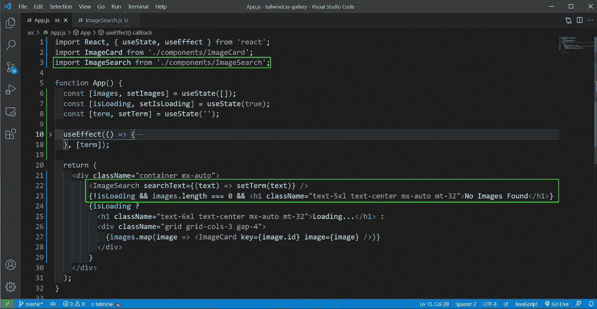

# 带有 React 和 Tailwind CSS 的图库

> 原文：<https://medium.com/nerd-for-tech/image-gallery-with-react-and-tailwind-css-177b32adcc55?source=collection_archive---------4----------------------->


重复

在本帖中，我们将使用 ReactJS 应用程序和 Tailwind CSS 构建一个图库。我们还将使用 Pixabay API 来获取图像。

因此，打开您的终端，使用下面的命令创建一个新的 ReactJS 应用程序。

```
npx create-react-app tailwindcss-gallery
```

现在，按照说明，切换到新创建的文件夹。我也用 VS 代码打开了这个项目。



初始设置

React 项目中的顺风设置是从我之前的[博客](https://nabendu82.medium.com/build-a-simple-react-website-with-tailwind-css-281f3114a932)开始的。我还删除了不必要的文件，它带有一个 React 设置。

之后用 **npm start** 启动应用，并更新 **App.js** 的内容，用一个顺风 CSS 类检查它是否工作。



App.js

在 [http://localhost:3000/](http://localhost:3000/) 我们可以看到这个大 h1，这意味着 tailwind css 设置正确。


顺风

我们现在将在 **App.js** 中展示一个基本的随机图像，带有顺风 css 类。它还将包含视图，下载，喜欢和一些标签。稍后，我们将从 API 获取所有这些信息。



App.js

现在，我们的应用程序如下图所示。



应用

现在，我们将在应用程序中使用 pixabay 服务来获取图像。我们需要在 pixabay.com 创建和帐户，我们将获得一个 API 键，以获取图像。

之后去[https://pixabay.com/api/docs/](https://pixabay.com/api/docs/)向下滚动，你会找到你的 API 密匙。



API 键

之后创建一个**。env** 文件，并在其中添加一个变量 **REACT_APP_PIXABAY_API** 。现在把你的 API 键加进去。



。包封/包围（动词 envelop 的简写）

接下来，在 **App.js** 文件中，我们将使用三个状态变量，还将使用 useEffect 进行 API 调用。

现在，我们通过循环将数据传递给另一个组件 **ImageCard** 。



App.js

在 **src** 文件夹内创建一个**组件**文件夹。在其中创建一个文件 **ImageCard.js** 。

现在，它将包含我们来自 App.js 的早期数据，但我们正在将硬编码的东西更新为我们从 API 获得的数据。

我们从 API 中以逗号分隔值的形式获取标签，因此我们使用 split 将其更改为数组。



ImageCard.js

现在，我们的图像很好地显示了来自 pixabay API 的数据。


Pixabay API

现在，我们想显示一个加载…文本，当图像是从 pixabay api 获取的。所以，在 **App.js** 文件中我们使用三元运算符来做同样的事情。



App.js

现在，我们将在应用程序中添加搜索逻辑。所以在**组件**文件夹中创建一个文件 **ImageSearch.js** 。

现在，它是一个简单的搜索组件，有一个输入框和按钮。 **onSubmit** 通过回调方法，将文本由 prop **searchText** 发回。

```
import React, { useState } from 'react';const ImageSearch = ({ searchText }) => {
    const [text, setText] = useState('');const onSubmit = (e) => {
        e.preventDefault();
        searchText(text);
    }return (
        <div className='max-w-sm rounded overflow-hidden my-10 mx-auto'>
            <form onSubmit={onSubmit} className="w-full max-w-sm">
                <div className="flex items-center border-b-2 border-purple-500 py-2">
                    <input onChange={e => setText(e.target.value)} className="appearance-none bg-transparent border-none w-full text-gray-700 mr-3 py-1 px-2 leading-tight focus:outline-none" type="text" placeholder="Search Image..." />
                    <button className="flex-shrink-0 bg-purple-500 hover:bg-purple-700 border-purple-500 hover:border-purple-700 text-sm border-4 text-white py-1 px-2 rounded" type="submit">
                        Search
                    </button>
                </div>
            </form>
        </div>
    )
}export default ImageSearch;
```

现在，回到 **App.js** ，我们将添加 **ImageSearch** 组件和道具 **searchText** ，将更新术语状态变量。当术语状态变量被更新时， **useEffect** 将再次运行并调用 API，以获取术语的新数据。

另外，请注意，如果没有找到搜索词，我们将显示**没有找到图像**文本。



App.js

这就完成了我们简单的带有 ReactJS 和 Tailwind CSS 的图库。你可以在[这个](https://github.com/nabendu82/react-tailwind-gallery) github repo 中找到相同的代码。


完整应用程序