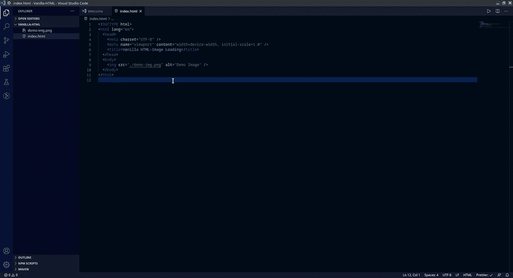
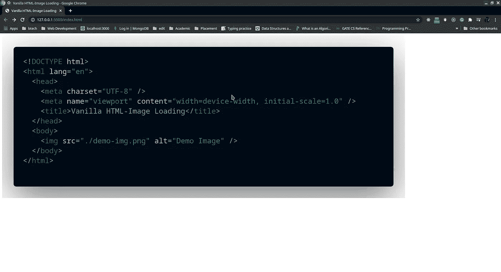
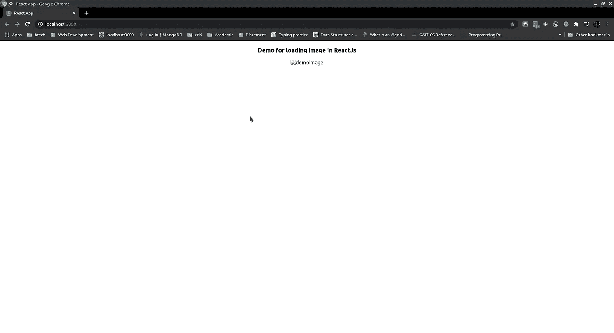
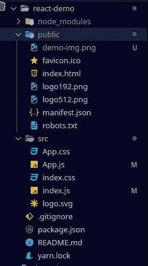
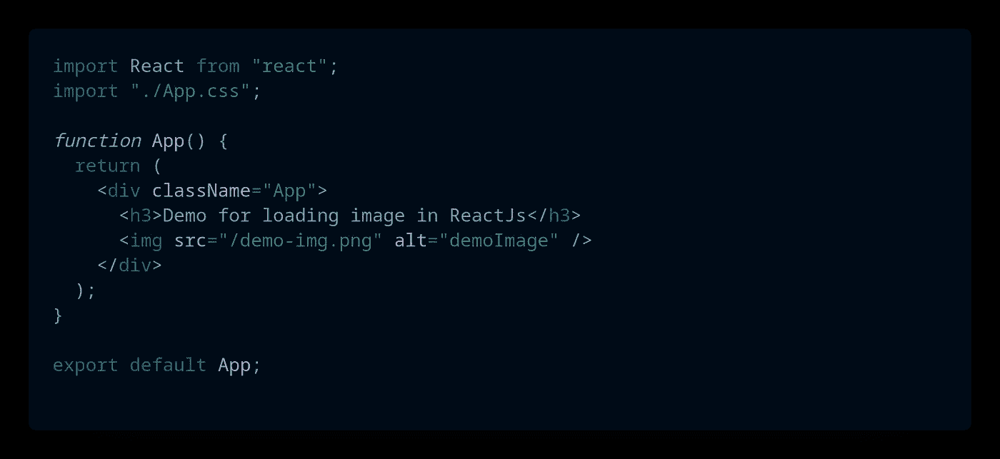
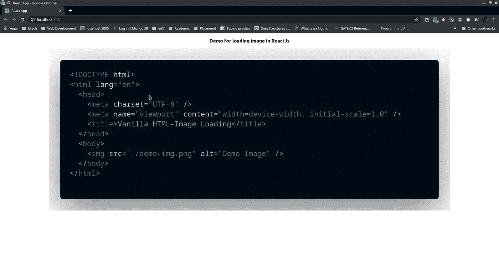
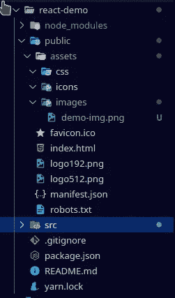

# ReactJs 中的图像渲染

> 原文：<https://medium.com/nerd-for-tech/image-rendering-in-reactjs-ad1d99a2a1c5?source=collection_archive---------2----------------------->

ReactJs 是一个即插即用型框架，主要用于构建 Web 应用程序。有了 Javascript 的初级知识，就可以在 ReactJs 中动手了。在构建一个用户喜欢与之交互的动态而漂亮的界面的模块化方法中，React 为开发一个使用 HTML、CSS、Javascript 的 web 应用程序所面临的问题提供了一个非常尖锐的解决方案。

尽管 React 通过提供 inline-CSS、modular-CSS 提供了几乎所有的界面开发解决方案，但初学者经常面临的一个问题是，即使在 ***img*** 标签的 src 属性中提供了正确的路径，图像也无法显示。事情很快变得令人沮丧，究竟为什么图像无法加载。人们开始疯狂地翻阅长长的 [**StackOverflow**](https://stackoverflow.com/) 答案，这再次导致人们对提供出路的更多怀疑。因此，考虑到图像的重要性，我们将尝试解释在使用流行的 Javascript 框架 ReactJs 创建 Web 应用程序时渲染(显示)图像的过程。

# 来自香草 HTML ✔️的通用方法

在一般的 HTML 中，我们一般喜欢把所有的**静态** **文件** ( **CSS** 和**图片**)和我们的 HTML 文件放在同一个目录下。

用普通 HTML 存储静态文件的常用方法

渲染图像

# 在 ReactJs 中遵循相同方法的问题🚩

虽然 HTML 的所有其他东西都在 ReactJs 中工作，但是图像加载不会导致不希望的输出。

> *以后想看这个故事？把它保存在***中。**

**

*react 中相同的文件夹结构*

*遵循相同的结构，即将**图像(demo-img.png)** 存储在与文件 **(App.js)** 相同的目录中，该文件将渲染**图像。结果会很不令人满意。***

**

*运行 react 项目时的输出*

# *问题的解决方法🏁*

*解决方法比推导问题更容易😋。*

*要快速摆脱这种情况，需要遵循以下几个步骤:*

# *1.将图像存储在公共文件夹中*

**

*当前文件夹结构*

**

*该图像已移动到公共文件夹*

# *2.以正确的方式定义 src 属性*

**

*从公共文件夹导入图像的代码段*

*请注意 img 标签的 **src 属性。该路径被定义为相对于**index.html**文件的**，该文件位于**公共**文件夹中的**。*******

**

*ReactJs 中的渲染图像*

*存储静态内容的常用**好方法** **是**在**公共文件夹**中创建一个资产文件夹**，然后将内容存储在各自的文件夹中。例如:***

**

*用于存储所有静态内容的独立文件夹*

*现在你可以在任何你想显示的地方显示这些美丽的数字化信息了。希望这有所帮助。*

## *更多来自期刊*

*有许多黑人创造者在科技领域做着令人难以置信的工作。这些资源为我们中的一些人提供了启示:*