# FGVC6 上的 iMaterialist(时尚)2019

> 原文：<https://medium.com/nerd-for-tech/imaterialist-fashion-2019-at-fgvc6-95a0d38ad362?source=collection_archive---------5----------------------->

# 时尚和服装的精细细分任务

# 内容

1.  介绍
2.  问题陈述
3.  性能指标
4.  关于数据
5.  目标
6.  探索性数据分析
7.  Tf 数据管道
8.  U-Net 标准架构
9.  培训 U-Net
10.  预言
11.  部署视频
12.  结论
13.  未来的工作
14.  参考

# **1。简介**

设计师知道他们在创造什么，但是人们真的穿他们的产品吗？人们在使用哪些产品组合？在本案例研究中，我们开发了一种算法，这将有助于实现自动产品检测的重要一步，即准确分配时尚图像的分割。

服装的视觉分析是近年来越来越受关注的话题。能够从图片中识别服装产品可以增强消费者的购物体验，并提高时尚专业人员的工作效率。

在这个案例研究中使用了一个新的服装数据集，其目标是通过联合时尚和计算机视觉社区的力量来引入一个新的细粒度分割任务。提出的任务是对时尚服装进行分类和分割，这是走向现实应用的重要一步。

 [## FGVC6 上的 iMaterialist(时尚)2019

### 时尚和服装的精细细分任务

www.kaggle.com](https://www.kaggle.com/c/imaterialist-fashion-2019-FGVC6/overview) 

# **2。问题陈述**

任务是执行时尚服装的分类和分割。给定服装图像，模型必须执行图像分割和分类。为了捕捉时尚对象的复杂结构和从网络抓取获得的描述中的模糊性，我们的标准化分类包含 46 个服装对象(27 个主要服装项目和 19 个服装部分)和 92 个相关的细粒度属性。

 [## FGVC6 上的 iMaterialist(时尚)2019

### 时尚和服装的精细细分任务

www.kaggle.com](https://www.kaggle.com/c/imaterialist-fashion-2019-FGVC6/overview) 

# **3。性能指标**

欠条:

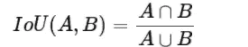

借据

该指标在 IoU 阈值范围内扫描，在每个点计算平均精度值。阈值范围从 0.5 到 0.95，步长为 0.05: `(0.5, 0.55, 0.6, 0.65, 0.7, 0.75, 0.8, 0.85, 0.9, 0.95)`。换句话说，在阈值为 0.5 时，如果预测对象与基础真值对象的交集大于 0.5，则该预测对象被视为“命中”。

来源:[https://www . ka ggle . com/c/imate rialist-fashion-2019-fgvc 6/overview/evaluation](https://www.kaggle.com/c/imaterialist-fashion-2019-FGVC6/overview/evaluation)

# 4.关于数据

在这个数据集中，为我们提供了大量的图像和相应的时尚/服装分割。图像以唯一的图像 id 命名。分割是以编码像素的形式。关于编码像素的更多细节，请参考[链接](/analytics-vidhya/generating-masks-from-encoded-pixels-semantic-segmentation-18635e834ad0)。数据集包含以下文件:

*   训练/ —训练图像
*   test/-测试图像(您正在分割和分类这些图像)
*   train . CSV——训练注释，包含具有分段服装类别和细粒度属性的图像；和仅具有分段服装类别的图像。
*   label_descriptions.json —给出服装类别和细粒度属性描述的文件。

train.csv 中的列如下:

*   `ImageId` -图像的唯一 Id
*   `EncodedPixels` -游程编码格式的掩码(详情请参考[评估页](https://www.kaggle.com/c/imaterialist-fashion-2019-FGVC6/overview/evaluation))。
*   `ClassId` -该掩码的类别 id。我们将类别和属性(如果有)连接在一起。
*   高度-给定图像的高度
*   宽度-给定图像的宽度

来源:[链接](https://www.kaggle.com/c/imaterialist-fashion-2019-FGVC6/data)

# 5.目标

本案例研究的目的是基于服装类别的分类执行简单的图像分割。它使用图像分割概念以及用于学习目的的计算机视觉概念。案例研究基于上述 kaggle 问题。使用的模型是一个简单的 U-Net 模型，以查看其在服装图像分割中的有效性。

# 6.探索性数据分析

a.基本统计

In train.csv:

*   唯一图像 id 的数量是 45，195。
*   特征的数量是 5。
*   具有属性的类别数是 11，499。
*   没有属性的类别数是 319714。

b.计数属性与图像数量图

我们首先将 train.csv 中给出的 ClassId 分成类别和属性。图像可以包含属性。根据我们的数据集如果 class_id 以`35_24_51_69_88_195_210_306`的形式出现

第一个数字表示类别，其余数字表示由“_”分隔的属性。例如，上面的类别是 35，属性是[24，51，69，88，195，210，306]。如果类 id 是单个数字的形式，那么这表示类别 id，并且图像包含 0 个属性。

我们绘制了一个简单的计数属性与图像数量的柱状图。

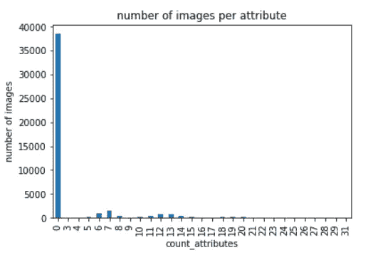

该图显示最大数量的图像没有属性。很少有图像具有非零属性。具有非零属性的图像的数量小于 5000。我们有一个偏斜的分布。

每个属性的图像数量的 c.kde 图

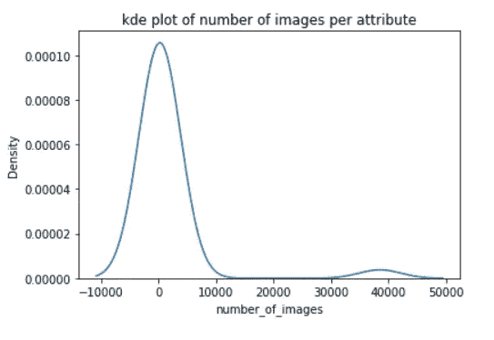

我们还绘制了 KDE 图，显示它是一条以 0 为中心的右尾正态分布曲线。

d.每个类别图的图像数量

*   类别 31(袖子)的图片数量最多，约为 6000 张。
*   类别 12，20，26，41，45 出现在最低数量的图像中。
*   类别 1，10，23，32，33 出现在相当多的图像中。

e.rle 到遮罩的转换:

为 train.csv 文件中的每个图像提供 rle(游程编码)。rle 被转换为分段掩码并存储在磁盘上。为此，我们将具有相同 image_id 的图像分组，然后获得属于该特定图像的类别列表。创建的掩码使用多标签分段概念。当我们使用稀疏分类交叉熵损失函数时，掩模像素在内部被表示为类别号。例如，参考下图。多标签分割就是这么做的。

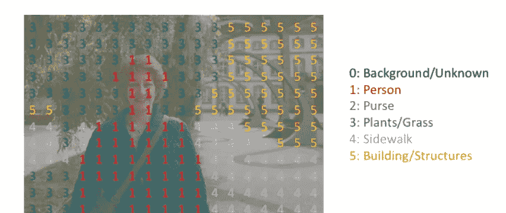

多层分割

# 7.Tf 数据管道

tf 数据管道是使用 tensorflow.org 指南创建的。tf-data 通过异步预取下一批数据来提高性能，使 GPU 无需等待数据。还可以并行化预处理和加载数据集的过程。

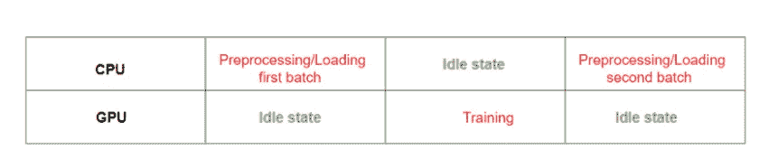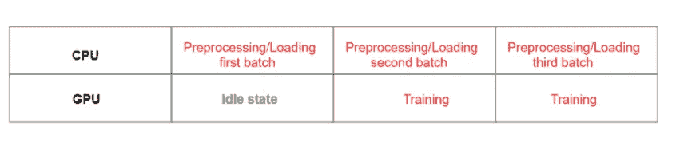

TF-数据管道效应

a.创建数据集:

*   tensor_slices:tensor flow 数据集是使用 tensor _ slices 创建的，它接受单个或多个 NumPy 数组或张量。这里它接受存储在本地磁盘上的图像和遮罩的文件名。tensor_slices 用第一维度对数据进行切片。它可用于将不同的元素组合成一个数据集，例如，将要素和标注组合成一个数据集(这也是张量的第一维应该相同的原因)。即数据集变得“更宽”。

b.数据集上的操作:

*   批处理:数据集。batch()将获取第一批 batch_size 条目，并对它们进行批处理。它将数据集的连续元素组合成一个批处理。当想要训练更小批量的数据以避免内存不足错误时，这很有用。在这里，我们采用批量大小为 5 进行训练。
*   地图:数据集。map()将把一些用户定义的函数映射到数据集上，这些函数转换数据以便能够为模型提供数据。这里，我们将 parse_image 函数和随机增强函数映射到训练数据集，并将 parse_image 函数映射到验证和测试数据集。由于输入元素相互独立，预处理可以在多个 CPU 内核上并行化。为了实现这一点，map 转换提供了 num_parallel_calls 参数来指定并行级别。
*   预取:数据集。prefetch()与训练步骤的预处理和模型执行重叠。当模型正在执行训练步骤 s 时，输入管道正在读取步骤 s+1 的数据。这样做可以将步长时间减少到训练的最大值(相对于总和)以及提取数据所需的时间。要预取的元素数量应该等于(或者可能大于)单个训练步骤消耗的批次数量。通常，在流水线的最末端添加一个小的预取缓冲器(可能只有一个元素)是最有用的，但是更复杂的流水线可以受益于额外的预取，尤其是当产生一个元素的时间可以变化时。这里，我们在预取中使用了大小为 3 的缓冲区。
*   shuffle: shuffle()应该在 batch()之前被调用，因为我们想要对记录进行洗牌，而不是批处理。首先通过按顺序添加记录来填充缓冲区，然后，一旦满了，就随机选择并发出一个记录，并从原始源读取一个新记录。

类似地，我们创建 tf 数据集进行验证和测试。

现在我们的 tf。数据管道创建完毕，可以使用了！！！！让我们展示一些图片和真实的面具:

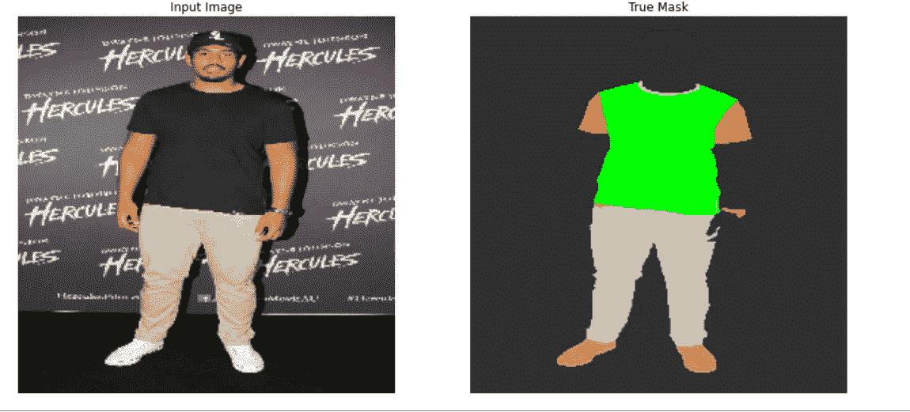

# 8.U-Net 标准架构

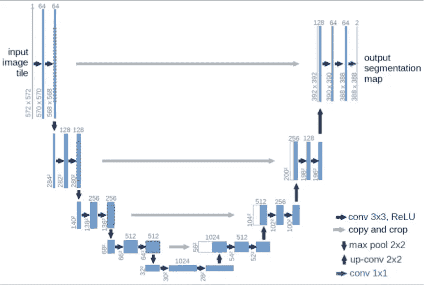

u 网

U-net 于 2015 年首次设计并应用于处理生物医学图像。在生物医学案例中，不仅需要区分是否存在疾病，还需要定位异常区域。因此，优信网服务于这一目的。它对每个像素进行分类，以便输入和输出共享相同的大小。U-Net 架构是对称的。它有一条收缩路径和一条扩张路径。左边部分是正常卷积过程的收缩路径，右边部分是转置 2d 卷积层的扩展部分。有关架构的完整解释，请参考[链接](https://towardsdatascience.com/understanding-semantic-segmentation-with-unet-6be4f42d4b47)。

标准的 U-Net 架构用于图像分割。这方面的代码如下:

# 9.培训 U-Net

该模型被训练 80 个时期。该模型用 Adam Optimiser 编译，学习率为(1e-3)，使用的损失是稀疏分类交叉熵。我们还使用 Keras 回调来实现 tensorboard 回调，如果连续 10 个时期验证损失没有改善，则提前停止，以及仅保存权重的模型检查点。

我们使用 128 的 batch_size 进行训练。

我们可以对这些参数进行超参数调整，提高模型性能。

我们还计算了 get_mean_iou 得分，这是我们的业务指标。这是一个自定义指标。

训练 80 个周期后获得的分数如下:

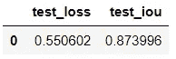

得分

get_mean_iou 和 loss 的训练图如下:

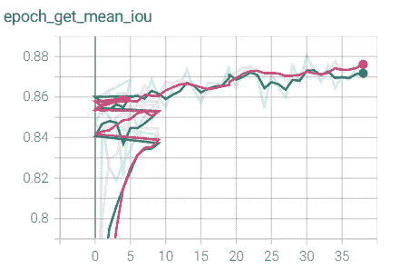

获取最近 39 个时期的平均值

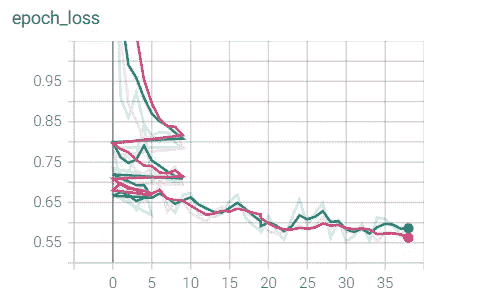

过去 39 个历元的历元丢失

# 10.预言

我们来看一些模型预测。

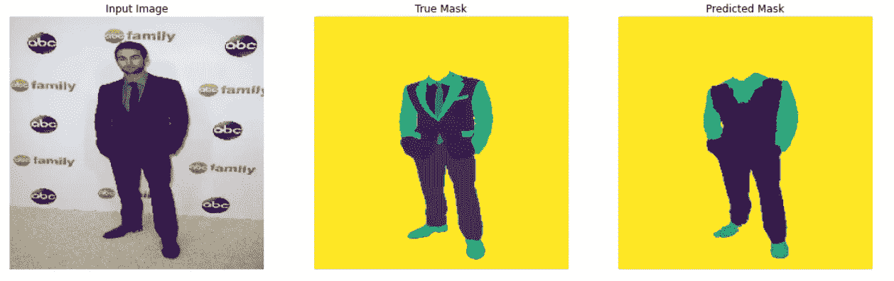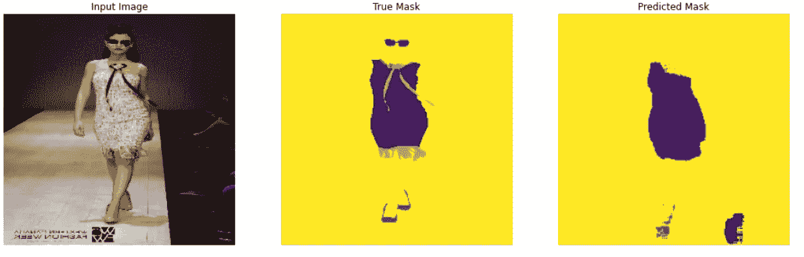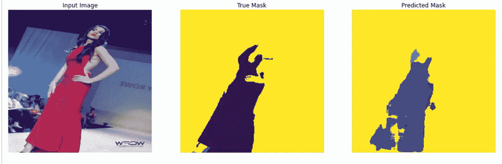

# 11.部署视频

该模型是使用 streamlit app 部署的。看一下视频。

# 12.结论

*   模型 unet 是一个简单的模型，易于实现。
*   我们可以更好地调整模型以给出更好的预测。
*   用于执行分割的过程简单且易于实现。
*   tf 数据管道让训练过程更快更优化。

# 13.未来的工作

*   可以使用 Mask-RCNN 模型，因为它是更复杂的模型并且更稳健。
*   图像可以调整为 512*512，而不是 256*256。
*   Tf-数据管道批量大小可以从 5。

# 14.参考

*   [https://code road . ru/59343661/Unet-% D0 % 9C % D1 % 83% D0 % BB % D1 % 8C % D1 % 82% D0 % B8 % D0 % BA % D0 % BB % D0 % B0 % D1 % 81% D1 % 81% D0 % BE % D0 % B2 % D0 % B0 % D1 % 8F-% D0 % A1 % D0 % B5 % D0 % B3 % D0 % BC % D0 % B5 % D0 % D0 % BD % D1 % 82% D0 %](https://coderoad.ru/59343661/Unet-%D0%9C%D1%83%D0%BB%D1%8C%D1%82%D0%B8%D0%BA%D0%BB%D0%B0%D1%81%D1%81%D0%BE%D0%B2%D0%B0%D1%8F-%D0%A1%D0%B5%D0%B3%D0%BC%D0%B5%D0%BD%D1%82%D0%B0%D1%86%D0%B8%D1%8F-%D0%98%D0%B7%D0%BE%D0%B1%D1%80%D0%B0%D0%B6%D0%B5%D0%BD%D0%B8%D0%B9)
*   [https://www . ka ggle . com/c/imate rialist-fashion-2019-fgvc 6/overview/description](https://www.kaggle.com/c/imaterialist-fashion-2019-FGVC6/overview/description)
*   [https://towards data science . com/understanding-semantic-segmentation-with-unet-6 be 4 f 42d 4b 47](https://towardsdatascience.com/understanding-semantic-segmentation-with-unet-6be4f42d4b47)
*   [https://www . ka ggle . com/kimwoojeong/simple-EDA-imate rialist-fashion-2019-at-fgvc 6](https://www.kaggle.com/kimwoojeong/simple-eda-imaterialist-fashion-2019-at-fgvc6)
*   [https://www.tensorflow.org/guide/data](https://www.tensorflow.org/guide/data)
*   [https://www.appliedaicourse.com](https://www.appliedaicourse.com/course/11/Applied-Machine-learning-course)

请查看我的 [Github](https://github.com/rash938/Imat-2019-fashion-self-case-study2-) 代码和 [LinkedIn](https://www.linkedin.com/feed/) 个人资料，以便进一步讨论。