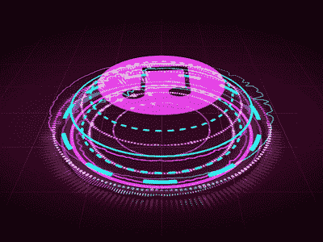
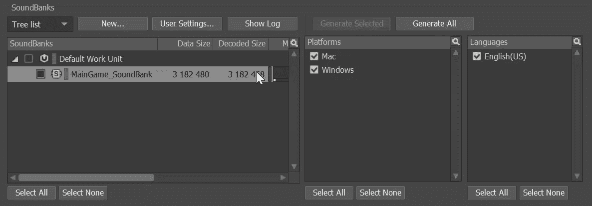
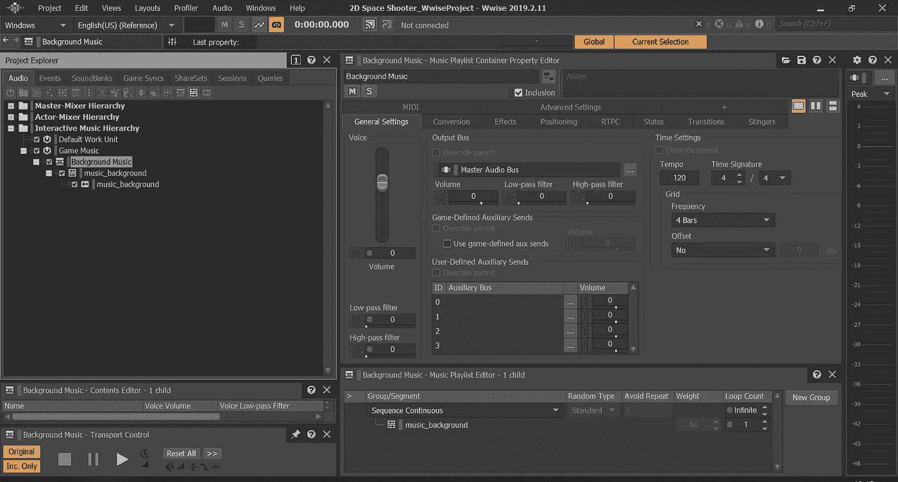
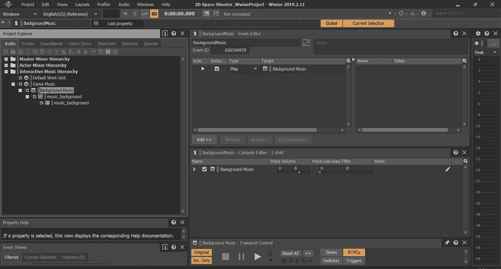
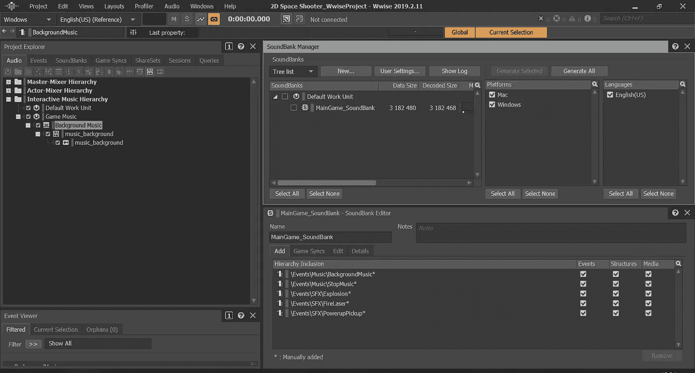
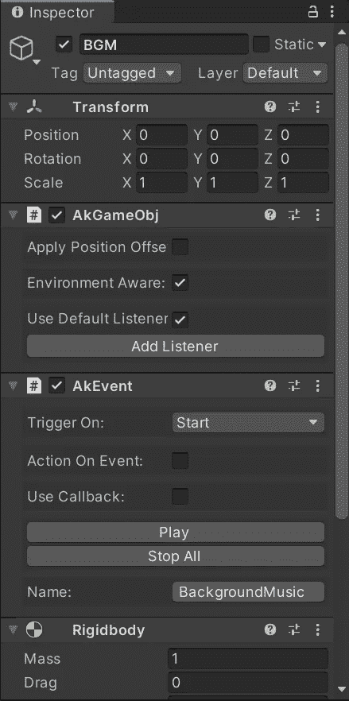
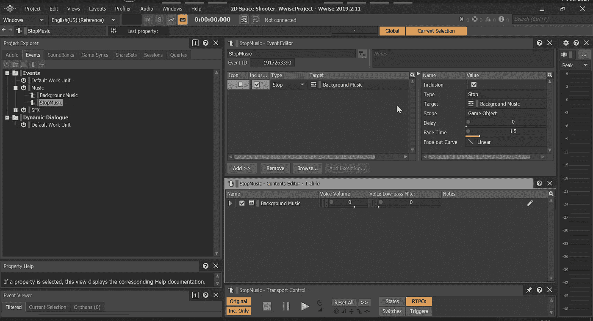
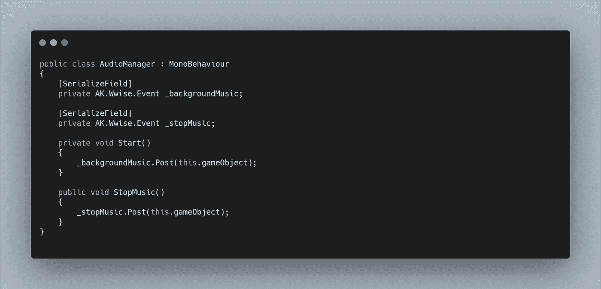

# 沉浸从声音开始

> 原文：<https://medium.com/nerd-for-tech/immersion-begins-with-sound-15f247f4121e?source=collection_archive---------14----------------------->

# Wwise 简介第一部分:音乐

**Wwise** 是一款**中间件**，能够与 **Unity** 集成，作为**音频引擎**的替代品，能够实现更多的功能，而不必从头创建一个引擎。

对于沉浸式音频，像 **Wwise** 这样的程序是非常优秀的。他们还有一个非常全面的认证计划，内容免费，非常适合让您了解它的大部分功能。

让我们看看用 Unity 的内部音频引擎替换我们实现的音频引擎。他们网站上的 **Wwise** 很大程度上涵盖了整合。但是需要注意的关键是创建了一个新的**音频监听器**，默认情况下，集成为**主摄像头**添加了一个**音频监听器**，在我们的例子中，这是完美的。我们需要删除默认的 **Unity 音频监听器**来解决任何问题。

我们还需要在 **Unity 中打开 **Soundbank** 。****声音库**由**声音**生成，保存我们所有的关键信息，以便在节目之间传递我们的**音频内容**。在我们的**音色库窗口(F7)** 中 **Wwise。**我们可以创建一个新的 **Soundbank，**选择我们的构建平台，然后点击 **generate all。**

现在在 **Unity 中，**让我们加载这个**声音库。**集成默认添加的另一个东西是一个 **WwiseGlobal 游戏对象**。这是一个**初始化脚本**，我们可以添加一个 **AkBank 脚本**来加载我们的 **Soundbank。**在下拉菜单中选择它，我们要将方法上的 **Load 设置为 **Awake** ，确保取消选择 **Start、**，否则它将在两种方法上加载 **Soundbank** 。我们使用**唤醒**，因为它是在**开始之前被调用的，**并且我们的一些声音会想要在**开始时被调用，**如果我们没有完成**声音库的加载，这些声音就不会工作。****

现在，让我们只使用相同的占位符音效来实现功能，就像简单形状的原型一样。一旦一切正常，我们可以在以后添加更多的音效。

首先，让我们添加背景音乐。在 **Wwise 中，**我们创建了**事件**，其中包含了我们想要为我们的音频调用的各种函数，最常见的是一个简单的**播放**函数。为了从 **Unity 调用这个函数，**我们可以添加一个 **AKEvent 脚本**到我们的**背景音乐游戏对象中。**这样做会要求我们添加一个**刚体**，这样我们的**监听器**就可以进行交互。现在我们可以将触发器设置为 **Start。**

让我们跳到**wise**并创建我们的第一个**事件。**在**项目浏览器窗口中，**让我们在**交互式音乐层级下添加一个新的**工作单元**。让我们在其中添加一个**音乐播放列表容器**，这样如果我们将来选择，我们可以创建一个音乐播放序列。现在在其中，我们可以**导入**我们的**背景音乐**，这将在**音乐片段**对象中创建一个**音乐轨道**对象。**

如果我们打开**交互式音乐布局(F10)** 并选择我们的**播放列表容器，**我们可以在屏幕底部看到一个编辑器。在这里，让我们添加我们的**音乐片段，**现在我们可以让它作为**序列连续，**但使用播放列表可以让我们随机播放不同的片段。我们希望背景音乐循环播放，因此将**循环计数**设置为**无限。**

如果我们在**项目浏览器中切换到**事件标签**，我们可以为**音乐**创建一个新的**工作单元**，然后在其中我们可以创建一个新的**事件。**如果我们选择新事件，切换回**音频选项卡**，我们可以简单地将**播放列表容器**拖放到**事件编辑器窗口中。**默认情况下，这将创建一个**播放功能。****

最后，我们需要将这个**事件**添加到我们的**声音库**中，这样它就可以被加载到 **Unity 中。**如果我们点击 **F7** 返回到我们的**音色库布局，**我们会在屏幕底部看到一个编辑器。只需将我们的**事件**拖放到该窗口中，然后重新生成**声音库。**

如果我们回到 **Unity** ，我们现在可以在我们的**背景音乐游戏对象上选择**事件**。**

现在，当我们开始游戏时， **Unity** 将从 **Wwise、**加载 **Soundbank** ，而 **BGM 游戏对象**将调用**背景音乐事件，**我们应该听到音乐！

当我们重新开始游戏时会发生什么呢？在 **Unity** 中，我们所有的游戏物体都在重装一个场景时被摧毁。这将删除我们的**音频源**，并因此停止我们的**背景音乐。**使用 **Wwise 集成，** **事件的**独立于 **Unity 游戏对象运行。**所以当我们重新加载场景时，我们的**播放背景音乐事件**的第二个实例被调用。

我们有很多方法可以做到这一点，**单线图**在场景之间保持某些元素活跃是很常见的。但是一个快速简单的方法是在 **Wwise 中创建另一个**事件**。**我们可以调用的功能之一是**停止**，如果我们拖放我们的**背景音乐播放列表**，那个播放列表就会停止。简单对！

现在我们可以创造另一把 AK。Wwise.Event 变量并在**公共方法**中触发它，该方法由我们的**游戏管理器**在我们的 **GameOver 方法中调用。**

当我们输掉游戏时，我们的**背景音乐**现在停止，重新启动时，**音乐**再次开始播放。对于任何有鹰眼的人来说，你可能会注意到我的 **StopMusic 事件中有一个**渐变时间**，**允许我们在失败时有一个更好的放松，并为我们重新开始演奏做一个更好的过渡。