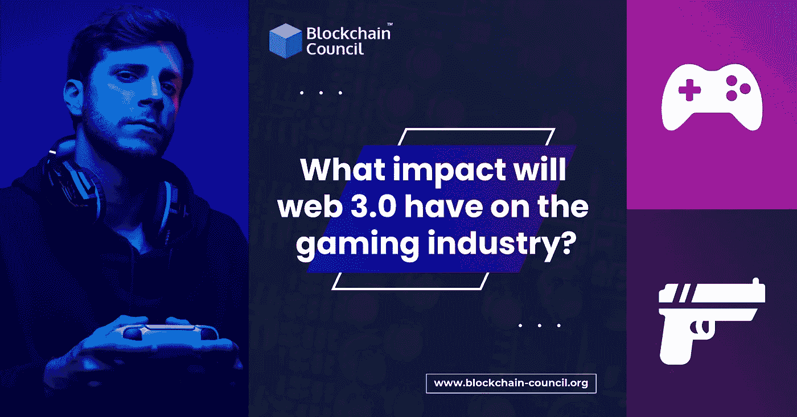

# Web 3.0 对游戏行业的影响

> 原文：<https://medium.com/nerd-for-tech/impact-of-web-3-0-on-the-gaming-industry-9c1643f2333d?source=collection_archive---------4----------------------->

Web 3 是互联网的未来，基于区块链技术。我们的世界正在从万维网向 Web 2.0 和 Web 3.0 过渡。有专家称， [**区块链平台**](https://www.blockchain-council.org/blockchain/top-10-blockchain-platforms-you-need-to-know-about/) 将为 Web 3 提供数据安全。这第三代发展强调分散应用。此外，它是人类最伟大的发明之一。专家认为 Web 3 是下一代互联网，将提供更丰富的应用体验。因此，它也将彻底改变游戏。Web 3 允许游戏玩家在玩游戏的同时赚钱。它将在几个方面完全改变游戏产业。在深入探讨 Web 3 对游戏的影响之前，让我们先来探索一下 Web 3 是什么。

# 什么是 Web 3？

众所周知，Web 3 是互联网的最新版本。这是第三代网络技术，利用了 T4 的区块链平台 T5。随着机器学习和人工智能的使用，Web 3 增强了应用程序。在过去的几年中，HTML 为 web 1.0 和 Web2.0 提供了网页。预计同一种语言将继续成为第三代 Web 技术发展的基础。通过一种去中心化的方法，Web 3 向用户提供了更快、更相关的数据。虚拟助手的引入将彻底改变互联网的世界。然而，我们可能需要更长的时间来全面实现 Web 3 并重塑它。但这是一个将用户生成的内容带入游戏等各种行业的概念。这个网络背后的想法是让应用程序去中心化，没有中央权力机构可以控制它们。

# Web 3 对游戏行业的影响

到 2025 年，游戏行业的市场规模将达到 1256.5 亿美元。预计随着 Web 3 的出现，这一数字将会进一步增长。一些人倾向于玩游戏，因为它能缓解压力。所以，为了自我满足，他们依赖游戏。因此，这扩大了市场规模和行业的整体经济。Web 3 游戏允许玩家以创新的方式参与游戏。

这个网站是一个吸引更多用户并帮助他们拥有游戏内资产的伟大解决方案。此外，这是一种不断变化的方式来提供技术，如游戏分散自治组织与区块链为基础的游戏资产所有权。基于 Web 3 的游戏吸引玩家交换数字资产并从中获利。此外，它为这个行业提供了更好的虚拟市场。由于这个网站是由区块链平台建立的，它允许玩家就任何游戏应该如何发展发表意见。

Web 3 将为游戏玩家的游戏和游戏赚钱奠定基础。此外，它还提供资产交易和用加密货币赚钱的机会。这进一步吸引用户创收。Web 3 游戏应该以 NFTs、Dao 和加密货币为特色。这反过来增强了玩家的游戏体验。更重要的是，它有助于资产的真正所有权及其内部和外部培训。Web 3 使游戏应用更接近本地边缘服务器和物联网设备。有了这个网络，在特定游戏运行的区块链技术上记录的交易将有更好的安全性。

Web 3 对游戏行业的其他好处如下:

1]游戏玩家可以创建自己的数字资产，如徽章和皮肤，并获得奖励。这些奖励是针对游戏中的成就，如成就、胜利、游戏中的动作等。此外，他们可以将虚拟物品转移到**区块链平台**。在加密钱包的帮助下，交易将在区块链内进行。作为用户，您对安全存储在您帐户中的资产拥有完全的所有权。公钥和私钥识别所有这些事务。

2]游戏玩家可以在人工智能的帮助下提高技能。因此，它增加可信度，改善弱点。此外，Web 3 gaming 还回答了玩家的问题。在接下来的几年里，它将统计游戏玩家的活动，以帮助他们获得投资。

Web 3 游戏的一个显著特点是将旧游戏模式整合到**区块链平台**和元宇宙中。这样，游戏过程将成为每个游戏玩家的个人选择。他们将能够扩展自己的元宇宙技术，并制作自己的头像来交易游戏中的收藏品。此外，参与特定区块链网络的大量玩家可以访问基于区块链的游戏。

# 结论

游戏行业的 Web 3 确保了透明性和安全性。区块链技术是高效运营游戏行业的最通用解决方案。要了解更多关于这项新兴技术的信息，请参加 [**区块链开发者**](https://www.blockchain-council.org/certifications/certified-blockchain-developer/) 在[区块链委员会](https://www.blockchain-council.org/)的课程。它是区块链教育的最佳平台。