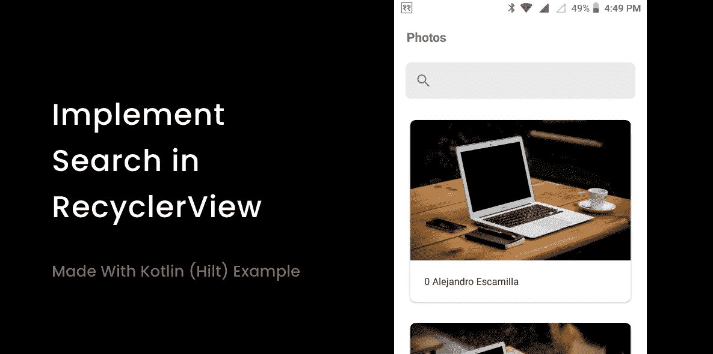
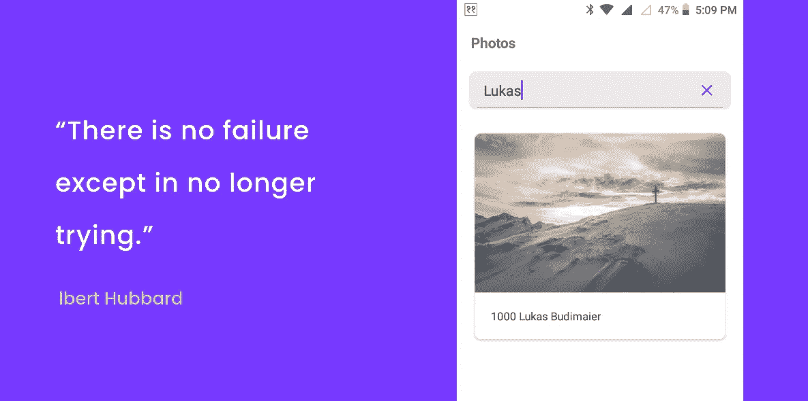

# RecyclerView Android 中的过滤器

> 原文：<https://medium.com/nerd-for-tech/implem-search-in-recyclerview-5bc18b547f4f?source=collection_archive---------0----------------------->

从公共 API 搜索并加载**回收器视图**。



🚀你好，在本文中，我们将实现一个带有**搜索视图&回收器视图**的完整页面。

从获取数据到用来自公共 URL“【https://picsum.photos/v2/list】*”的响应列表填充回收器视图。*

*此 **GET** API 的响应*

```
*[
 {
 “id”:”0",
 “author”:”Alejandro Escamilla”,
 “width”:5616,
 “height”:3744,
 “url”:”[https://unsplash.com/photos/yC-Yzbqy7PY](https://unsplash.com/photos/yC-Yzbqy7PY)",
 “download_url”:”[https://picsum.photos/id/0/5616/3744](https://picsum.photos/id/0/5616/3744)"
 },
 {
 “id”:”1",
 “author”:”Alejandro Escamilla”,
 “width”:5616,
 “height”:3744,
 “url”:”[https://unsplash.com/photos/LNRyGwIJr5c](https://unsplash.com/photos/LNRyGwIJr5c)",
 “download_url”:”[https://picsum.photos/id/1/5616/3744](https://picsum.photos/id/1/5616/3744)"
 }
 ....
]*
```

***步骤 1:初始设置***

*初始项目设置和改造可在下面的源代码链接与爱，科特林和希尔特注入。*

*[](https://github.com/iamnaran/search-recycler-view) [## iam naran/搜索-回收器-查看

### 这个项目帮助你理解 Android (Kotlin)中的手柄集成，它包括改进的协程架构…

github.com](https://github.com/iamnaran/search-recycler-view) 

将基本 URL 添加到我们的 Gradle 实现中。

```
buildConfigField 
'String', 'BASE_URL', "\"https://picsum.photos/v2/list\""
```

**步骤二。创建型号&适配器**

这里，在这个项目中，**照片**模型是从 API 响应**https://picsum.photos/v2/list**中创建的。

> **Photos.kt**

```
*import* com.google.gson.annotations.SerializedName

*data class* Photos(
    @SerializedName("author")
    *var* author: String, *// Matthew Wiebe* @SerializedName("download_url")
    *var* downloadUrl: String, *// https://picsum.photos/id/1025/4951/3301* @SerializedName("height")
    *var* height: Int, *// 3301* @SerializedName("id")
    *var* id: String, *// 1025* @SerializedName("url")
    *var* url: String, *// https://unsplash.com/photos/U5rMrSI7Pn4* @SerializedName("width")
    *var* width: Int *// 4951* )
```

然后，让我们为我们的回收器视图创建一个适配器，其中**照片列表**是数据列表& **照片列表过滤**是我们过滤后得到的列表的结果。

```
*var* photosList: ArrayList<Photos> = ArrayList()
*var* photosListFiltered: ArrayList<Photos> = ArrayList()
```

也是为了在我们的**回收视图**中实现搜索。我们需要在您的适配器中实现***Filterable****，并覆盖***get Filter():Filter**object**。**

> **PhotosAdapter.kt**

让我们把图片适配器添加到我们的**图片活动**中。我们还需要实现 **SearchView。*OnQueryTextListener****中我们的* **活动/片段** *。*

> **光活性. kt**

> **PhotosViewModel.kt**

**步骤三。绘制回收视图**

在这里，我们观察来自服务器的结果，并在响应时向**发送一个值，在上面的**活动中，我们观察这个响应。

完成后，你所有的搜索应该工作。

[](https://github.com/iamnaran/search-recycler-view) [## iam naran/搜索-回收器-查看

### 这个项目帮助你理解 Android (Kotlin)中的手柄集成，它包括改进的协程架构…

github.com](https://github.com/iamnaran/search-recycler-view) 

获取更多带示例的文章。

谢谢你。

日安。*