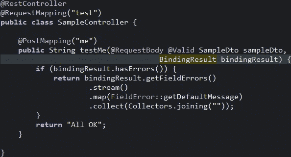
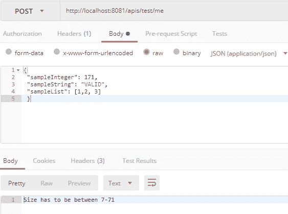
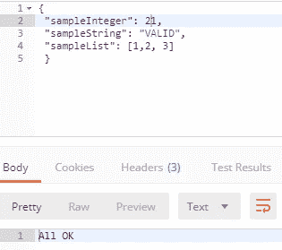
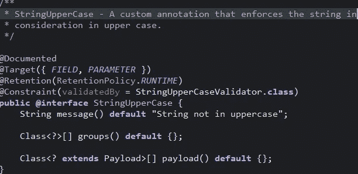
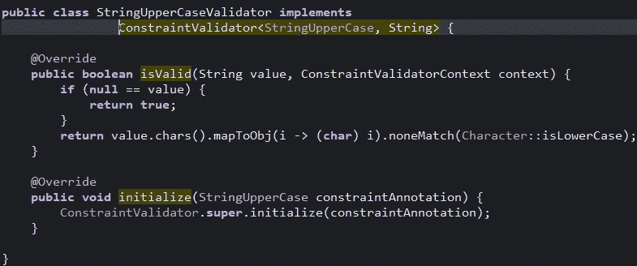
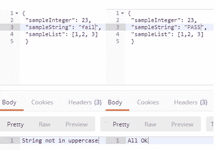

# 使用基于 JSR 的验证实现定制验证器[Java 8/Spring]

> 原文：<https://medium.com/nerd-for-tech/implement-custom-validators-using-jsr-based-validations-java-8-spring-f06920877916?source=collection_archive---------0----------------------->


最近，在我们的项目中，我们要求 ***处理客户端作为 JSON 响应从 UI 发送的 Java 模型*** 中的字段验证。

出于演示的目的，让我们将 sampleDto 作为我们的模型对象。它看起来有点像这样

```
@Getter
@Setter
public class SampleDto { public Integer sampleInteger;
    public String sampleString;
    public List<Integer> sampleList;}
```

相当简单。注意, [Lombok](/@ricardoespsanto/lombok-31997912dd88) 用于@Getter @Setter 注释，这是为了强调简洁。考虑一个典型的 MVC 类型架构。这个 ***dto/model*** 将作为 JSON 响应从用户传入。使用 [Postman](https://medium.com/u/94144f041644?source=post_page-----f06920877916--------------------------------) ，让我们构造请求体。

```
{
 "sampleInteger": 171,
 "sampleString": "VALID",
 "sampleList": [1,2, 3]
 }
```

为了映射传入的 post 请求，让我们构建一个非常简单的控制器，其端点名为 **test/me** 。只是最基本的。

```
[@RestController](http://twitter.com/RestController)
[@RequestMapping](http://twitter.com/RequestMapping)("test")
public class SampleController {[@PostMapping](http://twitter.com/PostMapping)("me")
 public void testMe(@RequestBody SampleDto sampleDto) { //...our validation logic goes here
 }
```

现在进入业务需求。比方说，我们要验证**要求 A) *每个被传递的字符串是否都必须是大写字母*** 如果条件不满足，我们抛出一个异常并停止执行。

我们如何实现这一目标？有很多方法可以做到这一点。想想天真的方法

```
public void testMe(@RequestBody SampleDto sampleDto) {
    if (null != sampleDto.getSampleString()) {
         //handle null
    } if (sampleDto.getSampleString().chars().mapToObj(i -> (char) 
           i).noneMatch(Character::isLowerCase)) {
        //handle all upper case
    }
}
```

这里没有什么特别的，只是检查字符串是否不为空，并且没有出现任何小写字符。

# 瞧啊。它工作了。

现在我们已经处理了需求，甚至没有意识到我们已经用业务级验证搞乱了控制器逻辑，我们应该感到自豪。正当我们高兴的时候，客户又提出了一个要求。

**要求 B)样本整数的大小必须在 7–71 之间**

我们花了一些时间，很快意识到这是大约 3-4 行代码的额外工作。

> 我们甚至将我们的验证逻辑隔离到不同的函数中，以加强关注点的分离。

```
public void testMe(@RequestBody @Valid SampleDto sampleDto) {
    if (isValid(sampleDto)) {
       //continue
    } else {
        //handle errors
    }
}private boolean isValid(SampleDto sampleDto) {
     if (null != sampleDto.getSampleString()) {
           return false;
     } if (sampleDto.getSampleString().chars().mapToObj(i -> (char)   
         i).noneMatch(Character::isLowerCase)) {
          return false;
     } if (null != sampleDto.getSampleInteger()) {
          return false;
     } if (sampleDto.getSampleInteger() >= 7 && 
        sampleDto.getSampleInteger() <= 71) {
          return false;
     }
     return true;
}
```

令人惊讶的是，现在我们可以在验证到来时处理单独的验证。此外，我们的控制器逻辑委托验证逻辑。

客户看到你陶醉在自己的荣耀中，突然拿出一个。

***C)用户输入的样本整数必须是质数***

> 现在，我们开始注意到目前为止我们的方法存在的问题。

*   我们正在处理许多 iff 和 else。
*   我们到底应该把验证函数放在哪里？我们说的是独立包装吗？这个功能的范围是什么？谁能说呢？
*   我们应该为其他 dto 设置单独的验证功能吗？我们说的是多少人？
*   *如果一个模型字段有五个验证，*这是否意味着我们需要在一个函数中放入五个不同的逻辑块？如果有五个不同的成员呢？
*   如果*我想对一些 dto 进行验证，而不是对其他 dto 进行验证*，那该如何操作呢？

显然，我们陷入了一个难题。随着项目规模的增长，我们的挫折感也随之而来。

# 输入 JAVA Bean 验证/JSR

当然，在大多数应用程序中，验证用户输入是一个非常常见的需求，Java Bean 验证框架已经成为处理这种逻辑的事实上的标准。

**JSR 380** 是用于 bean 验证的 Java API 的规范，是 JavaEE 和 JavaSE 的一部分，它确保 bean 的属性满足特定的标准，

设置基于 JSR 的注释非常简单。包括对 hibernate-validation(带版本)的依赖，您就可以开始了。

```
<dependency>
     <groupId>org.hibernate</groupId>
     <artifactId>hibernate-validator</artifactId>    
     <version>${hibernate-validator.version}</version>
</dependency>
```

你说，我们如何使用它？

只需
***A:用所需验证类型
***的注释来注释成员字段***B:****让 spring 知道必须使用****@ Valid annotation***来完成验证

**答:我们的 sampleDto 的整数字段现在得到了改造**

```
@NotNull
@Range(min = 7, max = 71, message = "Size has to be between 7-71")
public Integer sampleInteger;
```

@Range 和@NotNull 是内置的验证器。让我们利用它，而不是重新发明轮子。请注意，如果验证失败，我们也可以传入自定义消息。

现在，考虑“尺寸≤ 71 &尺寸≥7”是我们测试的唯一约束。我们的控制器逻辑如何被修改？

由于 Spring 支持验证器，我们简单地让我们的方法知道必须使用@Valid 注释来执行验证

**B: @Valid 批注** 根据 Docs， *@Valid 标记一个属性、方法参数或方法返回类型，用于验证级联。当验证属性、方法参数或方法返回类型时，验证对象及其属性上定义的约束。这种行为是递归应用的。*

这对我们很重要。现在我们可以随时随地进行验证。

```
[@PostMapping](http://twitter.com/PostMapping)(“me”)
 public void testMe(@RequestBody **@Valid** SampleDto sampleDto) {
     //...our business logic goes here
 }
```

请注意**@有效的**注释。现在我们要接受验证了。但是默认情况下，如果验证失败，Spring 不会做任何事情。没有人捕捉到异常。**无声无息地失败了。这绝对不是我们想要的。**

为了显式地捕捉它，我们需要传递一个类型为***binding result****的接口:一个表示绑定结果的
通用接口。扩展了错误注册功能的接口，允许应用验证器，并添加了特定于绑定的分析和模型构建。*

我们分别处理纠错。此外，该方法已被修改为返回一个字符串，以便我们可以获得它作为一个响应。



我们改良的控制器

让我们启动一个来自 POSTMAN 的 post 请求，并看看它是如何工作的。



我们收到我们的信息作为回应

当我们的 sampleInteger 完全符合约束条件时会发生什么？即在 7–71 之间。我们去看看。



# 平稳。

我们的验证运行良好。一切都在正确的位置。没有整洁的控制器，除了我们可以使用控制器建议处理的绑定结果部分。没问题。

让我们解决房间里的大象，好吗？
**自定义验证呢？**

如果默认情况下没有实现，我如何处理字符串大写检查。

欢迎来到文章的最后部分。如果你能走到这一步，真了不起。我们正在实现基于自定义 JSR 的注释，同时意识到我们为什么需要这样做，以及我们的替代方案是什么。

让我们来处理“**字符串大写检查**”。让我们遵循一些步骤。

*   用自定义注释修饰所需的字段。我们将很快创建它。

```
@NotNull()
@StringUpperCase()
public String sampleString;
```

我们将自定义注释命名为: **StringUpperCase。**让我们创建它

*   我们使用@interface 符号创建一个注释。为方便起见，让我们放入一个单独的包，比如说 com . medium . log in . validation . constraints

```
@Constraint(validatedBy = "StringUpperCaseValidator.class"
public @interface  StringUpperCase{
}
```



约束有效注释

这是一个非常简单的注释，有一个运行时范围。我们的目标要么是一个字段，要么是一个参数，这是我们适当指定的。我们注意到以下情况:

**@constraint** :包含该约束
**的验证逻辑的类，当违反约束
**时会生成**消息，验证 api 使用**组。我们不要碰它。
**payload:**Spring 用来处理代理。我们也不要碰它

很好，一旦我们声明了注释，我们需要为它创建一个验证器。当然，这是有道理的。这个注释如何知道它的验证逻辑是什么？

*   最后一步，让我们在一个单独的包中创建验证逻辑。比方说
    *com . medium . log in . validation . validator .*建议创建一个单独的包。这是加强模块化的原因。更改验证逻辑不应涉及控制器的更改。

```
public class StringUpperCaseValidator implements  
             ConstraintValidator<StringUpperCase, String>{

   @Overrride
   public boolean isValid(String val, ConstraintValidatorContext c){
   }
}
```



约束验证器逻辑

我们实现了验证库提供给我们的 constraintValidator 接口。请注意，我们引用了之前创建的注释 **"StringUpperCase"** ，并指定我们正在验证一个字符串。它可以是任何对象。

这里只有一种方法是最重要的。
你猜对了，是 **isValid()。**你会意识到**是有效的**方法的逻辑类似于我们在简单实现时的逻辑。

# 就是这样。我们完了。我们做到了。

最后，让我们验证它是否有效。



当以大写字母键入时，所有约束都得到满足。

既然这样，让我们加入一个单元测试。

```
@Test
public void sampleStringNotUpperCaseTest() {
      SampleDto sampleDto = new SampleDto();
      sampleDto.setSampleList(new ArrayList(Arrays.asList(1,2,3)));
      sampleDto.setSampleString("FAIL");
      sampleDto.setSampleInteger(23); // test string as invalid: not in uppercase
      Set<ConstraintViolation<SampleDto>> violations = 
             this.validator.validate(sampleDto); assertEquals(1, violations.size());
}
```

## 这就把我们带到了文章的结尾。所有的验证逻辑都在单独的包中，我们可以随时强制执行，不会干扰 MVC 逻辑。

为了对控制器隐藏 bindingResults 参数，我们可以设置一个控制器通知。我很快会写这方面的内容。

如果你喜欢这篇文章，请鼓掌并分享给其他人。
祝您愉快。