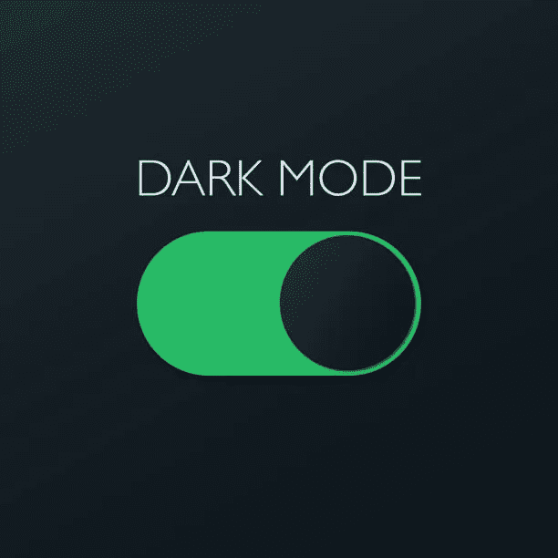
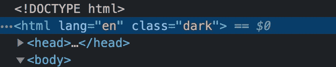
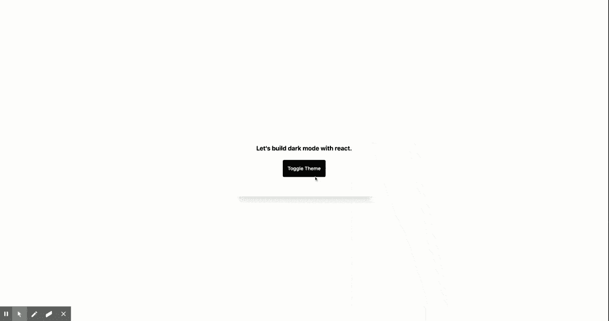

# 在 React 中使用 Zustand 和 Tailwind CSS 实现黑暗模式

> 原文：<https://medium.com/nerd-for-tech/implement-dark-mode-with-zustand-and-tailwind-css-in-react-da3299e6e824?source=collection_archive---------4----------------------->

## 原力的黑暗面是通向许多被认为是非自然的能力的途径——达斯·普雷格斯



是时候拥抱黑暗面了。

今天，我将向您展示如何使用 *zustand(德语)*和 Tailwind CSS 创建一个黑暗模式 react 应用程序。我们开始吧！

首先，什么是 zustand？

> ***Zustand*** 是一个小型、快速、可伸缩的 bearbones 状态管理解决方案。有一个基于钩子的舒适的 api，不是样板或固执己见，但仍然足够清晰和流畅。

如果你熟悉`redux`，这对你来说应该是小菜一碟。

对于这个应用程序，我将使用 [**创建-反应-应用**](https://github.com/facebook/create-react-app) 。启动您的终端并运行以下命令

```
npx create-react-app react-dark-mode
```

在我们开始酷的东西之前，我们需要安装我们的依赖项。

运行`npm install zustand`安装 zustand。

用`create-react-app`设置顺风已经在顺风官方文档中有记录。导航到[这个页面](https://tailwindcss.com/docs/guides/create-react-app)用我们的项目设置顺风 CSS。

## 一旦你完成了，让我们开始吧！

# 步骤 1:设置顺风配置🔨

首先，我们需要设置一些`tailwind`配置。导航到项目根目录下的`**tailwind.config.js**` 。如果您正确地遵循了这里的步骤[和](https://tailwindcss.com/docs/guides/create-react-app)，文件应该已经在那里了。

将以下内容添加到您的`**tailwind.config.js**`:

注意`**darkMode**`键，这是直接来自顺风文件。添加`**class**`作为值允许我们手动控制黑暗模式。您也可以使用`**media**`根据您的操作系统主题切换主题。

我们继续吧。

# 步骤 2:构建用户界面🖥️

打开`**App.js**`，更换内容如下:

让我们讨论一下这里发生了什么。使用 Tailwind，我们需要做的就是添加前缀`dark`来实现黑暗模式样式。例如:

`dark:bg-black dark:text-white`

如果你熟悉顺风，这个概念对你来说不会陌生。仅当您的应用程序处于黑暗模式时，`dark:`前缀后的样式才会被应用。你可以在这里了解更多。

# 步骤 3:常量⚙

在我们继续切换函数之前，让我们在一个**常量**文件中声明我们的主题。在你的`src`目录下创建一个名为`constants`的新文件夹。我们就叫它`**index.js**`。将下面的代码放在`**src/constants/index.js**`中

这将有助于避免我们整个代码库的错别字。现在，我们需要一种方法来切换我们的黑暗模式。使用 tailwind，我们需要将类`dark`添加到我们的`root`元素中。



# 步骤 4:编写我们的切换函数🌗

现在，让我们来看看我们的`**toggle**`函数。

让我们讨论一下这里发生了什么。我们的`applyThemePreference`函数接受当前主题作为参数。基于当前主题，我们可以从`root`元素中添加/移除`dark`属性。

也就是说，如果当前主题是`light`，这将为我们的`root`元素添加一个`dark`类，反之亦然。现在，我们需要一种方法来持久化我们的主题，这样即使我们重新加载页面，我们的首选主题也应该持久化。输入 ***zustand。***

Zustand 带有一个内置的中间件，允许我们将状态保存到`localStorage` **。让我们来建造我们的主题商店。**

# 步骤 5:用 Zustand 管理全局状态💪

导航到`src`并创建一个名为`stores`的新文件夹。在`stores`中，我们将创建一个名为`useThemeStore`的新文件。将内容`**src/stores/useThemeStore**`替换为以下内容:

让我们讨论一下这里发生了什么。我们有我们的`themeStore` 来展示我们应用程序的当前主题，还有一个**函数**来切换主题。这将把我们的`theme`变量从暗变亮，反之亦然，这取决于我们应用程序的当前主题。

`**persist**` `**middleware**` 将允许我们的状态通过`theme`键保存在`localStorage`中。我们可以将一个配置对象传递给我们的持久化中间件，以更改`localStorage`键的名称和其他属性。


# 第六步:向黑暗面问好！🌚

头回到`**App.js**` ，修改如下:

让我们讨论一下这里发生了什么。

Zustand 公开了一个钩子来将该状态消耗到我们的组件中。如果你还记得的话，我们将当前的`theme`和`toggleTheme`存储在我们的状态中。我们现在可以使用我们的`useThemeStore`钩子来消耗状态。

我们传递一个**选择器**给我们的**钩子**，它为我们提取那些值。你可以在组件的外部声明你的选择器**，以防止每次渲染时不必要的计算。但那是另一篇文章的内容了。**

这里，我们将`theme`和`toggleTheme`放在组件中，我们可以用它们来管理应用程序的主题状态。我们将`toggleTheme` 传递给我们的`button onClick.`，这将负责为全局状态更改主题。

现在，要改变主题并反映到你的 UI 上，我们需要使用我们的`applyThemePreference` 函数和我们的`useEffect` **。**

> 你会问，我们为什么需要一个`**useEffect**`？每当主题改变时，我们都需要从我们的`*root*`元素中添加/移除`*dark*`类。

## 点击切换主题按钮，看看魔术！🧙



# 还有…我们完了！！！​🥳​🎉​​💃🏻​

> 但是等等，我们可以做得更多一点。我们可以将这个功能提取到一个**定制钩子中。**

在`src`里面新建一个文件夹`hooks`，命名为`**useTheme.js**`。在您的`**src/hooks/useTheme.js**`中，添加以下代码:

在你的`**App.js**`T5、里面有一个可重复使用的挂钩！

好了，我们完成了！！！！

整洁！

你可以在 [Github](https://github.com/rohitpotato/) 查看我的更多作品，如果你感兴趣，可以在 [Twitter](https://twitter.com/rohitpotato) 上关注我。

*感谢阅读！！*