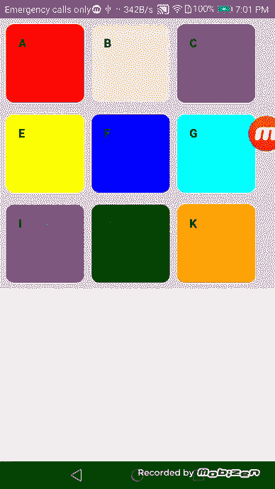

# 在 React 应用程序中的多个列表之间实现拖放，并在 React 本机应用程序中呈现 web 内容

> 原文：<https://medium.com/nerd-for-tech/implement-drag-and-drop-between-multiple-lists-in-a-react-app-and-renders-web-content-in-a-react-d9378a49be3d?source=collection_archive---------1----------------------->


在这里，我将使用 [react-beautiful-dnd](https://www.npmjs.com/package/react-beautiful-dnd) 实现多个列表之间的拖放项目，它能够使用后端 Json 响应动态控制可拖动的列表项目。此外，我们可以将该实现用作 react web 应用程序，或者在后端服务器中部署 web 应用程序，并使用 [react-native-webview](https://www.npmjs.com/package/react-native-webview) 在 react 本地应用程序中呈现 web 内容。

这篇文章的主要目的是在 react native 应用程序中使用这个实现，因为我们在 react native 中使用手势处理程序时有一些限制。

在这篇文章中，我将分享我是如何建造它的。下面我们可以看到在 android 设备上完成的拖放仪表板的样子:



所以让我们开始吧。

## 设置项目:

你需要做的第一件事是创建 React web 应用程序。你可以从[这里](https://create-react-app.dev/docs/getting-started/)找到更多信息。

由于功能是动态且简单的，我将在 App.js 中实现它。

下面是初始组件的样子:

**导入依赖项并定义示例后端 Json 响应:**

现在让我们导入依赖项，动态定义项目列表的后端响应的格式，并将其分配给一个状态变量。由于这是一个初始实现，我在 App.js 中硬编码了示例 Json 响应。稍后，我们可以使用后端 API 根据相同的格式动态获取仪表板项目列表并分配给状态。

在条目列表数组中，你可以看到我为每一行添加了唯一的可拖动 id，每一行条目都包含了数组对象的所有属性。

**实现:**

这里，所有内容都包装在< *DragDropContext >* 中，状态变量 *itemList* 映射到一个列表，使用数组映射函数动态呈现行。每一行都被包裹在*和<中。对于每一行中的单个项目 *row_items* 数组，该数组在每个主项目的内部，使用数组映射函数将状态映射到一个列表，以动态呈现每个项目。每个单独的项目都被包裹在可拖动的*<*>中。*

每个<*可拖放* >和< *可拖动* >都有一个唯一的 id，当拖放<*DragDropContext*>时触发 *onDragEnd* 方法。

**onDragEnd 方法实现:**

在这里，该函数接收行的源和目标可删除 id 以及每一项的源和目标数组索引。然后，我们需要使用可删除的 id 找到源行和目标行的数组索引，并动态地对项目进行重新排序。如果可删除的 id 相同，则项目在同一行，我使用 *reorder* 函数来实现逻辑。如果可删除的 id 不同，我将使用*移动*功能来实现逻辑。

**完成实施:**

下面是完整的 App.js 组件。

**后端服务器中的主机 React Web app:**

由于这是一个初始实现，我已经在 GitHub 页面中部署了我的 web 应用程序。你可以在[这里](https://dev.to/yuribenjamin/how-to-deploy-react-app-in-github-pages-2a1f)找到发布源配置。

你可以从[这里](https://devanshanir.github.io/ReatWebApp/)找到托管的网络应用，你也可以在你的设备上尝试该功能。

因为我的主要目标是使用 react native 应用程序中的 web 内容并执行拖放功能，所以我使用 [react-native-webview](https://www.npmjs.com/package/react-native-webview) 来获得最终输出。

```
<WebViewsource = {{uri:'https://devanshanir.github.io/ReatWebApp/'}}style={{ flex: 1 }}/>
```

这个帖子到此为止！这个实现很简单，但是您可以在它的基础上进行构建，使您在多个列表之间的拖放更加动态，功能更加丰富，就像 React web 应用程序一样，或者在 React native 应用程序的 WebView 中呈现 web 内容。

你可以从[这里](https://github.com/DevanshaniR/ReatWebApp)找到完整的源代码。

感谢您的阅读！