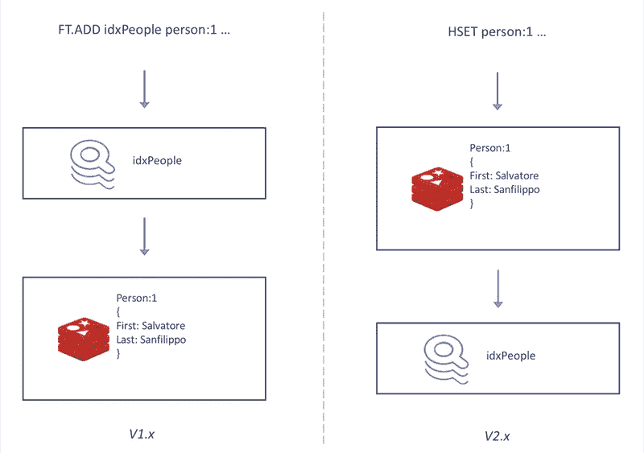
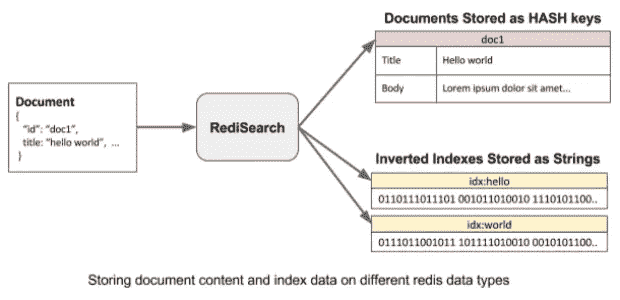
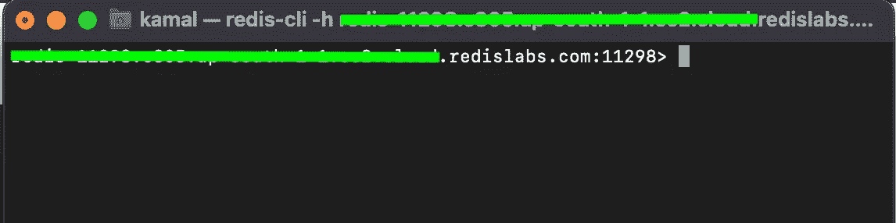
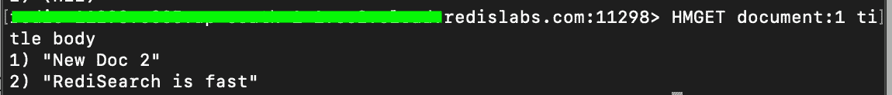
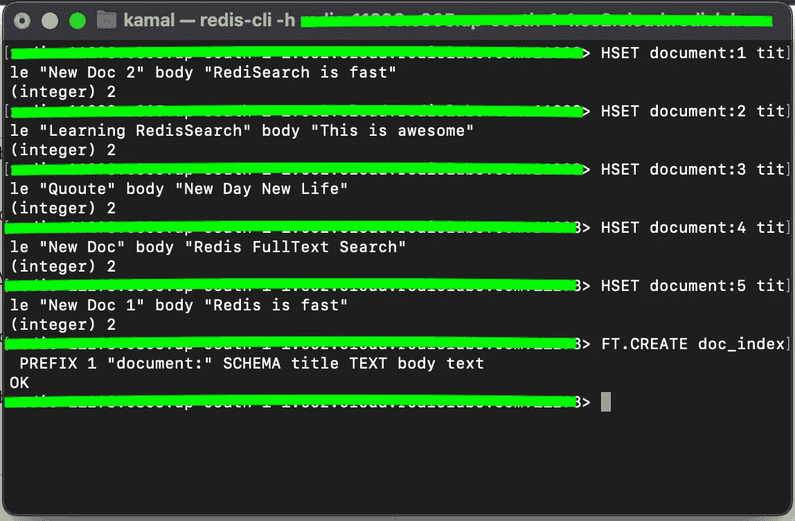
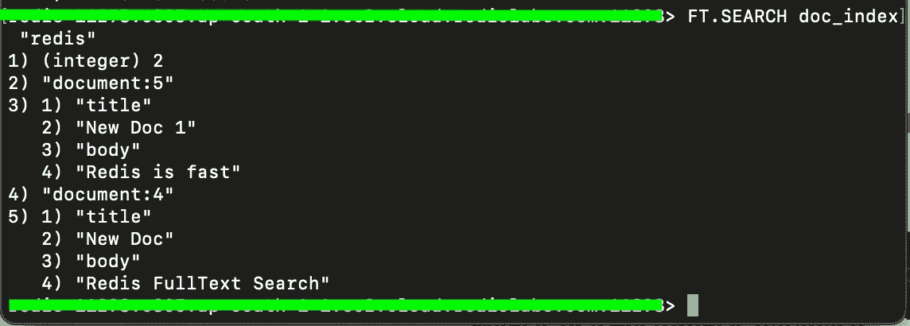
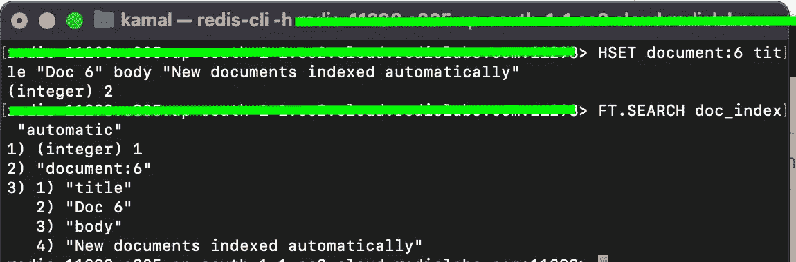
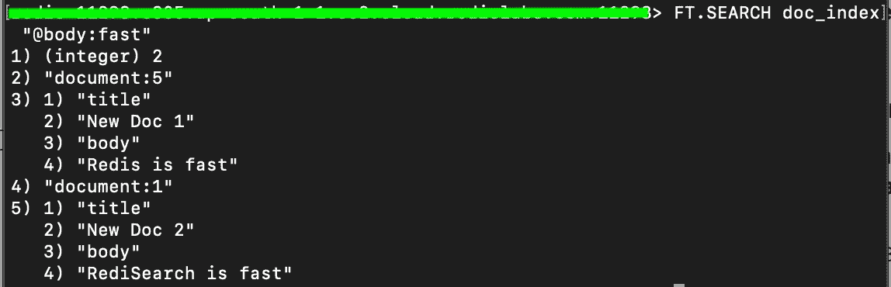

# 使用重新搜索实现全文搜索

> 原文：<https://medium.com/nerd-for-tech/implement-full-text-search-using-redisearch-272c10e57057?source=collection_archive---------0----------------------->


再研究

大家好，我又带来了另一篇关于 Redis 的文章，这次是关于 redsearch 的，所以让我们从 redsearch 的简单定义开始。

RediSearch 是一个 Redis 模块，支持 Redis 的查询、实时二级索引和全文搜索。这些特性允许多字段查询、[聚合](https://redis.io/docs/stack/search/reference/aggregations)、精确短语匹配、[数字过滤](https://redis.io/docs/stack/search/reference/query_syntax/#numeric-filters-in-query)和[地理过滤](https://redis.io/docs/stack/search/reference/query_syntax/#geo-filters-in-query)用于文本查询。

现在让我们看看实践中的再研究。

首先，创建一个免费的 [Redis](https://app.redislabs.com/#/login) 账户。有了这个帐号，你还可以得到一个免费的数据库。

只需按照说明，你的免费数据库将在几秒钟内准备就绪。

创建数据库后，您应该会看到以下屏幕


现在你已经成功地创建了你的账户和数据库，我们可以开始我们的主要课程了，看看实践中的再研究。

## **重新搜索 2.0 如何工作**

在 RediSearch 2.0 中，Redis 重新设计了索引与数据保持同步的方式。因此，现在不必通过索引写入数据(使用 FT。ADD 命令)，RediSearch 现在跟踪写在哈希表中的数据并同步索引它。



V1 再研究组织对 V2 再研究组织

下图显示了 RediSearch 如何将文档转换为散列并同步索引它们。



行动中的再研究

因此，现在要使用全文搜索功能，我们必须将文档存储在[哈希](https://redis.io/commands/hset/)中。我们必须用`FT.CREATE`命令初始化索引，并使用`FT.SEARCH`命令通过文本进行搜索。

**现在我们已经了解了基础知识，让我们开始行动吧**

在您的终端上使用以下命令启动**Redis CLI【T17:-**

```
>redis-cli -h host_name -p port_number -a password
```

在上面的命令中，您必须更新主机名、端口号和密码，您可以在单击刚刚在 Redis Labs 上创建的数据库时获得这些信息。

因此，现在您应该会看到类似于下图的 Redis CLI 提示符



现在让我们插入一些文档

HSET 命令保存我们的文件作为哈希

这将创建 5 个散列，分别命名为`document:1`、`document:2`等等，直到`document:5`，其中`title`和`body`作为文本字段。

现在我们的数据库包含了这些散列，如果您知道文档(document:1)的密钥，使用下面的命令检索信息就很简单了

```
>HMGET document:1 title body
```

在这里，标题和正文是我们希望使用键获取的字段。



用关键字搜索

这一切都很好，我们已经使用关键字从数据库中获取了数据，但这不是我们在这里的原因，我们在这里是为了进行**全文搜索*、*** 就像你如何查询数据库以获得基于使用标题、正文或我们可能已经创建的任何其他字段的文档列表？

为此，我们可以简单地定义一个与数据相关联的索引，并让数据库管理它们。然后，我们可以使用查询引擎通过二级索引来查询/搜索数据。

# 为我们的文档创建一个重新搜索索引

```
> FT.CREATE doc_index PREFIX 1 “document:” SCHEMA title TEXT body text
```



设置哈希和创建索引

不过，在运行查询之前，让我们仔细看看《金融时报》。创建命令:

*   doc_index:索引的名称，您将在执行查询时使用它
*   前缀 1 "document:":应该被索引的关键字的前缀。这是一个列表，因为我们只想索引文档:* keys 数字是 1。
*   SCHEMA …:定义要索引的模式、字段及其类型。正如您在命令中看到的，我们使用了文本、[数字](https://oss.redis.com/redisearch/Overview/#numeric_index)、[标签](https://oss.redis.com/redisearch/Overview/#tag_index)和[可排序的](https://oss.redis.com/redisearch/Overview/#sortable_fields)参数。

# 搜索索引

RediSearch 2.0 引擎将使用前缀值扫描数据库，搜索就像使用索引名称和短语调用`FT.SEARCH`命令进行搜索一样简单:

```
> FT.SEARCH doc_index "redis"
```



# 实时索引

添加一个新文档，Redis 将实时对其进行索引。

```
> HSET document:6 title "Doc 6" body "New documents indexed automatically"
```



# 搜索特定字段

我们可以使用以下语法搜索特定字段:-

```
> FT.SEARCH doc_index "@body:fast"
```



你可以检查 FT 的所有变体。[官方文档](https://redis.io/commands/ft.search/)中的搜索命令。

结论

RediSearch 是一个功能强大、功能丰富的全文搜索引擎，具有 Redis 已知的性能，它可以有效地为您的应用程序中的全文搜索提供生产解决方案。

附注:这篇文章是与 Redis 合作的。

**了解更多:**

*   免费试用 Redis 云
*   [Redis 开发者中心——关于 Redis 的工具、指南和教程](https://redis.info/3LC4GqB)
*   [RedisInsight 桌面 GUI](https://redis.info/3wMR7PR)