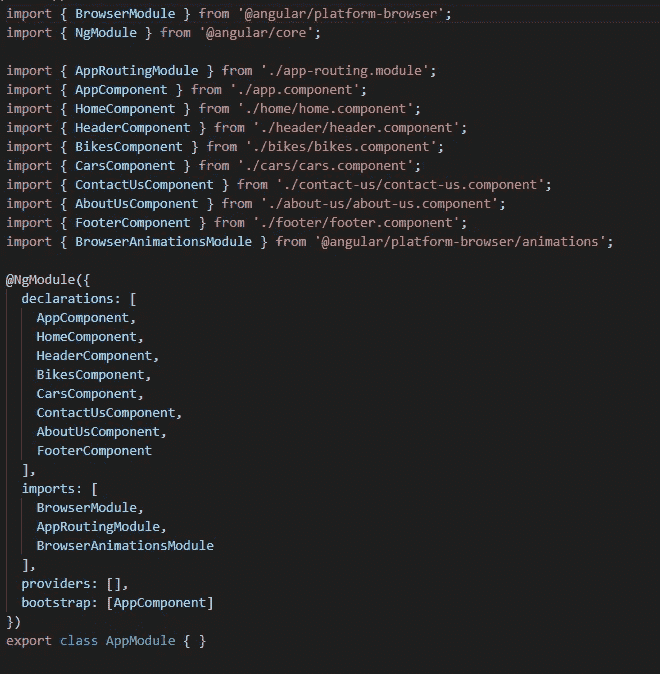
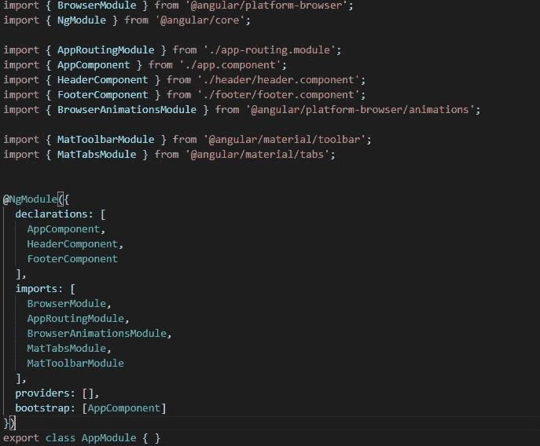
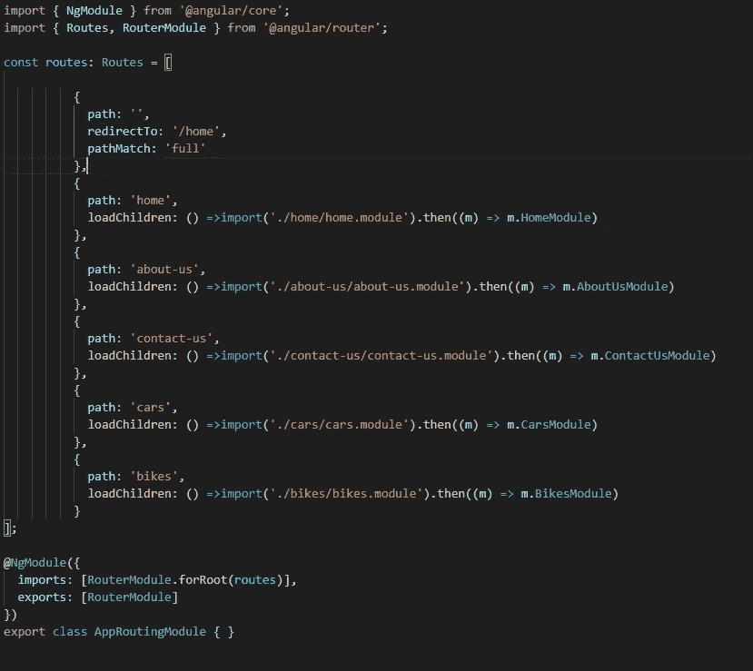
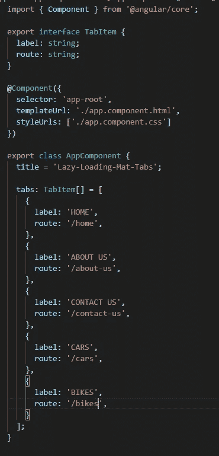
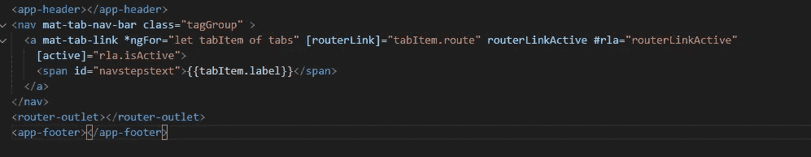
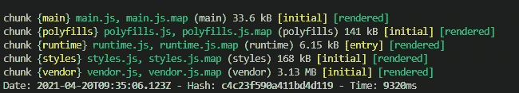
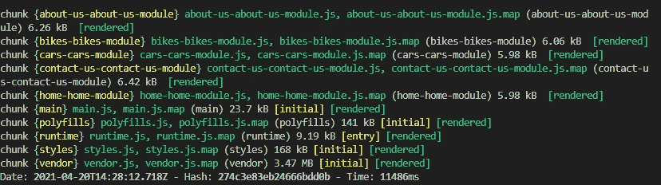

# 用角形垫片实现延迟装载

> 原文：<https://medium.com/nerd-for-tech/implement-lazy-loading-with-mat-tabs-in-angular-2d291f5f5315?source=collection_archive---------2----------------------->

# 什么是懒装？

惰性加载帮助我们批量下载网页，而不是一大捆下载所有内容。

为了在 Angular 中实现延迟加载，我们需要为需要延迟加载的组件创建一个`routing module`和一个`module.ts`文件。

# 项目设置

在这里，我们建立了我们的项目。我们将在本文中通篇使用 Angular CLI ( `ng`)实用程序。

运行以下命令安装新项目:

```
ng new Lazy-Loading-Mat-Tabs
```

# 创建组件

现在，我们将创建我们的组件。

*   要创建标题组件，请运行以下命令:

```
ng g c header 
```

`ng`工具有大量的命令可以用来使开发变得容易和没有压力。这里我们使用了`ng generate component`的快捷符号。

*   要创建页脚组件，请运行以下命令:

```
ng g c footer
```

*   要创建 Home 组件，请运行以下命令:

```
ng g c home
```

> 注意:创建 home.module.ts 和 home.routing.ts 来实现惰性加载。Home 组件只有在加载时才会调用。

*   要创建 About-us 组件，请运行以下命令:

```
ng g c about-us
```

> 注意:创建 about-us.module.ts 和 about-us.routing.ts 来实现延迟加载。“关于我们”组件只有在加载时才会调用。

*   要创建 Contact-us 组件，请运行以下命令:

```
ng g c contact-us
```

> 注意:创建 contact-us.module.ts 和 contact-us.routing.ts 来实现延迟加载。Contact-Us 组件只有在加载时才会调用。

*   要创建 Cars 组件，请运行以下命令:

```
ng g c cars
```

> 注意:创建 cars.module.ts 和 cars.routing.ts 来实现延迟加载。Cars 组件只有在加载时才会调用。

*   要创建 Bikes 组件，请运行以下命令:

```
ng g c bikes
```

> 注意:创建 bikes.module.ts 和 bikes.routing.ts 来实现延迟加载。Bikes 组件只有在被加载时才会调用。

当您通过 CLI 创建组件时，它们将被自动添加到 **app.module.ts** 文件中。您的`app.module.ts`文件现在看起来像这样:



应用程序模块

# 安装角形材料

通过运行以下命令，使用 Angular CLI 的安装示意图[来设置您的 Angular Material 项目:](https://material.angular.io/guide/schematics)

`ng add @angular/material`

运行以下命令时，在 app.module.ts 文件中导入 MatTabsModule 和 MatToolbarModule。


应用程序模块

# 创建一个延迟加载的模块

我们实际上已经创建了上面的惰性加载模块，这里我们将为每个模块实现路由。

# 主页模块

正如我们在上面的创建过程中注意到的，创建了两个模块，`home.routing.module.ts`和`home.module.ts`。

`home.routing.module.ts`保存模块的路由，并导入到`home.module.ts`的导入数组中。

我们将通过在`routes`数组中插入对象来配置`home-routing.module.ts`中的路线:

```
// src/app/home/home-routing.module.ts
...
const routes: Routes = []
...
```

`routes: Routes`数组用于定义一个应用程序可能处于的所有可能的路由器状态。它采用一个具有两个基本属性的对象:`path`和`component`。

在其中插入以下内容:

```
// src/app/home/home-routing.module.ts
...
import { HomeComponent } from './home.component';
const routes: Routes = [
 {
   path: '',
   component: HomeComponent
 }
];
...
```

这里，我们使用空的`path`来表示默认/索引路由。我们导入了`HomeComponent`，这样我们可以将它赋给`routes`数组中的`component`属性。`@angular/router`使用`component`属性来知道在浏览器 DOM 中加载哪个组件。

在 home.module.ts 中插入以下内容:

```
// src/app/home/home.module.ts
...
import { NgModule } from '@angular/core';
import { HomeComponent } from './home.component';
import { HomeRoutingModule } from './home.routing';@NgModule({imports: [HomeRoutingModule],
providers:  [],
declarations: [HomeComponent]
})
export class HomeModule {}
...
```

# 关于我们模块

我们将做和上面一样的事情。导入`About-us`组件并配置路线:

```
// src/app/about-us/about-us-routing.module.ts
...
import { AboutUsComponent } from ./about-us.component';
const routes: Routes = [
  {
    path: "",
    component: AboutUsComponent
  }
]
...
```

配置关于我们的模块

```
// src/app/about-us/about-us.module.ts
...
import { NgModule } from '@angular/core';
import { AboutUsComponent } from './about-us.component';
import { AboutUsRoutingModule } from './about-us.routing'@NgModule({
  imports: [AboutUsRoutingModule],
  providers:  [],
  declarations: [AboutUsComponent]
})export class AboutUsModule {

}
...
```

> 我们将对汽车、联系人和自行车等所有其他组件进行同样的操作。

# 延迟加载新模块

我们已经完成了我们的功能模块。现在，我们设置父模块`app.module.ts`。

因为我们已经为所有相应的组件创建了单独的 module.ts 文件。因此，我们需要从 app.module.ts 中删除声明的组件。更新后的 app.module.ts 文件将如下所示:



应用程序模块

好了，我们现在创建`routes`变量来保存我们的 routes 数组，就像我们在功能模块中看到的一样:



app-routing.module.ts

因此，这里我们通过使用空的`path:""`使 Home 组件成为默认路由。查看接下来的路线，您会注意到一些奇怪的地方，有一个奇怪的语法，带有模块名。这些路线是我们希望延迟加载的路线，并在功能模块中设置:

*   家庭模块
*   关于我们模块
*   ContactUsModule
*   汽车模块
*   自行车模块

属性是我们告诉 Angular 延迟加载一个模块的方式。`=>`前的第一部分指向特征模块的相对路径。第二部分是特性模块的类名。

这就是 Angular 中功能模块的延迟加载方式:

```
loadChildren: () =>import(PATH_TO_FEATURE_MODULE).then((m) => m.FEATURMODULE_CLASS_NAME)
```

这里有一些重要的事情需要注意:

1.  使用`loadChildren`属性代替`component`。
2.  我们不仅定义了路径，还定义了特性模块类的名称。

# 使用 Mat 标签惰性加载模块

角度材料选项卡将内容组织到单独的视图中，一次只能看到一个视图。每个选项卡的标签都显示在选项卡标题中，活动选项卡的标签用动画墨迹条指定。当标签列表超出标题宽度时，分页控件会出现，让用户在标签间左右滚动。

当用户选择标题中的一个选项卡标签时设置的活动选项卡。

> 通过提供具有标签和路由的接口`TabItems`作为该接口的成员来配置`app.component.ts` 。创建一个`TabItems`数组`tabs`，并提供标签和路由器链接。



应用程序组件

通过使用 mat-tab-nav-bar 配置`app.component.Html`以使用路由器链接，并用以下代码替换现有的 app.component.html:



`routerLinkActive`将帮助激活所选组件。

# 配置路线

这是最后一个阶段，此时，您已经为所有想要延迟加载的组件及其单独的路径设置好了模块。你必须告诉你的主应用程序路由模块，这些路由应该被延迟加载。将下面的代码块复制到您的`app-routing.module.ts`文件中:


在这里，您告诉 Angular，在急切加载的情况下，应该通过指定 loadChildren 代替组件来延迟加载。一切都已完成，是时候运行您的应用程序了:

```
ng serve
```

您将看到，在捆绑应用程序时，它现在被拆分成我们创建的那些模块。

# 测试我们的应用

现在，我们已经设置好了我们的应用程序，并正确实现了我们所有的功能模块。我们需要测试应用程序，看看他们的行动。

如果您注意到在您的终端中，除了正常的包之外，还有额外的代码包生成:



正常束

angular generated extra bundle:`aboutus.module.chunk.js`、`bikes.module.chunk.js`、`cars.module.chunk.js`、`contact-us.module.chunk.js`、`home.module.chunk.js.`这些是我们配置成按需加载的特性模块。当导航到路线`/about-us`和`/home`时，将加载这些额外的模块块。



导航至`http://localhost:4200`您的浏览器。

完成了，✅。我们的应用程序已经准备好通过延迟加载来加载组件。

源代码可以在 [GitHub](https://github.com/shubham911/lazy-loading-mat-tabs.git) 上获得。

# 最后的话

我希望你在编写这段代码的时候和我一样开心。现在你知道如何用延迟加载来加载组件了。有了这些知识，我们可以减少主包的大小，并为用户提供更好的体验。

感谢阅读！👍