# 用科特林、Spring Boot 和 H2 数据库实现 REST API

> 原文：<https://medium.com/nerd-for-tech/implement-rest-api-with-kotlin-spring-boot-and-h2-database-9d0103064600?source=collection_archive---------3----------------------->

在这篇**第一部分**文章中，我们将实现一个简单的小工具库(CRUD API to**C**reate， **R** etrieve， **U** pdate 和**D**delete Gadget details)REST API with[Kotlin](https://kotlinlang.org/docs/home.html)、SpringBoot 2.x、JPA 和 H2 内存数据库。

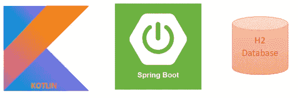

***技术/工具*** :

> IDE:IntelliJ(STS/Eclipse)
> [Kotlin](https://kotlinlang.org/docs/home.html):1.4 . x
> 构建工具:Maven
> Spring Boot: 2.4.x
> 数据库:H2(内存数据库)
> Rest 客户端/邮递员

**Gadget gallery API 的** —让我们从 spring initializer 创建一个 sprint boot 项目，它公开了 6 个 API 来执行 CRUD 操作，如下所示。

*   从数据库中获取所有现有小工具
*   向小工具表发布新的小工具详细信息
*   基于 gadgetId 获取小工具数据
*   基于 gadgetId 更新小工具数据
*   基于 gadgetId 移除/删除小工具数据
*   从数据库中删除所有小工具数据

**步骤 1** : [弹簧初始值设定项配置](https://start.spring.io/#!type=maven-project&language=kotlin&platformVersion=2.4.2.RELEASE&packaging=jar&jvmVersion=11&groupId=com.learning&artifactId=springboot-kotlin-h2&name=springboot-kotlin-h2&description=Simple%20CRUD%20application%20with%20Kotlin%2C%20SpringBoot%20and%20H2%20database&packageName=com.learning.springboot-kotlin-h2&dependencies=devtools,lombok,web,h2,data-jpa)(访问配置链接并下载)

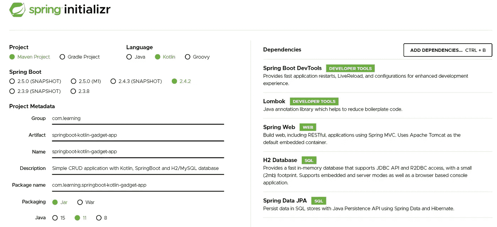

春季 app 生成—[https://start.spring.io/](https://start.spring.io/)

**pom.xml —** 依赖项(kotlin、spring-web、data-jpa、H2 内存数据库)

```
<**dependencies**>
   <**dependency**>
      <**groupId**>org.springframework.boot</**groupId**>
      <**artifactId**>spring-boot-starter-data-jpa</**artifactId**>
   </**dependency**>
   <**dependency**>
      <**groupId**>org.springframework.boot</**groupId**>
      <**artifactId**>spring-boot-starter-web</**artifactId**>
   </**dependency**>
   <**dependency**>
      <**groupId**>com.fasterxml.jackson.module</**groupId**>
      <**artifactId**>jackson-module-kotlin</**artifactId**>
   </**dependency**>
   <**dependency**>
      <**groupId**>org.jetbrains.kotlin</**groupId**>
      <**artifactId**>kotlin-reflect</**artifactId**>
   </**dependency**>
   <**dependency**>
      <**groupId**>org.jetbrains.kotlin</**groupId**>
      <**artifactId**>kotlin-stdlib-jdk8</**artifactId**>
   </**dependency**>
   <**dependency**>
      <**groupId**>org.apache.commons</**groupId**>
      <**artifactId**>commons-lang3</**artifactId**>
   </**dependency**>

   <**dependency**>
      <**groupId**>org.springframework.boot</**groupId**>
      <**artifactId**>spring-boot-devtools</**artifactId**>
      <**scope**>runtime</**scope**>
      <**optional**>true</**optional**>
   </**dependency**>
   <**dependency**>
      <**groupId**>com.h2database</**groupId**>
      <**artifactId**>h2</**artifactId**>
      <**scope**>runtime</**scope**>
   </**dependency**>
   <**dependency**>
      <**groupId**>org.springframework.boot</**groupId**>
      <**artifactId**>spring-boot-starter-test</**artifactId**>
      <**scope**>test</**scope**>
   </**dependency**>
</**dependencies**>
```

**步骤 2** :将 zip 文件解压到本地目录，并将其作为 maven 项目导入到 IDE 中

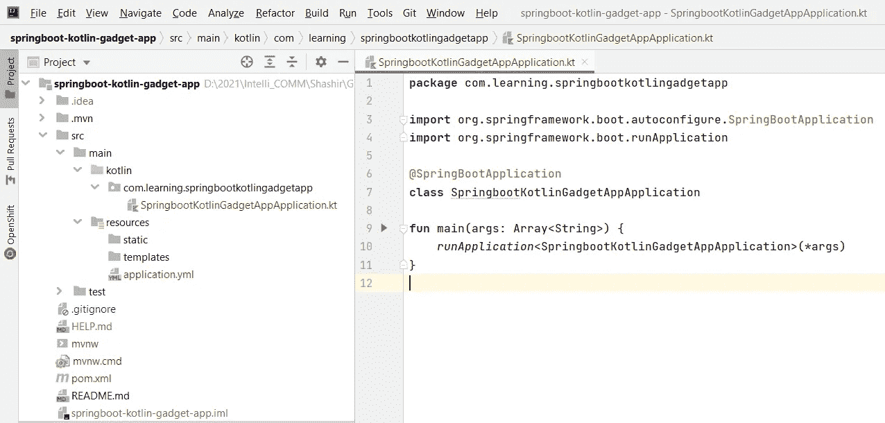

让我们从主类开始，这是我们应用程序的起点。

```
**package** com.shasr.springbootkotlingadgetapp

**import** org.springframework.boot.CommandLineRunner
**import** org.springframework.boot.autoconfigure.SpringBootApplication
**import** org.springframework.boot.runApplication

@SpringBootApplication
**class** SpringbootKotlinGadgetAppApplication 

**fun** main(args: Array<String>) {
    *runApplication*<SpringbootKotlinGadgetAppApplication>(*args)
}
```

**步骤 3** :让我们创建一个数据类:Gadget.kt，它有 5 个属性来携带小工具的详细信息。Koltin 数据类默认提供 setter/getter 方法。

```
**package** com.shasr.springbootkotlingadgetapp.model

**import** javax.persistence.Entity
**import** javax.persistence.GeneratedValue
**import** javax.persistence.GenerationType
**import** javax.persistence.Id
**import** javax.persistence.Table

@Entity
@Table(name = **"GADGET"**)
**data class** Gadget(

    @Id
    @GeneratedValue(strategy = GenerationType.*AUTO*)
    **val gadgetId** : Long,
    **val gadgetName** : String,
    **val gadgetCategory** : String?,
    **val gagdetAvailability** : Boolean = **true**,
    **val gadgetPrice** : Double
)
```

**步骤 4:** 让我们用 6 个方法创建一个控制器类。为了简单起见，这里我们不打算对请求参数进行严格的验证。

让我们从 GET、POST、PUT 和 DELETE 方法开始

> 从数据库
> [获取所有小工具的 GET 方法 http://localhost:8888/API/gadgets/](http://localhost:8888/api/gadgets/)

```
@GetMapping(**"/gadgets"**)
**fun** fetchGadgets(): ResponseEntity<List<Gadget>> {
    **val** gadgets = **gadgetRepository**.findAll()
    **if** (gadgets.isEmpty()) {
        **return** ResponseEntity<List<Gadget>>(HttpStatus.*NO_CONTENT*)
    }
    **return** ResponseEntity<List<Gadget>>(gadgets, HttpStatus.*OK*)
}
```

这里，我们使用“findall()”方法从表中检索所有小工具，并验证表中的记录是零还是多。

如果表中有一个或多个小工具，我们将返回所有状态为 200 的记录(HttpStatus。*好的)。对于没有记录的表，我们返回 204 状态(HttpStatus。 *NO_CONTENT)**

> 根据' gadgetId'
> [获取小工具详细信息 http://localhost:8888/API/gadgets/{ id](http://localhost:8888/api/gadgets/{id)}

```
@GetMapping(**"/gadgets/{id}"**)
**fun** fetchGadgetById(@PathVariable(**"id"**) gadgetId: Long): ResponseEntity<Gadget> {
    **val** gadget = **gadgetRepository**.findById(gadgetId)
    **if** (gadget.*isPresent*) {
        **return** ResponseEntity<Gadget>(gadget.get(), HttpStatus.*OK*)
    }
    **return** ResponseEntity<Gadget>(HttpStatus.*NOT_FOUND*)
}
```

这里，我们使用“findById(gadgetId)”方法检索基于“gadgetId”的特定小工具，并验证具有 gadgetId 的小工具是否可用。

方法返回状态为 200 的小工具详细信息(HttpStatus。 *OK)如果它可用，否则它返回* 204 状态(HttpStatus。*未找到 _ *

> 发布一个新的小工具
> [http://localhost:8888/API/gadgets/](http://localhost:8888/api/gadgets/)

```
@PostMapping(**"/gadgets"**)
**fun** addNewGadget(@RequestBody gadget: Gadget, uri: UriComponentsBuilder): ResponseEntity<Gadget> {
    **val** persistedGadget = **gadgetRepository**.save(gadget)
    **if** (ObjectUtils.isEmpty(persistedGadget)) {
        **return** ResponseEntity<Gadget>(HttpStatus.*BAD_REQUEST*)
    }
    **val** headers = HttpHeaders()
    headers.setLocation(uri.path(**"/gadget/{gadgetId}"**).buildAndExpand(gadget.**gadgetId**).toUri());
    **return** ResponseEntity(headers, HttpStatus.*CREATED*)
}
```

这里我们用“save(gadget)”方法创建一个新的小工具，并验证小工具是否创建成功。

方法在状态为 200(http status)的响应标头中返回新创建的资源的 URI。*好的)。在空响应方法的情况下，返回 4* 00 状态(HttpStatus。 *NOT_FOUND) —这只是为了演示。*

> PUT —通过 gadgetId
> [更新小工具详细信息 http://localhost:8888/API/gadgets/{ id](http://localhost:8888/api/gadgets/{id)}

```
@PutMapping(**"/gadgets/{id}"**)
**fun** updateGadgetById(@PathVariable(**"id"**) gadgetId: Long, @RequestBody gadget: Gadget): ResponseEntity<Gadget> {
    **return** gadgetRepository.findById(gadgetId).map **{** gadgetDetails **->
        val** updatedGadget: Gadget = gadgetDetails.copy(
            gadgetCategory = gadget.gadgetCategory,
            gadgetName = gadget.gadgetName,
            gadgetPrice = gadget.gadgetPrice,
            gagdetAvailability = gadget.gagdetAvailability
        )
        ResponseEntity(gadgetRepository.save(updatedGadget), HttpStatus.OK)
    **}**.orElse(ResponseEntity<Gadget>(HttpStatus.INTERNAL_SERVER_ERROR))
}
```

在更新记录之前，我们可以开始验证数据库中是否存在‘gadgetId’的小工具详细信息。成功获取后，更新小工具的详细信息并返回 HttpStatus。OK 作为回应。

如果请求的小工具细节在数据库中不存在，那么我们返回— HttpStatus。内部服务器错误

> 通过 gadgetId
> [移除/删除小工具 http://localhost:8888/API/gadgets/{ id](http://localhost:8888/api/gadgets/{id)}

```
@DeleteMapping(**"/gadgets/{id}"**)
**fun** removeGadgetById(@PathVariable(**"id"**) gadgetId: Long): ResponseEntity<Void> {
    **val** gadget = **gadgetRepository**.findById(gadgetId)
    **if** (gadget.*isPresent*) {
        **gadgetRepository**.deleteById(gadgetId)
        **return** ResponseEntity<Void>(HttpStatus.*NO_CONTENT*)
    }
    **return** ResponseEntity<Void>(HttpStatus.*INTERNAL_SERVER_ERROR*)
}
```

如果请求的“gadgetId”的小工具详细信息存在，我们将调用“deleteById(gadgetId)”方法，并返回 HttpStatus。*NO _ 含量。对于无效的“gadgetId ”,我们将返回— HttpStatus。*内部 _ 服务器 _ 错误(500 状态)**

> 删除所有小工具
> [http://localhost:8888/API/gadgets/](http://localhost:8888/api/gadgets/)

```
@DeleteMapping(**"/gadgets"**)
**fun** removeGadgets(): ResponseEntity<Void> {
    **gadgetRepository**.deleteAll()
    **return** ResponseEntity<Void>(HttpStatus.*OK*)
}
```

我们调用“deleteAll()”方法从 gadget 表中删除所有 Gadget 细节，并返回 200 status — HttpStatus。*确定*

**步骤 5:** JPA 存储库:与 H2 数据库交互

```
**package** com.shasr.springbootkotlingadgetapp.repository

**import** com.shasr.springbootkotlingadgetapp.model.Gadget
**import** org.springframework.data.jpa.repository.JpaRepository
**import** org.springframework.stereotype.Repository

@Repository
**interface** GadgetRepository : JpaRepository<Gadget, Long>
```

创建一个简单的存储库接口来对 Gadget 表执行必要的操作。<gadget long="">表示我们引用的实体名称和小工具实体中的主键类型(在外部情况下— gagdetId 类型)</gadget>

**Step-6** :我们可以在 application.yml 中配置 H2 数据库配置细节，如下图。

```
*## H2 Configuration* **spring**:
  **h2**:
    **console**:
      **enabled**: true
      **path**: /gadget-console
      **settings**:
        **trace**: false
        **web-allow-others**: false
  **datasource**:
    **url**: jdbc:h2:mem:gadget-db;DB_CLOSE_DELAY=-1;DB_CLOSE_ON_EXIT=FALSE
    **username**: gadgetadmin
    **password**: gadgetpwd
  **jpa**:
    **show-sql**: true
    **hibernate**:
      **ddl-auto**: update
    **properties**:
      **hibernate**:
        **dialect**: org.hibernate.dialect.H2Dialect
        **use_sql_comments**: true
        **format_sql**: true
```

现在我们从主类运行应用程序，我们可以注意到用如下结构创建的表“GADGET ”(可以在控制台上验证)

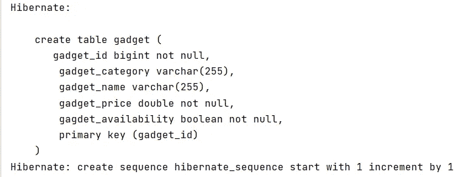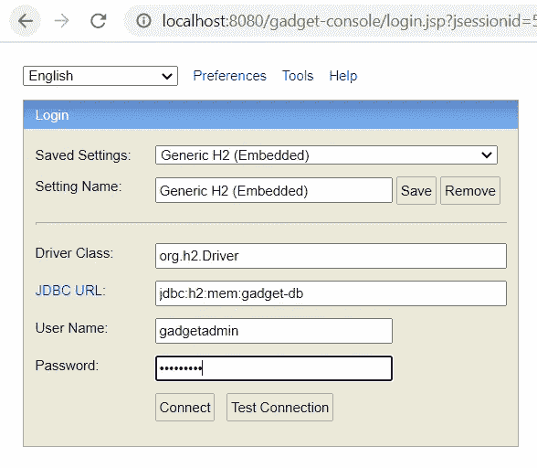

H2 数据库

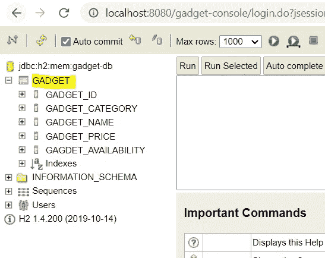

在 H2 数据库中创建的小工具表

让我们启动服务器并验证应用程序是否按预期运行。

**帖子**:[http://localhost:8888/API/gadgets/](http://localhost:8888/api/gadgets/)

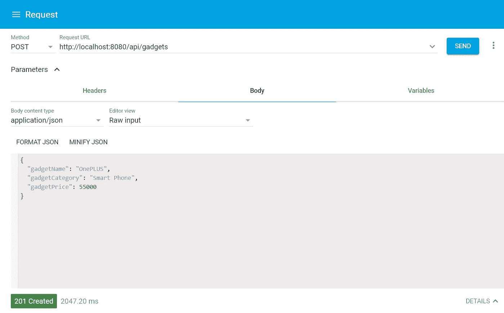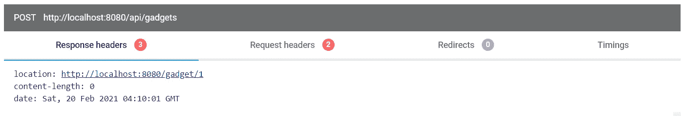

例如:kot Lin——API 测试后

**GET**:ALL[http://localhost:8888/API/gadgets/](http://localhost:8888/api/gadgets/)

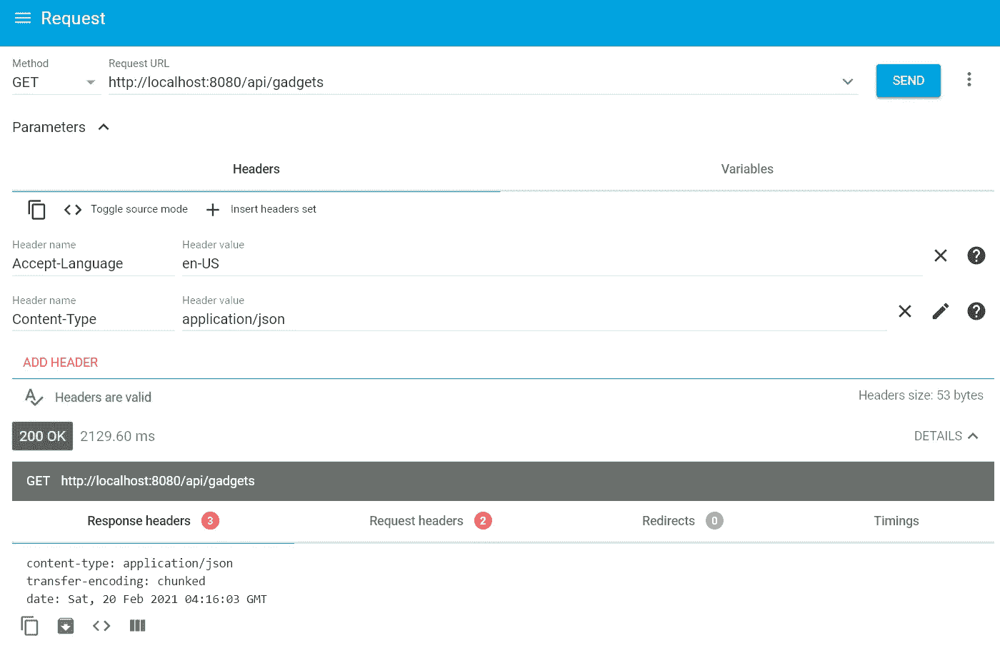

例如:Kotlin —获取所有 API 测试

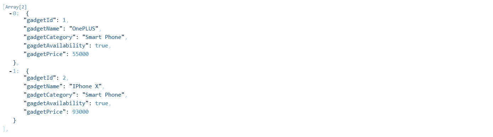

**GET**:By GadgetId[http://localhost:8888/API/gadgets/2](http://localhost:8888/api/gadgets/2)

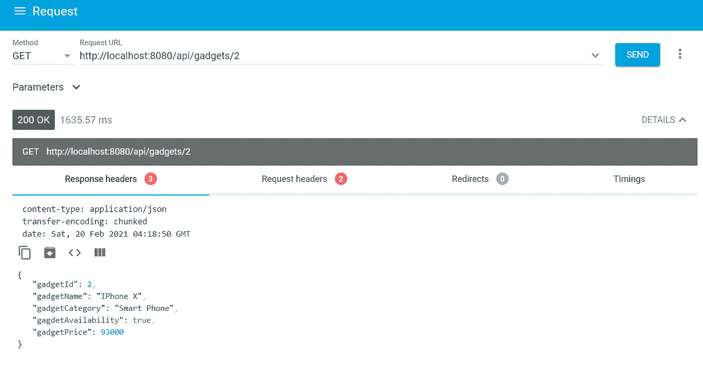

例如:Kotlin —获取 API 测试

**放**:[http://localhost:8888/API/gadgets/](http://localhost:8888/api/gadgets/)2

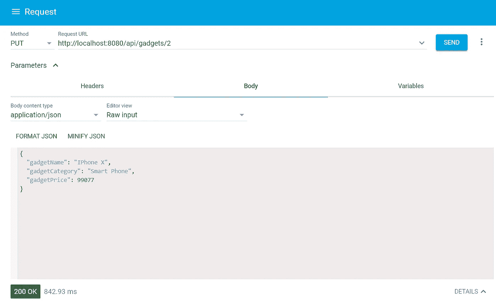

例如:kot Lin——进行 API 测试

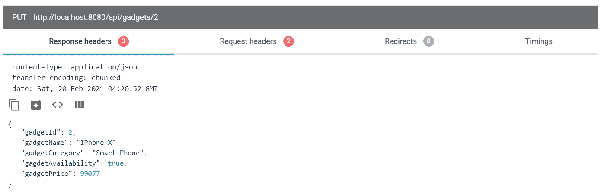

**GET**:By GadgetId[http://localhost:8888/API/gadgets/2](http://localhost:8888/api/gadgets/2)

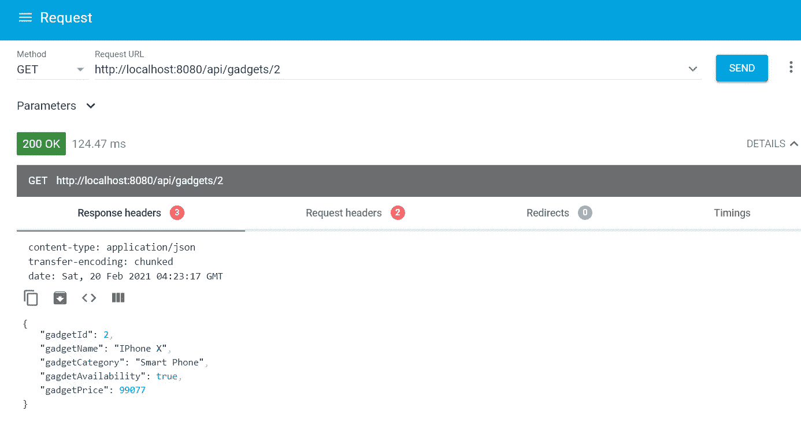

例如:Kotlin —获取 API 测试

删除操作之前的小工具表数据

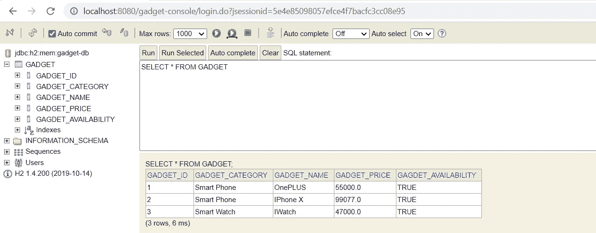

验证小工具表以了解小工具详细信息

**删除**:[http://localhost:8888/API/gadgets/1](http://localhost:8888/api/gadgets/1)

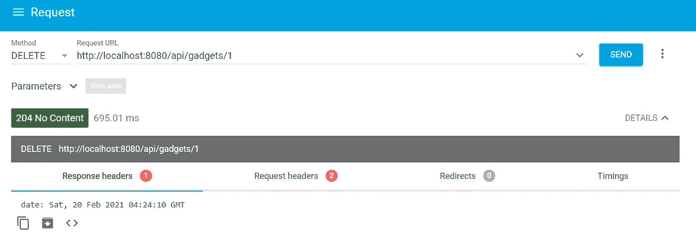

例如:Kotlin —删除 API 测试

**GET** :所有小工具→[http://localhost:8888/API/Gadgets/](http://localhost:8888/api/gadgets/)

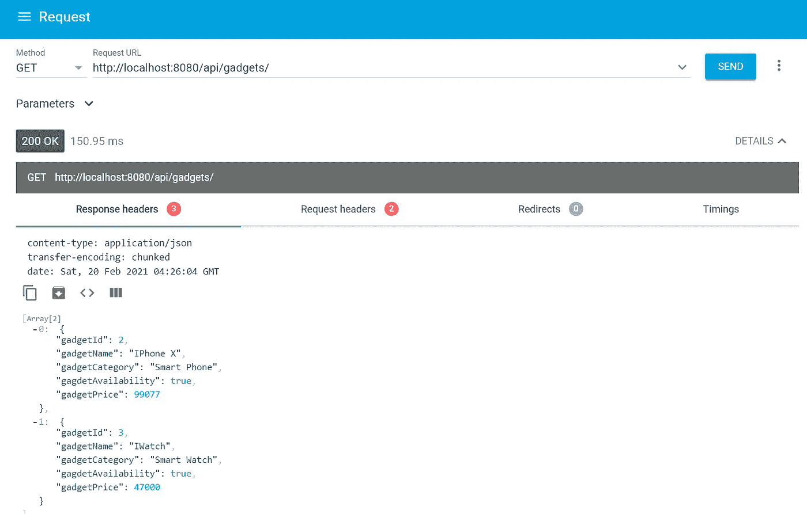

例如:Kotlin —获取 API 测试

**删除所有**:[http://localhost:8888/API/gadgets/](http://localhost:8888/api/gadgets/)

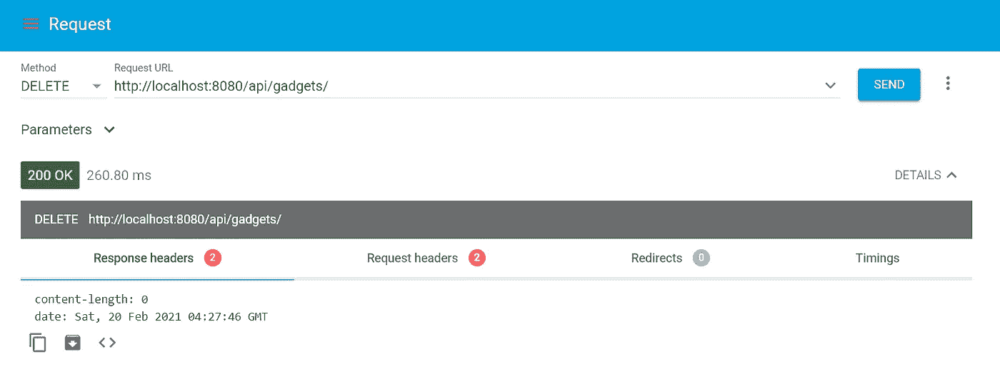

例如:删除 API —删除所有小工具

GitHub:

[](https://github.com/shashirl9/gadget-gallery-kotlin-springboot-mysql) [## shashirl 9/gadget-gallery-kotlin-spring boot-MySQL

### 简单的休息 API 与科特林，Spring Boot 和 MySQL-shashirl 9/小工具-画廊-科特林-springboot-mysql

github.com](https://github.com/shashirl9/gadget-gallery-kotlin-springboot-mysql) 

**概要:**

在本文中，我们用科特林和 Spring Boot 创建并测试了一个简单的 Gadget gallery 应用程序，它公开了 6 个 API。它允许对小工具执行创建、检索、更新和删除操作。

***接下来是什么*** …

*   **Part-2** : [用 OpenAPI 3.0 文档化 Spring Boot REST API](https://techcolors.medium.com/documenting-spring-boot-rest-api-with-openapi-3-0-220a5103f0a5)
*   **Part-3** : [在 Redhat Openshift 容器平台(OCP)上创建 MySQL 实例](/nerd-for-tech/create-mysql-instance-on-redhat-openshift-container-platform-ocp-482a7c3e6cb2)
*   **第 4 部分:**将 Spring Boot 应用程序部署到 OCP 集群，并连接到 MySQL 实例(步骤 3)(进行中)

**参考文献**:

[https://kotlinlang.org/](https://kotlinlang.org/)T10[https://spring.io/guides/tutorials/spring-boot-kotlin/](https://spring.io/guides/tutorials/spring-boot-kotlin/)