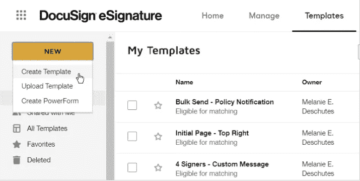
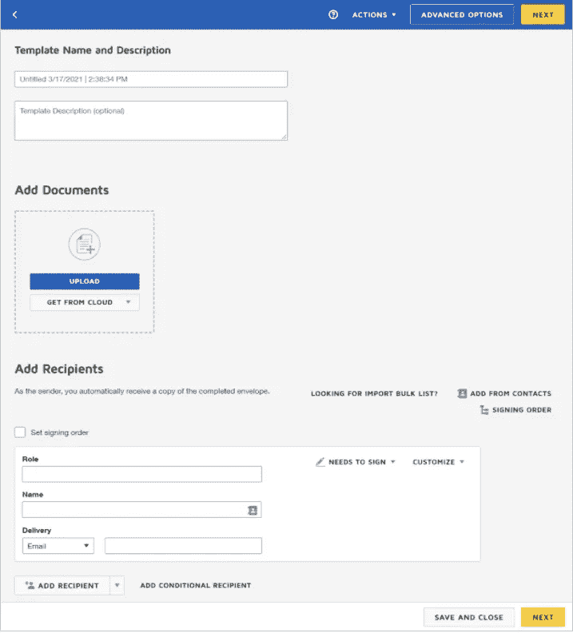

# 在 Laravel 应用程序中实现发送文档以使用 DocuSign 签名

> 原文：<https://medium.com/nerd-for-tech/implement-sending-documents-to-sign-with-docusign-in-a-laravel-app-92aa4203837f?source=collection_archive---------1----------------------->

为了做到这一点，我们需要在文档中创建一个演示帐户使用创建一个集成密钥更多信息，您可以在[此处](https://www.docusign.com/blog/dsdev-dev-w-ds-integration-keys)找到。

之后，我们需要创建我们自己的模板，我们将使用它们进行签名。

# 要创建模板

此过程解决了您可以为模板添加或设置的所有问题，但所有步骤都是可选的，您可以选择想要如何设置模板。您可以保存任何完整级别的模板。

1.  在模板页面，点击**新建**，选择**创建模板**。



将显示“准备”视图，您可以在其中添加文件、收件人角色和消息。



2.输入模板的名称和描述。

这些条目仅在模板本身上可见，从该模板生成的任何信封的签名者都看不到。

我们需要做的另一件重要的事情是为签约创建角色。在角色字段中定义收件人的角色。该角色有助于模板用户了解在使用模板发送文档时应该输入谁作为收件人。示例:申请人、客户、销售代表

更多详细信息你可以在[这里](https://support.docusign.com/en/guides/ndse-user-guide-create-templates)找到。

# 步骤 1:安装 Laravel

在第一步中，我们需要使用下面的命令获得新的 Laravel 应用程序，因此打开您的终端或命令提示符并运行下面的命令:

```
composer create-project --prefer-dist laravel/laravel docusign-app
```

# 步骤 2:安装 docusign php 客户端

```
composer require docusign/esign-clien
```

在我们安装了这个包之后，我们需要创建一个基本的客户端类来处理与 DocuSing Api 的连接。

首先，我们需要创建一个客户机实例，它将接受如下所示的配置实例作为参数:

我们将在**中存储所有凭证。env** 文件。创建演示帐户后，您可以从 DocuSign platform 获取凭据。

得到所有这些信息后，我们将尝试在 DocuSign Api 中进行登录尝试，如下所示:

这将向客户端返回我们未来请求的所有必要信息。

为了推进我们的应用程序，我们需要添加一些东西。在我的例子中，我创建了一个**模板**表，其中存储了我在 DocuSign 中创建的所有模板，供我根据不同的客户选择发送哪一个模板。我做的第二件事是创建一个 **envelope_requests** 表。在这里，我存储了我发送给客户的所有签名请求。

对于上面列出的表，我创建了模型和一些基本的存储库，以便更容易地与它们交互。

在第一部分中，我们创建了模板，定义了用于签名的角色，还定义了客户在签名前应该填写的一些基本字段(如名字和姓氏、公司详细信息等)。

首先，我们需要创建要发送到文档的角色，如下所示:

**textTabs** 键指的是我们在模板中声明的定制字段。

现在，让我们试着发送第一份要签署的文件:

首先，我们验证我们的请求，以便获得客户端，然后我们用从 DocuSign 获得的模板 id 创建信封。

通过创建信封得到的响应，我们将它存储到表 **envelope_requests** 中。

```
$this->envelopeRequestRepository->store([
    'user_id' => $user->id,
    'template_id' => $template->id,
    'envelope_id' => $response->getEnvelopeId(),
]);
```

比方说，我们希望当客户完成签署文件时，我们希望在我们的应用程序中对他的状态进行一些更新。为此，我们创建一个 EventNotification 对象，并在创建信封时将其传递给 DocuSign。处理这个问题的类如下所示:

并且可以这样传递:

```
$envelopDefinition->setEventNotification($this->eventNotification->build());
```

为此，我们可以创建一条路线:

```
Route::any('docusign/webhook', SignWebhookController::class)->name('docusign.webhook');
```

这个处理用户更新的方法如下所示: