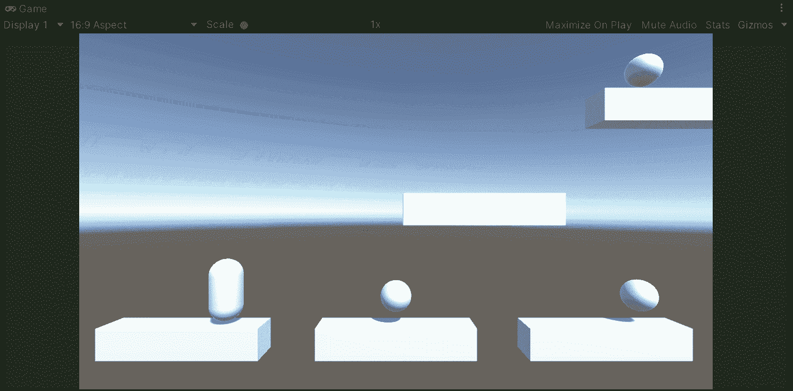
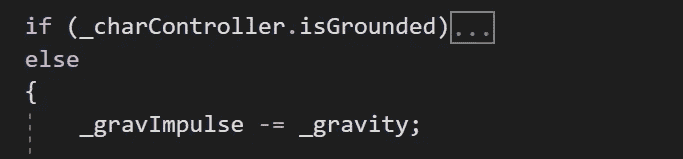
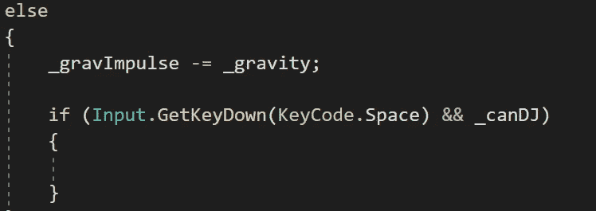
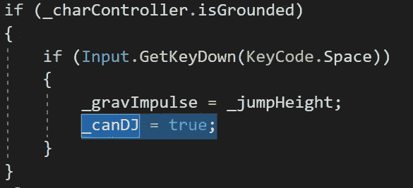
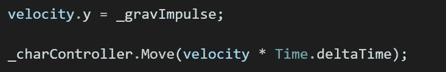
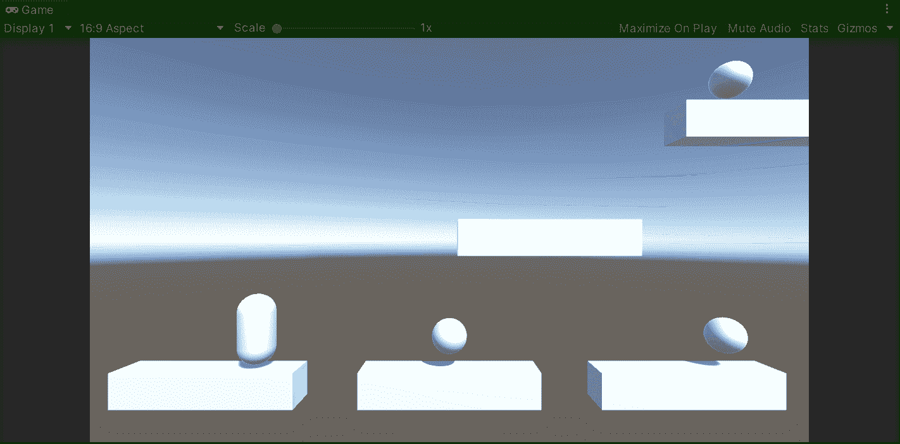

# 实现双跳|统一

> 原文：<https://medium.com/nerd-for-tech/implementing-a-double-jump-unity-87a1e55e4e72?source=collection_archive---------2----------------------->

## 统一指南

## 关于如何为 Unity 玩家实现双跳的快速指南

**目标**:使用基于物理的角色控制器 Unity 实现一次双跳。

在上一篇文章中，我介绍了[如何创建一个基于物理的角色控制器](/nerd-for-tech/creating-a-physics-based-character-controller-unity-6c9f44473526)来让玩家在场景中移动。现在，是时候通过使用相同的基于物理的角色控制器 Unity 来实现一个双重跳跃机制了。

# 实现双跳

如果你还没有看到我的上一篇文章，我强烈建议你在实现双跳转机制之前查看一下:

 [## 创建基于物理的角色控制器| Unity

### 关于如何使用 Unity 创建基于物理的角色控制器的快速指南

medium.com](/nerd-for-tech/creating-a-physics-based-character-controller-unity-6c9f44473526) 

现在，为了实现双跳机制，让我们打开玩家脚本并创建一个新的 bool 来了解玩家是否可以执行双跳:

然后，在**更新**方法中，记住我们检查**角色控制器**组件是否接触地面。如果玩家没有接触地面，我们从重力脉冲中减去相应的重力，使玩家下落，直到接触地面:

因此，为了实现双击，让我们检查空格键输入，以及决定玩家是否可以双击的布尔值是否为 ***true*** :

如果是这种情况，让我们将相应的跳跃高度幂加到重力脉冲上，然后将允许双跳的布尔设置为 false:

另一方面，如果玩家正在接触地面，让我们添加一行代码，通过在第一次跳跃时将 bool 设置为 true 来启用双跳:

最后，让我们记住在**更新**方法结束时，重力脉冲定义了我们的玩家在 Y 轴上的速度:

如果我们用 Unity 运行游戏，我们会注意到双跳按预期工作，玩家可以通过使用这种机制达到新的高度:

就这样，我们用 Unity 实现了双跳机制！:d .我会在下一篇文章中看到你，在那里我将展示如何用 Unity 为玩家创建一个可收集的物品。

> *如果你想了解我更多，欢迎登陆*[***LinkedIn***](https://www.linkedin.com/in/fas444/)**或访问我的* [***网站***](http://fernandoalcasan.com/) *:D**