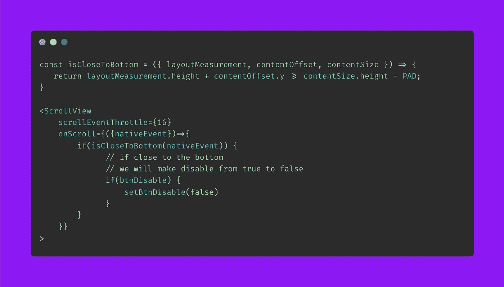
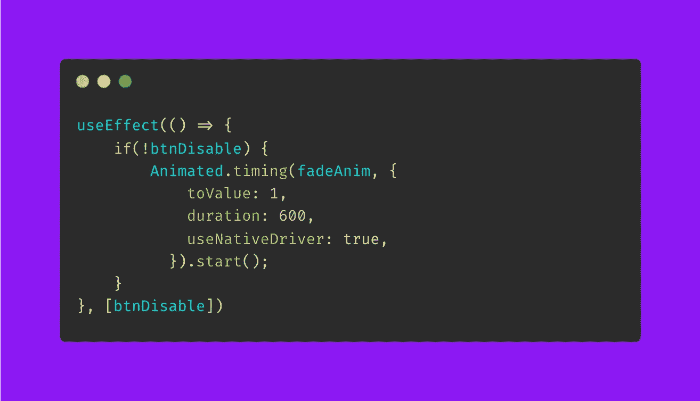
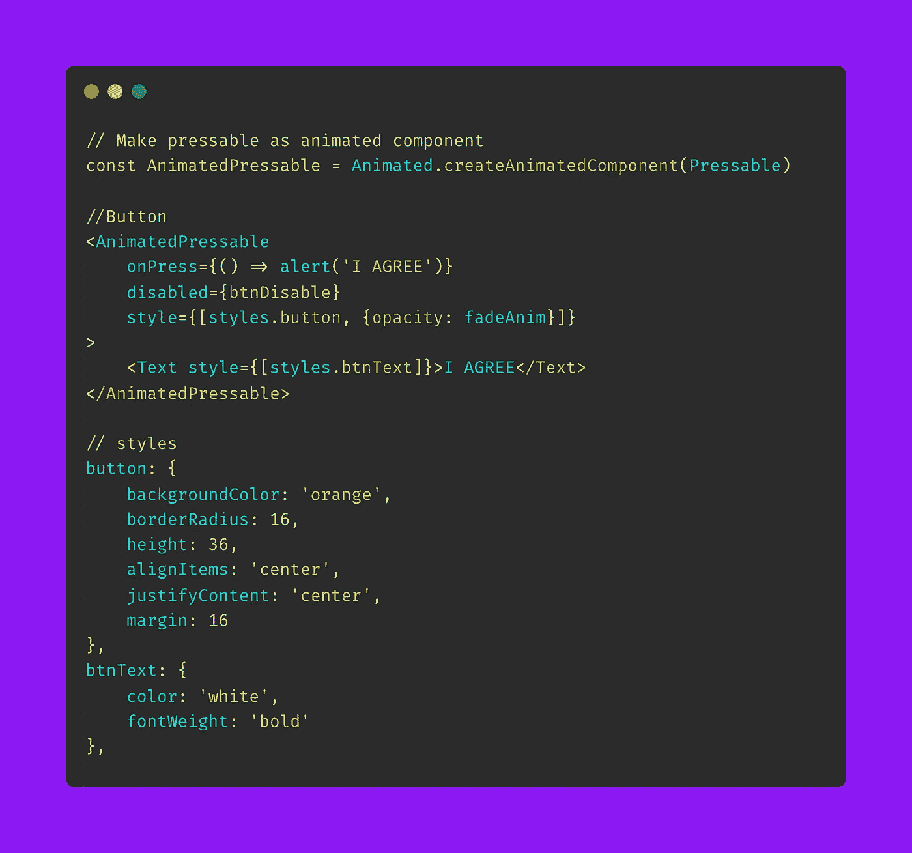
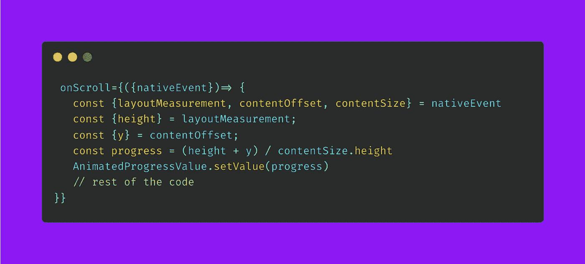
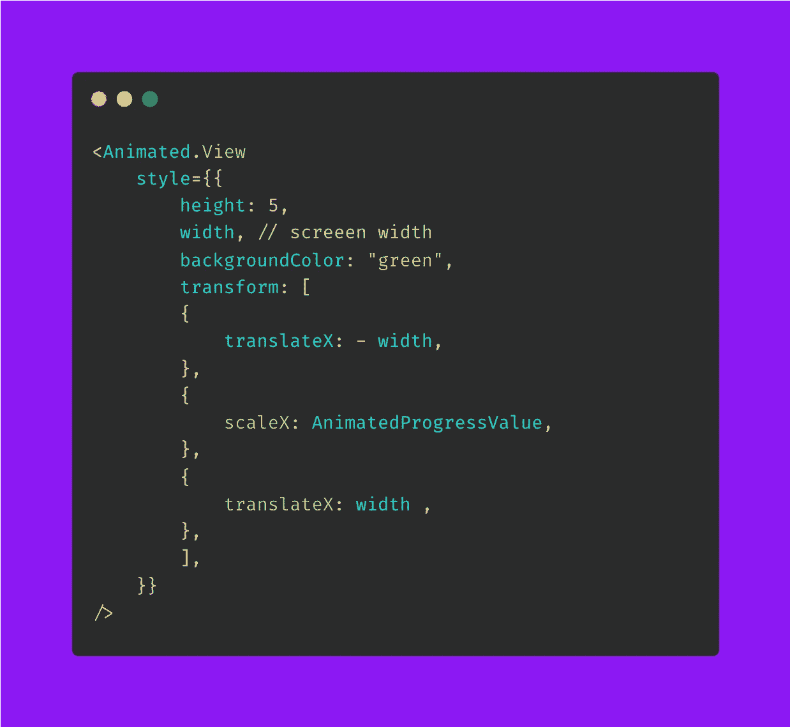

# 在 React Native 中实现带有动画和进度跟踪的动态“条款和条件”页面

> 原文：<https://medium.com/nerd-for-tech/implementing-a-dynamic-terms-conditions-page-with-animation-and-progress-tracking-in-react-56e27677041b?source=collection_archive---------2----------------------->

马库斯·温克勒在 [Unsplash](https://unsplash.com/s/photos/terms-of-service?utm_source=unsplash&utm_medium=referral&utm_content=creditCopyText) 上拍摄的照片

我们都知道浏览条款和条件页面的常见用户体验。用户需要向下滚动到底部，以启用提交按钮，只有在这之后，他们才能继续。在本帖中，我们将尝试构建一个相同体验的小型演示。

首先，让我们看看最终产品，以便清楚地了解我们想要实现的目标。

从演示中，我们可以指出实现这种行为需要解决的几个关键领域。

1.  首先，我们需要检测用户是否已经到达页面底部，如果他们到达底部的某个点，我们将需要启用禁用按钮。
2.  我们还需要跟踪滚动的进度。这样我们就可以根据滚动位置向用户显示进度条。用户将清楚地知道他们进展了多长时间。
3.  最后，为了使 UX 更加友好，我们可以在按钮被激活时设置按钮不透明度的动画。

好的，让我们从实现开始。

# 1.检测用户是否已经到达屏幕底部:

在初始阶段，我们的按钮是禁用的。我们可以创建一个状态来更改按钮的启用/禁用状态，如下所示

`const [btnDisable, setBtnDisable] = React.useState(**true**)`

为了检测用户的滚动位置，我们将使用我们的`ScrollView`的`onScroll`道具。

检测用户是否已经到达底部

# 2.启用带有不透明度动画的按钮:

从上面的代码中，我们可以看到我们正在启用按钮。我们可以添加一个简单的不透明动画来创建一个更好的感觉。最初，不透明度值为`0.2`。这就是为什么我们看到一个浅橙色的值，让用户知道按钮仍然处于非活动状态。

`const fadeAnim = useRef(**new**` `Animated.Value(0.2)).current;`

当我们将`btnDisble`状态的值设置为 false 时，我们可以将不透明度的值设置为 1。

这是我们的按钮组件。

# 3.跟踪和显示进度条

我们的最后一个任务是跟踪用户滚动页面的进度。为了跟踪进度，我们将在 onScroll 函数中使用一个动画值。

`const AnimatedProgressValue = **new**` `Animated.Value(0)`

下面的代码描述了跟踪进度的过程。

在我们的`AnimatedProgressValue`变量中有进度值。我们可以用它在页面底部生成进度条。这个实现如下

进度条的宽度等于屏幕的宽度。我们只需要根据进度值增加`scaleX`。`translateX`需要从左边开始缩放，否则，缩放将从中间开始，这就像`transformOrigin: '0px 0px'`网络一样。

这里是帖子的完整代码和演示—[https://snack.expo.dev/@saad-bashar/terms-conditions-demo](https://snack.expo.dev/@saad-bashar/terms-conditions-demo)