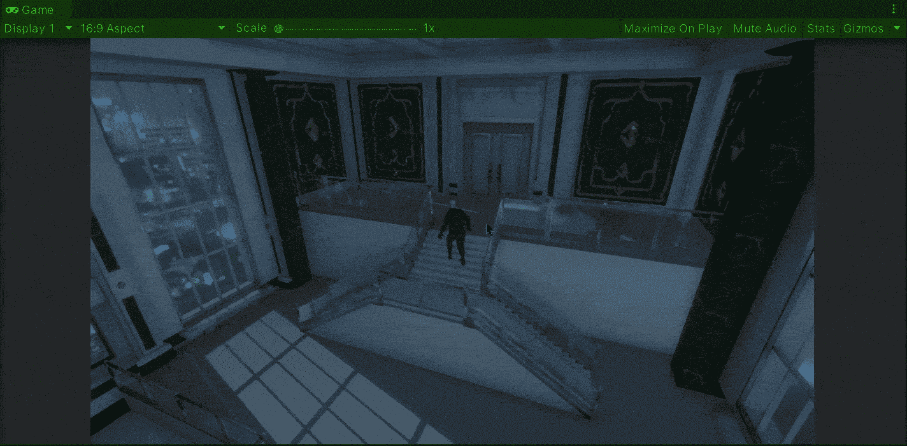
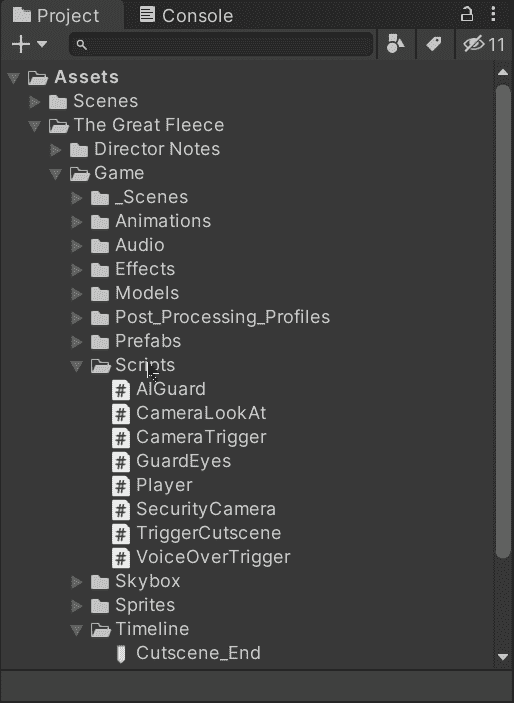
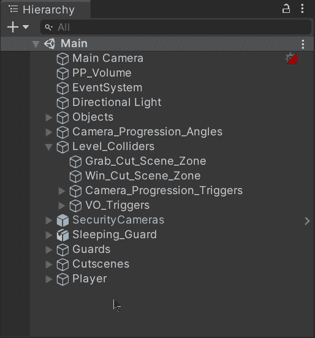
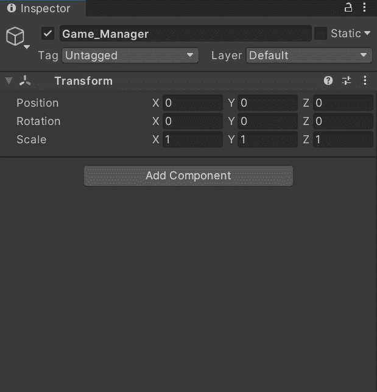
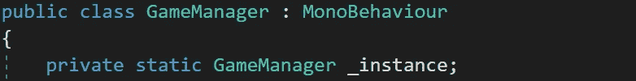
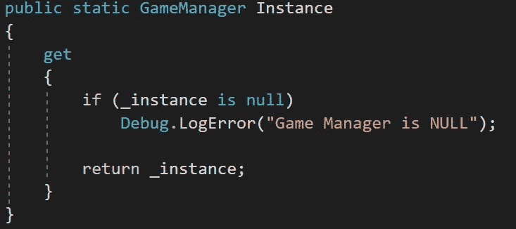
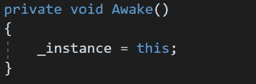
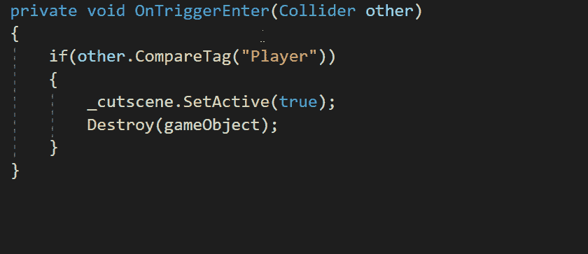
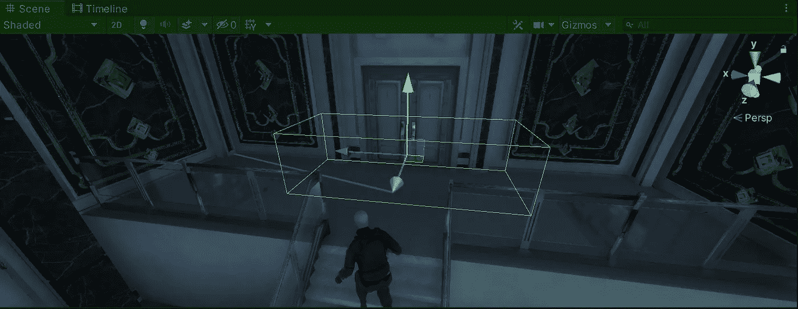
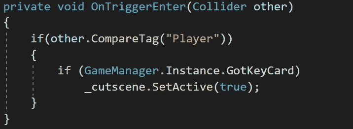

# 使用单例模式实现游戏管理器

> 原文：<https://medium.com/nerd-for-tech/implementing-a-game-manager-using-the-singleton-pattern-unity-eb614b9b1a74?source=collection_archive---------1----------------------->

## 统一指南

## 关于如何使用 Unity 的单例模式实现游戏管理器的快速指南

**目标**:通过在 Unity 中应用 Singleton 模式来管理一个简单的游戏机制，实现一个游戏管理器实例。

在上一篇文章中，我介绍了[如何触发一个完成的过场动画，然后用 Unity](/nerd-for-tech/triggering-a-finished-cutscene-unity-42007f1b4ce4) 返回游戏。现在，是时候实现一个游戏管理器来处理一个简单的情况了。

# 创建游戏管理器

为了实现游戏管理器，让我们首先创建一个新的脚本:

因为 ***GameManager*** 名称是 Unity 中的保留关键字，所以脚本显示为齿轮图标。

现在，让我们为游戏管理器创建一个新的空游戏对象，并通过检查器附加相应的脚本:

# 应用单例模式

单例模式意味着场景中只存在一个类单元(应用了该模式)。在这种情况下，单例模式有助于确保每种类型只有一个管理器(游戏管理器、音频管理器、UI 管理器、AI 管理器等)。)，所以我们可以用它来处理我们游戏的游戏管理器。

所以，为了应用单例模式，让我们打开**游戏管理器**脚本。让我们首先创建一个新的**私有**(以确保只有该类可以修改它)和**静态**(以确保它被该类的所有实例共享)类型的 **GameManager** 变量，它们将保存该类各自的唯一实例:

然后，为了能够从其他类访问这个惟一的实例，让我们用一个 **get** 选项创建一个新的公共**属性**。在 get 选项中，我们将检查上面的私有静态实例是否为空，以表明游戏管理器为空(如果是这种情况)，然后，我们将返回要读取的相应实例:

现在，为了初始化私有实例，我们需要使用**唤醒/启动**方法:

> 注意:当我们需要在游戏中使用它并提高性能时，我们也可以使用惰性实例化来创建相应的管理器。

最后，为了展示游戏管理器 singleton 的可能用途，让我们创建一个新的 **auto public bool 属性**，可以分别用 **get** 和 **set** 来访问或修改。该属性将定义玩家是否已经从沉睡的守卫那里获得了卡来完成关卡:

## 修改实例的属性

如果你读了[上一篇文章](/nerd-for-tech/triggering-a-finished-cutscene-unity-42007f1b4ce4)，你会记得我们触发了过场动画，玩家使用 **OnTriggerEnter** 方法从一个睡着的警卫手里抢走了一张钥匙卡。因此，为了定义钥匙卡被抓取，我们可以选择通过从触发过场动画的类中调用游戏管理器实例及其属性来修改属性:

这样，我们将能够根据玩家是否有钥匙卡来检查最后一个过场动画是否应该被触发。

## 检查实例的属性

所以，让我们把同样的机制(就像在[的最后一个帖子](/nerd-for-tech/triggering-a-finished-cutscene-unity-42007f1b4ce4))应用到最后一个过场动画。我们有一个带有碰撞器和刚体的游戏对象，当玩家接近门时触发最后一个过场动画:

然后，使用 **OnTriggerEnter** 方法，我们将能够通过访问游戏管理器实例及其属性来检查是否已经抓取了钥匙卡:

如果来自**游戏管理器**实例的 **GotKeyCard** 属性为真，将触发最后一个过场动画。

如果我们获取相应的钥匙卡并尝试触发最后一个过场动画，我们会注意到游戏管理器实例的属性按预期工作:

就这样，我们通过应用 Unity 的单例模式实现了一个游戏管理器！:d .下一篇文章再见，我将展示如何用 Unity 创建一个装载场景。

> *如果你想了解我更多，欢迎登陆*[***LinkedIn***](https://www.linkedin.com/in/fas444/)**或访问我的* [***网站***](http://fernandoalcasan.com/) *:D**