# 实现跳转机制| Unity

> 原文：<https://medium.com/nerd-for-tech/implementing-a-jump-mechanic-unity-6420b106e47a?source=collection_archive---------2----------------------->

## 统一指南

## 关于如何在 Unity 中实现跳转机制的快速指南

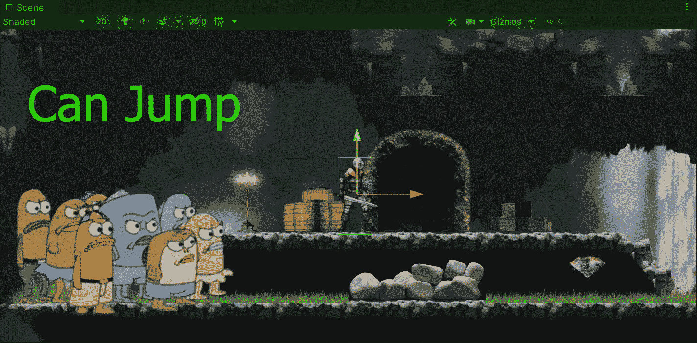

目标:使用刚体 2D 为 2D 玩家实现跳跃机制。

在上一篇文章中，我介绍了[如何用新的 Unity 输入系统](/nerd-for-tech/moving-with-the-new-input-system-unity-a6c9cb100808)实现移动。现在，是时候在 2D 环境中用刚体 2D 组件为我们的玩家实现一个跳跃机制了。

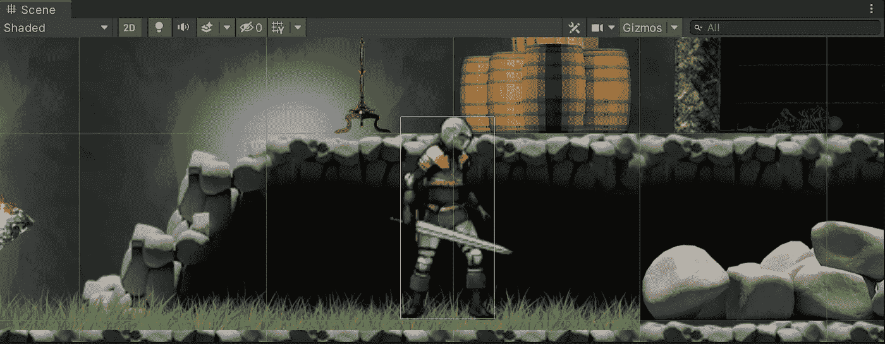

# 创建跳跃动作

首先，让我们在输入动作资产中创建跳转动作。让我们保持动作类型为 ***按钮*** ，因为我们要实现一个被触发的跳转机制:

> 注:如果你不知道如何开始使用 Unity 的新输入系统，可以看看我的[上一篇](/nerd-for-tech/moving-with-the-new-input-system-unity-a6c9cb100808)。

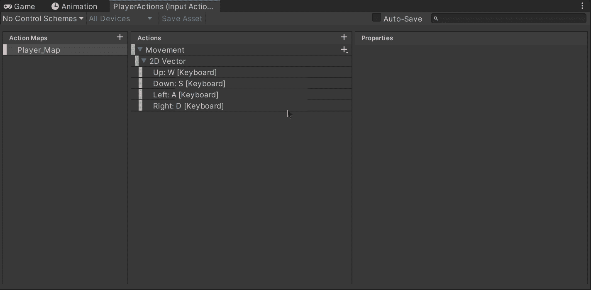

在上一篇文章中，我创建了一个动作来控制玩家的移动。

然后，让我们选择默认绑定，并指示键盘上的空格键将与跳转动作绑定:

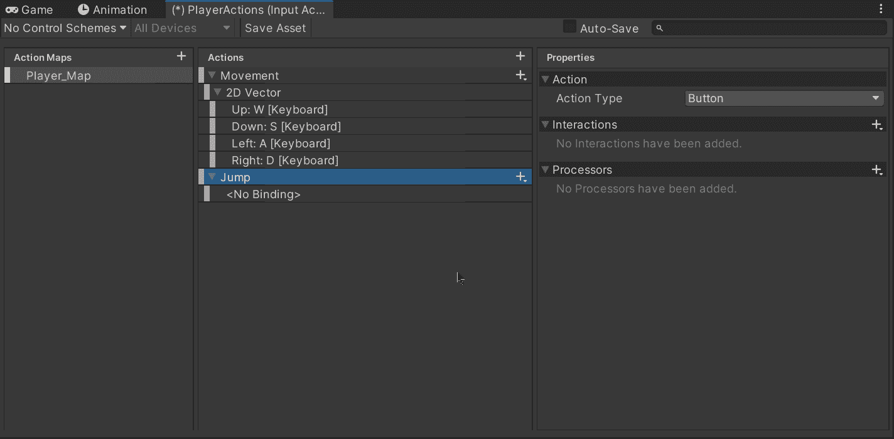

# 创建地面层

接下来，为了能够识别玩家何时落地，从而允许执行跳跃机制，让我们选择相应的地面图块地图并更改其图层:

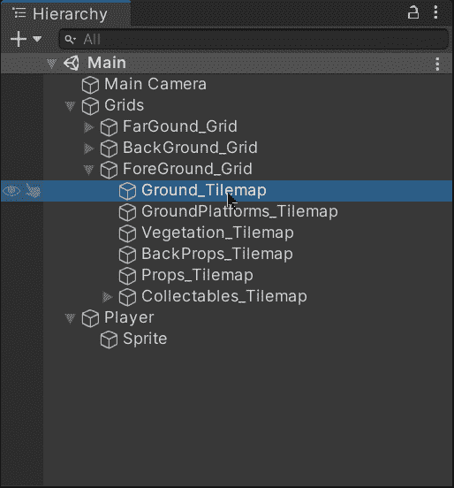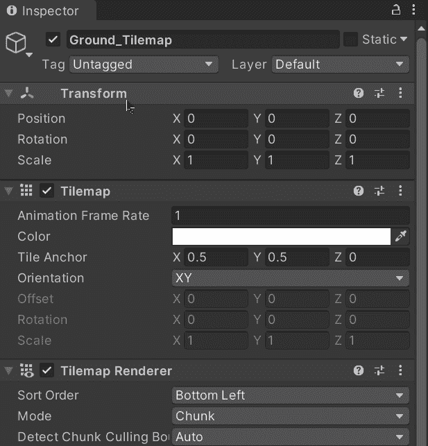

# 实现跳转机制

## 变量声明

现在，为了实现跳转机制，让我们打开播放器脚本并声明下一个变量:

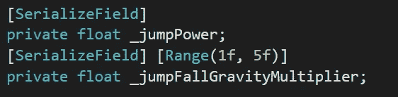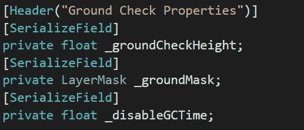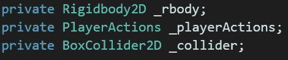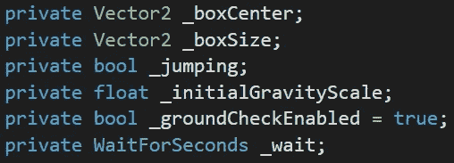

*   跳跃能力

这个变量将决定跳跃时的初始速度。

*   跳落重力倍增器

这个变量将决定玩家在完成一次跳跃后下落时应用于刚体的重力比例。

*   地面检查高度

这个变量将决定盒子的高度( **OvelapBox** 方法)，我们将在玩家下方使用它来决定它是否在地面上。

*   接地屏蔽

这个变量将允许我们在使用 **OverlapBox** 方法时检查地面层内的碰撞器。

*   禁用地面检查时间

该变量将决定跳跃时地面检查被禁用的时间，以避免重置跳跃布尔值。

*   盒子中心

这个变量将指示检查玩家是否在地面上的盒子的中心坐标。

*   盒子大小

这个变量将指示同一盒子的大小(宽度，高度)。

*   跳跃的

这个变量将指示玩家当前是否正在跳跃。

*   初始重力标度

这个变量将存储刚体的初始重力比例值。

*   地面检查已启用

该变量将指示接地检查是否启用。

*   等待

该变量将用于在再次启用接地检查之前在协程内等待。

*   刚体

这个变量将保存一个对我们玩家的刚体 2D 的引用。

*   玩家动作

该变量将保存对输入动作资产的引用，该资产包含移动或跳跃等玩家动作。

*   碰撞机

这个变量将包含一个对我们玩家的 2D 碰撞器的引用。

## 变量初始化

然后，在 **Awake** 方法中，让我们初始化实现跳转机制所需的变量和引用。最后一行从输入动作资产订阅了 **Jump_performed** 方法到 **Jump** 动作的 **performed** 事件。

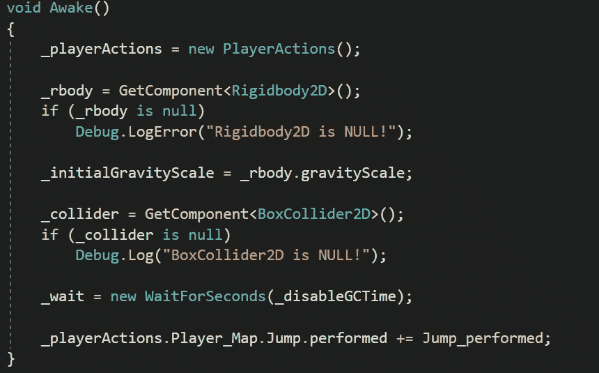

同样，让我们确保在**one enable**和 **OnDisable** 方法中启用和禁用各自的动作映射(以接收来自用户的输入),作为良好实践:

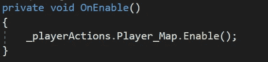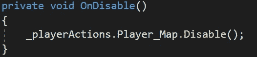

## 实现跳转

现在，为了实现跳转，让我们使用下面的方法和协程:

**跳转 _ 已执行**

玩家每次执行 ***跳转*** 动作(绑定空格键)都会调用这个方法。首先，我们将通过调用 **IsGrounded** 方法检查玩家是否在地面上。如果是这样的话，我们将把速度加到 Y 轴上(根据玩家的跳跃能力)，并将跳跃 bool 值设置为 true。最后，我们将启动一个协程来禁用和启用地面检查，以避免在开始跳转时重置跳转 bool 值。

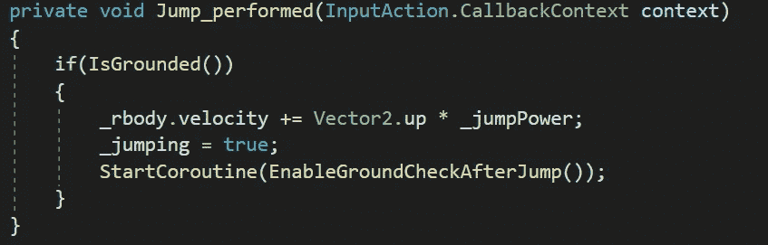

被驱逐出

这个方法将返回一个布尔值来指示玩家是否在地面上。要检查这一点，我们需要:

*   通过相加计算盒子的中心坐标:碰撞器的中心坐标，碰撞器高度的一半(负)和检查玩家是否在地面上的新盒子高度的一半(负)。
*   在 Vector2 中设置新盒子的大小，使其具有与碰撞器相同的宽度和所需的高度。
*   使用**重叠框**方法，将新框的中心坐标、新框的尺寸、新框的角度和各自的地面层遮罩作为参数发送。
*   如果返回的碰撞器不为空，玩家在地面上，否则，它不在地面上。

**EnableGroundCheckAfterJump**

该协程将改变指示接地检查应该“禁用”还是“启用”的布尔值。这是为了在每次跳跃后禁用地面检查一段时间(由用户指定),以便当玩家在初始帧仍在地面上时，指示玩家何时跳跃的布尔值不会改变。

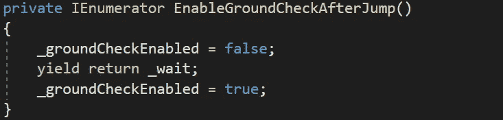

## 打磨跳跃

现在，为了改进跳跃的执行，让我们创建一个新的方法，它将在 **FixedUpdate** 方法中被调用，以确定玩家何时不再跳跃，并分别改变下落时的重力比例:

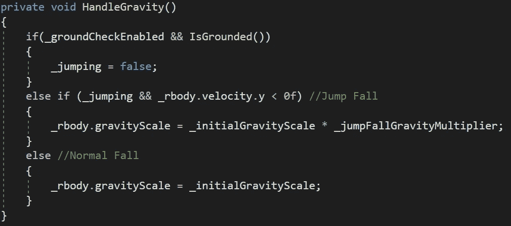

然后，让我们将它添加到 **FixedUpdate** 方法中应用移动的行之后:

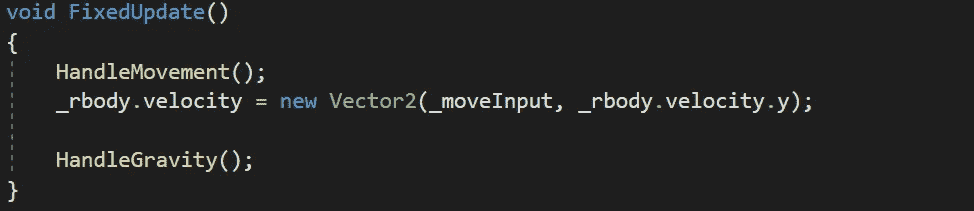

## 可视化地面检查

接下来，为了可视化检查玩家下方是否有地面的框，让我们使用**小发明。用 **OnDrawGizmos** 方法中各自的坐标和大小绘制 WireCube** 方法:

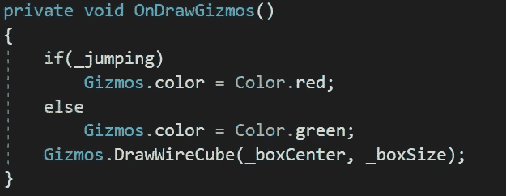

> 注意:这将仅在 **Unity 编辑器**的**场景**窗口中可见。

## 自定义属性

最后，要开始使用跳转机制，让我们通过检查器修改跳转和地面检查属性的值:

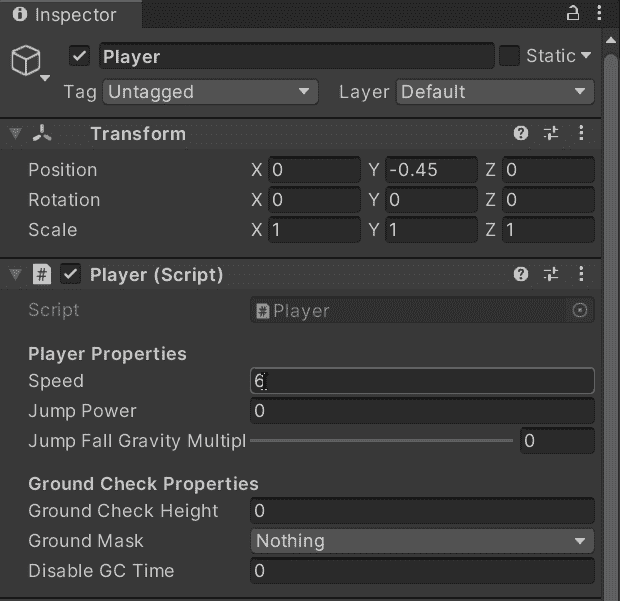

如果我们用 Unity 运行游戏，我们会看到地面检查起作用，并且在到达跳跃的顶点后施加更多的重力:

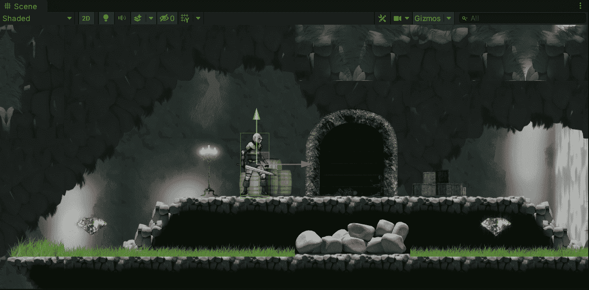

就这样，我们用 Unity 为我们的玩家实现了一个可靠的跳转机制！:d .我会在下一篇文章中看到你，在那里我将展示如何用 Unity 为我们的玩家实现更多的机制。

> *如果你想了解我更多，欢迎登陆*[***LinkedIn***](https://www.linkedin.com/in/fas444/)**或访问我的* [***网站***](http://fernandoalcasan.com/) *:D**