# 实施生命系统| Unity

> 原文：<https://medium.com/nerd-for-tech/implementing-a-life-system-unity-e2a9c6b44db5?source=collection_archive---------12----------------------->

## 统一指南

## 如何用 Unity 实现生命系统的快速指南

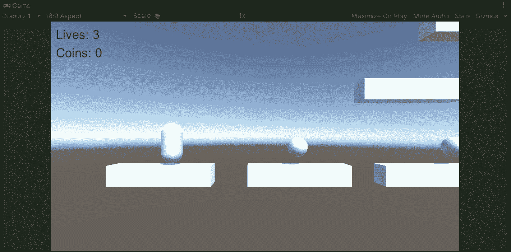

**目标**:实现一个系统来统一处理玩家的生活。

在上一篇文章中，我介绍了[如何用 Unity](/nerd-for-tech/dynamic-platforms-unity-28cfe83af90) 创建动态平台。现在，是时候实现一种方法来处理玩家在我们平台游戏中的生活了。

# 处理坠落

如果你看过[我的上一篇帖子](https://fas444.medium.com/)，你会记得我们正在使用原始资产开始创建一个平台游戏。目前，在下一个场景中，我们有一个带有一些平台和收藏品的播放器:

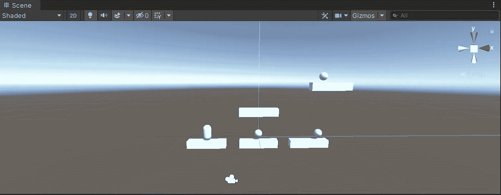

因此，为了处理玩家摔倒的情况，让我们从创建一个空的游戏对象开始，它代表场景中让玩家重生的点:

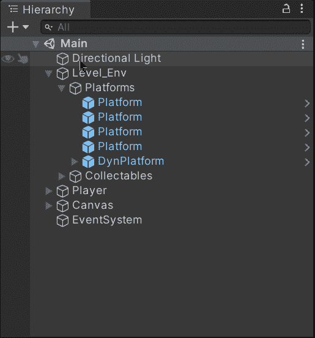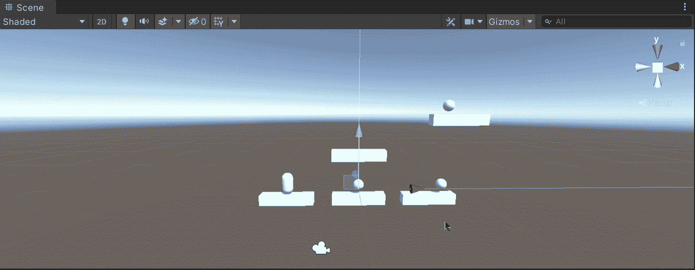

然后，让我们创建一个新的游戏对象，它包括一个盒子碰撞器组件，并启用了 ***Is Trigger*** 属性来表示玩家将失去一条生命的区域:

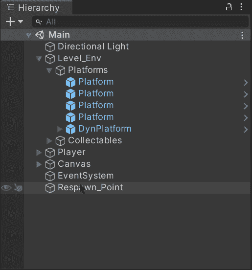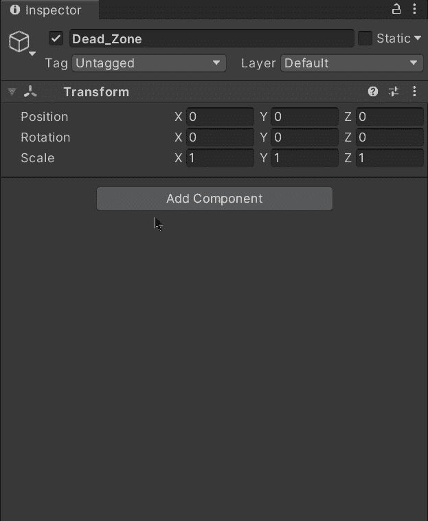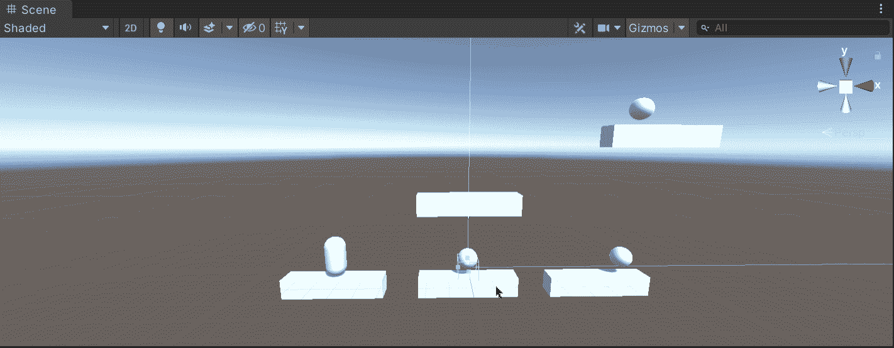

一旦碰撞器实现了我们的目的，让我们将游戏对象移动到期望的区域:

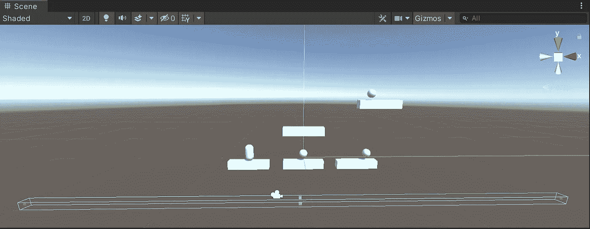

当它掉落并触发碰撞器时，玩家将失去一条生命。

现在，让我们创建一个新的脚本并附加到游戏对象上，以便处理与玩家的触发冲突:

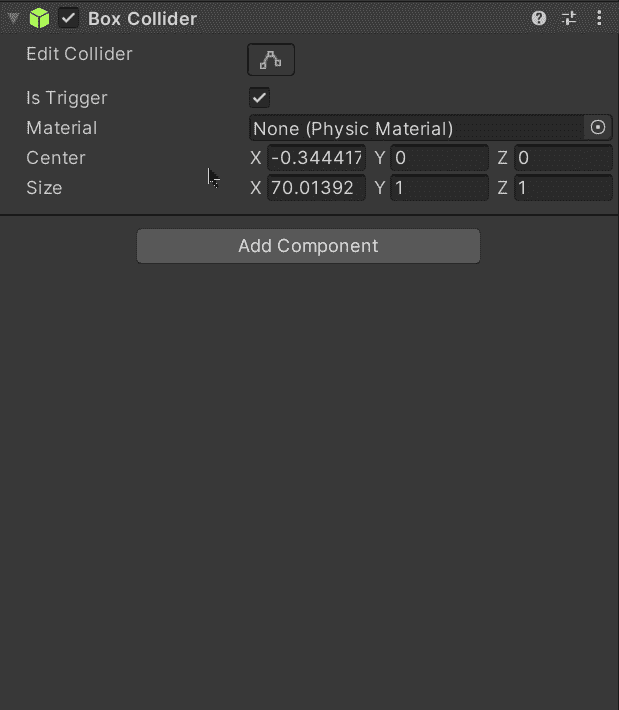

然后，让我们打开脚本并在顶部包含**系统**名称空间:

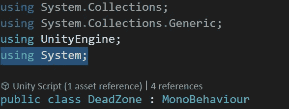

接下来，让我们创建一个新的公共静态动作委托，它将代表玩家的每次摔倒:

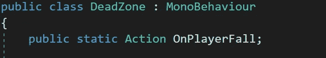

如果您想了解有关动作代表的更多信息，可以访问 Microsoft 文档:

 [## 动作委托(系统)

### 封装没有参数且不返回值的方法。公共委托 void Action()；公共…

docs.microsoft.com](https://docs.microsoft.com/en-us/dotnet/api/system.action?view=net-5.0) 

现在，让我们使用 **OnTriggerEnter** 方法来触发与其他碰撞器的碰撞。在这个方法中，我们将通过比较另一个碰撞器的标签来检查碰撞是否发生在玩家身上。如果碰撞器属于玩家，我们将调用动作委托(如果不为空)在玩家摔倒时采取相应的动作:

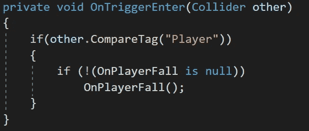

# 生命系统

现在，为了处理生命系统，让我们打开玩家脚本并包含**场景管理**名称空间，因为我们将在玩家生命耗尽时重启关卡:

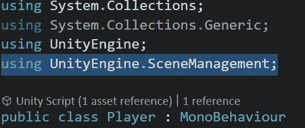

然后，让我们创建:

*   一个私有变量存储玩家的总寿命。
*   返回私有变量的值的公共属性。
*   存储重生点引用的私有变量。

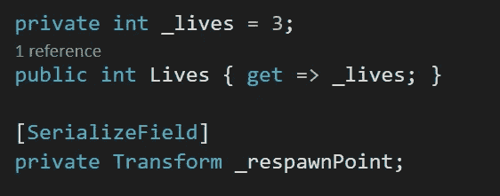

现在，让我们创建一个新的方法来处理玩家的伤害。当该方法被调用时，它将:

*   从相应的变量中减去一个生命。
*   如果玩家生命耗尽，恢复等级。
*   禁用角色控制器组件以平滑重生。
*   改变玩家的位置到重生点。
*   在一定时间后启动一个协程来启用字符控制器。

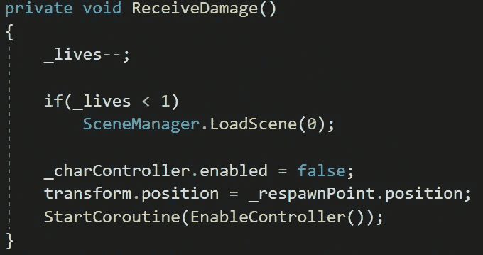

启用角色控制器的协程是下一个:

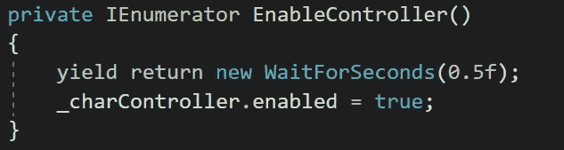

这样，我们将等待半秒钟，直到控制器再次启用。

最后，让我们将该方法添加到从死区开始的动作委托中的 **Start** 方法中，以便在玩家摔倒时调用该方法。同样，作为一个好的实践，让我们使用 **OnDestroy** 方法删除它，以避免在播放器被破坏时试图执行它:

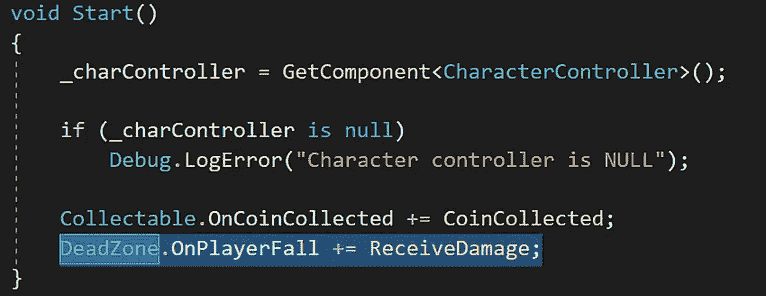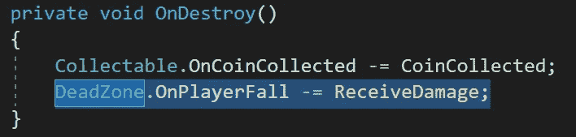

保存脚本后，让我们将重生点拖到检查器中:

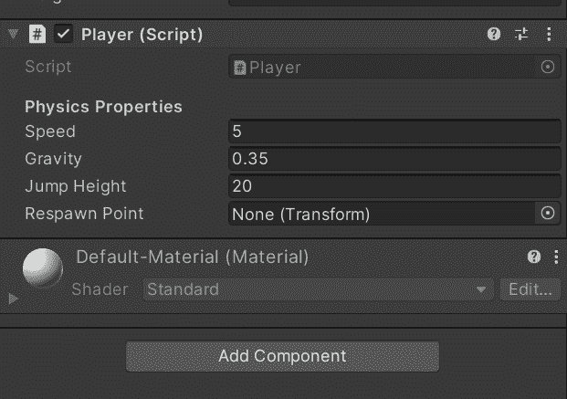

# 展示生命

现在，为了显示剩余的生命，让我们在画布中使用一个文本元素，就像我们用来显示硬币的元素一样:

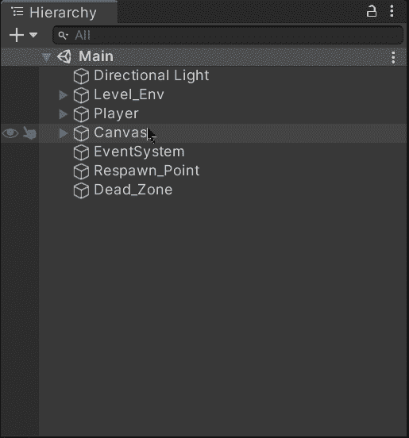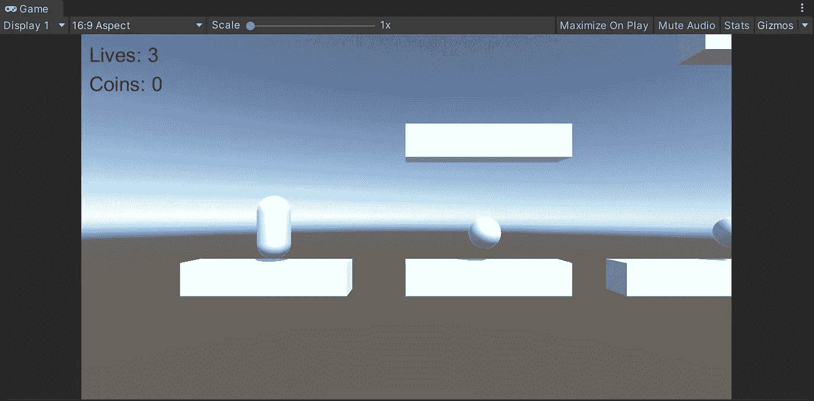

一旦我们有了文本元素，让我们打开 UI Manager 脚本并创建一个新变量来存储对它的引用:

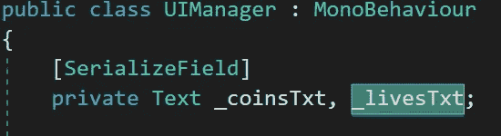

然后，让我们创建一个新方法，通过更改 text 属性并从 player 类调用 lifes 属性来更新 lifes:

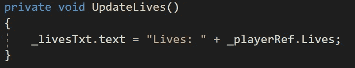

最后，让我们添加和删除动作委托中的方法，就像我们处理接收玩家类伤害的方法一样:

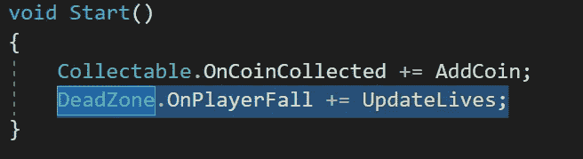

不要忘记通过检查器将文本元素拖到相应的变量中:

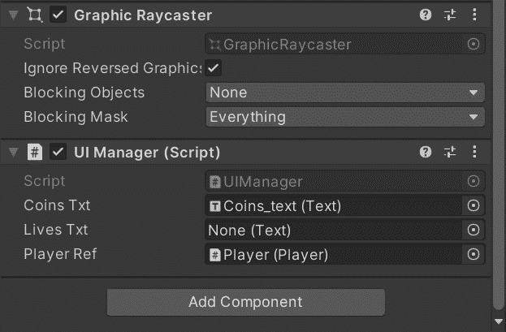

如果我们在 Unity 中运行游戏，我们会看到玩家每次倒下都会重生并失去一条生命:

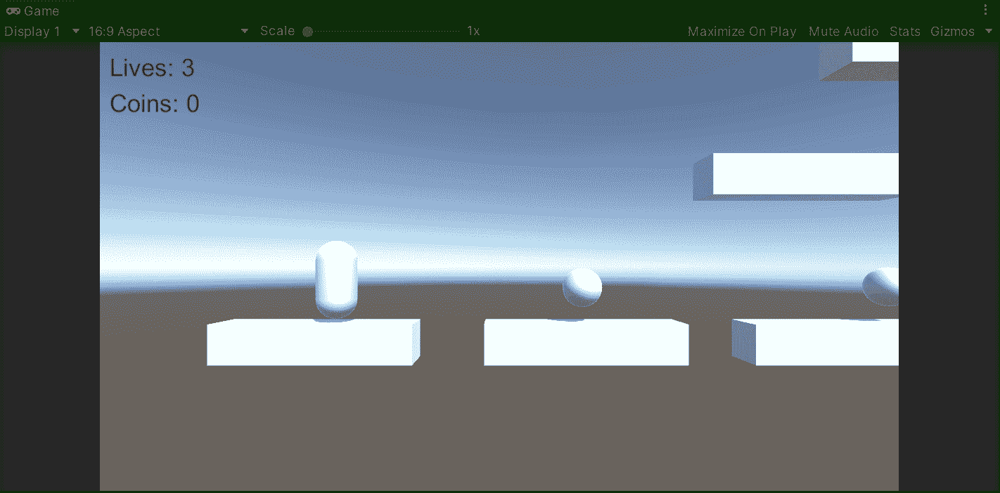

就这样，我们用 Unity 为我们的平台游戏实现了一个生命系统！:d .下一篇文章再见，我将展示如何用 Unity 创建电梯。

> *如果你想了解我更多，欢迎登陆*[***LinkedIn***](https://www.linkedin.com/in/fas444/)**或访问我的* [***网站***](http://fernandoalcasan.com/) *:D**