# 在 Unity 中实现对行为的复古游戏

> 原文：<https://medium.com/nerd-for-tech/implementing-a-retro-game-over-behavior-in-unity-fb126c76c4bf?source=collection_archive---------23----------------------->

## 统一指南

## 关于如何在 Unity 中为你的游戏创建一个复古游戏行为的快速指南

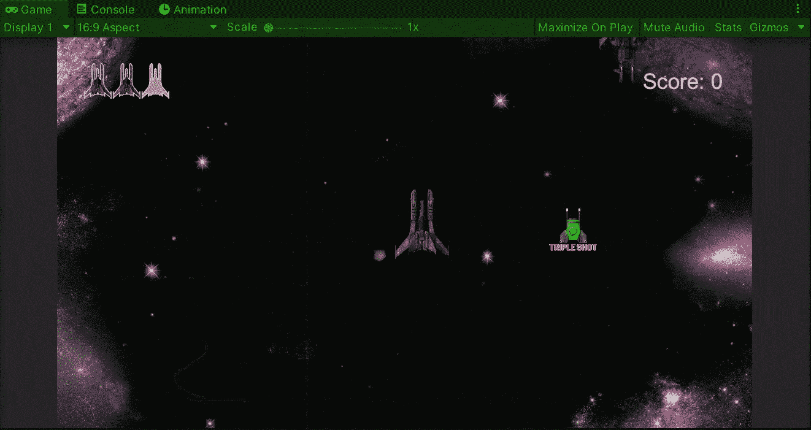

**目标**:在 Unity 的一个太空射击游戏中，创建一个游戏文本 UI 元素，并为其实现一个复古行为。

在上一篇文章中，我向[展示了如何在 Unity](/nerd-for-tech/creating-ui-elements-in-unity-a778929eacfa) 中创建 UI 元素，现在是时候实现一个复古的游戏行为，使用 UI 元素来表示游戏结束了。

# 在文本上创建游戏

为了做到这一点，让我们为游戏 over warning 创建一个新的文本元素，并根据我们的需要修改它以适应场景:

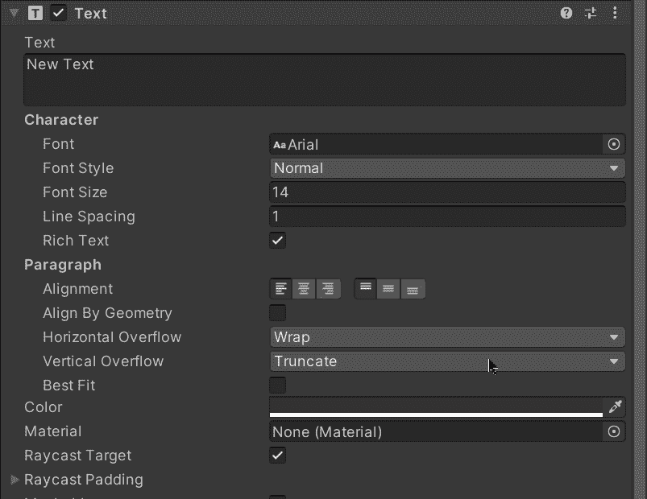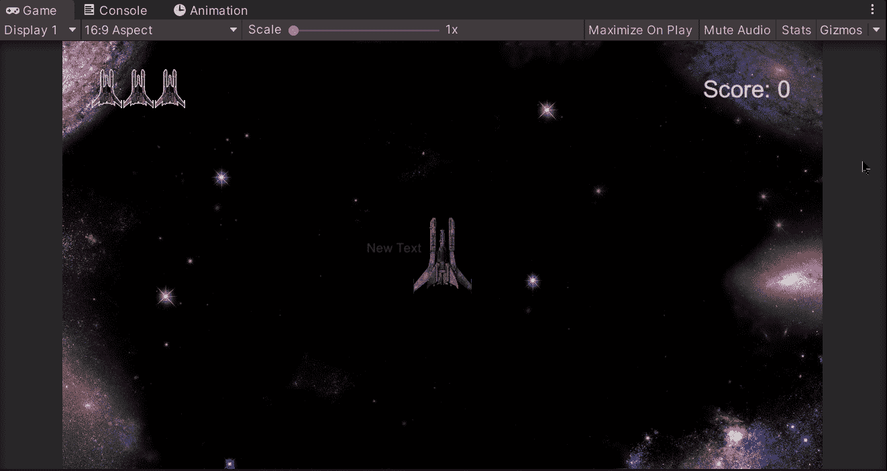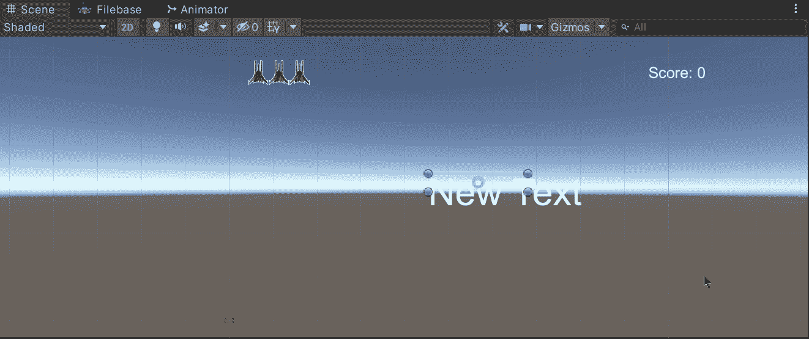

一旦游戏结束文本准备就绪，让我们在场景中禁用游戏对象，以确保它只在游戏结束时出现:

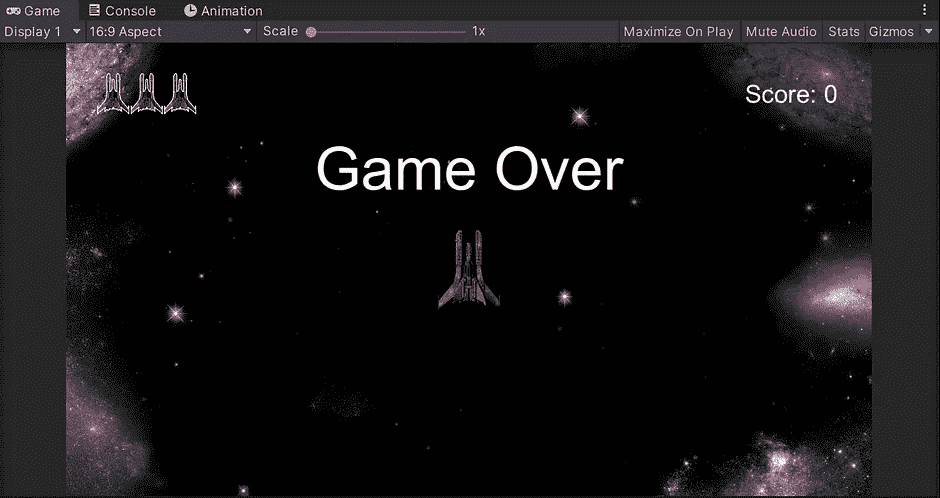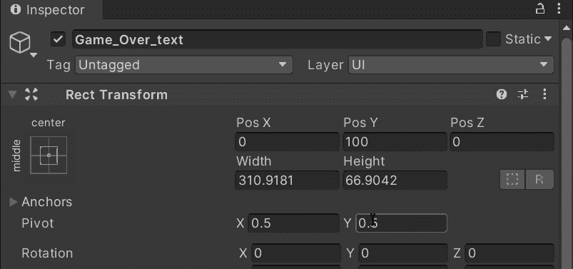

# 在文本上显示游戏

然后，让我们打开 UI Manager 脚本并创建一个新变量来存储对文本元素上的游戏的引用:

不要忘记使用**【serialize field】**来从层次结构中拖动文本元素。

保存脚本，转到检查器，将文本元素拖到画布内部的 UI Manager 脚本组件中:

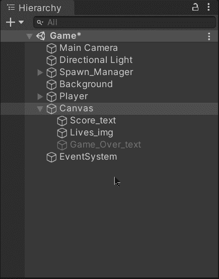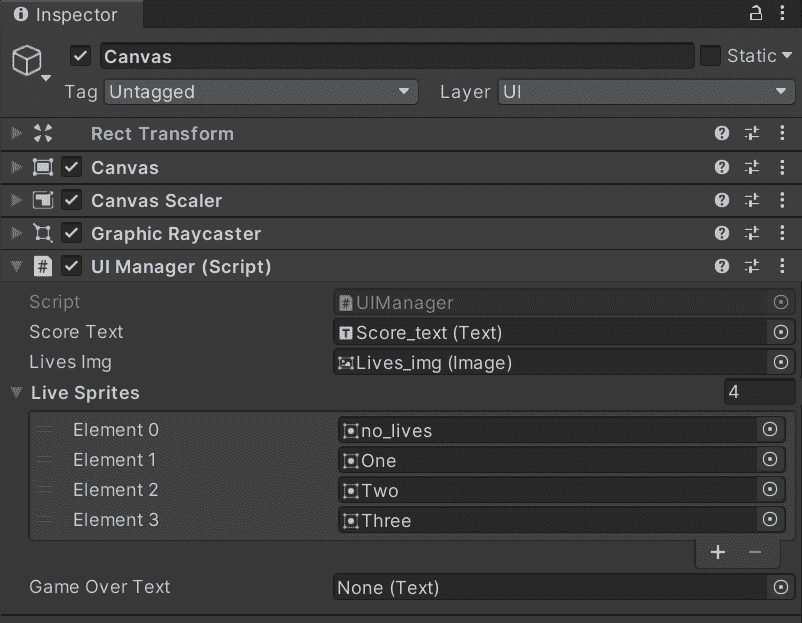

然后，返回 UI 管理器脚本，创建一个新的公共函数，在播放器被破坏时调用:

在这里，我们将使用 gameobject 中的 **SetActive** 方法激活文本元素上的游戏:

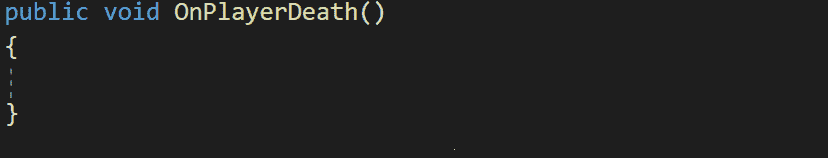

现在，为了调用该函数，让我们打开玩家脚本，并确定处理飞船损坏的函数。然后，使用存储我们已经拥有的对 UI 管理器脚本的引用的变量，在玩家失去所有生命时调用 **OnPlayerDeath** 函数:

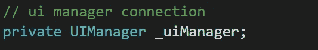

这个变量存储了对画布内部 UI 管理器脚本的引用。

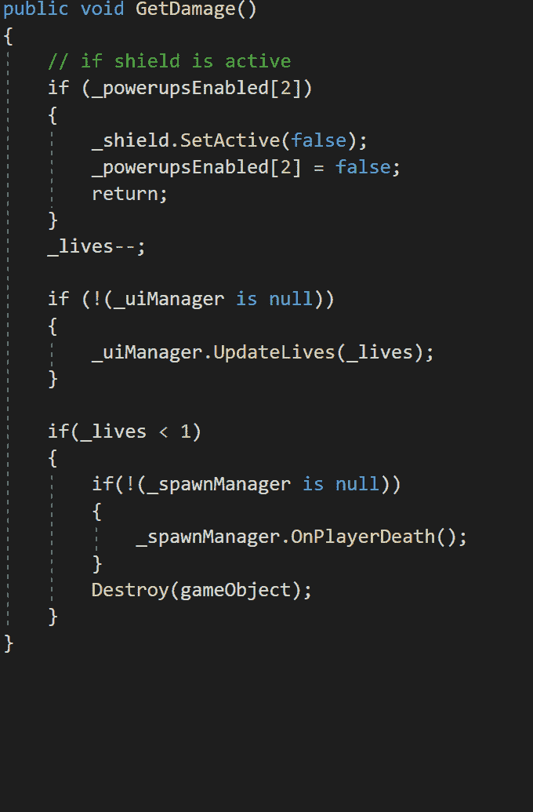

在从 UI 管理器调用函数之前，检查 UI 管理器引用是否不为空，以防止编译错误。

如果我们在 Unity 中运行游戏，我们会注意到当玩家击中 3 个敌人时，游戏结束文本元素变得活跃:

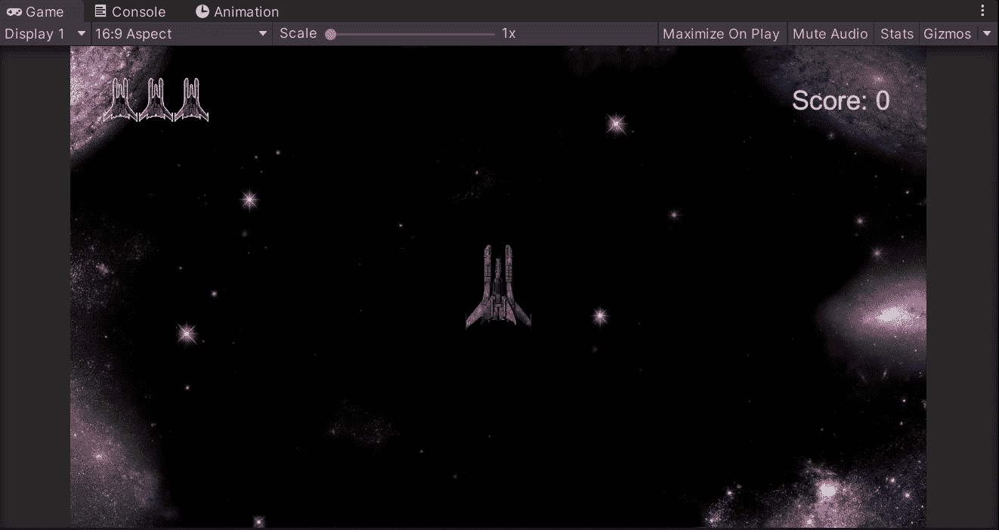

# 实施追溯行为

正如我在以前的一篇文章中提到的，我们将使用一个[协程](https://fas444.medium.com/using-coroutines-in-unity-5fa1d51e0055)来实现文本元素上游戏的复古行为。让我们创建一个新的 **IEnumerator** 函数来实现它:

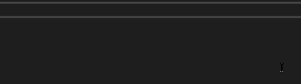

现在，在一个无限 while 循环中:

1.  将文本元素的文本设置为“Game Over”(原始)。
2.  使用 **yield return** 语句和 **WaitForSeconds** 方法，在执行下一步之前等待。
3.  将文本元素的文本设置为空。
4.  再次使用 **yield return** 语句和 **WaitForSeconds** 方法等待再次执行第一步。

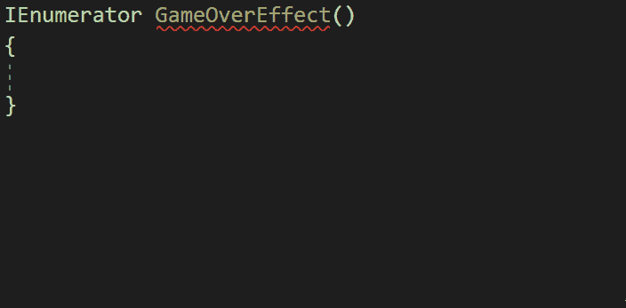

通过使用 **yield return** 语句，我们确保函数在相同的位置重新开始执行。

然后，为了执行协程，让我们在 **OnPlayerDeath** 函数中激活游戏结束文本元素后，使用 **StartCoroutine** 方法调用它:

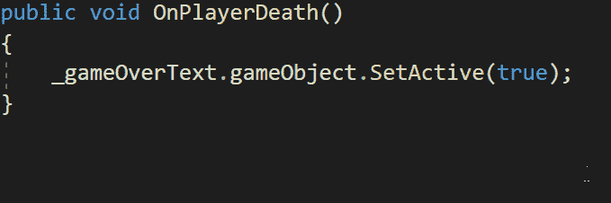

最后，如果我们在 Unity 中运行游戏，我们会看到，一旦玩家被摧毁，游戏结束文本元素会以复古行为显示:

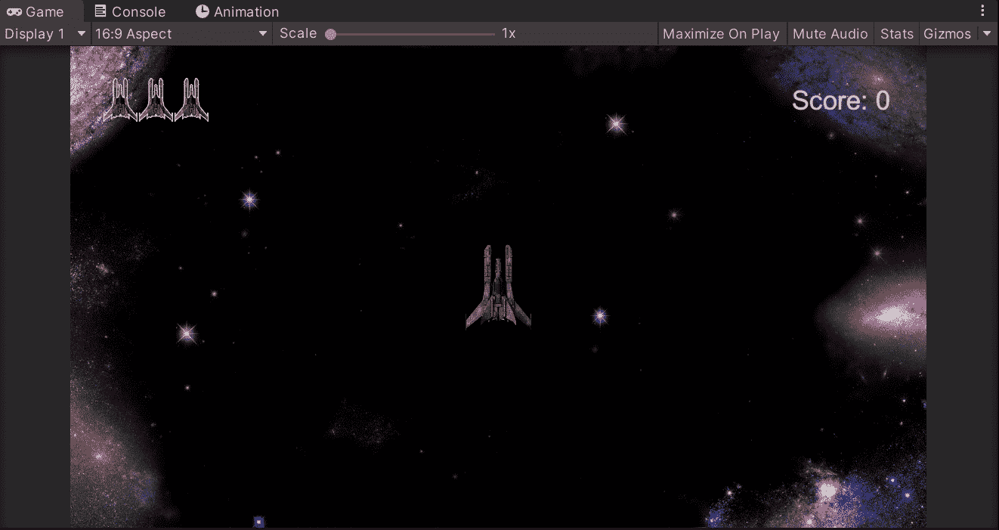

就这样，你可以在 Unity 中为你的 UI 元素实现一个复古行为！:d .下一篇文章再见，我将展示如何在 Unity 中加载场景。

> *如果你想了解我更多，欢迎登陆*[***LinkedIn***](https://www.linkedin.com/in/fas444/)**或访问我的* [***网站***](http://fernandoalcasan.com/) *:D**