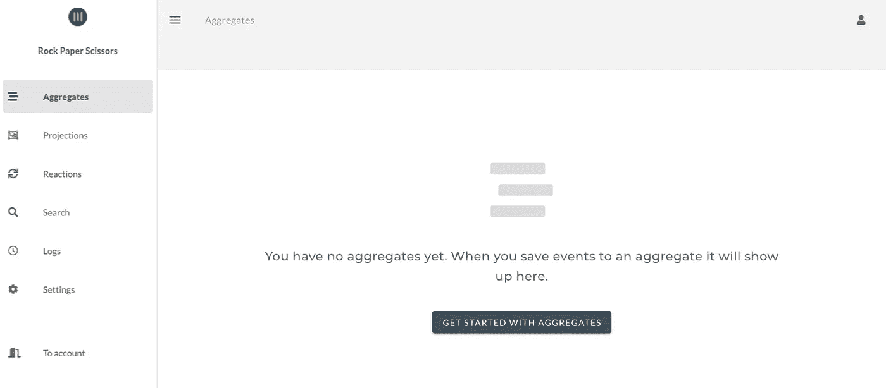
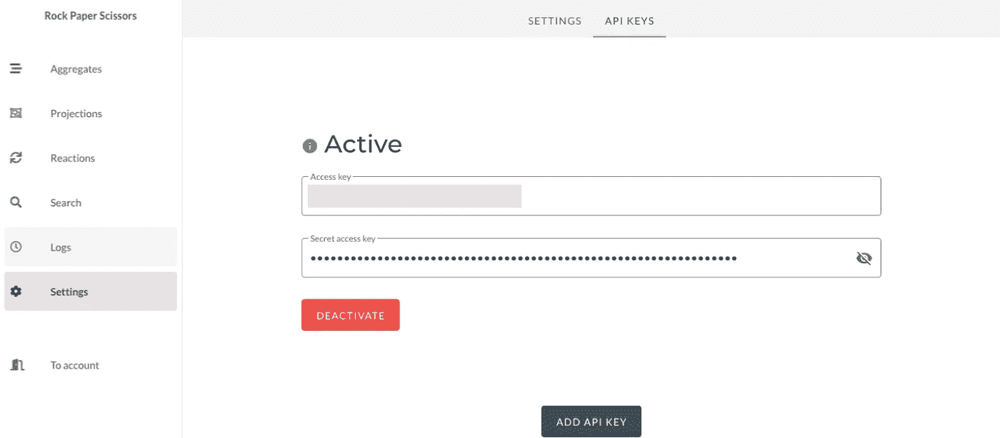
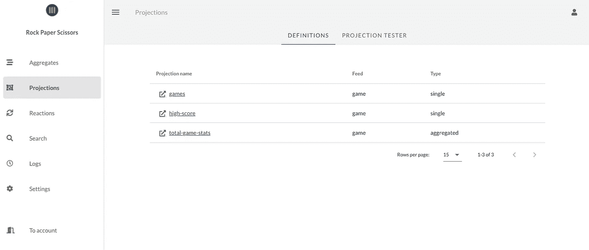
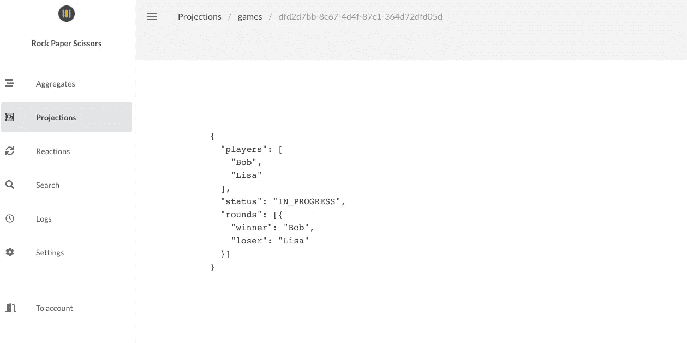
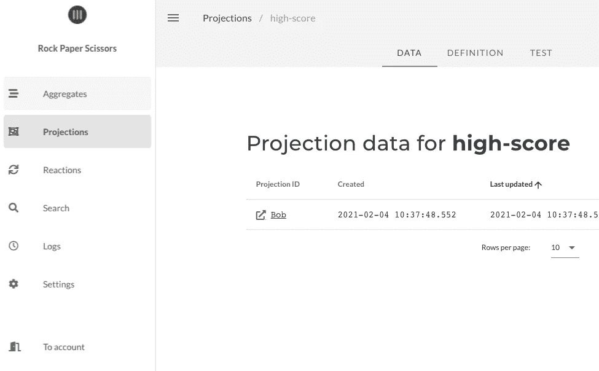
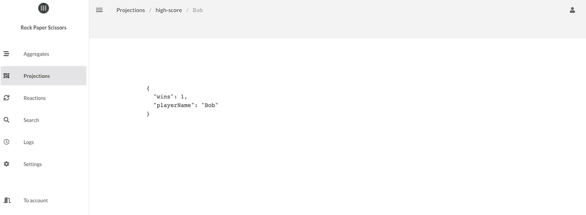

# 使用事件源实现石头剪子布游戏

> 原文：<https://medium.com/nerd-for-tech/implementing-a-rock-paper-scissors-game-using-event-sourcing-35f772cbcaa?source=collection_archive---------5----------------------->

在本教程中，我们将了解如何使用针对事件源和 CQRS 的[序列化的](https://serialized.io)API 来设计石头剪子布游戏的游戏流程。


我们最喜欢的应用程序运行时环境通常是 [Dropwizard](https://www.dropwizard.io/) ，但是因为很多人更喜欢 [Spring Boot](https://spring.io/projects/spring-boot) ，所以我决定在本文中使用它。我们的 [Java 客户端](https://github.com/serialized-io/client-java)可以与您在 JVM 上使用的任何运行时环境或平台一起工作。

# 配置序列化项目

为了开发我们的游戏，我们将使用连续聚合和投影。聚合将存储每场比赛的事件，投影将提供每场比赛的视图以及最高赢家的高分列表(在运行多个比赛的情况下)。

如果你还没有注册连载，你需要[注册一个免费的开发者账户](https://app.serialized.io/)。一旦您注册并创建了您的第一个项目，您将看到一个聚集的空视图，如下所示:



将访问密钥和秘密访问密钥复制到安全的位置。我们将需要这些来从我们的后端应用程序访问序列化的 API。

干得好！我们现在有一个空的序列化项目。我们现在准备开始开发我们的游戏！

# 游戏的设置和概要

在这一节中，我们将描述游戏的基本功能以及开发整个游戏流程所需要实现的部分。

# 游戏规则

游戏的核心是游戏规则。如果你对游戏的历史感兴趣，你可以在维基百科上了解更多。

这是游戏规则的简要总结:

*   这个游戏是由两个人玩的。
*   一轮游戏包括双方亮出他们的手牌(石头/布/剪刀)。
*   每一轮结束时，双方球员已经表明他们的手，有一个赢家。
*   如果一轮打成平手(显示的是同一手牌)，该轮将再次进行。
*   纸打败了石头。
*   石头打败剪刀。
*   剪刀胜过布。
*   一场游戏最好是 3 回合——当一个玩家赢了 2 回合就结束了。

# 游戏模型

我们将使用*命令*和*事件*来设计我们的游戏。命令是游戏支持的动作，事件是作为这些命令的结果发出的[域事件](https://serialized.io/ddd/domain-event)。

# 命令

鉴于我们简单的游戏规则，我们只能执行两个操作:

*   当我们决定开始两人游戏时，将会发送。
*   `**ShowHand**`每当玩家摊牌时都会发送。

**注意**:由于当最后一手牌出现时游戏自动结束，并且我们有一个赢家，这不是作为一个命令，而是作为一个事件。

用命令和事件设计游戏的一个有趣的结果是，我们可以清楚地看到不同命令和事件的数量之间的差异。

# 事件

下面是我们的`**Game**`聚合发出的事件描述，作为成功处理命令的结果:

*   `**GameStarted**`将作为`**start-game**`命令的结果被保存。
*   `**RoundStarted**`将与第一轮的`**GameStarted**`一起保存，并在双方玩家都回答后隐含地保存到下一轮。
*   当玩家亮出一手牌时,`**PlayerAnswered**`将被保存。
*   `**RoundTied**`当两个玩家都亮出了手牌，并且他们亮出了相同的标志时，将被保存。
*   当两个玩家都亮出手牌时，将被保存
*   `**GameFinished**`当我们有一个赢家(一个玩家赢了 2 个或更多回合)时将被保存。

# 问题

我们还将实现一些查询来显示序列化的**投影**支持。投影帮助我们计算可查询的模型，这些模型是聚集中保存的大量事件的结果。我们将支持的游戏查询如下:

*   游戏状态—游戏的当前状态(包括已经进行的回合)。
*   高分(列表中每个玩家的获胜次数)。
*   游戏总数。

# 实现游戏

让我们深入研究一下我们游戏的实现吧！

# 应用程序配置

如果你不熟悉我们的 Java 客户端，你可以[在这里](https://serialized.io/java/get-started/)阅读更多关于基础知识的内容。

首先，我们必须配置序列化客户端。在我们的`**AppConfig**`类中，我们为聚合客户端创建了一个可注入 bean，我们将使用它将事件存储到序列化。我们使用一个`**GameState**`类来管理任何先前存储的事件的状态的具体化，并在这个类中为我们在建模会话中设计的每个事件类型分别注册处理程序方法。

```
**@Configuration
public class AppConfig {

  @Autowired
  public AppConfig(Environment env) {
    this.env = env;
  }

  ...

  @Bean
  public AggregateClient<GameState> gameClient() {
    return AggregateClient.aggregateClient(GAME_AGGREGATE_TYPE, GameState.class, getConfig())
      .registerHandler(GameStarted.class, GameState::handleGameStarted)
      .registerHandler(PlayerWonRound.class, GameState::handlePlayerWonRound)
      .registerHandler(GameFinished.class, GameState::handleGameFinished)
      .registerHandler(PlayerAnswered.class, GameState::handlePlayerAnswered)
      .registerHandler(RoundStarted.class, GameState::handleRoundStarted)
      .registerHandler(RoundFinished.class, GameState::handleRoundFinished)
      .registerHandler(RoundTied.class, GameState::handleRoundTied)
      .build();
  }

  private SerializedClientConfig getConfig() {
    return SerializedClientConfig.serializedConfig()
      .accessKey(env.getProperty("SERIALIZED_ACCESS_KEY"))
      .secretAccessKey(env.getProperty("SERIALIZED_SECRET_ACCESS_KEY"))
      .build();
  }

}**
```

# 游戏逻辑

`**GameState**`类包含我们的`**Game**`集合的状态。当一个新的命令(`**ShowHand**`)被发送到`**Game**`集合时，我们将首先加载一个`**GameState**`的实例，该实例基于之前保存在游戏中的所有**事件**。

```
**/**
 * The transient state of a game, built up from events
 */
public class GameState {

  private final Set<Player> registeredPlayers = new LinkedHashSet<>();
  private final Set<PlayerHand> shownHands = new HashSet<>();
  private final Map<Player, Long> wins = new HashMap<>();

  private GameStatus gameStatus = GameStatus.NEW;

  public static GameState newGame() {
    return new GameState();
  }

  public GameState handleGameStarted(Event<GameStarted> event) {
    gameStatus = GameStatus.STARTED;
    registeredPlayers.addAll(event.data().players.stream().map(Player::fromString).collect(toSet()));
    return this;
  }

  public GameState handlePlayerWonRound(Event<PlayerWonRound> event) {
    Player winner = Player.fromString(event.data().winner);
    long numberOfWins = wins.getOrDefault(winner, 0L);
    wins.put(winner, numberOfWins + 1);
    return this;
  }

  public GameState handleRoundStarted(Event<RoundStarted> event) {
    return this;
  }

  public GameState handlePlayerAnswered(Event<PlayerAnswered> event) {
    Player player = Player.fromString(event.data().player);
    shownHands.add(new PlayerHand(player, event.data().answer));
    return this;
  }

  public GameState handleRoundTied(Event<RoundTied> event) {
    shownHands.clear();
    return this;
  }

  public GameState handleRoundFinished(Event<RoundFinished> event) {
    shownHands.clear();
    return this;
  }

  public GameState handleGameFinished(Event<GameFinished> event) {
    this.gameStatus = GameStatus.FINISHED;
    return this;
  }

  ...

}**
```

我们将使用一个集合`**Game**`来实现游戏规则，并为正确的情况发出正确的事件。游戏是事件采购的一个很好的展示窗口，因为它们需要很强的一致性。我们开箱即用的保存的历史也有助于构建有趣的附加功能，如高分和统计。通过对事件做出反应，我们也可以很容易地为玩家建立通知和提醒。

`**Game**`类是我们的聚合根，包含游戏规则和逻辑的实现。

```
**public class Game {

  private final GameState gameState;

  ...

  public List<Event<?>> startGame(Player player1, Player player2) {
    if (player1.equals(player2)) {
      throw new IllegalArgumentException("Cannot play against yourself");
    }
    Set<Player> players = Stream.of(player1, player2).collect(toCollection(LinkedHashSet::new));
    return singletonList(gameStarted(players));
  }

  Player calculateWinner(PlayerHand hand1, PlayerHand hand2) {
    if (hand1.answer.equals(ROCK)) {
      return hand2.answer.equals(SCISSORS) ?
          hand1.player : hand2.player;
    } else if (hand1.answer.equals(PAPER)) {
      return hand2.answer.equals(ROCK) ?
          hand1.player : hand2.player;
    } else
      return hand2.answer.equals(PAPER) ?
          hand1.player : hand2.player;
  }

  Player calculateLoser(PlayerHand player1, PlayerHand player2) {
    return calculateWinner(player1, player2).equals(player1.player) ? player2.player : player1.player;
  }

}**
```

# 生成高分排行榜

我们的应用程序中的最高分是一个**投影**，它是从所有包含每场比赛赢家/输家 id 的`**GameFinished**`事件中构建的。

我们可以通过简单地告诉 Serialized 将我们的事件转换成可查询的`**winners**`投影来构建这个投影，该投影可用于创建一个高分列表。

在我们的`**AppConfig**`中，我们添加了一个投影客户端，用于在应用程序启动时初始化投影定义。

```
**@Configuration
public class AppConfig {

  ...

  @Bean
  public ProjectionClient projectionApiClient() {
    return ProjectionClient.projectionClient(getConfig()).build();
  }

  ...

}**
```

我们创建了一个`**ProjectionInitializer**`服务，它将初始化我们所有的投影(在这个例子中是高分)

如果定义代码在应用程序启动之间改变，它将通过再次重新读取所有`**GameFinished**`事件来重新创建投影。

```
**@Service
public class ProjectionInitializer {

  private final ProjectionClient projectionClient;

  @Autowired
  public ProjectionInitializer(ProjectionClient projectionClient) {
    this.projectionClient = projectionClient;
  }

  public void createGameProjection() {
    projectionClient.createOrUpdate(
      singleProjection("games")
        .feed("game")
        .addHandler(GameStarted.class.getSimpleName(),
          merge().build(),
          set().with(targetSelector("status")).with(rawData("IN_PROGRESS")).build())
        .addHandler(RoundFinished.class.getSimpleName(),
          append()
            .with(targetSelector("rounds"))
            .build())
        .addHandler(GameFinished.class.getSimpleName(),
          merge().build(),
          set().with(targetSelector("status")).with(rawData("FINISHED")).build())
        .build());
  }

  public void createWinnersProjection() {
    projectionClient.createOrUpdate(
      singleProjection("winners")
        .feed("game")
        .withIdField("winner")
        .addHandler("GameFinished",
          inc().with(targetSelector("wins")).build(),
          set().with(targetSelector("playerName")).with(eventSelector("winner")).build())
  }

  ...

}**
```

对于游戏投影，我们将回合添加到回合数组，并在收到`**GameStarted**`和`**GameFinished**`事件时修改游戏的状态。

赢家的预测略有不同。在这种情况下，我们使用序列化的`**idField**`特性来创建投影，这些投影可以使用 playerId 而不是`**aggregateId**`(在这种情况下是 gameId)来识别。这使得 playerId 可以查询`**winners**`预测。

# 应用程序类

我们的主应用程序类是我们的 Spring Boot 应用程序的入口点。它将启动 web 容器，并在引导期间初始化/更新我们的投影定义。它看起来是这样的:

```
**@Configuration
@EnableAutoConfiguration
@ComponentScan
public class GameApplication implements CommandLineRunner {** **private final ProjectionInitializer configurer;** **@Autowired
  public GameApplication(ProjectionInitializer configurer) {
    this.configurer = configurer;
  }** **@Override
  public void run(String... strings) {
    configurer.createWinnersProjection();
    configurer.createGameProjection();
    configurer.totalStatsProjection();
  }** **public static void main(String[] args) {
    SpringApplication.run(GameApplication.class, args);
  }
}**
```

在启动应用程序之前，您需要将您的序列化 API 键作为系统属性/环境变量提供给 Java 进程，以便我们的`**AppConfig**`类可以获取它们并正确初始化我们的客户端。

启动应用程序后，您可以转到序列化控制台中的 **Projections** ，您应该能够在那里看到初始化的投影定义。



# 将碎片拼在一起

为了向我们的客户端(Web/Mobile/other)公开游戏逻辑，我们将创建一个`**@Controller**`，它从客户端接收 HTTP `**POST**`请求(命令)并执行请求中提供的`**gameId**`的域逻辑:

```
**@Controller
public class GameCommandController {** **private final Logger logger = LoggerFactory.getLogger(getClass());
  private final AggregateClient<GameState> gameClient;** **@Autowired
  public GameCommandController(AggregateClient<GameState> gameClient) {
    this.gameClient = gameClient;
  }** **@RequestMapping(value = "/start-game", method = POST, consumes = "application/json")
  @ResponseStatus(value = HttpStatus.OK)
  public void startGame(@RequestBody StartGameCommand command) {
    Player player1 = Player.fromString(command.player1);
    Player player2 = Player.fromString(command.player2);
    GameState state = GameState.newGame();** **Game game = Game.fromState(state);
    gameClient.save(saveRequest().withAggregateId(command.gameId).withEvents(game.startGame(player1, player2)).build());
    logger.info("Game [{}] started with players [{}, {}]", command.gameId, command.player1, command.player2);
  }** **@RequestMapping(value = "/show-hand", method = POST, consumes = "application/json")
  @ResponseStatus(value = HttpStatus.OK)
  public void showHand(@RequestBody ShowHandCommand command) {
    // Load the aggregate state from all events, execute domain logic and store the result
    gameClient.update(command.gameId, gameState -> {
      Game game = Game.fromState(gameState);
      return game.showHand(Player.fromString(command.player), command.answer);
    });
    logger.info("Player [{}] answered [{}] in game [{}]", command.player, command.answer, command.gameId);
  }****}**
```

为了公开投影，我们创建了一个`**@Controller**`,它接收来自客户端的 HTTP 调用，查询我们的投影并返回结果:

```
**@Controller
public class GameQueryController {

  private final ProjectionClient projectionClient;

  @Autowired
  public GameQueryController(ProjectionClient projectionClient) {
    this.projectionClient = projectionClient;
  }

  @RequestMapping(value = "/high-score", method = GET, produces = "application/json")
  @ResponseBody
  public WinnersProjection highScore() {
    return WinnersProjection.fromProjections(projectionClient.query(list("winners").build(HighScore.class)));
  }

  @RequestMapping(value = "/stats", method = GET, produces = "application/json")
  @ResponseBody
  public TotalGameStats gameStats() {
    ProjectionResponse<TotalGameStats> projection = projectionClient.query(aggregated("total-game-stats").build(TotalGameStats.class));
    return projection.data();
  }

  @RequestMapping(value = "/games/{gameId}", method = GET, produces = "application/json")
  @ResponseBody
  public GameProjection game(@PathVariable UUID gameId) {
    ProjectionResponse<GameProjection> game = projectionClient.query(single("games")
      .id(gameId)
      .build(GameProjection.class));
    return game.data();
  }

}**
```

# 测试应用程序

为了测试应用程序，您可以向端点`**/start-game**`和`**/show-hand**`发送 HTTP POST 请求。

开始新游戏的请求示例如下:

```
**curl -i http://localhost:8080/start-game \
  --header "Content-Type: application/json" \
  --data '
{
    "gameId" : "dfd2d7bb-8c67-4d4f-87c1-364d72dfd05d",
    "player1": "Lisa",
    "player2": "Bob"
}
'**
```

为了玩一轮游戏，我们将发送两个`**show-hand**`请求。一个给丽莎，一个给鲍勃:

```
**curl -i http://localhost:8080/show-hand \
  --header "Content-Type: application/json" \
  --data '
{
    "gameId" : "dfd2d7bb-8c67-4d4f-87c1-364d72dfd05d",
    "player": "Lisa",
    "answer" : "ROCK"
}
'****curl -i http://localhost:8080/show-hand \
  --header "Content-Type: application/json" \
  --data '
{
    "gameId" : "dfd2d7bb-8c67-4d4f-87c1-364d72dfd05d",
    "player": "Bob",
    "answer" : "PAPER"
}
'**
```

# 舍入结果

由于我们的投影已经设置为显示每一轮的结果，我们现在可以在序列化控制台中导航到`**Projections/games/dfd2d7bb-8c67-4d4f-87c1-364d72dfd05d**`并查看完成的一轮。



为了访问这些数据，我们在应用程序中还有一个查询端点:

```
**curl -i** [**http://localhost:8080/games/dfd2d7bb-8c67-4d4f-87c1-364d72dfd05d**](http://localhost:8080/games/dfd2d7bb-8c67-4d4f-87c1-364d72dfd05d)
```

该函数调用给定游戏 id 的序列化`**games**`投影，并返回(已经)计算的投影数据:

```
**{"players":["Bob","Lisa"],"status":"IN_PROGRESS","rounds":[{"winner":"Bob","loser":"Lisa"}]}**
```

# 展示高分

如果我们再玩一轮相同的游戏，Bob 赢了这一轮(因此也赢了游戏)，我们可以看到高分投影随着他在游戏中的胜利而更新:



为了访问这些数据，我们在应用程序中还有一个查询端点:

```
**curl -i** [**http://localhost:8080/high-score**](http://localhost:8080/high-score)**{"highScores":[{"playerName":"Bob","wins":1}]}**
```

该查询显示了来自`**high-score**`预测的预测数据，并使用预测 API 的`**sort**`和`**limit**`特性来显示获胜次数最多的 10 名玩家。在与更多玩家一起运行了几个游戏之后，响应可能是这样的:

```
**{
  "highScores":
  [
    {"playerName":"Bob","wins":11},
    {"playerName":"Lisa","wins":6},
    {"playerName":"John","wins":5},
    {"playerName":"Dan","wins":4},
    {"playerName":"Anna","wins":1}
  ]
}**
```

# 摘要

这就结束了本教程的概述，展示了使用序列化进行事件源和 CQRS 的基本技术。希望本教程对你有用，并且它能启发你使用序列化构建自己的应用程序(或者游戏)。

# 完整的示例代码

在我们的 Github 库中查看本教程的完整示例代码。你可以随意克隆这个项目，并随意修改它。玩得开心！