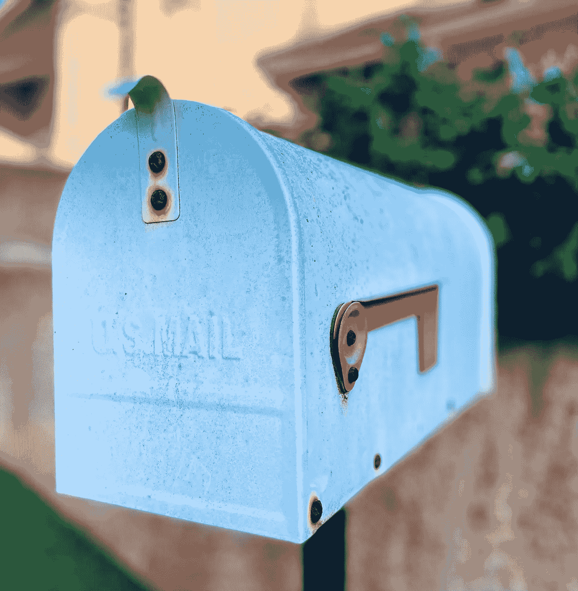
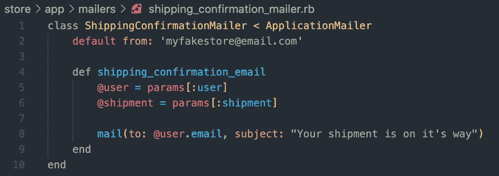
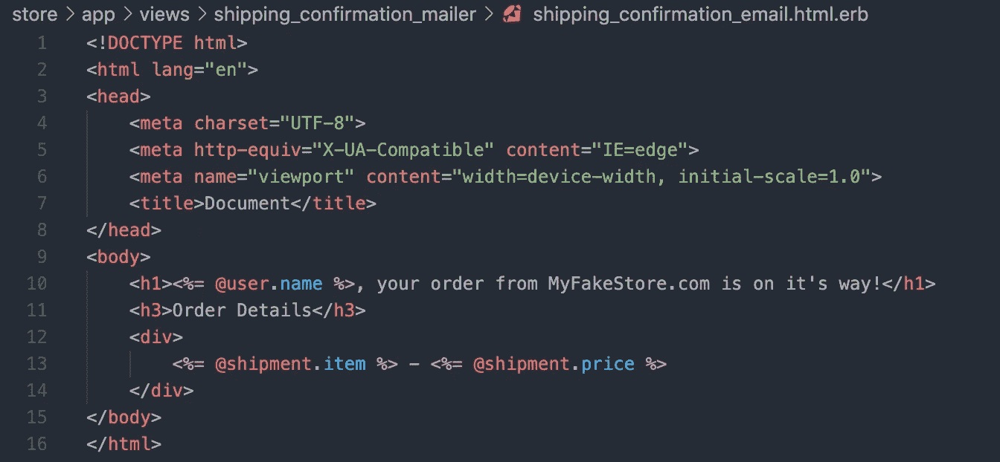
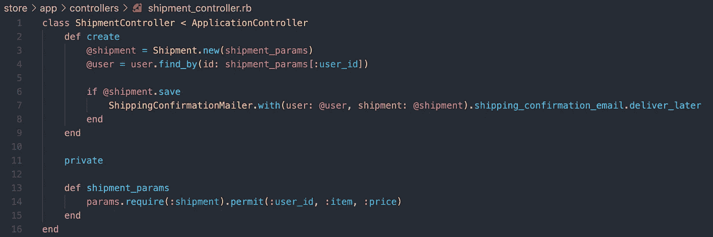

# 实现动作邮件程序— Ruby on Rails

> 原文：<https://medium.com/nerd-for-tech/implementing-action-mailer-ruby-on-rails-1766f59c6f?source=collection_archive---------0----------------------->



照片由[伊丽莎白·库什连科](https://unsplash.com/@kukla_13)经由[unsplash.com](https://unsplash.com/photos/zKPBvFUwUMs)拍摄

在现代网站和应用程序中，接收自动发送的电子邮件已经变得如此普遍，以至于以某种形式或方式收不到邮件都让人感觉怪怪的。这就是为什么作为开发人员，理解如何实现邮件程序很重要。幸运的是，对于任何正在学习 Ruby on Rails 的人，或者目前正在使用 Rails 的人来说，Action Mailer 可以提供帮助。

# 什么是动作邮件？

根据 [Ruby on Rails 指南](https://guides.rubyonrails.org/action_mailer_basics.html)，“动作邮件程序允许您使用邮件程序类和视图从应用程序发送电子邮件”。

在继续之前，如果你不熟悉**模型-视图-控制器**模式，花点时间阅读一下可能会有帮助，因为动作邮件程序依赖于相同的设计模式。

# 在 Rails 项目中实现动作邮件程序

第一步:用`rails g mailer < YourMailerName >`创建一个邮件

运行`rails g mailer`将创建以下文件:

```
% rails g mailer ShippingConfirmation
      create  app/mailers/shipping_confirmation_mailer.rb
      invoke  erb
      create    app/views/shipping_confirmation_mailer
      invoke  test_unit
      create    test/mailers/shipping_confirmation_mailer_test.rb
      create  test/mailers/previews/shipping_confirmation_mailer_preview.rb
```

第二步:在邮件中创建一个动作/方法



邮件程序操作预览。

邮件程序充当控制器，因此您在此电子邮件操作中定义的任何实例变量都可以在电子邮件视图中访问。这就是 MVC 模式发挥作用的地方！

不要忘记定义用于发送电子邮件的默认电子邮件地址。您可以在刚刚创建的邮件程序中定义它，也可以在 Rails 为我们创建的应用程序邮件程序中定义它，因为我们的邮件程序继承了应用程序邮件程序。如果你有多个邮件发送者，使用应用程序邮件存储默认邮件地址有助于保持我们的代码**干燥**。

第三步:定制邮件视图



电子邮件 HTML 预览。

为了简洁明了，我就不展示了，但是 Rails 也生成了一个`.text.erb`视图文件，如果您的用户不想接收 html 邮件，这是一个很好的做法。

第四步:从控制器调用邮件程序



控制器动作预览。

这一步非常简单。您想在邮件程序中使用的任何变量都可以作为参数传递给`.with`方法。我们想在邮件中使用的任何动作都可以在使用点符号的`.with`方法之后调用。

动作邮件程序允许现在或以后使用`.deliver_now`或`.deliver_later`发送电子邮件。后者利用了[活动作业](https://guides.rubyonrails.org/active_job_basics.html)，它允许在请求响应周期之外发送电子邮件，异步地考虑*，这可以让用户感觉你的应用程序更快。*

*第五步:配置 Rails 应用程序使用 Gmail*

```
**# config/environments/development.rb*config.action_mailer.delivery_method = :smtpconfig.action_mailer.default_url_options = { 
:host => '<your_url_here>', 
:protocol => 'http'
}config.action_mailer.smtp_settings = {
:address => 'smtp.gmail.com',
:port => 601,
:user_name => <gmail_username>,
:password => <gmail_password>,
:authentication => 'plain',
:enable_starttls_auto => true
}*
```

*如果您正在本地运行，您将使用 localhost:3000 或您正在运行的任何端口。*

*第六步:配置 Gmail 允许你的 Rails 应用程序*

*这最后一步可能有点棘手，所以我建议直接找到问题的根源。谷歌提供了一个很好的[演练](https://support.google.com/accounts/answer/185833)如何让第三方应用程序访问你的 gmail。要做到这一点，需要启用双因素身份认证并生成应用程序密码。*

*这就是让动作邮件程序在你的 Rails 应用程序中运行所需要的一切。还有许多其他可用的特性和选项，所以我鼓励您花些时间阅读开头链接的 Rails 指南。*

*与大多数 Rails 一样，Action Mailer 允许您在不编写太多代码的情况下完成大量工作。读完这篇文章后，我希望你现在已经知道实现这个基本特性的必要性。*

*欢迎在下面留下您对实施行动邮件的想法或您对我的任何反馈！*