# 实施电梯| Unity

> 原文：<https://medium.com/nerd-for-tech/implementing-an-elevator-unity-2e2f5ad0514f?source=collection_archive---------9----------------------->

## 统一指南

## 关于如何在 Unity 中实施电梯的快速指南

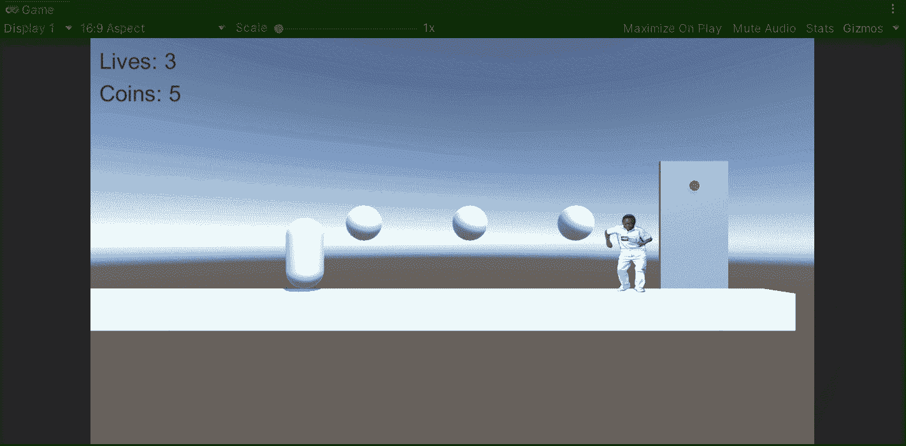

**目标**:在 Unity 平台游戏中实现一个电梯运送玩家。

在上一篇文章中，我介绍了[如何用 Unity](/nerd-for-tech/implementing-a-life-system-unity-e2a9c6b44db5) 创建一个生命系统。现在，是时候实现一个电梯，让玩家在我们的平台游戏中移动到一个新的区域。

# 现时水平

为了涵盖我们平台游戏的一些未来特性，我们将在 Unity 中使用这个场景。电梯之后要实现的功能是翻墙和推动物体来完成一个拼图。

那么，让我们来看看我们将用来实现电梯的组件。我们有一个电梯面板，上面有一个红色的游戏对象，代表当我们呼叫上面的电梯时会改变颜色的灯:

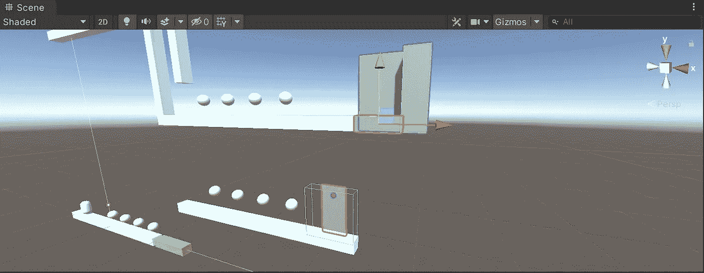

电梯包含普通碰撞器，电梯面板包含触发碰撞器。

# 实施电梯

为了实现电梯行为，我们将使用这个电梯，它由 3 个立方体组成，带有一个普通的盒子碰撞器(处理与玩家角色控制器的交互):

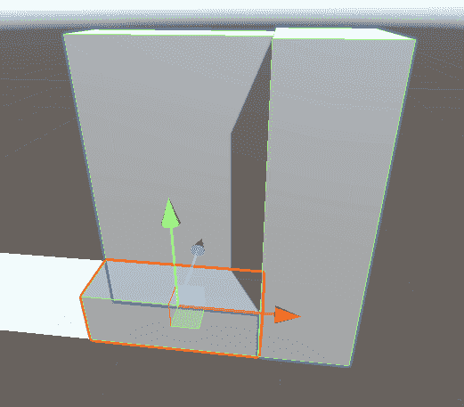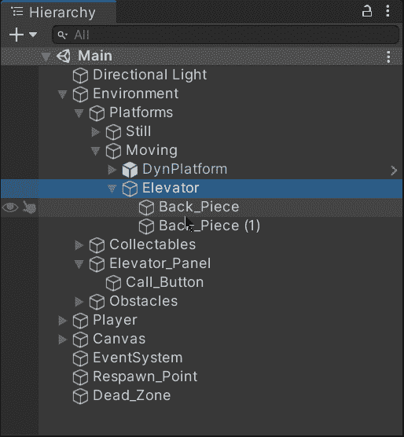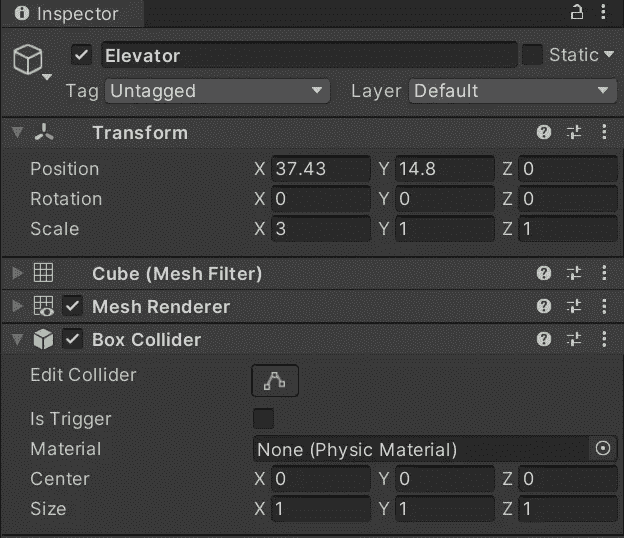

现在，为了定义定义电梯路径的路点，让我们创建下一个空游戏对象:

*   电梯集装箱

这个空的游戏对象将作为父对象来存储电梯和各自的路点，以定义要遵循的路径。

*   起源

这个空的游戏对象将定义路径的初始航路点。

*   目标

这个空的游戏对象将定义路径的最后一个路点。

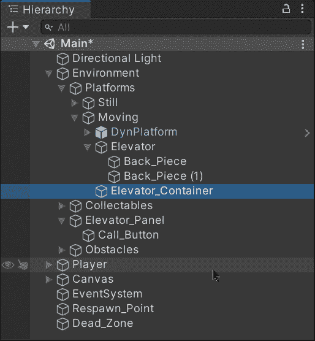

一旦游戏对象被创建，让我们修改每个路点各自的位置，以确保它们是我们希望电梯停止的地方:

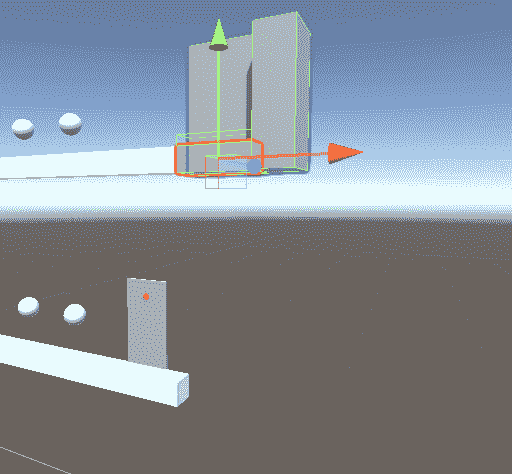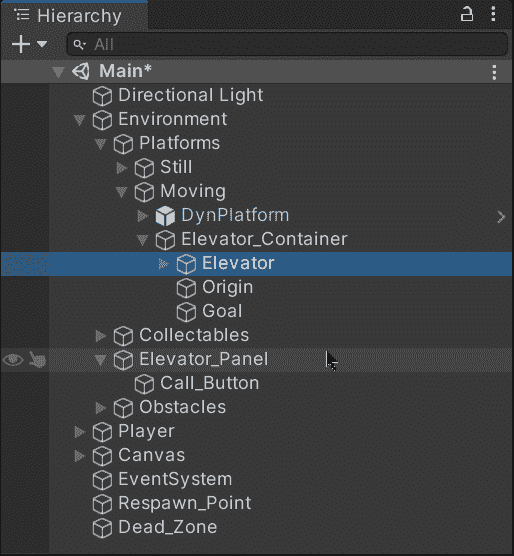

然后，让我们创建一个新脚本，并将其附加到电梯上:

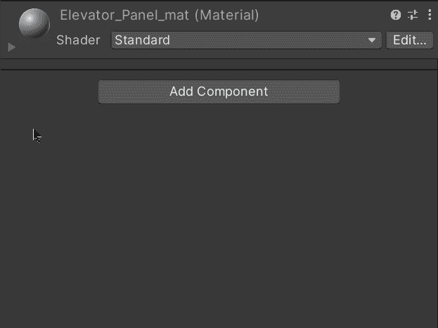

## 实施运动

创建完成后，让我们打开脚本并创建下一个变量来处理电梯行为:

*   光

这个变量将存储一个对电梯面板红灯的网格渲染器组件的引用，以便我们可以根据电梯的移动来改变它的颜色。

*   速度

这个变量将存储电梯运行的速度值。

*   起源和目标

这个变量将存储一个对定义电梯路径的空游戏对象的变换组件的引用。

*   论起源

这个变量将指示电梯是在起点还是在终点。目前，它被默认设置为假，因为电梯是在目标(上图)。

*   移动的

这个变量将定义电梯是否应该向一个目标移动。

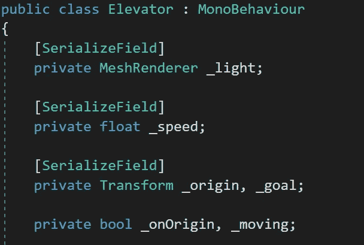

现在，为了处理移动(也避免玩家在电梯上的怪异行为)，让我们使用 **FixedUpdate** 方法。在这种方法中，我们将:

*   检查电梯是否应该移动
*   →检查电梯是否在原点
*   →→检查升降机是否已经到达相应物镜的位置
*   →→→如果是这样，让我们停止运动，并指出电梯是否在原点
*   →→→如果这是错误的，让我们将电梯移向目标

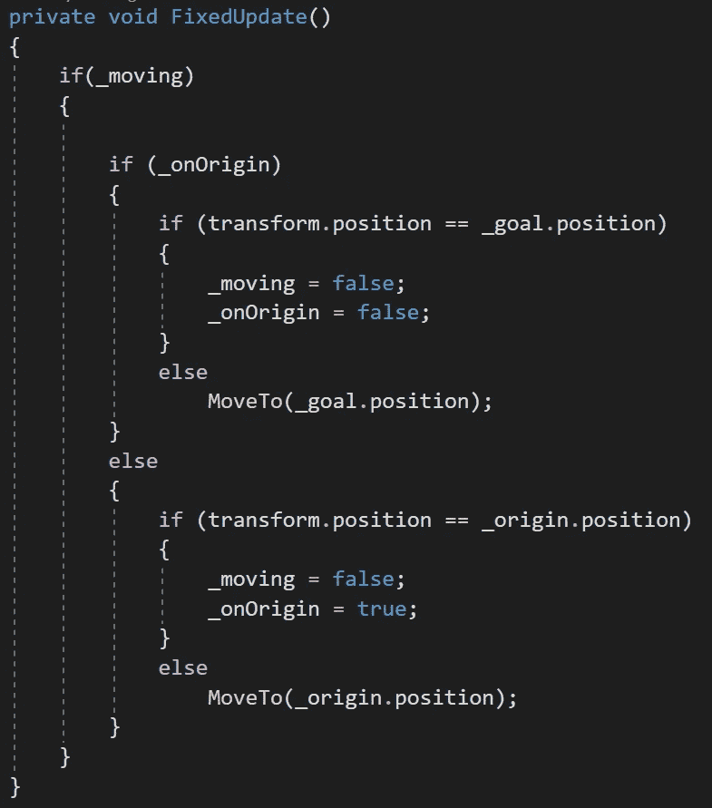

**MoveTo** 方法接收一个正在 **Vector3 中使用的 **Vector3** 参数**值。移动到**方法定义升降机的新位置:**

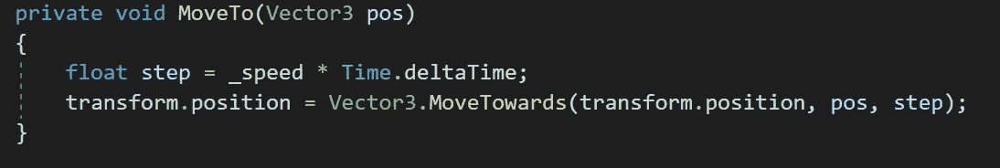

最后，为了连接电梯面板和电梯，让我们创建一个新的公共方法，如果电梯已经停止并且不在原点，该方法将告诉电梯移动并且灯的颜色改变:

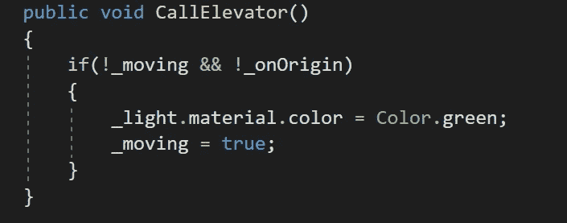

## 平稳上升

现在，为了平稳地提升播放器，让我们给电梯附加一个新的碰撞器(但这次让我们启用 Is **触发器**属性),它将与播放器合并:

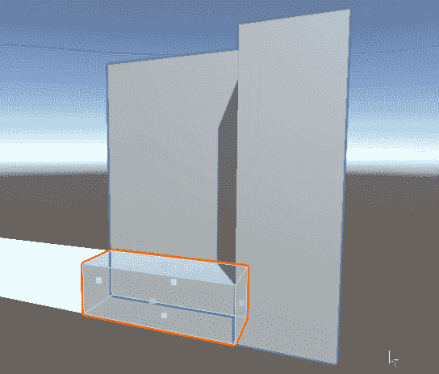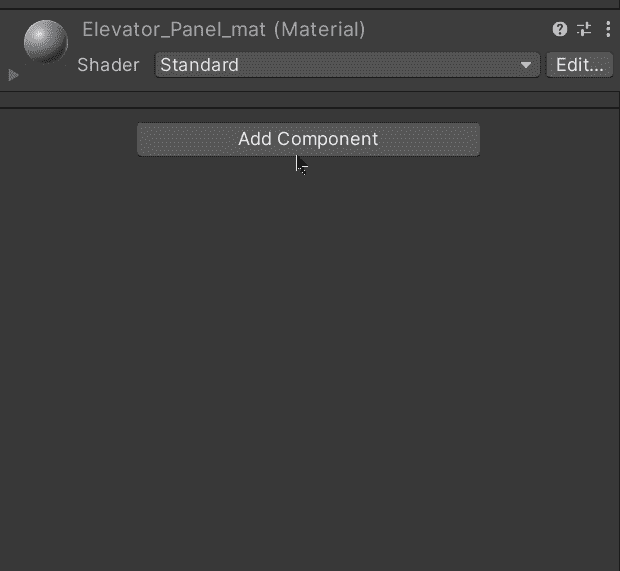

然后，为了处理相应的触发器，让我们使用 **OnTriggerEnter** 方法来完成:

*   检查**玩家**标签是否被识别
*   →检查电梯是否停止，如果停止，则移动电梯。
*   检查电梯是否在原点
*   →如果是这样，将灯光颜色改为红色
*   →如果这是错误的，将灯光颜色改为绿色
*   将电梯设置为玩家的父级，这样电梯就可以平稳地跟着它移动。

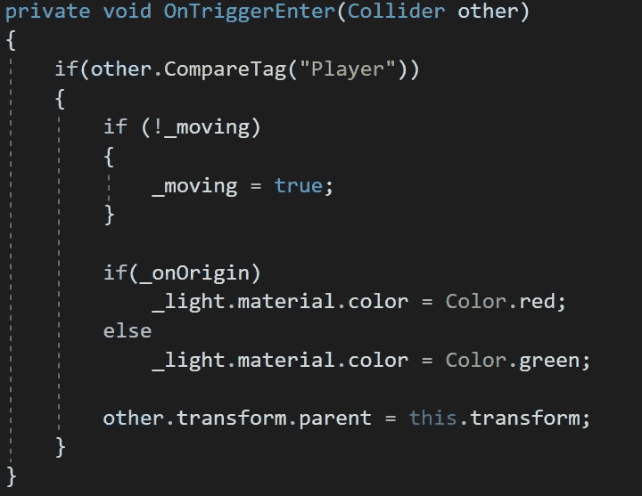

最后，让我们使用 **OnTriggerExit** 方法在电梯退出各自的碰撞器时将玩家从电梯中分离出来:

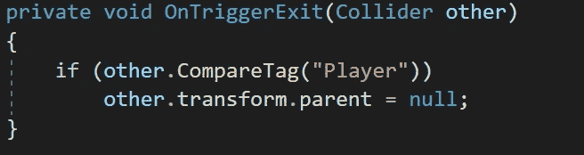

现在，让我们通过检查器修改各自的值，以便电梯脚本按预期工作:

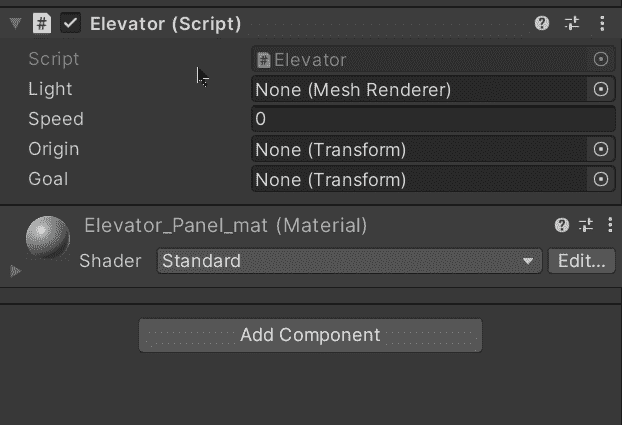

# 呼叫电梯

接下来，为了能够通过使用电梯面板来调用电梯，我们将使用一个启用了 **Is Trigger** 属性的箱式碰撞器:

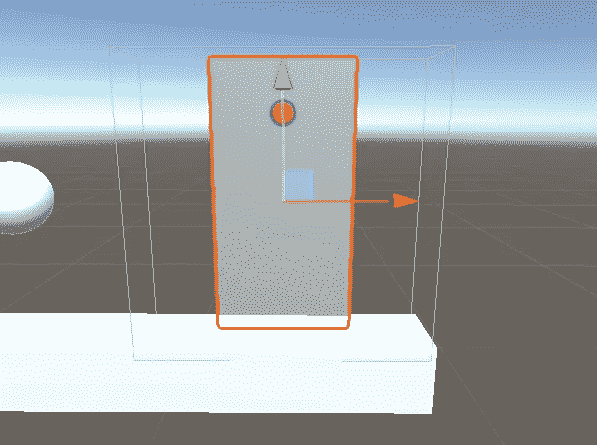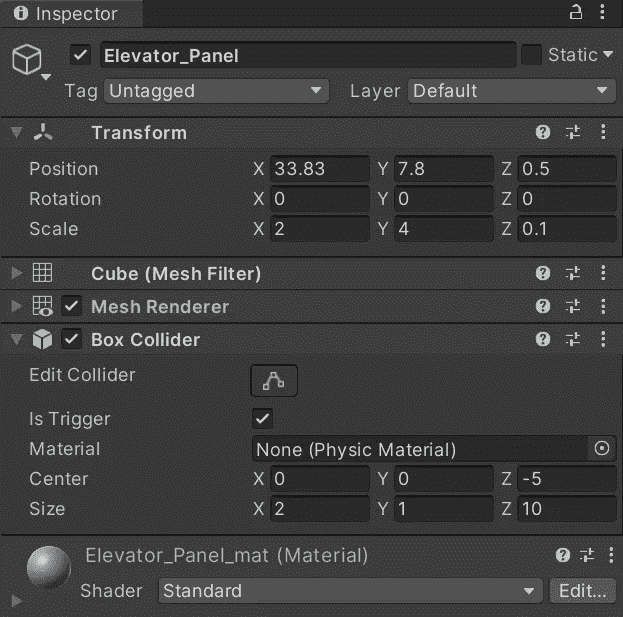

现在，让我们为电梯面板创建一个新脚本:

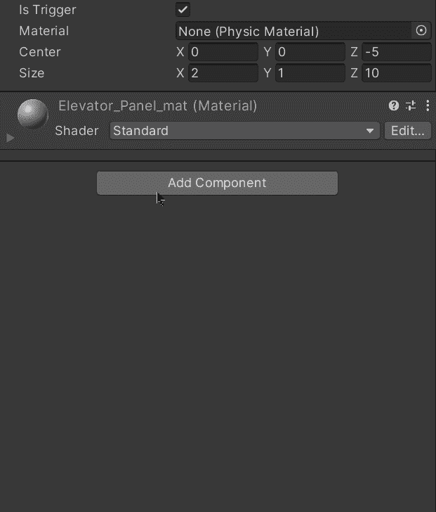

创建后，让我们创建下一个变量来处理它的行为:

*   需要硬币

这个变量将存储决定玩家需要多少硬币才能呼叫电梯的值。

*   球员裁判

这个变量将存储一个对玩家的引用，以便检查它收集了多少硬币。

*   在射程内

这个变量将决定玩家是否在能够呼叫电梯的特定范围内。

*   电梯

这个变量将存储一个对电梯的引用，以便我们能够使用我们在电梯脚本中创建的公共方法来调用它。

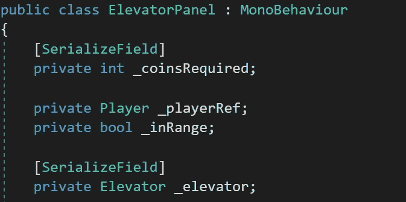

然后，让我们使用 **OnTriggerEnter** 方法来获得**玩家**参考，并指示该玩家在呼叫电梯的范围内:

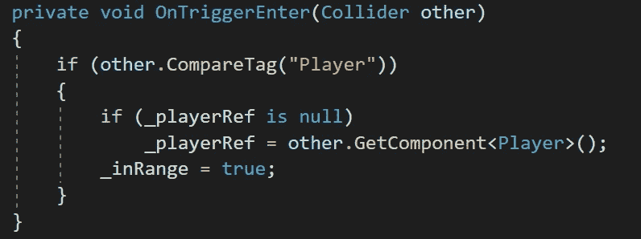

同样，让我们使用 **OnTriggerExit** 方法来指示玩家不在范围内:

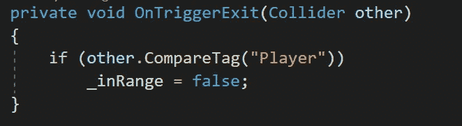

现在，使用**更新**方法，让我们检查玩家是否在范围内，以及 E 键是否被按下。如果是这种情况，让我们检查玩家是否有所需的硬币，以便使用电梯类中的公共方法调用电梯:

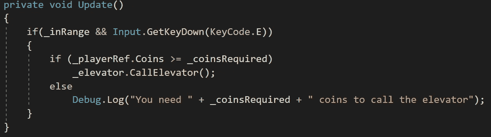

最后，让我们通过检查器修改各自的值，以便我们的脚本按预期工作:

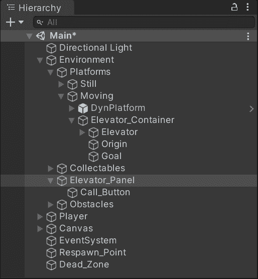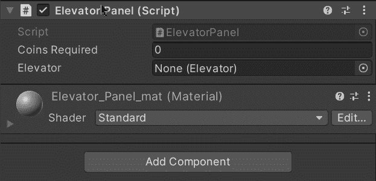

如果我们在 Unity 中运行游戏，我们会看到电梯和电梯面板按预期工作:

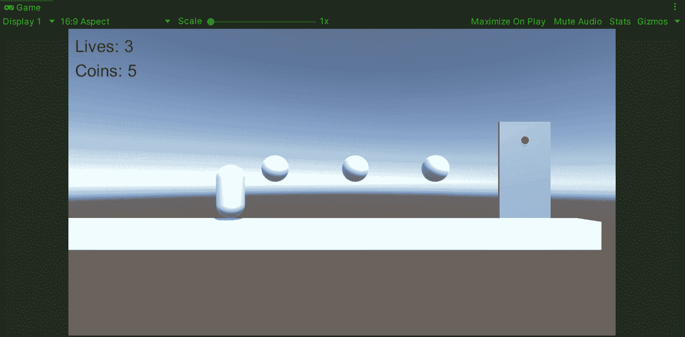

就这样，我们用 Unity 为我们的平台游戏实现了一个电梯！:d .我会在下一篇文章中看到你，在那里我将展示如何用 Unity 实现一个墙跳。

> *如果你想了解我更多，欢迎登陆*[***LinkedIn***](https://www.linkedin.com/in/fas444/)**或访问我的* [***网站***](http://fernandoalcasan.com/) *:D**