# 为近战战斗实现击中目标检测| Unity

> 原文：<https://medium.com/nerd-for-tech/implementing-hitbox-detection-for-melee-combat-unity-bc1912178e63?source=collection_archive---------2----------------------->

## 统一指南

## 关于如何在 Unity 的近战中实现一个识别生命盒的系统的快速指南

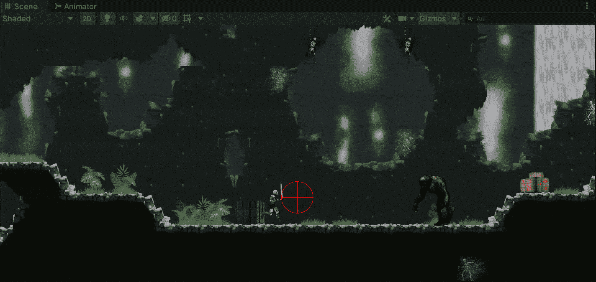

目标:在 Unity 的 2D 游戏中，实现一个系统来检测近战中易损坏的游戏对象的生命值。

在上一篇文章中，我介绍了[如何在 Unity](https://fas444.medium.com/idamageable-interface-unity-45bf961d141) 中实现一个 IDamageable 接口。现在，是时候实现一个系统来识别近战中易受伤害的游戏对象的生命值，以便对它们造成伤害。

如果你还没有看到最后一个帖子，请花点时间来看看，因为它是 hitbox 检测机制的一个重要组成部分:

 [## I 可成像界面| Unity

### 关于如何在 Unity 中实现 IDamageable 接口的快速指南

fas444.medium.com](https://fas444.medium.com/idamageable-interface-unity-45bf961d141) 

# 进攻时机

为了开始开发我们的 hitbox 检测系统，让我们在我们的玩家中创建一个新的游戏对象，它将代表剑攻击的起源:

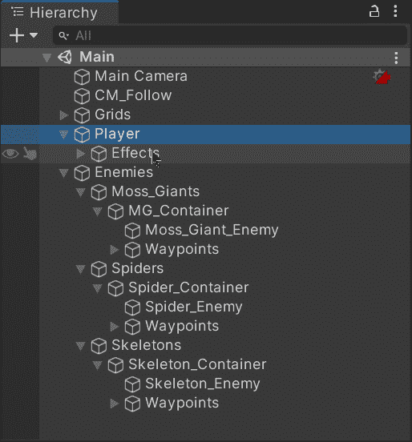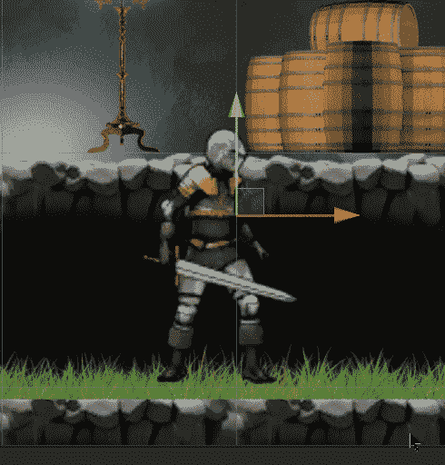

如果我们播放攻击动画，我们会看到该点位于攻击的中心:

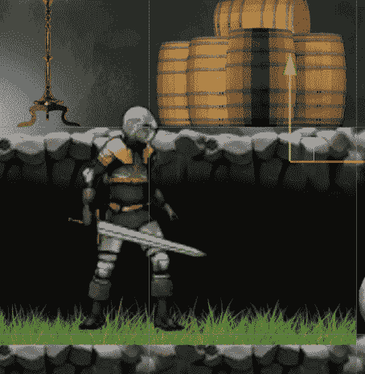

# 敌人层

然后，为了在识别点击框时保持有序和简单，让我们为游戏中的敌人创建一个新层:

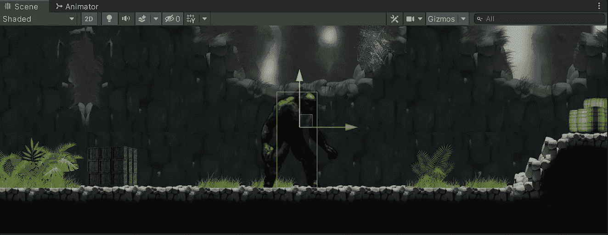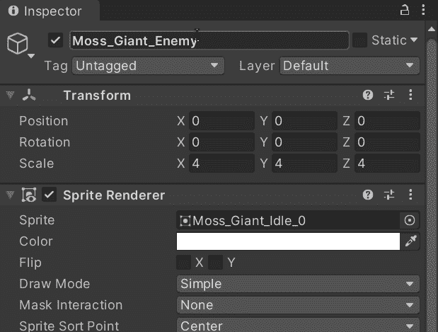

# 攻击范围

接下来，为了确定我们攻击的范围，让我们打开玩家脚本并创建下一个变量:

*   进攻时机

该变量将存储一个对攻击源转换的引用，以便了解每个攻击的位置。

*   攻击范围

这个变量将决定我们从攻击起点开始的攻击范围。

*   攻击面具

这个变量将指示在执行攻击时我们将在哪一层识别碰撞体。

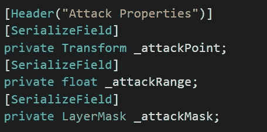

如果我们想要可视化攻击范围，我们可以利用**小发明中的变量。在 **OnDrawGizmos** 方法处绘制 WireSphere** 方法:

一旦我们通过检查器为变量分配了各自的值，我们就能够在场景视图中可视化攻击范围:

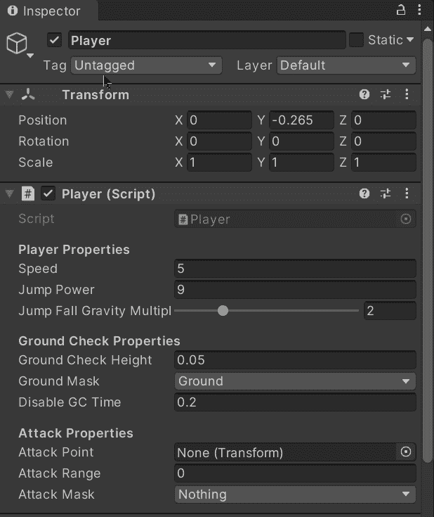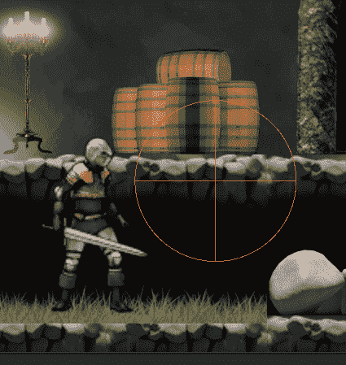

这样，当我们执行攻击时，我们攻击范围内的所有东西都会受到影响:

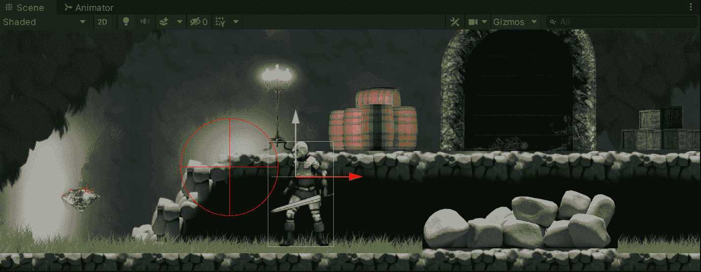

# 识别 hitboxes

现在，为了识别我们攻击范围内的生命值，让我们在玩家脚本中创建一个新方法，我们将:

*   使用 **Physics2D 储存攻击范围内的所有对撞机。OverlapCircleAll** 方法，带有各自的参数(攻击来源、范围和层掩码)。
*   搜索每个碰撞器中的**id 可损坏的**组件，以了解它是否可损坏。
*   如果是这种情况，从组件调用**损害**方法来应用各自的损害。

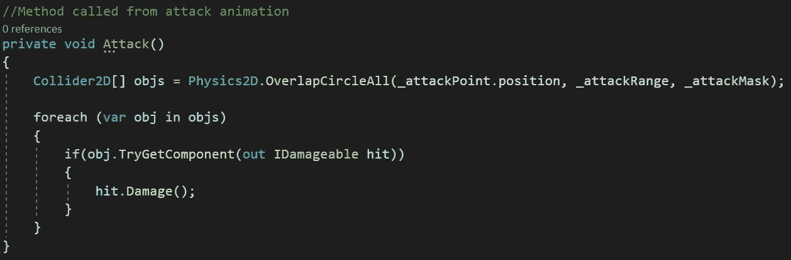

如果我们看一下**伤害**方法(由于**idamagable**接口而在敌人脚本中实现)我们会看到它从生命值中减去一个单位并触发相应的动画:

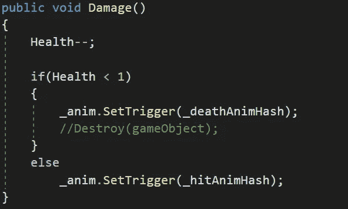

最后，为了执行我们的**攻击**方法，让我们打开动画窗口，在攻击动画中剑攻击的确切帧处通过一个**动画事件**调用它:

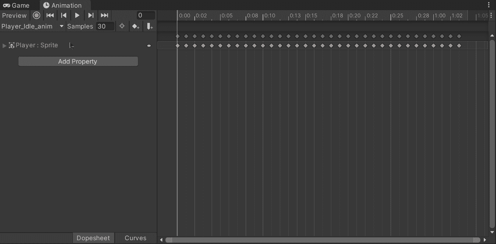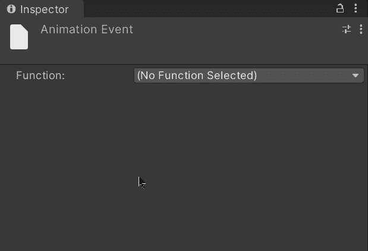

如果我们在 Unity 中运行游戏，我们将能够看到攻击以预期的结果执行:

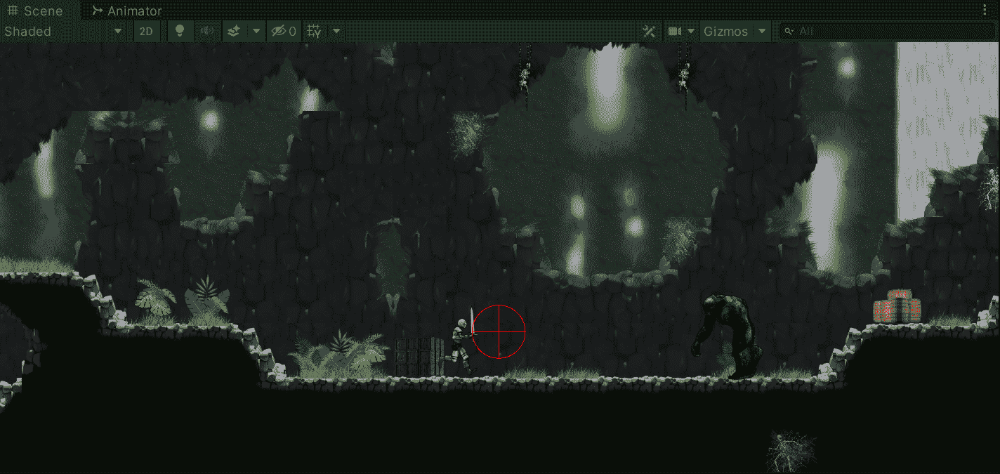

就这样，我们在 Unity 中实现了一个在近战中检测生命盒的系统！我会在下一篇文章中看到你，在那里我会展示如何在 Unity 中创建一个战利品系统。

> *如果你想了解我更多，欢迎登陆*[***LinkedIn***](https://www.linkedin.com/in/fas444/)**或访问我的* [***网站***](http://fernandoalcasan.com/) *:D**