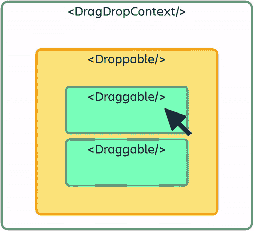

# 使用 react-beautiful-dnd 在 reactJS 中实现嵌套拖放

> 原文：<https://medium.com/nerd-for-tech/implementing-nested-drag-and-drop-in-reactjs-using-react-beautiful-dnd-878ce8ad70be?source=collection_archive---------1----------------------->

图片来自 freecodecamp.org

希望在一个已经是 dnd 对象的元素中实现一个**拖放**(以下简称 **dnd** )功能？如果你正在使用 **react-beautiful-dnd** (以下简称' **rbd 【T7 ')，你已经知道它不支持嵌套 dnd。这意味着什么，让我们来看看。**

我将首先从 rbd 库如何工作以及如何使用它来实现嵌套 dnd 开始。你可以在他们的 github 页面-[**https://www.npmjs.com/package/react-beautiful-dnd**](https://www.npmjs.com/package/react-beautiful-dnd)查看更详细的工作和教程

# rbd 的基础:

react-beautiful-dnd 是一个由创建 JIRA 的人创建的库，非常容易集成和实现到你的 reactJs 应用中。

rbd 库主要工作在三个元素上:

1.  dragdropcontext:-dropbables 和 draggables 的包装器。
2.  **可投放:——可投放拖拽体的区域。**
3.  可拖动的:可以拖动的元素。

其中，dragdropcontext 由一个或多个可拖放对象组成，可拖放对象可以有一个或多个可拖放对象。

图片来自[https://www.npmjs.com/package/react-beautiful-dnd](https://www.npmjs.com/package/react-beautiful-dnd)

在 reactJs 项目中安装并导入 rbd 库之后，您创建了一个 **dragdropcontext 元素**，该元素将接受一个**函数**作为 **onDragEnd** 属性的值，当拖放任何可拖动的对象时，该属性将被调用。

在这个上下文元素中，您创建了一个**drop able 元素**并提供了一个**drop ableid**属性，该属性可用于在上面的 onDragEnd 函数中创建逻辑，并找到可拖动的对象是从哪里拾取的或者是从哪里被放下的。您可以有多个邻居可丢弃。

现在，在这个 droppable 中，您迭代一个您希望被拖动的元素列表，并使用属性 **key、draggableId** 和 **index** 创建 **draggable 元素**，这些属性可用于在上面的 onDragEnd 函数中对元素列表进行重新排序。

上面的 droppable 和 draggables 也需要一个 div，里面有一些属性，如 **ref** 和 **style** ，你可以从教程/示例中看看提供什么值。

**运行你的 reactJs 应用**，你的应用就会有一个干净漂亮的 dnd 功能。

# 嵌套免打扰:

现在，如果你的应用程序中已经有了上述设置，并试图在一个可拖动的应用程序中添加可拖放的和可拖动的应用程序，即。试图在你的应用程序中实现嵌套的 dnd，当拖动元素并试图放下时，你可能会遇到**问题和小故障。你可以按照下面的方法让它无缝地工作。**

rbd 库不支持嵌套 dnd，这意味着你可以**实现嵌套 dnd，但是它有一些限制。**

我们不能在另一个 dragdropcontext 中有一个 dragdropcontext，所以这意味着我们**只有一个 onDragEnd 函数**来处理外部 draggable 和内部 draggable 的删除。

此外，当你拖动内部 draggables 时，它会混淆其直接可拖放容器和父可拖放容器，导致故障和功能无法工作。

为了解决这个问题，我们使用了 droppable 元素的 **"type"** 属性。为父可拖放对象提供一个不同的**值，为内部可拖放对象提供一个不同的值，然后内部可拖动对象将只在内部可拖放对象中进行拖放。如果您想让**成为一个可拖放的对象，只放入它自己的可拖放对象**，而不放入邻居的可拖放对象，您可以为 **"type"** 属性赋予两个可拖放对象不同的值。**

*注意:所有可丢弃的可丢弃 id 应该不同。*

在 onDragEnd 函数中，您可以只检查**类型**的值，并为外部或内部删除编写**单独的重新排序逻辑**。

也就是说，您应该在 reactJs 应用程序中拥有一个正常运行的**嵌套拖放功能**。

# 谢谢大家！