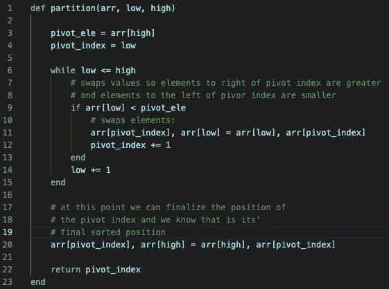
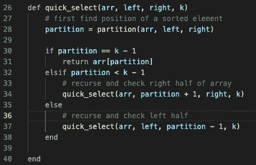

# 在 Ruby 中实现快速选择

> 原文：<https://medium.com/nerd-for-tech/implementing-quick-select-in-ruby-df7f3f4c7ab?source=collection_archive---------11----------------------->

在这篇博客中，我们将介绍如何用 Ruby 编写快速选择算法。这种技术用于在一个**未排序的**数组中寻找第 k 个最小的元素，平均运行时间复杂度为 O(n)。快速选择使用与流行的快速排序算法相似的方法。这是一种分而治之的方法，要搜索的数组被分成越来越小的块，直到找到想要的结果。

乍一看，找到数组的第 k 个最小元素很简单。只需对数组排序并选取索引[k - 1]处的元素。但是，如果我们这样做，只会和我们的排序方法一样快，大多数情况下比 O(n)慢。因此，使用快速选择将确保我们在解决问题时效率最高。

首先要做的是写一个分区方法。这个方法只有一个目的:返回数组中已排序元素的索引。我们传入一个数组以及它的一部分，通过一个高低索引来查看。

分离法

该方法遍历数组的选定部分，并根据元素与我们选择的 pivot 元素的关系交换元素，在本例中，我们选择了与高索引相对应的元素。这个过程的奇妙解释可以在[这里](https://youtu.be/7h1s2SojIRw?t=240)找到。

现在我们已经有了查找未排序数组的排序索引的分区算法，我们需要编写一个方法来查找我们正在讨论的元素！

传递给这个方法的参数是正在讨论的数组，左索引，右索引，当然还有 k，它告诉我们返回数组的第 k 个最小元素。当我们第一次调用这个方法时，左右索引将分别为 0，数组长度减 1。随着方法递归调用自身，左右之间的距离每次都会缩小一半。

以下是步骤:

1.  用分区方法查找排序索引
2.  检查该索引是否是第 k 个最小元素(数组[k - 1])，如果是，则返回该元素
3.  如果索引小于 k -1，则搜索数组的右半部分
4.  如果索引大于 k -1，则搜索数组的左半部分

快速选择技术

这就是我们，到最后我们会找到我们要找的元素。

我喜欢这个算法，因为它不需要对数组进行排序。我们所需要做的就是不断地找到某些元素在它们正确排序位置上的索引，我们将最终实现我们的目标。这使得 Quick Select 成为搜索特定元素的绝佳选择。