# 实施安全摄像头| Unity

> 原文：<https://medium.com/nerd-for-tech/implementing-security-cameras-unity-691fc591b67b?source=collection_archive---------25----------------------->

## 统一指南

## 关于如何在 Unity 中实施安全摄像头的快速指南

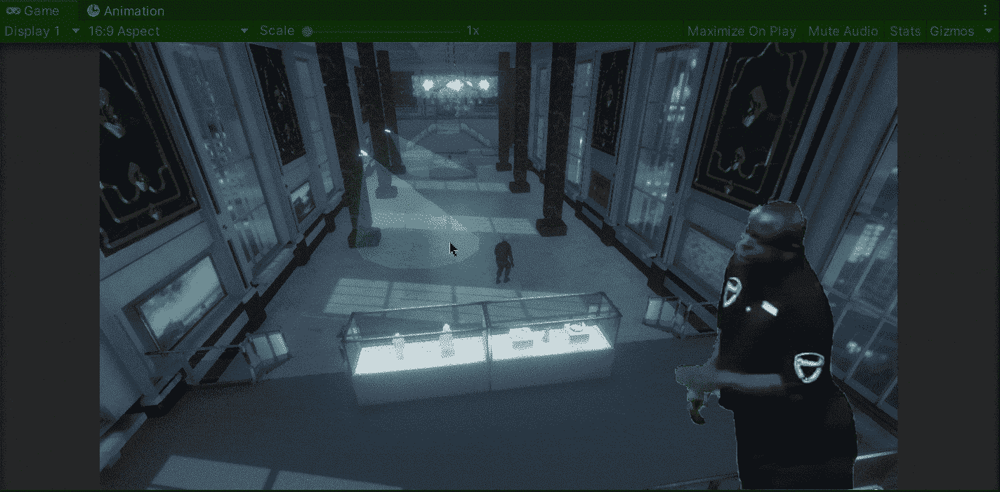

**目标**:安装安全摄像头以识别 Unity 中的玩家。

在上一篇文章中，我介绍了[如何用硬币愚弄人工智能](/nerd-for-tech/distracting-the-ai-with-a-coin-unity-1cfb4e83f0fa)。现在，是时候实施一些安全摄像头，如果玩家在 Unity 中进入他们的视野范围，这些摄像头将识别玩家。

# 当前场景

我们在 Unity 的当前场景中有 2 个摄像机。摄像机的目的是检测运动员是否通过摄像机发出的绿光:

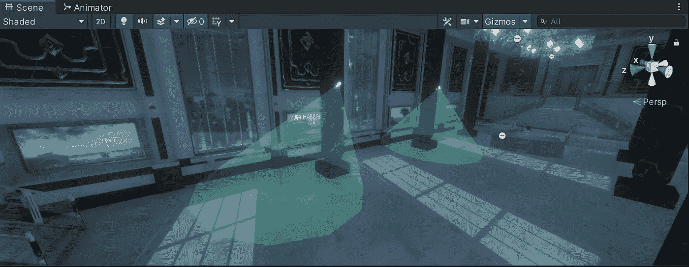

每台摄像机都用一个圆锥形的碰撞器计数:

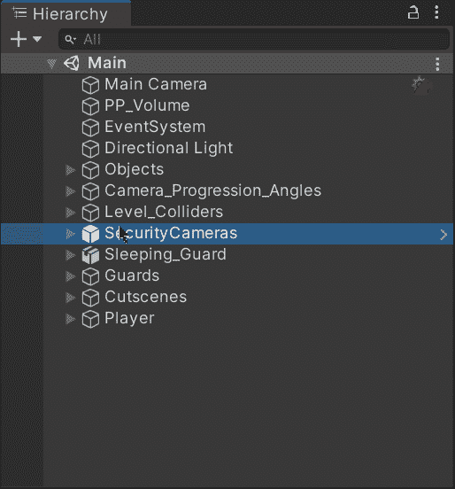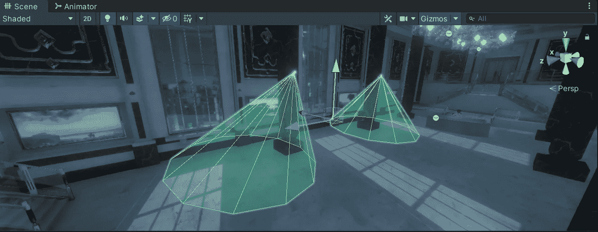

# 为摄像机制作动画

首先，让我们通过创建一个新的 Animator 控制器来制作摄像机动画，并在选择摄像机游戏对象后使用动画窗口进行剪辑:

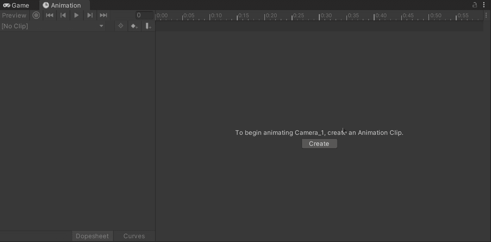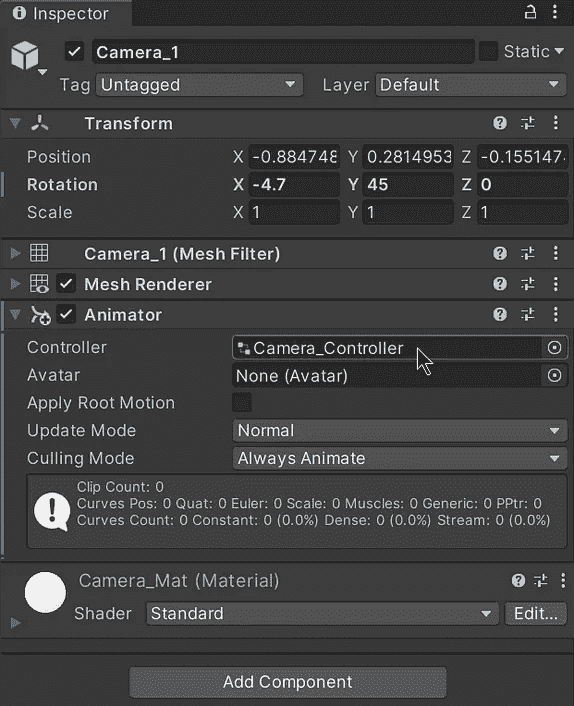

> 注意:要打开动画窗口，您可以在 Unity 编辑器中点击**窗口>动画>动画** 。

然后，让我们记录各自的初始和结束关键帧，以在动画剪辑期间更改相机旋转:

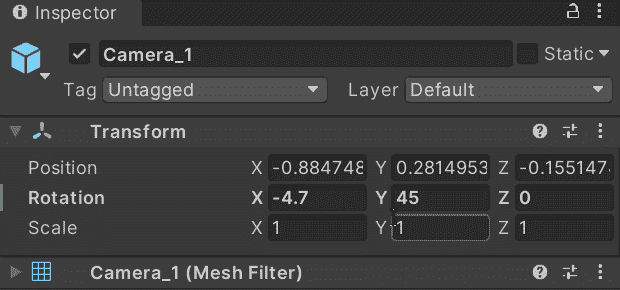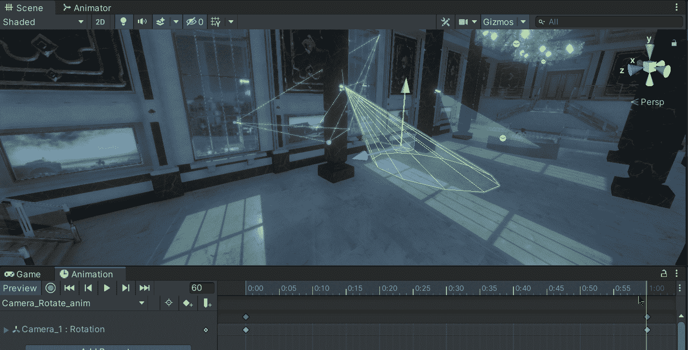

这样我们就可以在每次动画运行时旋转 90 度。

接下来，如果我们双击动画控制器，我们将打开动画窗口。在 Animator 窗口中，我们将看到摄像机的动画是默认执行状态:

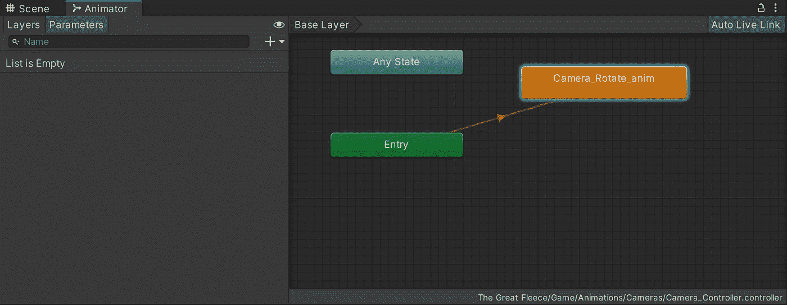

如果我们想让相机从 45 度到-45 度来回移动，我们可以选择:

*   复制并粘贴默认状态。
*   彼此进行新的过渡。

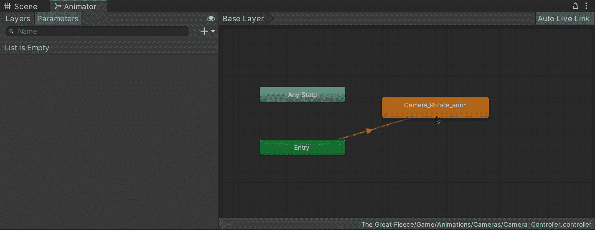

*   选择每个州。
*   将动画状态的速度变得更慢。
*   改变后退速度的符号。

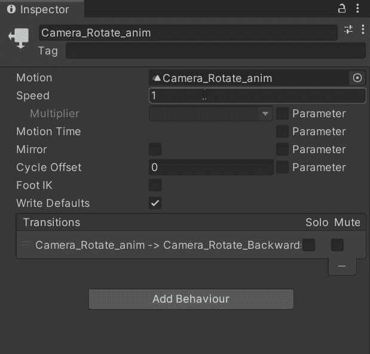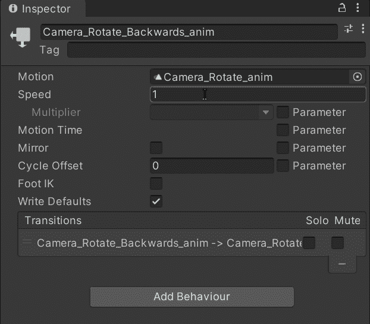

这样我们就能注意到动画向前和向后移动:

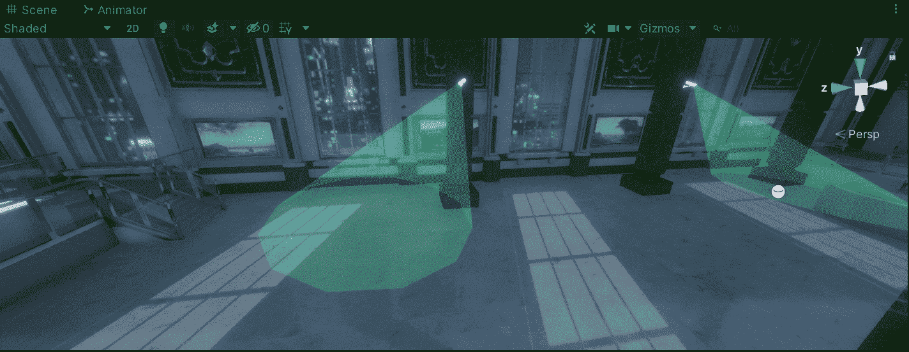

要使两个摄像机反向动画，我们只需复制另一个摄像机的动画控制器，并将默认/初始状态设置为反向动画。

# 识别玩家

现在，为了用相机识别玩家，让我们用碰撞器选择各自的游戏对象:

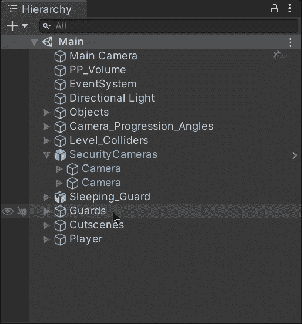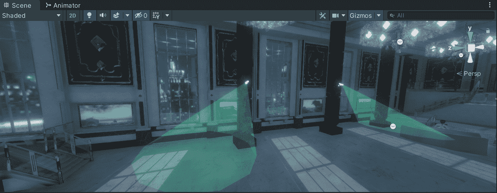

然后，我们附上:

*   一个刚体能够识别与玩家碰撞器的碰撞。别忘了关闭重力。
*   处理监控摄像头的新脚本。

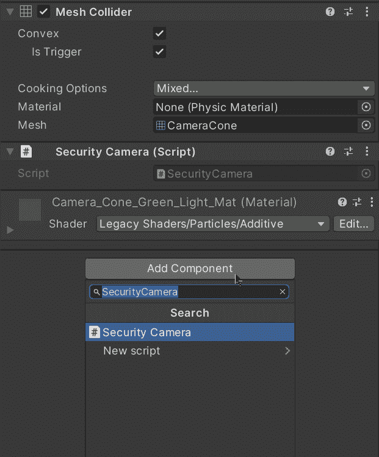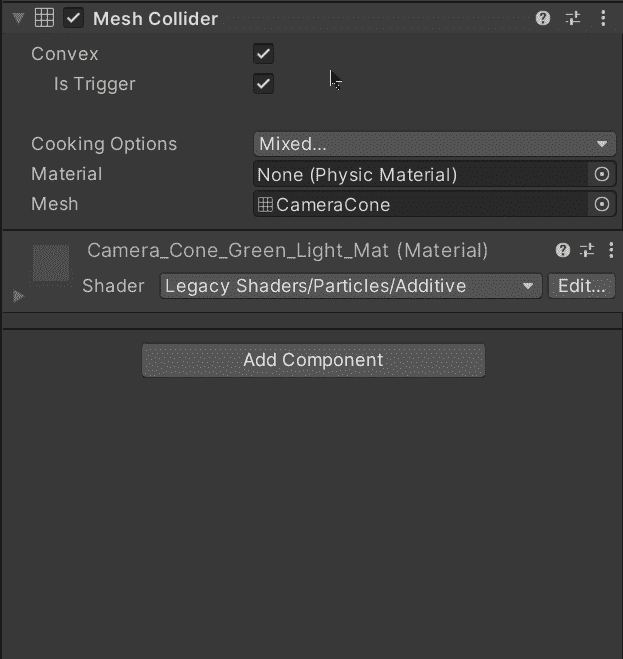

最后，让我们打开新脚本并使用 **OnTriggerEnter** 方法来识别与其他碰撞器的碰撞，并且，为了识别玩家，让我们使用作为参数接收的碰撞器的 **CompareTag** 方法来检查它是否被标记为玩家:

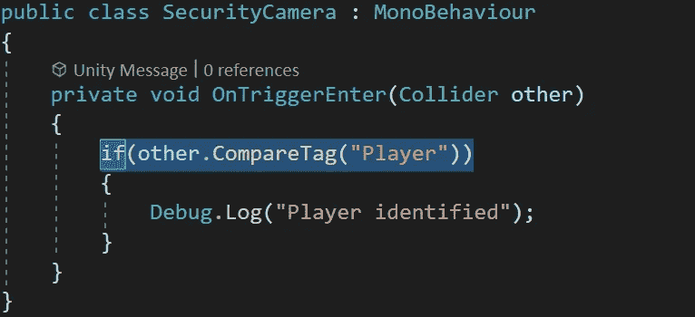

如果我们用 Unity 运行游戏，当玩家与摄像头发出的绿光发生碰撞时，我们将能够在控制台窗口中看到相应的消息:

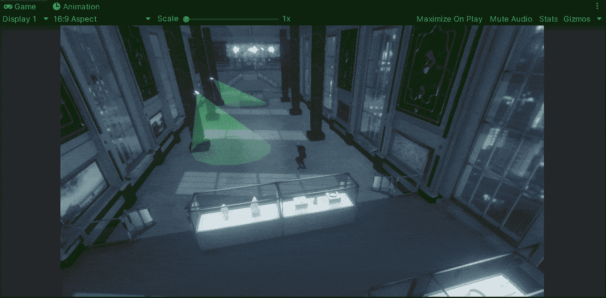

就这样，我们用 Unity 实现了安全摄像头！:d .我将在下一篇文章中看到你，在那里我将展示如何在玩 Unity 时显示一个完成的过场动画。

> *如果你想更多地了解我，欢迎登陆*[***LinkedIn***](https://www.linkedin.com/in/fas444/)**或访问我的* [***网站***](http://fernandoalcasan.com/) *:D**