# C# —实现一些 C#接口和扩展方法

> 原文：<https://medium.com/nerd-for-tech/implementing-some-c-interfaces-and-extension-methods-f8093f1e29fd?source=collection_archive---------3----------------------->

我只想写一篇文章，介绍一些如何使用扩展方法的例子和一些最常见的 C#接口。

哎呀:我想在一些图片上，我的方法是错误的。请记住这一点，因为它不符合标准。

# 扩展方法

使用扩展方法，您可以向 C#中的任何类型/类添加方法。例如，在下面，我们向字符串类型添加了一个扩展方法。然后我们可以从任何字符串调用该方法。

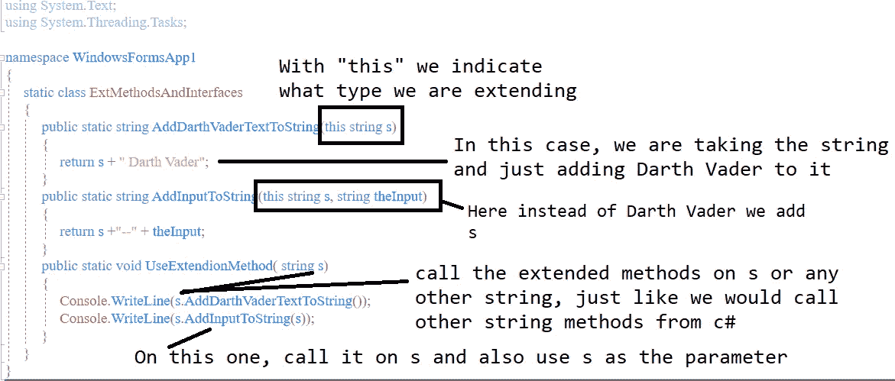

# INotifyPropertyChanged

当您的属性需要在更改时触发事件(已更改)时，请实现此接口。在属性更改时触发事件，并让您想要的任何订阅者订阅它，以便您可以在通知到来时做一些事情。

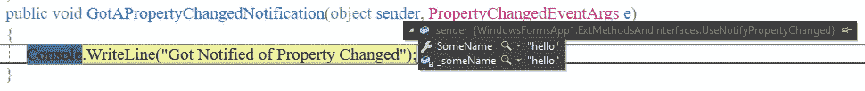

# I 可比

当您想要提供一个方法来比较您的类时，请实现它。


一旦有了上面的内容，您就可以对比较类型的对象列表进行排序，它将根据 CompareTo:

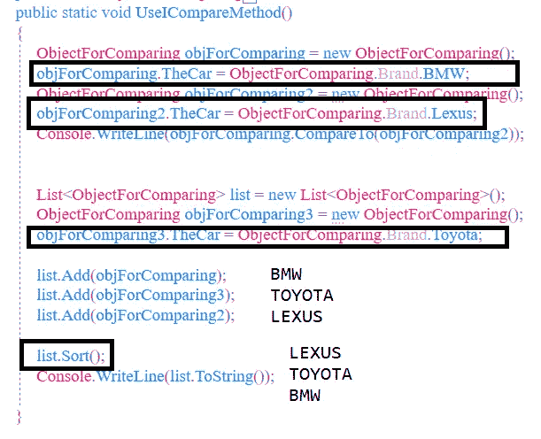

# 我比较

IComparer 还用于比较两个对象，并可用于对自定义类型进行排序。当你能控制正在排序的类时，IComparable 将帮助你进行排序，所以你可以用你喜欢的方式进行比较。然而，有可能您有了用于比较对象的 objects，但是您并不希望该类中的 CompareTo 用于您的排序，现在您希望它们以某种其他方式排序。

我将向该类添加一些其他属性，然后您将使用这些其他属性对您的对象进行排序，而不是使用数组{Lexus，Toyota，BMW，Ford}中的索引。

在上面我们已经有的 ObjectForComparing 类中，只需添加这个新属性:

```
public int ThePrice { get; set; }
```

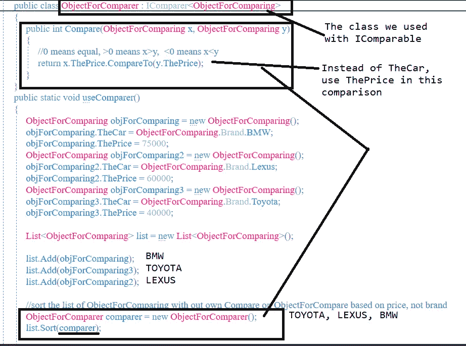

# 可等式化

你知道你可以用 equals 来比较字符串，你希望你的类也有类似的东西。

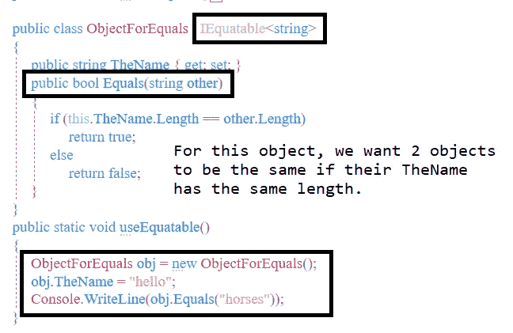

# IEqualityComparer

类似于 IEquatable，但是您在另一个类中创建它，该方法将接受两个参数进行比较。

我的例子有点傻，但我只是展示了如何使用它，以及你需要的任何比较。

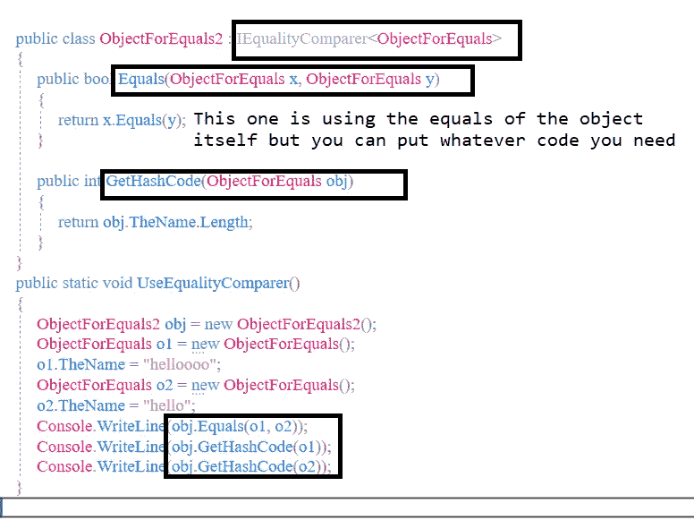

上面的代码是可以的，但是如果你想让 GetHashCode 按照 Equals 的方式工作，比如说你不会在字典中得到重复的键，它应该看起来更像这样:

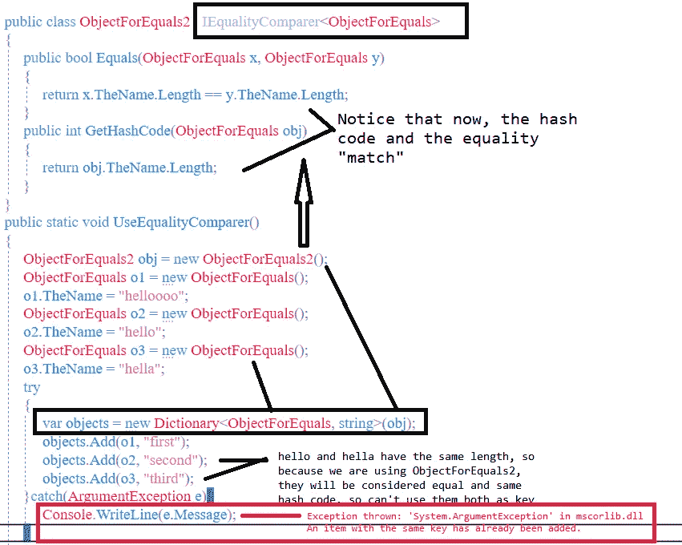

# IEnumerable

当您希望能够迭代自定义集合时，您需要添加此选项。

我将在列表中使用这种类型的对象。

```
class MyObject
{
   public string TheColor { get; set; }
   public int TheTone { get; set; }
}
```

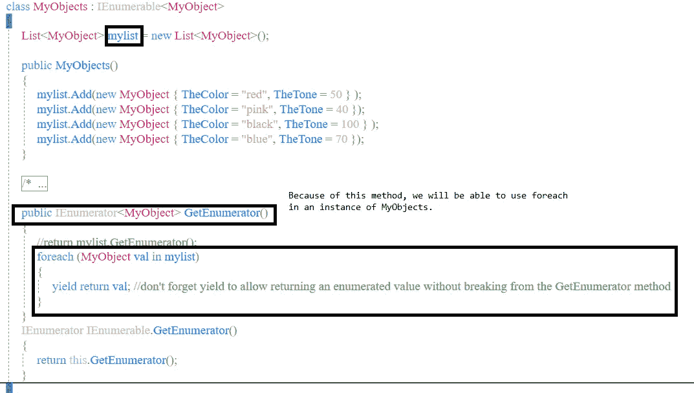

在上面的代码中，也可以使用注释掉的部分，而不是 foreach (return myList。get enumerator()；)

要使用它:

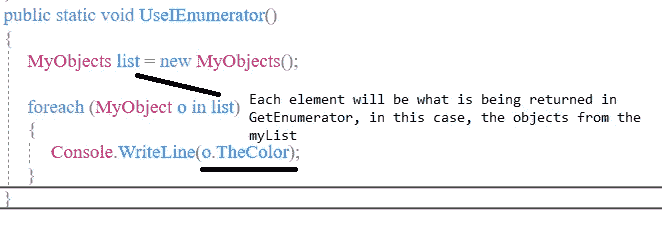

我们也可以这样做，而不是让构造函数将对象添加到列表中，在这种情况下，我们将把它们添加到列表中。

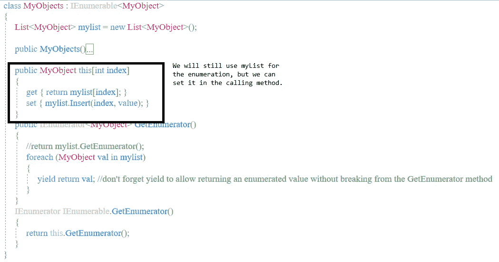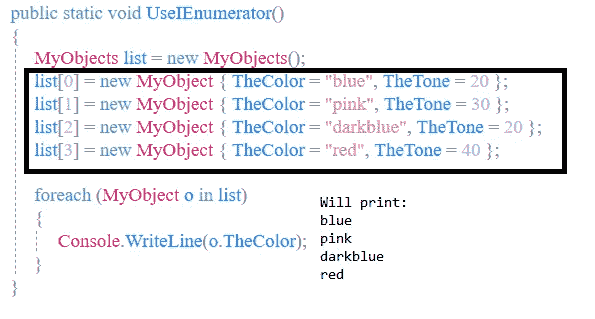

注意:使用 IEnumerable，要点是你将有一个列表或数组，并且你提供了一种在 GetEnumerator 中遍历它的方法。不管你的类需要通过构造函数还是调用你创建的 Add 方法来创建列表。

# IEnumerator

注意，在上面的例子中，GetEnumerator()方法返回一个 IEnumerator <myobject>，所以这将是相关的。IEnumerable 和 foreach 的使用隐藏了枚举器的复杂性。但是您可以使用自己的枚举器。</myobject>

下面的例子获取了一个整数列表，并提供了遍历它的枚举器(不用管我给的名字)。

可枚举对象仍然与我们使用的 IEnumerable 相似:

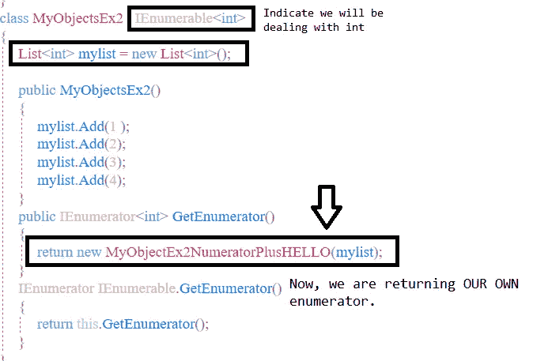

要使用它，它将与 IEnumerable 相似。

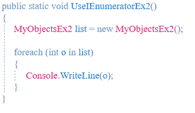

但是请注意，在我的列表中，我添加了 1，2，3，4。但这是我在控制台上看到的:

```
10
20
30
40
```

为什么？因为自定义分子:


因为我认为这可能会引起混淆，所以我修改了上面的代码，现在可以处理字符串列表，但是也可以处理您的特定类:

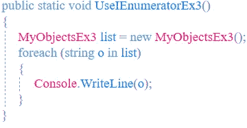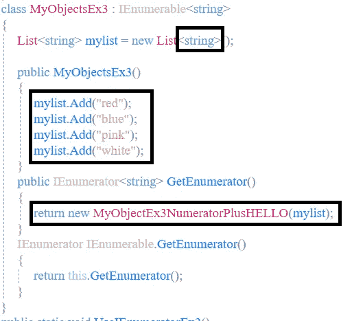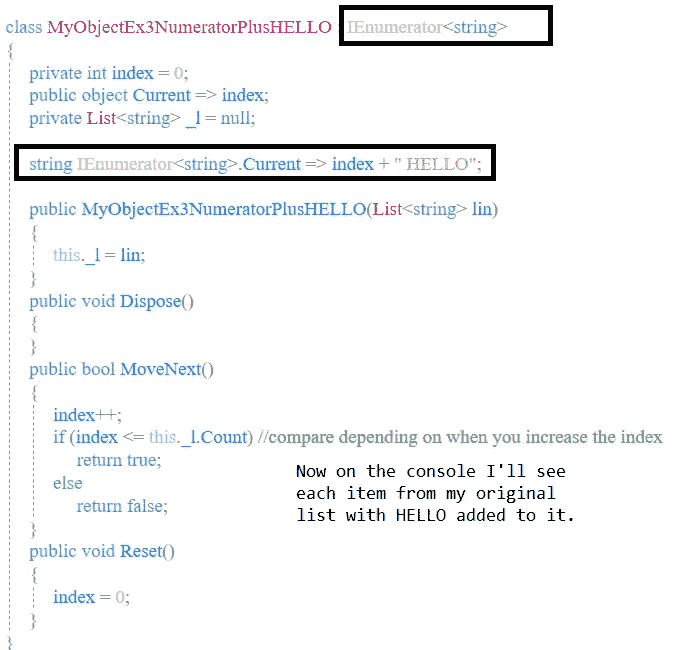

# 太多了！我希望这些例子有助于澄清概念。