# 实现太空射击游戏功能-侵略性的敌人

> 原文：<https://medium.com/nerd-for-tech/implementing-space-shooter-game-features-aggressive-enemies-bc123d1e1ed1?source=collection_archive---------19----------------------->

## 统一指南

## 快速回顾 Unity 中添加到太空射击游戏的新功能

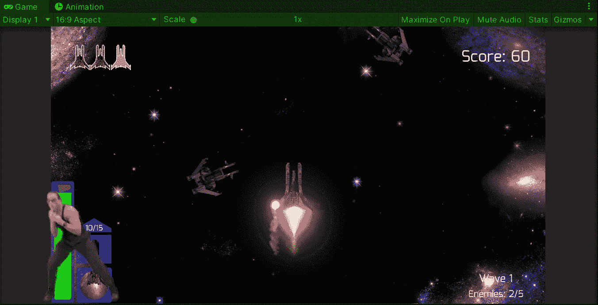

**目标**:在 Unity 的太空射击游戏中对敌人实施攻击行为。

在之前的帖子中，我在 Unity 的太空射击游戏中为一些敌人使用了盾牌[。现在是时候对敌人实施新的攻击行为了。](/nerd-for-tech/implementing-space-shooter-game-features-enemy-shields-7c4f343bb6a0)

# 检测玩家

为了在我们的太空射击游戏中对敌人实施攻击行为，我们可以给我们的敌人添加一个新的空游戏对象:

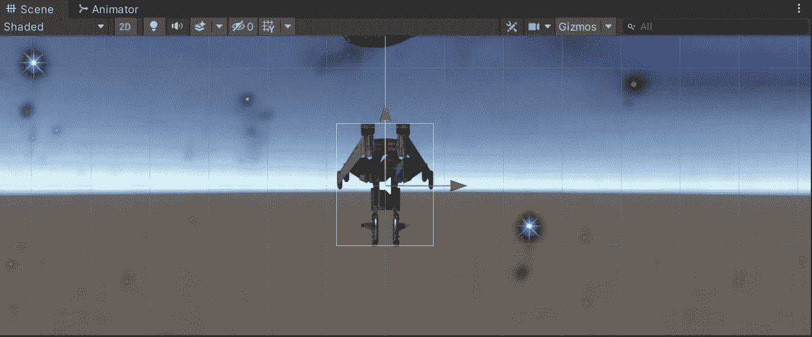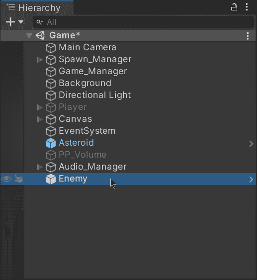

然后，在空的游戏对象中，让我们添加一个圆形碰撞器 2D 来表示敌人将不得不识别玩家的检测范围:

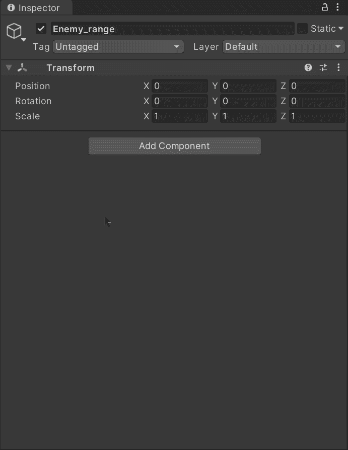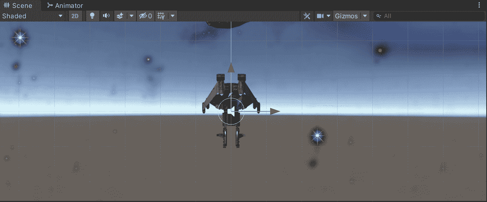

一旦我们决定了圆形碰撞器的半径，让我们启用 ***来触发*** 选项来检测玩家何时进入或退出这个范围:

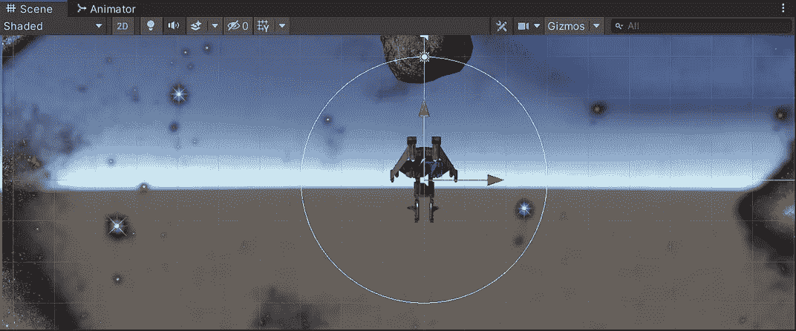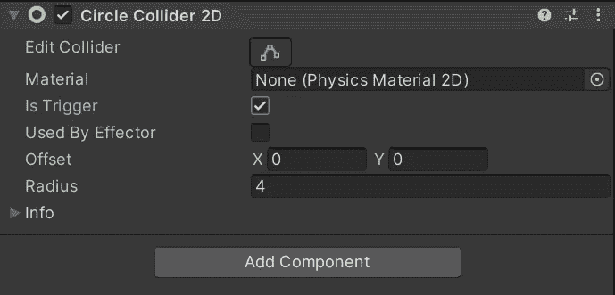

此外，添加一个刚体 2D 并使其运动以避免从敌人父节点调用 **OnTriggerEnter2D** 方法也非常重要(这会对敌人造成伤害):

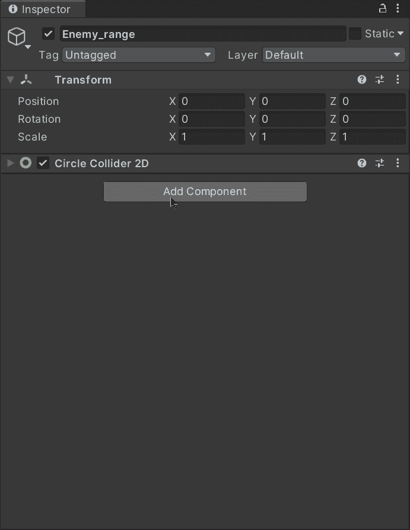

# 攻击行为

现在，为了创造攻击行为，我们可以选择让敌人转向玩家，当它已经向前移动时，敌人将与玩家相撞并造成伤害。

因此，为了使敌人在进入探测范围时转向玩家，让我们创建一个新的脚本并将其附加到空的游戏对象:

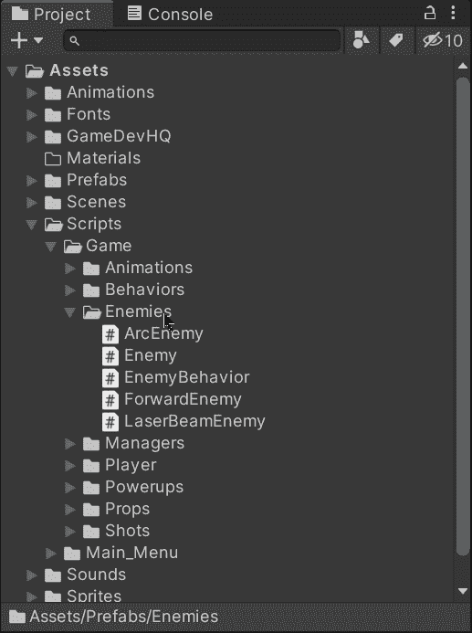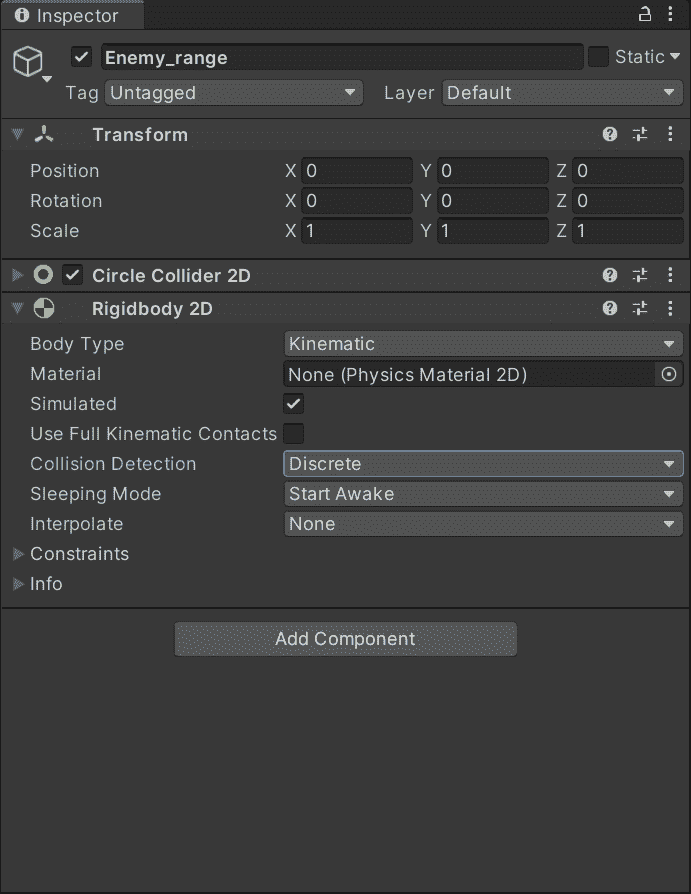

让我们打开脚本，确保在类声明上方有一个圆形碰撞器 2D 和 **RequireComponent** 语句:

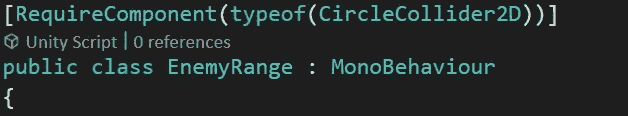

我们需要下面这些变量:

*   每秒度数

这个变量将存储当玩家被探测到在范围内时每秒旋转敌人的度数。

*   当前协同程序

这个变量将存储当前的协程，它将确保旋转到玩家的方向。

*   轮流

这个变量将存储该值，以了解敌人是否在协程中旋转。

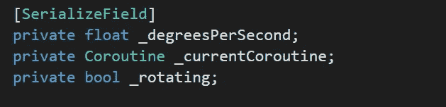

现在，为了在玩家进入范围时触发相应的旋转，让我们使用 **OnTriggerEnter2D** 方法，该方法将获得指向玩家位置的方向和角度，并将其发送给处理旋转的协程:

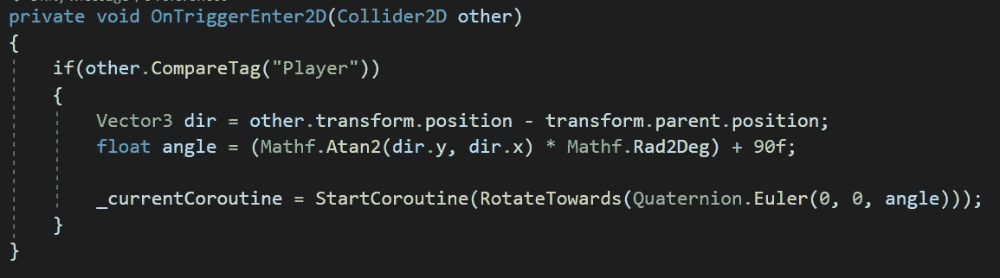

协程在被调用时存储在私有变量中。

然后，为了避免一个以上的协程同时旋转，让我们使用 **OnTriggerExit2D** 方法在玩家超出范围时停止当前的协程:

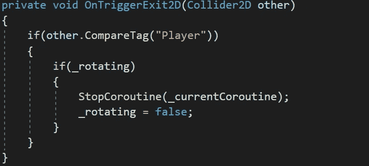

为了用协程处理旋转，让我们进入一个 while 循环，直到达到目标旋转才结束。为了向玩家旋转，让我们通过使用**四元数来改变父对象的旋转。旋转方向**:

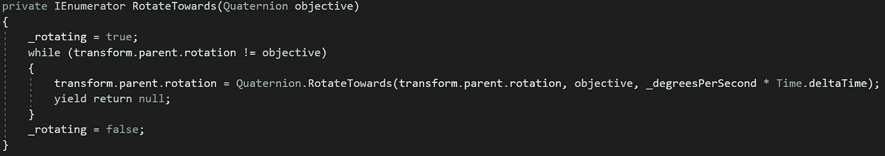

# 实现行为

现在，为了实现这个行为，让我们把这个空的游戏对象变成一个预置，这样我们就可以实例化这个行为，就像我们对敌人的盾牌所做的一样:

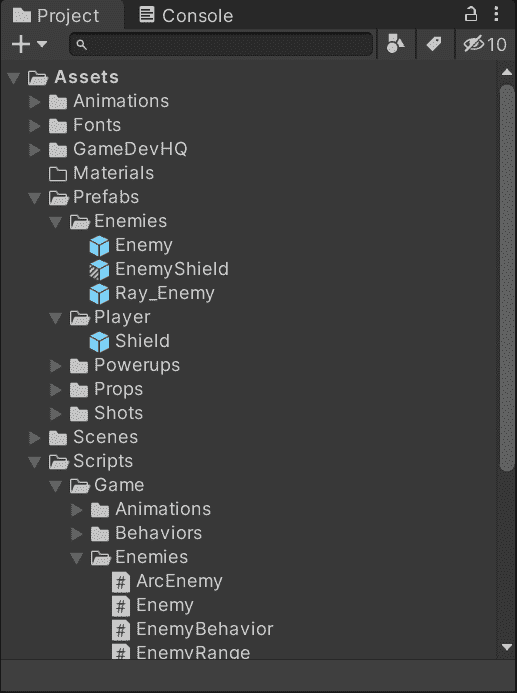

让我们打开 spawn manager 脚本并添加 2 个新变量:

*   敌人咄咄逼人

这个变量将存储一个预置的引用，这个预置将敌人作为一个孩子来旋转。

*   攻击概率

这个变量将存储每个敌人在发现玩家时产生攻击行为的概率。

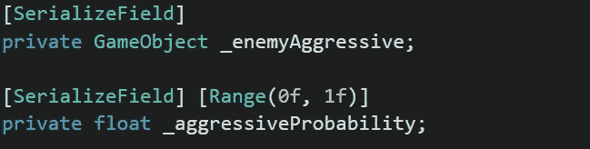

正如我们使用**【serialize field】**一样，我们可以在 Unity 中通过 inspector 修改变量:

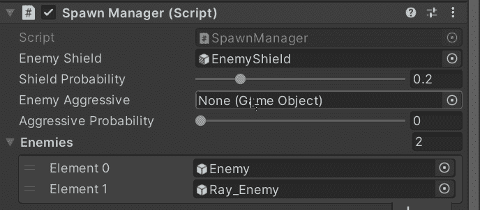

最后，为了添加攻击性行为，我们需要检查产生的敌人是否属于向前移动的类型，以及 ***Random.value*** 是否在攻击性概率范围内。如果这些情况是真的，我们将把预设实例化为新敌人的后代:

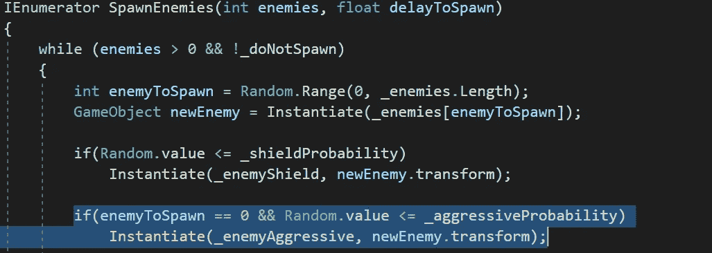

现在，如果我们在 Unity 中运行游戏，我们将能够看到敌人在靠近玩家时改变了游戏的旋转并与之相撞:

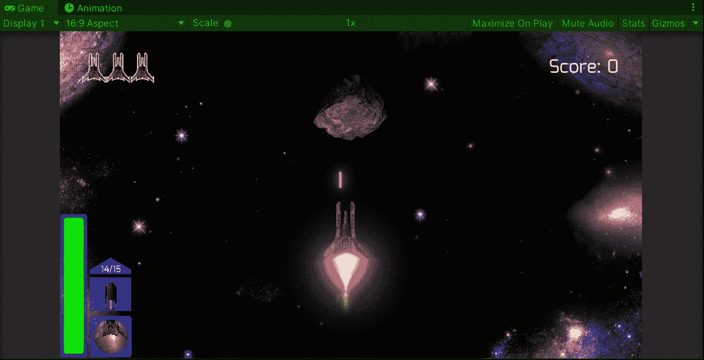

就是这样，我们对敌人实施了侵略行为！:d .我会在下一篇文章中看到你，在那里我会展示更多添加到我的 Unity 太空射击游戏中的功能。

> *如果你想了解我更多，欢迎登陆*[***LinkedIn***](https://www.linkedin.com/in/fas444/)**或访问我的* [***网站***](http://fernandoalcasan.com/) *:D**