# 实现太空射击游戏功能-弹药限制

> 原文：<https://medium.com/nerd-for-tech/implementing-space-shooter-game-features-ammo-limit-4da7533e2d71?source=collection_archive---------21----------------------->

## 统一指南

## 快速回顾 Unity 中添加到太空射击游戏的新功能

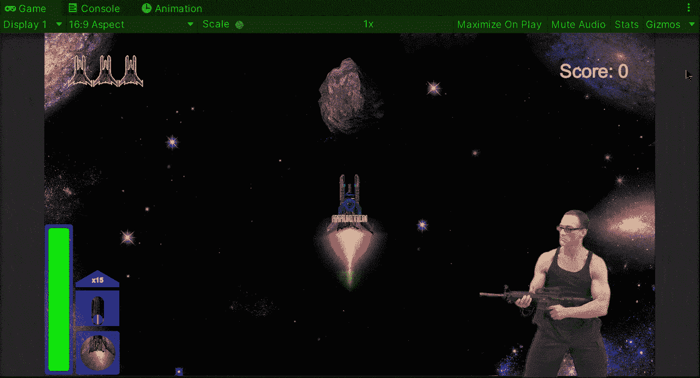

**目标**:用 Unity 实现一个限制玩家在太空射击游戏中发射弹药的系统。

在之前的帖子中，我[在我的 Unity 太空射击游戏中实现了一个健康增强项目](/nerd-for-tech/implementing-space-shooter-game-features-extra-life-a670cc82f2b9)。现在是时候实现一个系统来限制弹药，显示其统计数据，并提供一种补充弹药的方法。

# 限制弹药

为了限制弹药，让我们从打开玩家脚本开始:

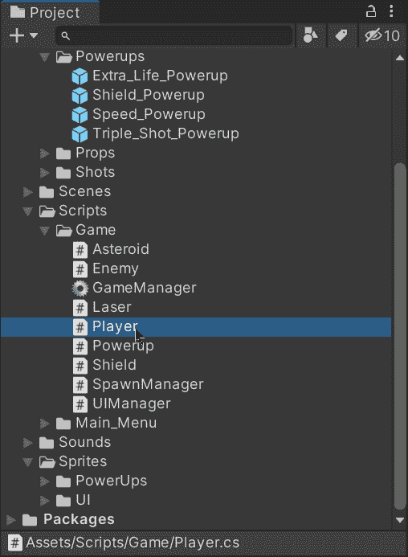

一旦打开，让我们创建一个新的变量来存储玩家能够携带和发射的子弹或激光的数量:

然后，在玩家每次射击时执行的方法中，让我们在开始时添加一个条件，以检查是否没有激光可供射击，如果是这样，让我们退出该方法:

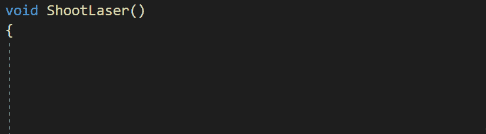

现在，如果玩家射击，让我们在方法结束时从激光中减去一个单位:

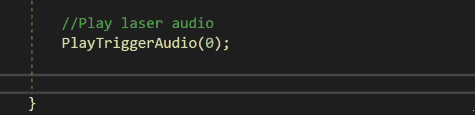

# 显示弹药状态

## 带音频

为了让玩家意识到弹药耗尽，让我们添加一个新的音频到没有弹药时播放的玩家脚本数组中:

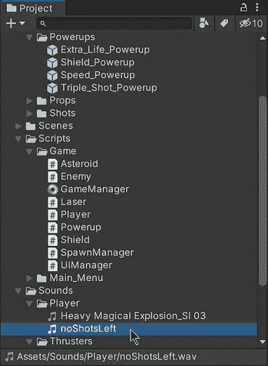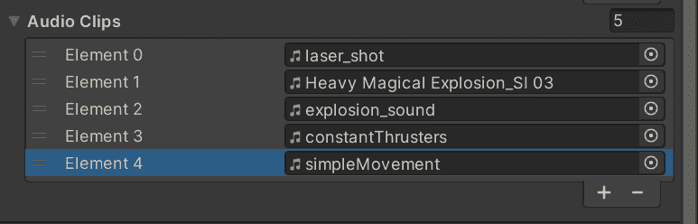

让我们添加相应的调用来播放先前条件中的音频，包括新音频的索引作为参数:

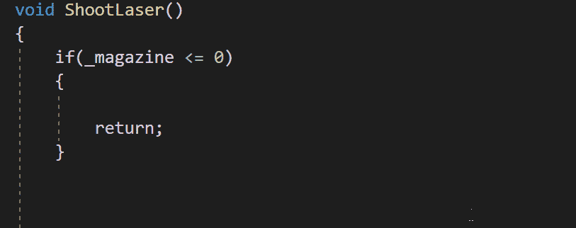

## 使用 UI 元素

同样，我们可以使用 UI 元素来显示弹药状态，让我们添加一个新的 UI 元素，就像我们在之前[所做的那样:](/nerd-for-tech/creating-ui-elements-in-unity-a778929eacfa)

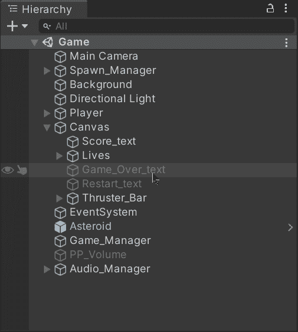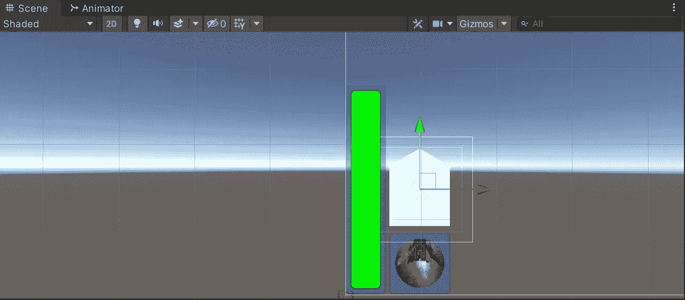

使用 2 张图片和 1 个文本元素，我们可以确保提供当前弹药的状态:

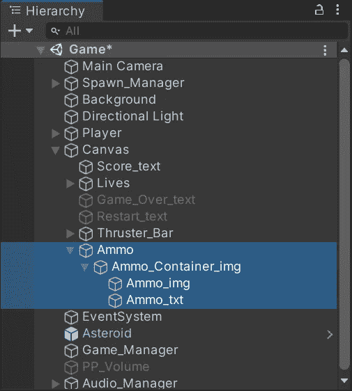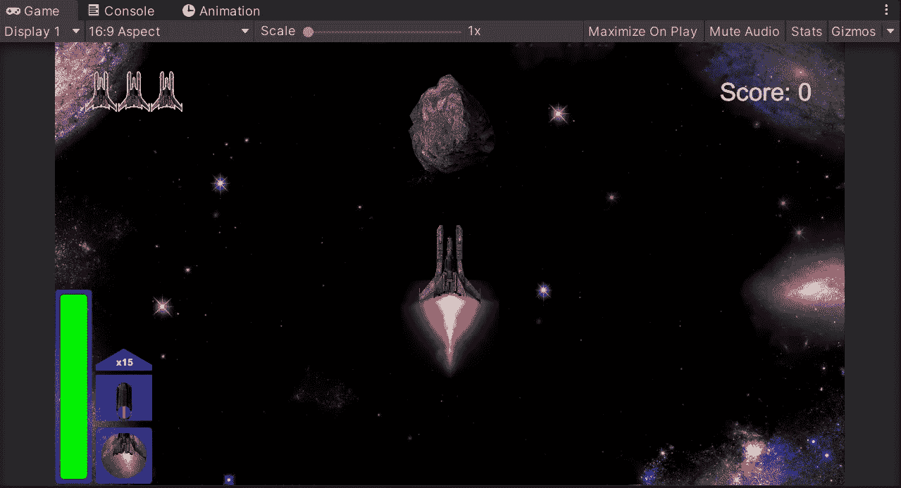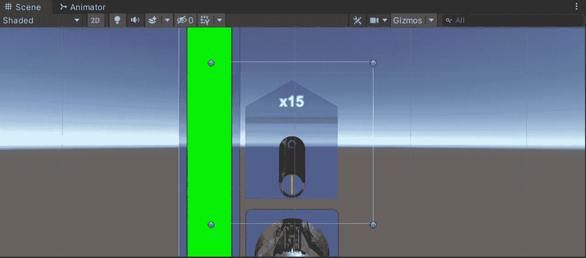

在顶部，我们使用文本元素来显示可用激光器的数量。在底部，我们用一个图像来显示要射击的弹药类型。

现在让我们打开 UI 管理器脚本，创建一个新的公共方法来更新弹药状态:

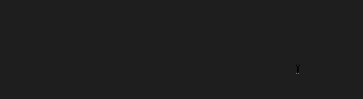

该方法将获得剩余的弹药总量。

然后，为了能够更新屏幕上的值，让我们创建一个新变量来存储对画布中文本元素的引用:

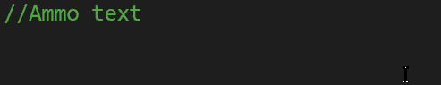

不要忘记使用**【serialize field】**将文本元素拖到检查器中。

现在，将文本元素拖动到画布中的 UI Manager 脚本组件中:

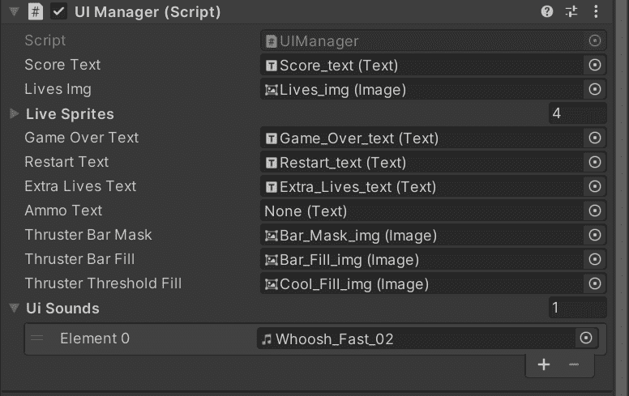

这样，我们就能够在每次调用该函数时用相应的值修改 text 属性:

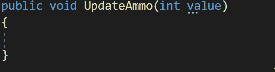

最后，打开玩家脚本，将相应的调用添加到 UI 管理器中，包括玩家每次射击时弹药的当前值:

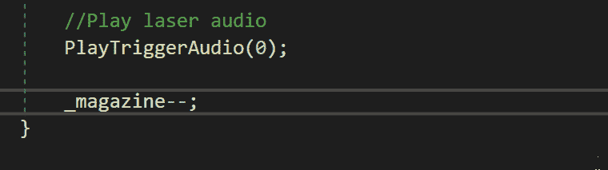

现在，如果我们在 Unity 中运行游戏，我们会看到当玩家射击时弹药值会更新:

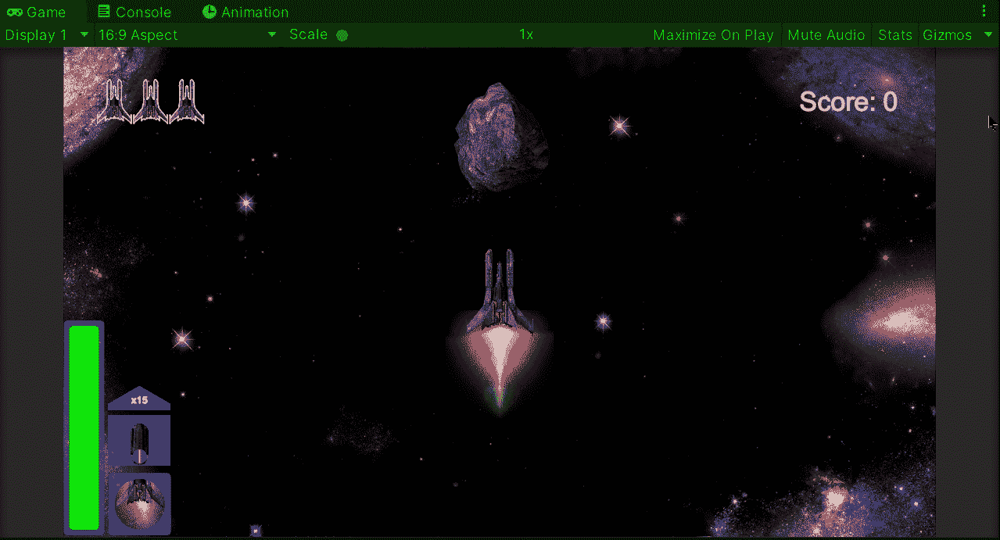

# 提供补充弹药的方法

最后，但不是最不重要的，让我们添加一个新的电源项目来补充玩家的弹药。如果你不知道如何在你的游戏中实现一个加电物品，你可以访问我以前的一个帖子:

 [## 在 Unity 中为你的游戏创造动力

### 关于如何在你的 Unity 游戏中实现一个增强道具的快速指南

medium.com](/nerd-for-tech/creating-a-power-up-for-your-game-in-unity-6810d73376a1) 

让我们添加新加电项目的精灵，包括其他加电项目具有的各个组件:

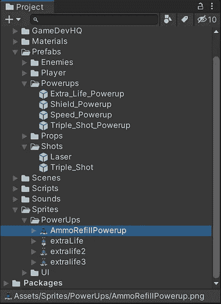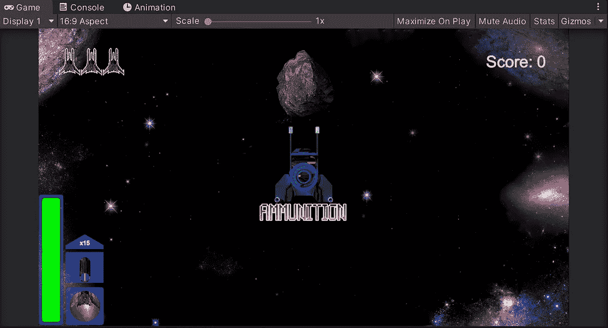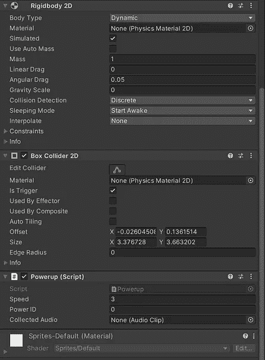

然后，如果我们再次运行游戏，我们将能够在收集能量物品时补充弹药:

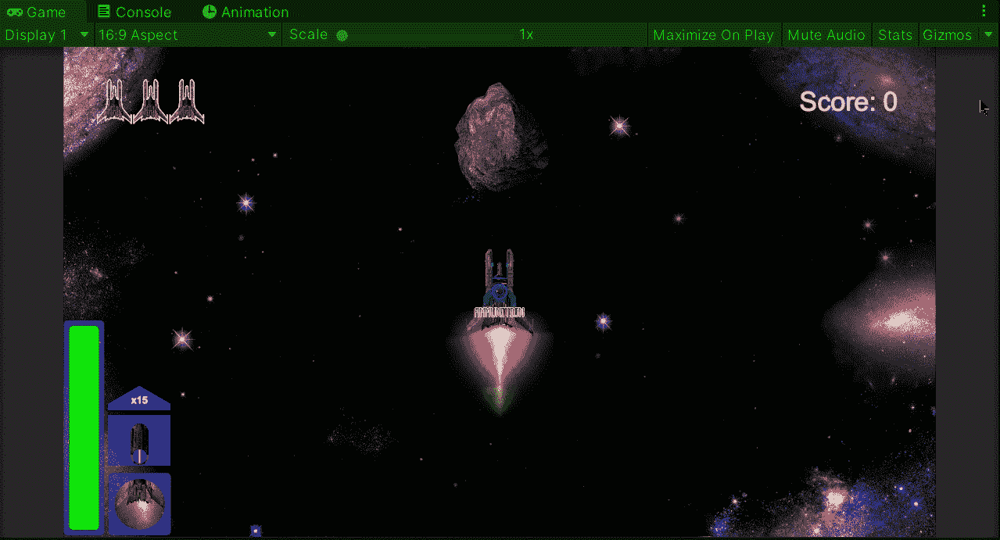

就是这样，我们实施了一个限制弹药的系统！:d .我会在下一篇文章中看到你，在那里我会展示更多添加到我的 Unity 太空射击游戏中的功能。

> *如果你想更多地了解我，欢迎登陆*[***LinkedIn***](https://www.linkedin.com/in/fas444/)**或访问我的* [***网站***](http://fernandoalcasan.com/) *:D**