# 实现太空射击游戏功能-吸引电源

> 原文：<https://medium.com/nerd-for-tech/implementing-space-shooter-game-features-attract-power-ups-83b3666daffe?source=collection_archive---------23----------------------->

## 统一指南

## Unity 空间射击游戏新增功能快速回顾

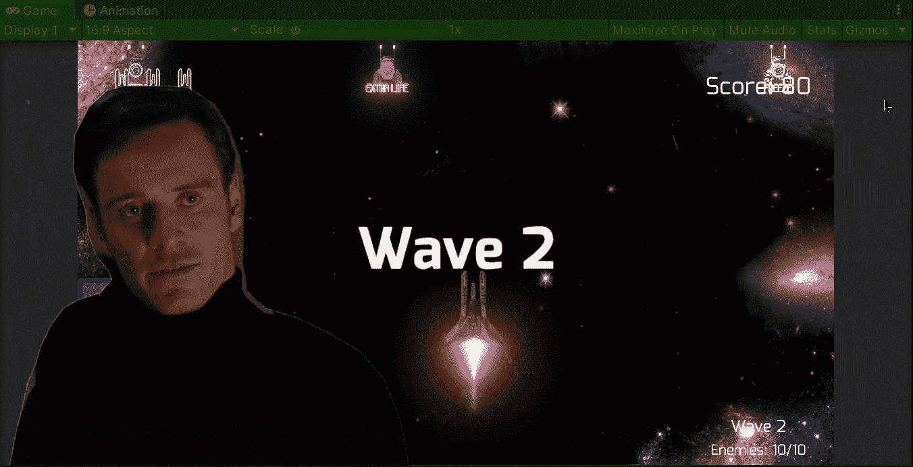

**目标**:在 Unity 的太空射击游戏中，为玩家实现一种吸引能量的方法。

在之前的帖子中，我[在我的 Unity 太空射击游戏中为一些敌人实现了一种检测加电的方法](/nerd-for-tech/implementing-space-shooter-game-features-enemy-view-3095e0679365)。现在是时候为玩家实现一种方法来吸引操场上的能量，以便更容易地收集它们。

# 通电等级

为了让加电跟随播放器，让我们打开**加电**类，并创建一个新的变量来存储对播放器的变换组件的引用:

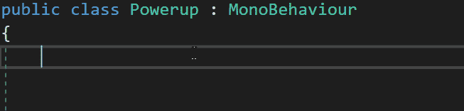

然后，在 **Start** 方法中，我们使用 **GameObject。Find** 方法找到播放器，然后用 **GetComponent** 方法，让我们得到转换组件:

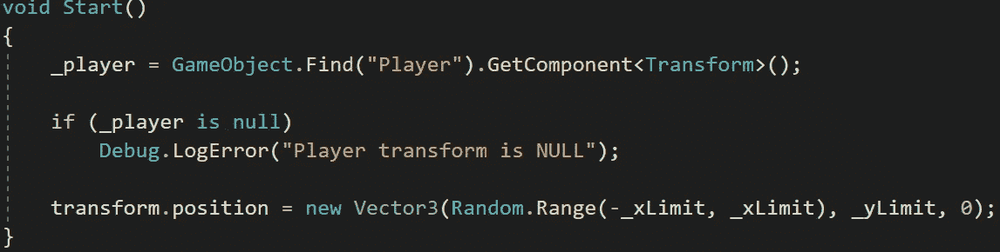

> 注意:我们也可以使用 [***游戏对象。FindWithTag***](https://docs.unity3d.com/ScriptReference/GameObject.FindWithTag.html)

此外，让我们创建一个新的 bool 变量，该变量指示玩家是否对上电感兴趣:

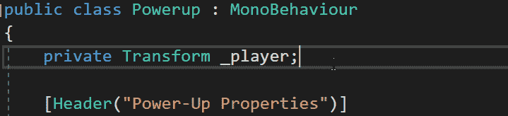

现在，让我们创建一个新的方法，通过计算向玩家移动的距离来开始。这一步将是加电速度每秒加倍的结果:

然后，让我们使用**矢量 3。向**移动，给加电位置一个更接近玩家位置的新值:

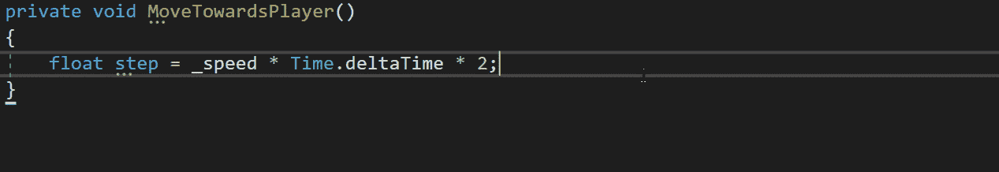

如果你想了解更多关于 **Vector3 的信息。走向**方法你可以访问 Unity 文档:

 [## 向量 3。走向

### 你如何在整个工作流程中使用文档？请参加本次调查，与我们分享您的体验。建议一个…

docs.unity3d.com](https://docs.unity3d.com/ScriptReference/Vector3.MoveTowards.html) 

最后，让我们通过检查加电是否被吸引来确定**更新**方法内部的运动:

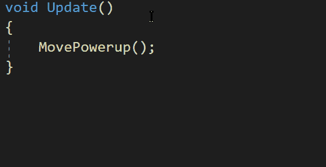

# 玩家等级

现在，为了让玩家能够吸引场景中的电源，让我们创建一个公共委托方法及其公共静态事件。这些将有助于改变场景中电源的吸引力布尔值:

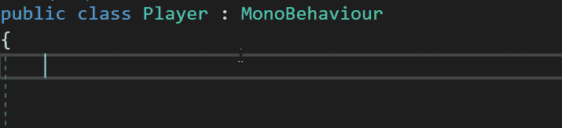

接下来，让我们在 **Update** 方法中添加一个条件，检查玩家是否输入了“c”键，在这种情况下，如果静态事件不为空，让我们执行它:

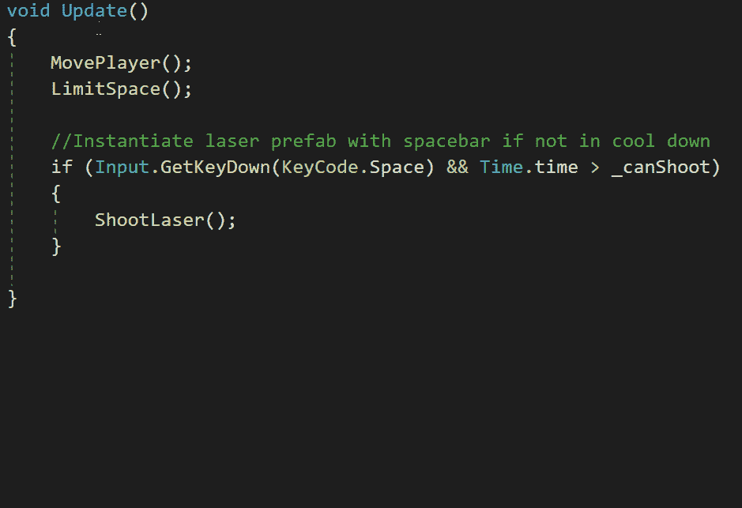

此外，为了停止吸引电源，我们可以在玩家停止按“c”键时使用相同的事件:

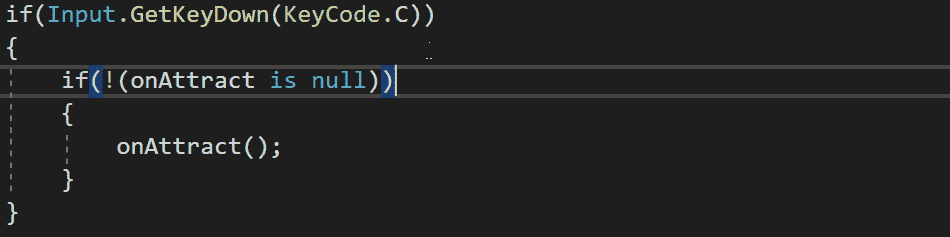

为了改变吸引力，让我们在 **Powerup** 类中创建一个新方法，该方法给出 bool 的当前相反值。这样，我们可以确保在调用该方法时，值被设置为相反的值:

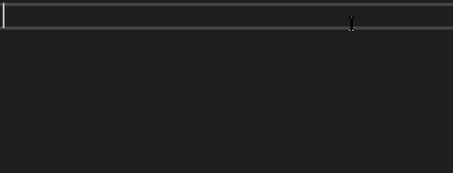

然后，在 **Powerup** 类中，让我们从 **Player** 类添加对静态事件的方法调用，以便在事件执行时调用它:

最后，让我们确保使用 **OnDestroy** 方法从静态事件中移除该方法，该方法在销毁附加了该脚本的 gameobject 之前被调用。通过这样做，我们可以确保静态事件不会试图执行不再存在的游戏对象的方法:

现在，如果我们在 Unity 中运行游戏，我们将能够按下“c”键并将场景中的电源吸引到玩家面前:

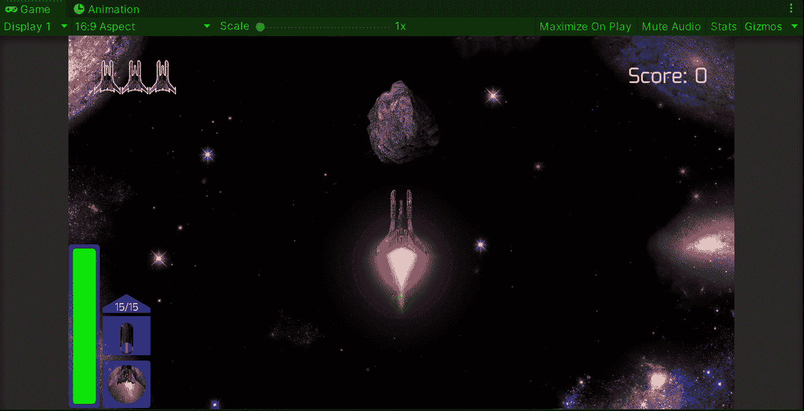

就这样，我们实现了一种让玩家在场景中吸引能量的方法！:d .我会在下一篇文章中看到你，在那里我会展示更多添加到我的 Unity 太空射击游戏中的功能。

> *如果你想了解我更多，欢迎登陆*[***LinkedIn***](https://www.linkedin.com/in/fas444/)**或访问我的* [***网站***](http://fernandoalcasan.com/) *:D**