# 实现太空射击游戏功能-相机抖动

> 原文：<https://medium.com/nerd-for-tech/implementing-space-shooter-game-features-camera-shake-51c6eb02704a?source=collection_archive---------18----------------------->

## 统一指南

## Unity 空间射击游戏新增功能快速回顾

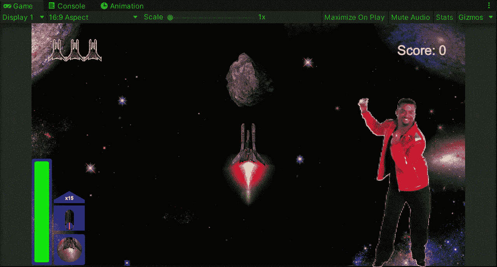

**目标**:用 Unity 实现一个太空射击游戏的相机抖动效果。

在之前的帖子中，我用 Unity 实现了一个[系统来限制我的太空射击游戏中玩家](/nerd-for-tech/implementing-space-shooter-game-features-ammo-limit-4da7533e2d71)的弹药。现在是时候实现一个相机抖动效果来显示玩家每次受到的伤害。

# 创建摇动效果

为了创建抖动效果，让我们创建一个新的脚本并将其附加到主摄像机:

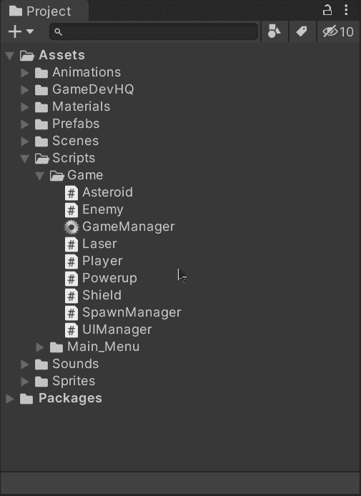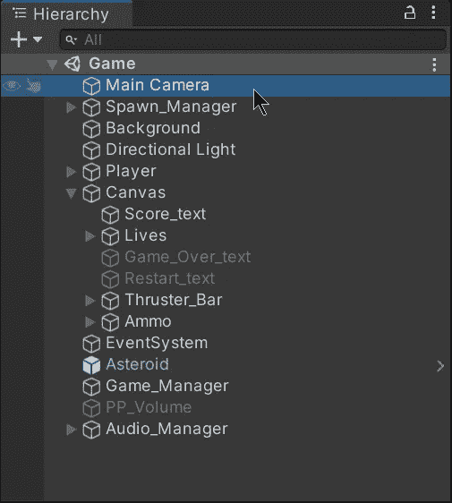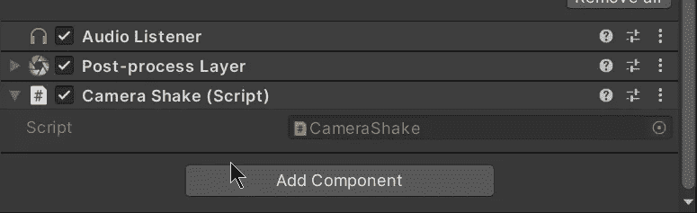

附加到主摄像机的新脚本。

然后，让我们打开脚本并创建变量来存储新属性的值，相机将不得不模拟抖动:

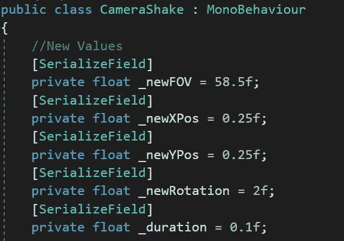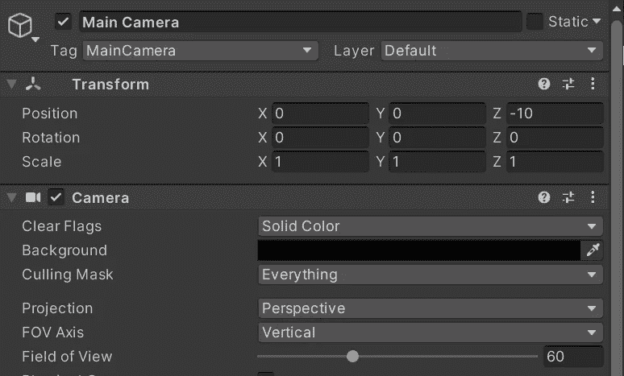

第一幅图像的值将用于修改第二幅图像的原始值。

通过使用**【序列化字段】**，我们将能够从检查器中编辑私有变量以尝试不同的值:

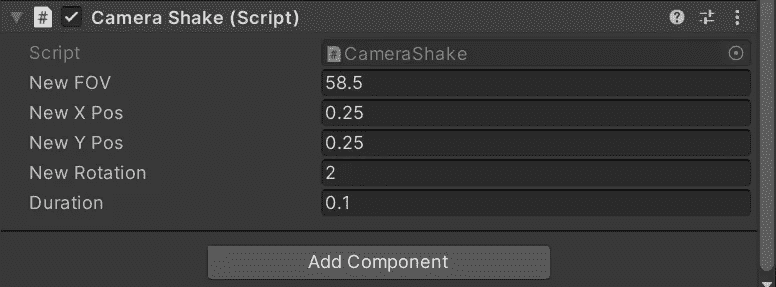

让我们也添加新的变量来存储相机的原始值，以在模拟抖动效果后恢复它们:

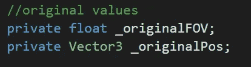

然后，让我们创建一些变量来帮助这个过程:

*   *_ 延迟*

为了避免内存分配，我们创建了一个 WaitForSeconds 变量，我们将在后面定义这个变量，并在一个协程中使用它来帮助实现 shake 效果。

*   *_newPos* ， *_newRot*

定义摄像机新位置和旋转的 Vector3 值。

*   *_invertXYPos*

乘以位置向量，只反转 X 轴和 Y 轴。

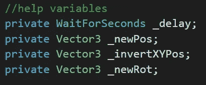

现在在 **Start** 方法中，让我们初始化摄像机和帮助变量的初始值:

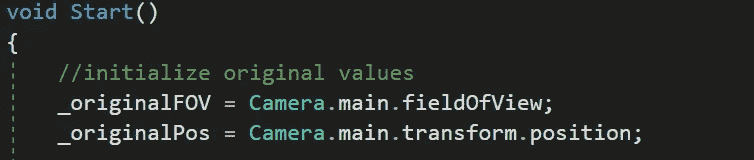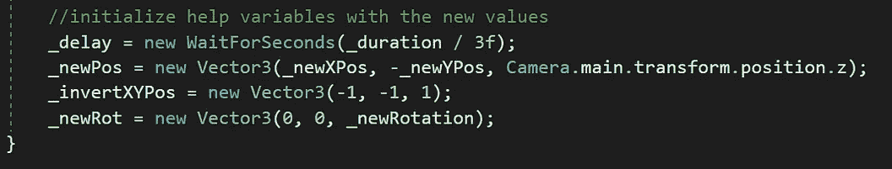

延迟除以 3，因为它将在协程中使用 3 次。

然后，让我们[创建一个新的协程](https://fas444.medium.com/using-coroutines-in-unity-5fa1d51e0055)来模拟震动效果:

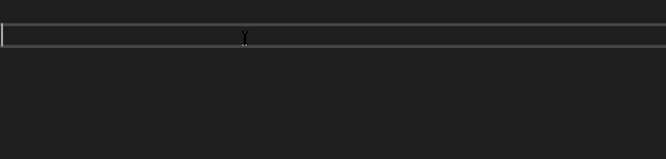

该方法是公开的，玩家在受到伤害时可以调用。

首先，让我们用新值改变主摄像机的视野(FOV)，然后，让我们等待延迟运行下一行:

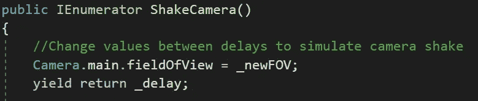

现在，让我们用新值更改摄像机的位置和旋转，然后，让我们等待另一个延迟来运行下一行:

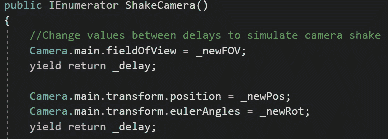

然后，让我们用反转的新值来改变摄像机的位置和旋转，以等待最后的延迟:

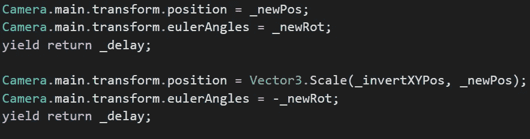

最后，让我们恢复主摄像头的原始值(FOV、位置和旋转):

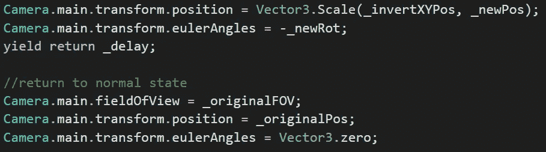

# 触发震动效果

为了执行摇动效果，让我们打开播放器脚本并创建一个新变量来存储对主摄像机的 **CameraShake** 脚本组件的引用:

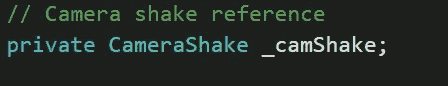

然后，让我们初始化**开始**方法中的变量:

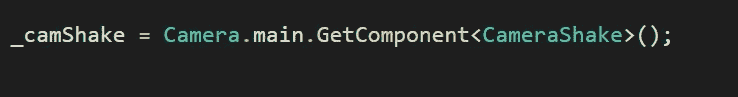

不要忘记添加相应的条件来检测是否没有找到脚本:

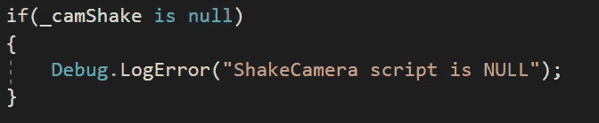

现在，在处理玩家伤害的方法中，让我们使用 **StartCoroutine** 方法添加对相机抖动协程的调用:

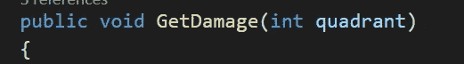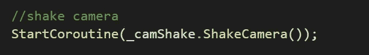

如果我们在 Unity 中运行游戏，我们会看到每次玩家受到伤害时，摄像机都会抖动:

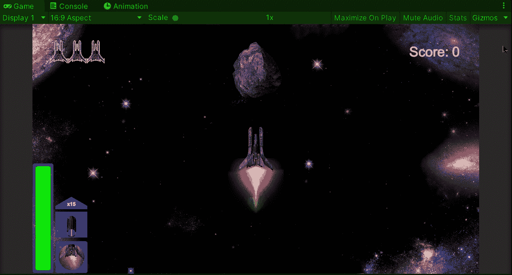

就这样，我们实现了一个相机抖动效果！:d .我会在下一篇文章中看到你，在那里我会展示更多添加到我的 Unity 太空射击游戏中的功能。

> *如果你想了解我更多，欢迎登陆*[***LinkedIn***](https://www.linkedin.com/in/fas444/)**或访问我的* [***网站***](http://fernandoalcasan.com/) *:D**