# 实现太空射击游戏功能-敌人的行为

> 原文：<https://medium.com/nerd-for-tech/implementing-space-shooter-game-features-enemy-behavior-a784cb1d8af0?source=collection_archive---------19----------------------->

## 统一指南

## Unity 空间射击游戏新增功能快速回顾

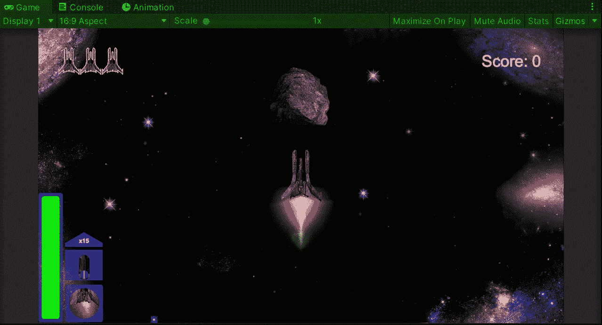

**目标**:在 Unity 的太空射击游戏中实现新的移动行为。

在之前的帖子中，我[在我的 Unity 太空射击游戏中实现了一种新的射击方式](/nerd-for-tech/implementing-space-shooter-game-features-multi-direction-shot-bb9bf00f46fc)。现在是时候为敌人实现新的移动行为来增加游戏难度了。

# 新类别

如果你一直关注[我的帖子](https://fas444.medium.com/)，那么你会记得我们只是用一个职业来控制敌人的行为。为了完成一个新的行为，让我们创建新的类，当我们试图在未来制造新的敌人时，这些类将使用继承来使新的行为可伸缩和模块化。

新的课程将包括:

*   **敌人**

这个类不会继承**monobehavior**，它会存储敌人可能拥有的不同属性。

*   **敌人行为**

这个类将继承**monobehavior**并且它将处理每个敌人可能有的主要/简单动作。

*   **前方敌人**

这个职业将继承**敌人的行为**并且它将处理在空间中移动的敌人。

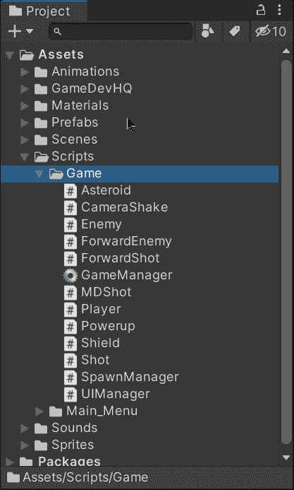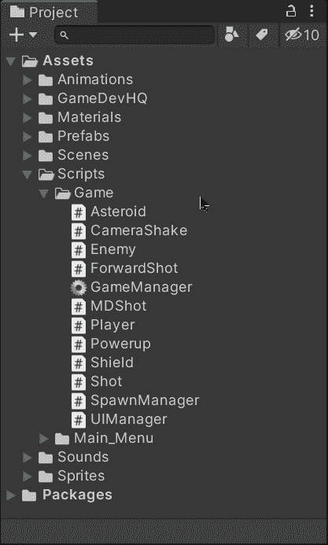

## 敌人阶级

首先，在**敌人**职业中，让我们去掉**单行为**的继承，只留下我们需要的各种类型敌人的领域。让我们将它们公开，因为我们将通过检查器修改它们:

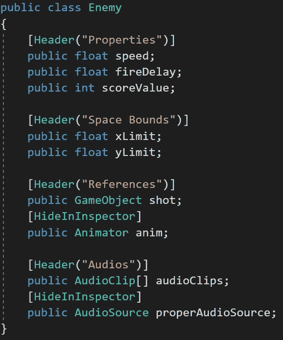

有些变量隐藏在检查器中，因为它们不需要编辑。

那么，我们就用**【系统。【T23 能够在检查器中修改类:**

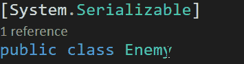

## 敌人行为类

现在，让我们来处理**敌人行为**类中敌人的主要行为。由于我们将在《敌人》中使用动画制作人和音频源组件，所以让这个类使用 **[RequireComponent()]** 来要求它们:

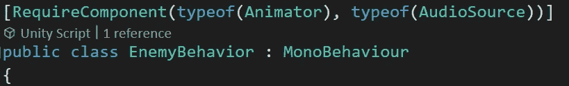

然后，让我们创建一些新的变量:

*   *_ 敌人*

是私**敌**实例。使用**【serialize field】**允许我们通过 inspector 修改值。

*   *速度，XBound & YBound*

这些是受保护的属性，让这个类的子类从这个类的**敌人**实例中读取私有值。

*   *_ 能射，_ 死了&_ 玩家*

这些是私有变量，用于管理这个类上**敌人**实例的主要行为。

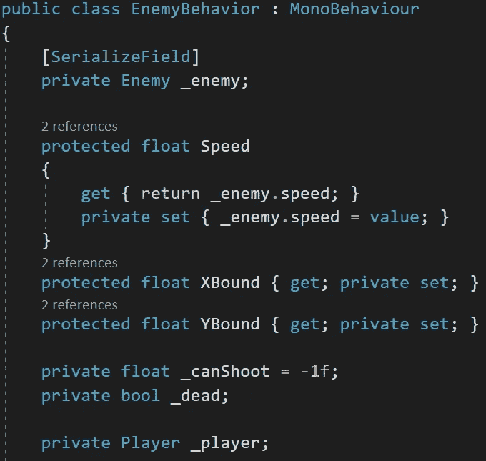

现在，让我们使 **Start** 方法成为一个公共的虚方法，这样我们就可以从这个类的子类中覆盖这个函数。在这种情况下，让我们初始化处理敌人主要行为所需的值:

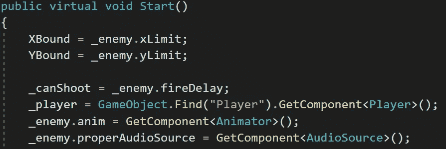

然后，让我们对**更新**方法做同样的事情。在这种情况下，我们需要它每隔一段时间处理一次拍摄功能:

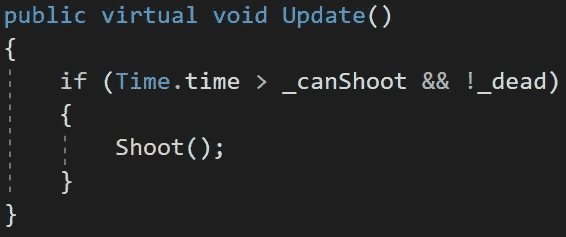

最后，让我们来定义哪些函数(最初在**敌人**类中)是敌人的主要行为:

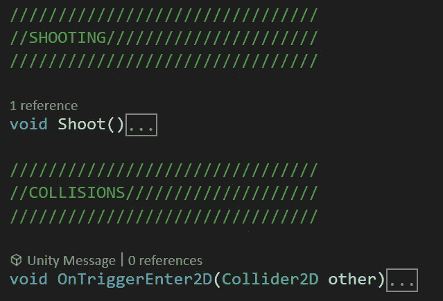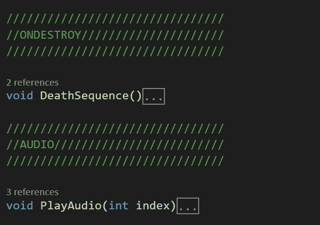

## 前方敌级

现在，让我们创建第一种次要敌人行为，即前进敌人。这种类型的敌人将以不同的起点(不像以前那样只是从顶部)在空间中排成一条直线移动。

这个类将继承 **EnemyBehavior** 类来实现任何敌人的主要行为:

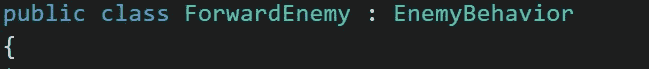

接下来，让我们创建一对私有变量，它们将存储来自 **EnemyBehavior** 类的空间边界:

我们也可以使用**x bound**&**y bound**protected**属性来代替这两个变量。**

**现在，让我们创建一个函数来修改敌人的变换组件值(位置和旋转),根据相机的哪一侧来产生它。**

**我们开始选择一方来随机繁殖。范围方法。然后，我们使用一个 switch 语句来修改各自的位置，以便在摄像机的那一侧产卵。最后，我们通过调用 **GetRandomAngle** 方法来修改敌人的 Z 旋转，选择边作为参数:**

**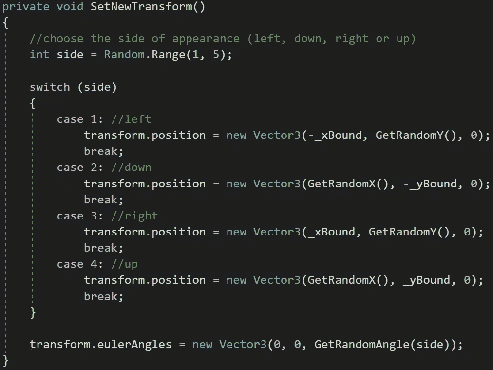**

****GetRandomAngle** 方法使用此公式返回一个 45 度之间的随机角度，该角度指向作为参数接收的摄像机一侧:**

**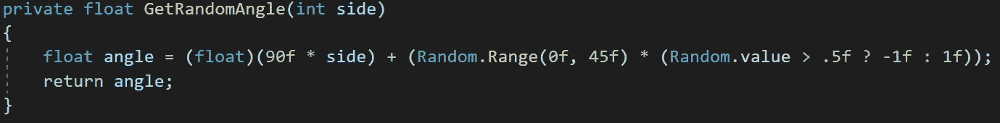**

**我们用**？**操作者知道随机值是否会被减去或加到角度上。**

**然后，让我们初始化公共覆盖 **Start** 方法中的各个变量，该方法也通过使用**基类从 **EnemyBehavior** 类调用 Start 方法。启动**方法:**

****

**这样，我们确保该类也将从父类运行 **Start** 方法。**

**同样，像上面的方法一样，让我们使 **Update** 成为一个公共覆盖方法，它从父类中调用 **Update** 方法，并在该类中调用 **MoveEnemy** 方法:**

**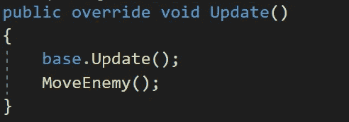**

****MoveEnemy** 方法将确保附加了该脚本的敌人将在整个空间中以父类的 protected Speed 属性提供的速度向前移动(在一条直线上)。此外，它将从这个类中调用**的方法:****

**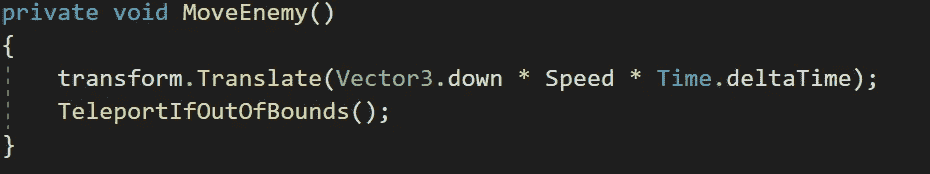**

**如果敌人到达了空间的极限，**传送自动反弹**方法将调用 **SetNewTransform** 方法，这样就可以用各自的转换值传送敌人再次进入游戏场:**

**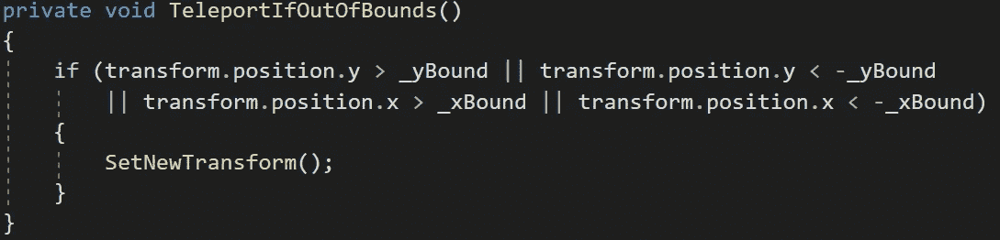**

**最后，我们将能够将 **ForwardEnemy** 脚本附加到敌人预设，并通过检查器修改其值以符合我们的要求:**

**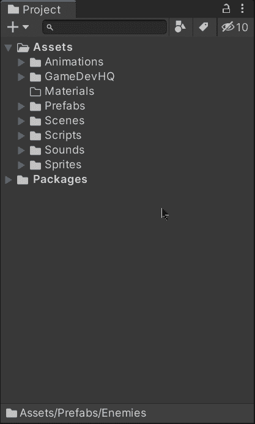****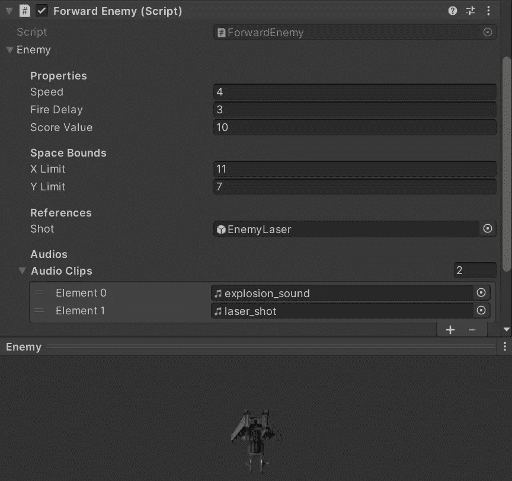**

**如果我们在 Unity 中运行游戏，我们会看到敌人从不同的角度和位置进入游戏场地，使游戏变得更难:**

**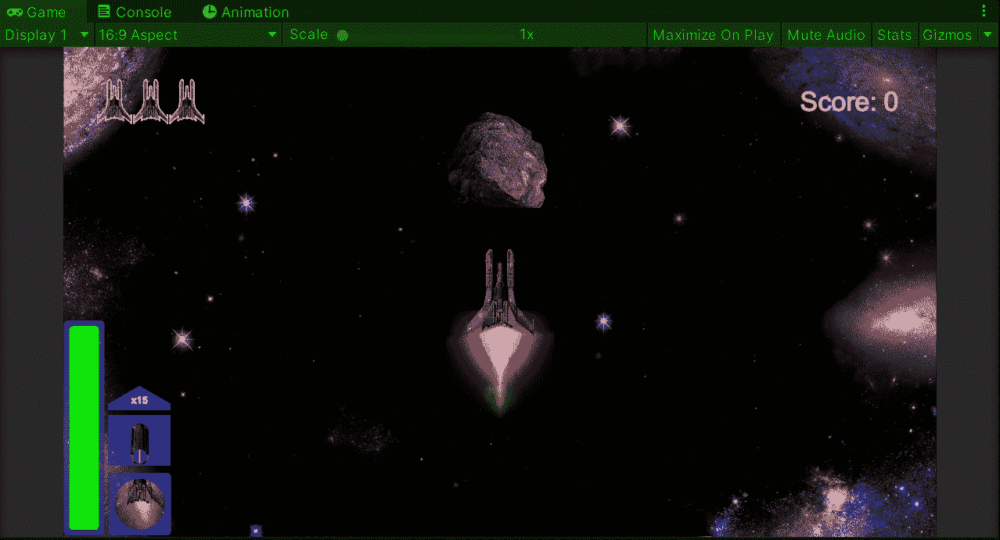**

**就这样，我们实现了一个新的运动行为！:d .我会在下一篇文章中看到你，在那里我会展示更多添加到我的 Unity 太空射击游戏中的功能。**

> ***如果你想了解我更多，欢迎登陆*[***LinkedIn***](https://www.linkedin.com/in/fas444/)**或访问我的* [***网站***](http://fernandoalcasan.com/) *:D****