# 实现太空射击游戏功能-敌人盾牌

> 原文：<https://medium.com/nerd-for-tech/implementing-space-shooter-game-features-enemy-shields-7c4f343bb6a0?source=collection_archive---------13----------------------->

## 统一指南

## Unity 空间射击游戏新增功能快速回顾

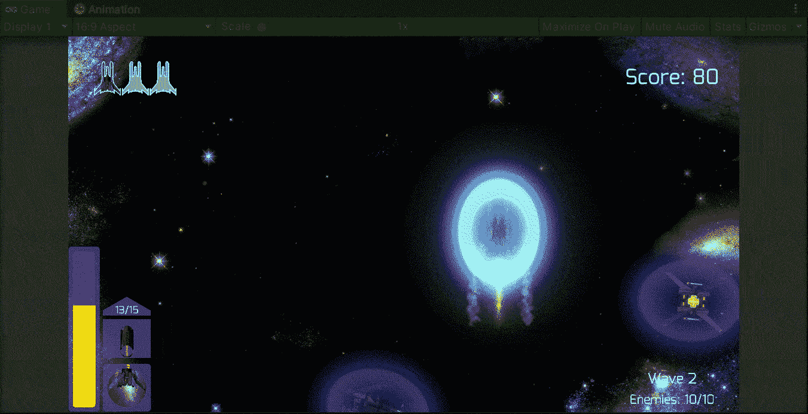

**目标**:在 Unity 的太空射击游戏中为敌人实施盾牌。

在上一篇文章中，我在 Unity 的太空射击游戏中用激光束射击了一个新类型的敌人。现在是时候在每波产生的一些敌人身上使用护盾了。

# 屏蔽预制件

为了实现敌人之盾，我们需要改变我们处理玩家之盾的方式，让它成为一个独立的对象，处理几乎所有与其他游戏对象和镜头的碰撞。

在下一张图片中，我们可以看到玩家的盾牌，这是一个禁用的游戏对象，当玩家受到伤害时，它会再次启用和禁用:

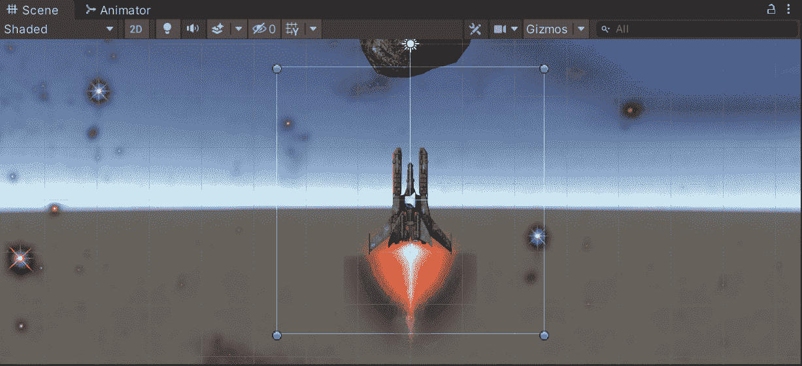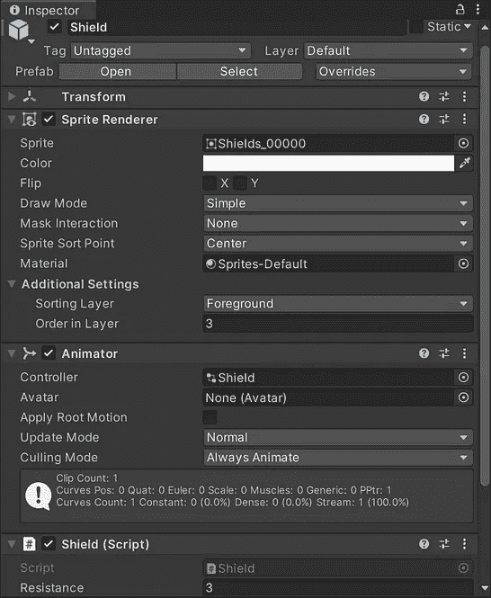

因此，为了使盾牌成为一个独立的对象，让我们添加一个 2D 碰撞器来很好地适应精灵，让我们启用 ***是触发*** 属性:

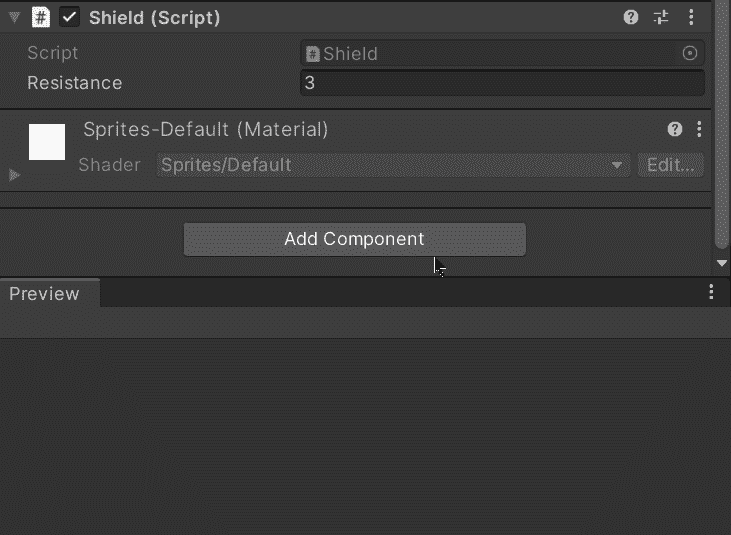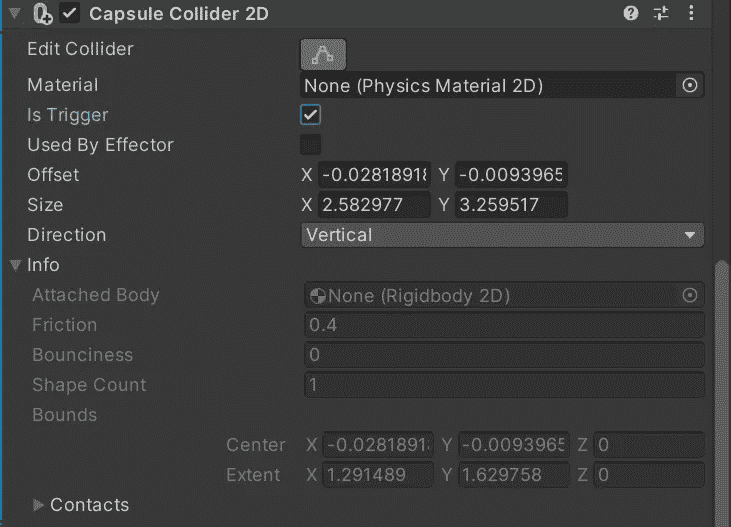

然后，让我们在场景视图中修改碰撞器来覆盖盾牌精灵:

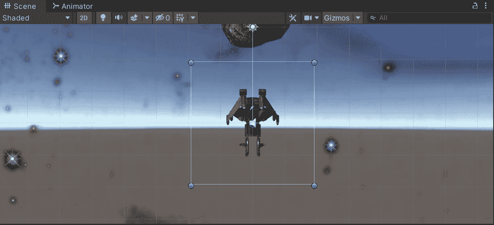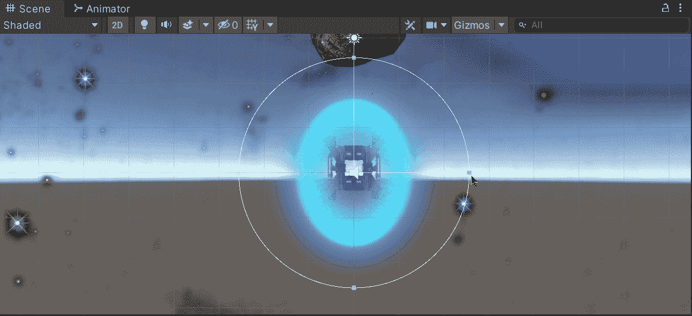

此外，为了处理碰撞，让我们添加一个 2D 刚体，并将重力比例设置为 0:

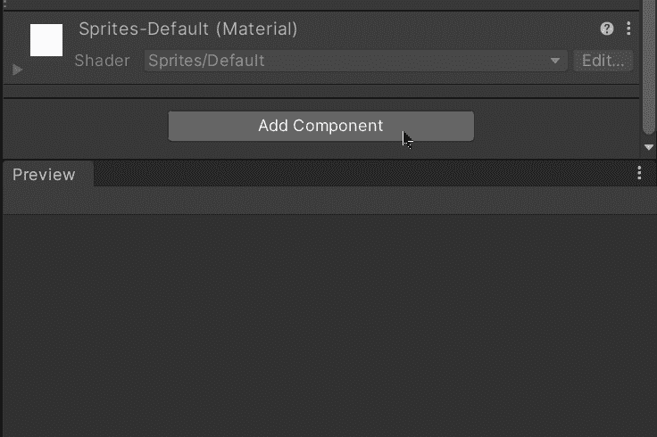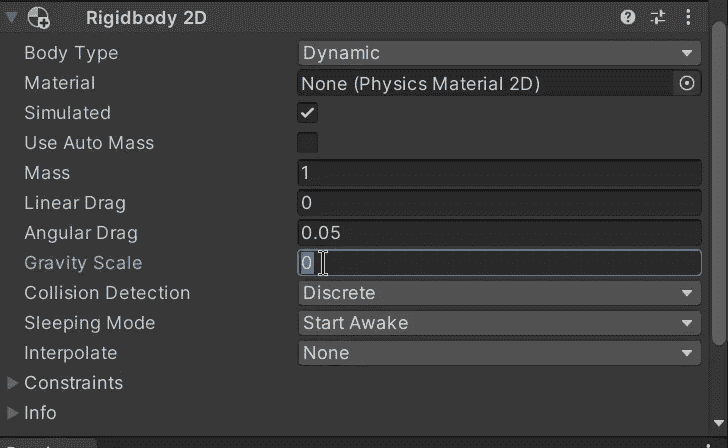

现在，让我们通过把它拖到各自的预设文件夹中来制作一个预设。因为我们已经为玩家准备了一个(而且我们只需要修改敌人盾牌中的一些值)我们可以选择制作一个新的预置变体而不是一个新的预置:

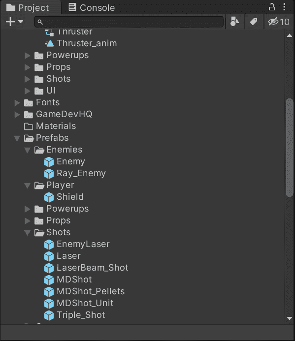

为了区分盾牌预设，我们可以为每个预设使用一个标签或布尔值:

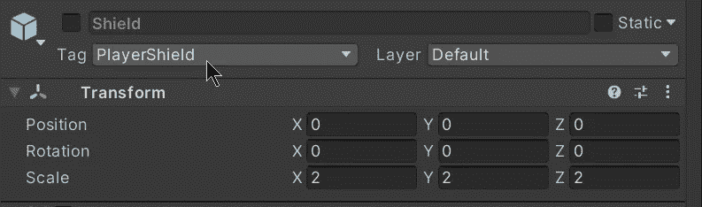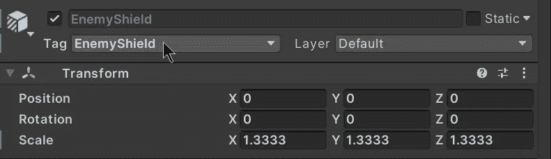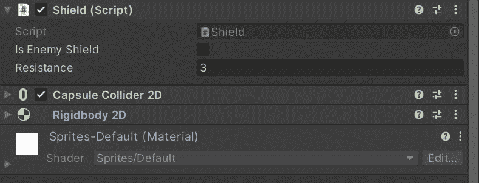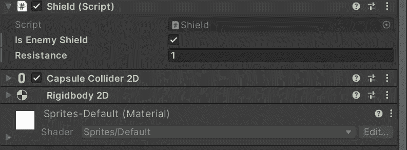

为了避免使用像 **GetComponent** 这样昂贵的方法，我们只能使用标签。

# 屏蔽等级

现在，为了处理游戏逻辑，让我们打开盾牌脚本。在脚本中，我们需要一个新变量:

*   是敌人的盾牌

这个新的变量表明盾牌预设是否会被实例化来覆盖敌人。通过使用**【serialize field】**我们可以确保通过检查器修改它的值。

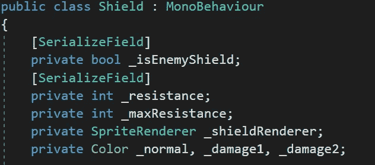

如果你想知道其他变量是做什么的，你可以在这个旧帖子中查看玩家的盾牌实现:

 [## 实现空间射击游戏的功能-盾牌的力量

### Unity 空间射击游戏新增功能快速回顾

medium.com](/nerd-for-tech/implementing-space-shooter-game-features-shield-strength-1fd3c5c18ee3) 

现在，让我们把布尔方法(它表示盾牌受到伤害，如果盾牌需要保持活动就返回)改为无效方法，当没有抵抗时禁用盾牌:

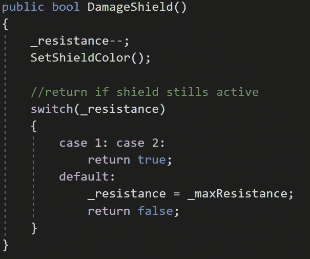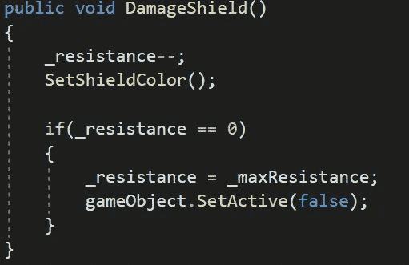

第一张图显示了旧方法，第二张图显示了新方法。

然后，为了处理与其他游戏对象的冲突，让我们使用 **OnTriggerEnter2D** 方法:

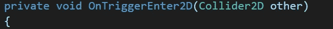

首先，我们要确保盾牌是玩家的，这样我们就可以处理盾牌和以下物体之间的碰撞:

*   其他敌人护盾
*   敌人的射击
*   敌人

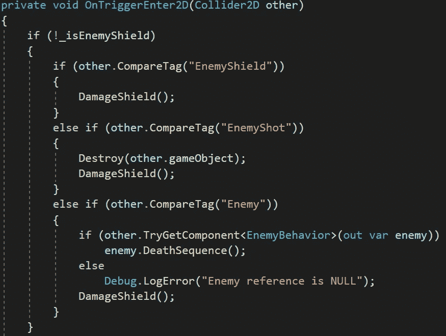

然后，如果护盾来自敌人，我们需要检查护盾和以下物体之间的碰撞:

*   玩家的盾牌
*   玩家的镜头
*   玩家本身

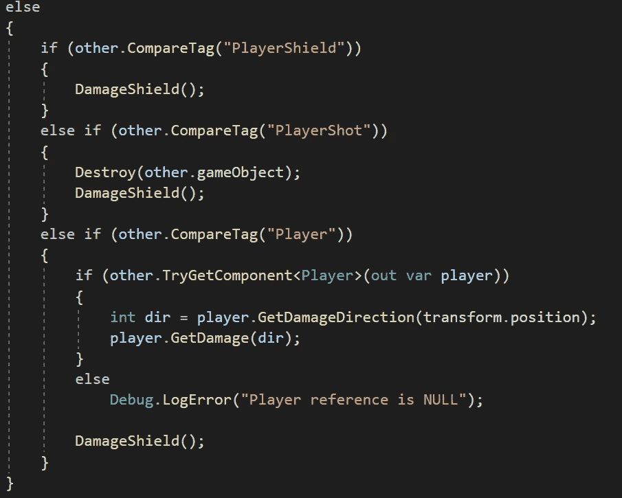

# 产卵护盾

现在，为了用盾繁殖敌人(不需要在他们各自的预设中添加盾),我们需要在繁殖管理器脚本中创建 2 个新变量:

*   敌人的盾牌

这个变量将存储一个对盾牌预置的引用。我们可以使用**【serialize field】**将预设拖到检查器中。

*   屏蔽概率

这个变量将会存储一个十进制数值，这个数值将会显示出用盾牌产生新敌人的概率。

最后，让我们在每一波产生敌人的函数中添加几行代码。我们将比较 **Random.value** 的值(返回 0 和 1 之间的值，包括 0 和 1)和盾牌概率，如果它在这个范围内，我们将把盾牌预置实例化为要产生的新敌人的孩子:

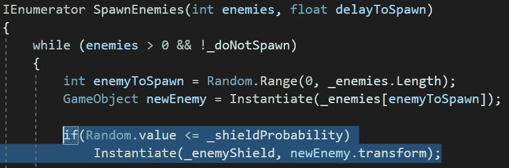

现在，如果我们在 Unity 中运行游戏，我们将能够看到一些敌人有护盾，并且护盾在他们自己的类别中工作:

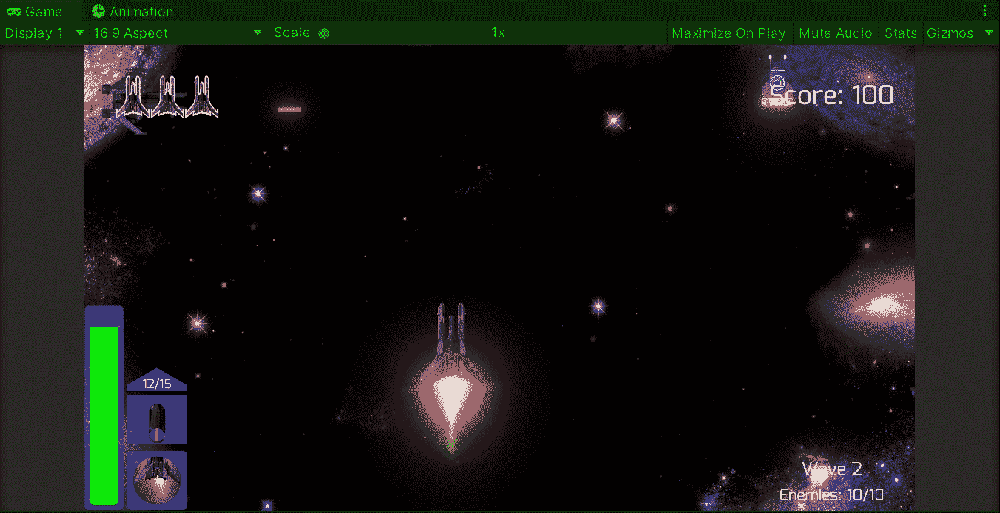

就这样，我们对敌人实施了屏蔽！:d .我会在下一篇文章中看到你，在那里我会展示更多添加到我的 Unity 太空射击游戏中的功能。

> *如果你想了解我更多，欢迎登陆*[***LinkedIn***](https://www.linkedin.com/in/fas444/)**或访问我的* [***网站***](http://fernandoalcasan.com/) *:D**