# 实现太空射击游戏功能-敌人视角

> 原文：<https://medium.com/nerd-for-tech/implementing-space-shooter-game-features-enemy-view-3095e0679365?source=collection_archive---------13----------------------->

## 统一指南

## Unity 空间射击游戏新增功能快速回顾

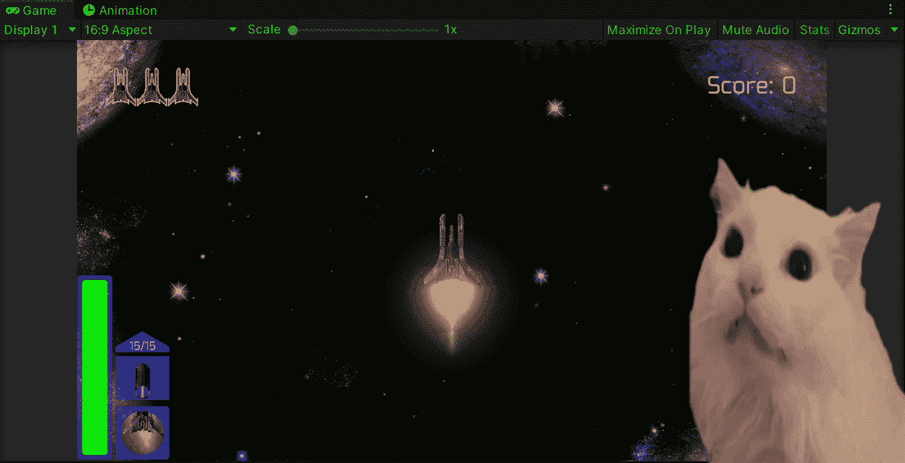

**目标**:在 Unity 的太空射击游戏中实现一种让敌人检测到电源并摧毁它们的方法。

在上一篇文章中，我用 Unity 为我的太空射击游戏中的一些敌人实现了一个智能行为。现在是时候实现一种方法，让敌人检测他们面前是否有电源，如果是这样，就试图摧毁它。

# 创建检测器

为了让敌人识别它前面的能源，让我们从拖动一个敌人预置到场景视图开始:

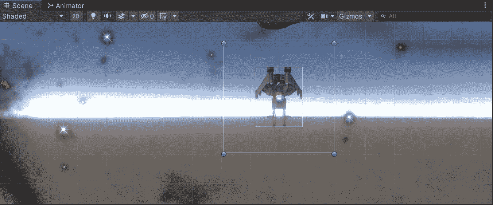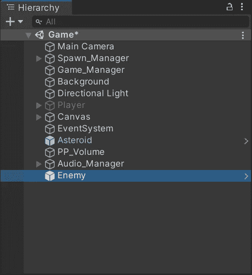

接下来，让我们创建一个新的空对象作为敌人的子对象，它将作为加电检测器。

为了能够检测到能量的增加，我们需要在新的空游戏物体上附加一个 2D 碰撞器和一个 2D 刚体。让我们启用碰撞器中的 ***Is Trigger*** 选项，并让我们使刚体成为运动学体类型，以避免在碰撞器中检测到某些东西时调用敌方父对象的 **OnTriggerEnter2D** 方法:

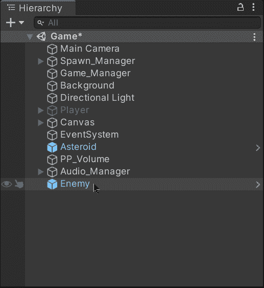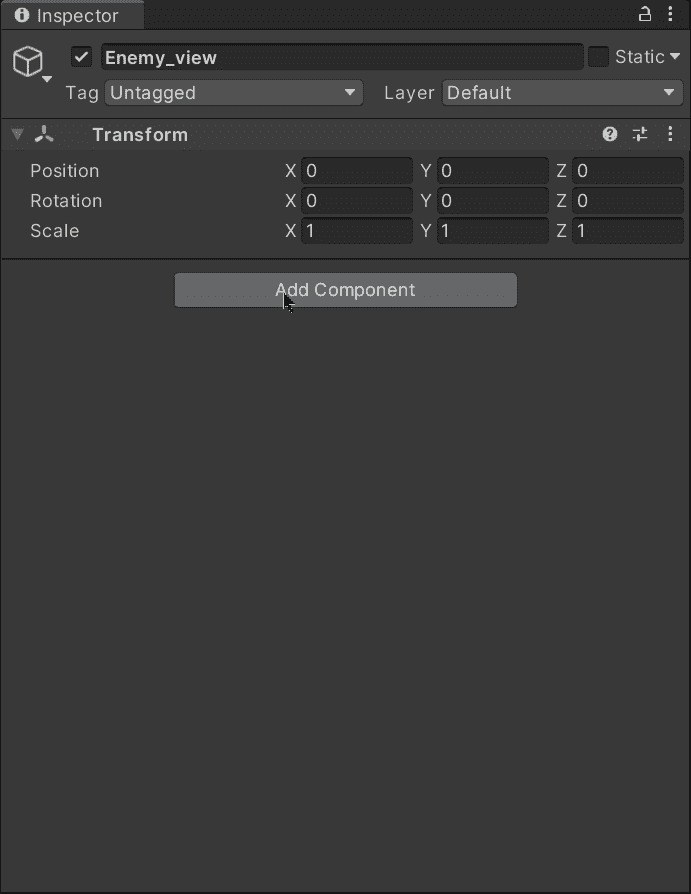

然后，让我们修改 2D 对撞机，以匹配我们的敌人预制的前视图。这样，如果一个加电(用碰撞器)进入碰撞器，我们可以使用 **OnTriggerEnter2D** 方法来检测它:

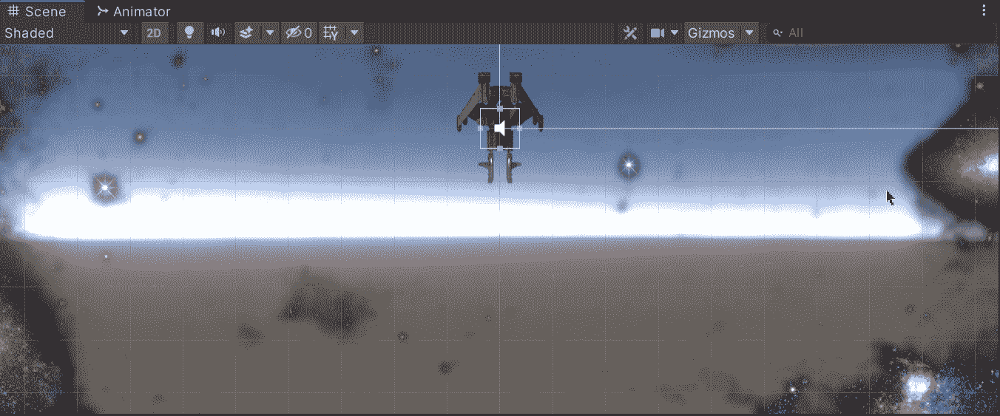

现在，让我们创建一个新的脚本来处理加电检测，并在检测发生时调用相应的操作:

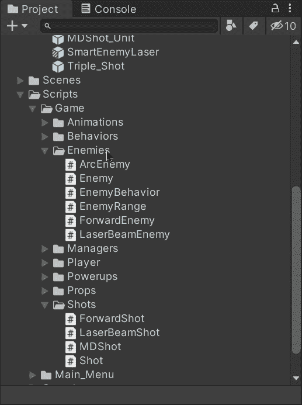

将新脚本附加到新的空游戏对象中。

# 处理检测

为了向敌人表明已经发现加电，让我们打开 **EnemyBehavior** 类并创建一个新的公共方法来调用敌人的射击方法:

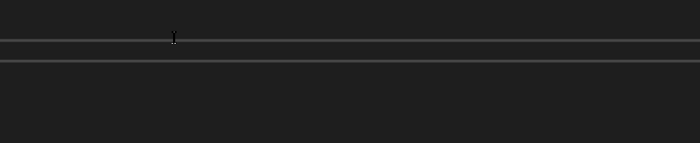

现在，让我们打开新脚本并创建一个新变量来存储对附加了 **EnemyBehavior** 类的父类的引用:

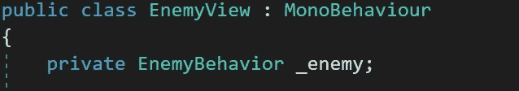

为了初始化变量，我们将在 **Start** 方法中使用 **GetComponent** 方法:

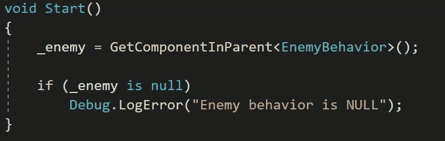

然后，为了识别加电何时进入敌人视野，让我们使用 **OnTriggerEnter2D** 方法，该方法将比较触发该方法的碰撞器的标签，以检查它是否是加电。

如果识别出一个带有加电标签的碰撞器，我们将使用 **EnemyBehavior** 类引用调用相应的公共函数:

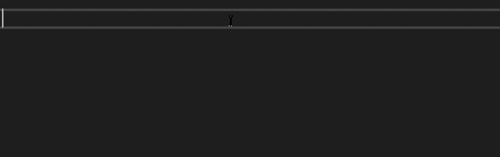

为了确保检测到加电，让我们在加电预设中添加并选择相应的标签:

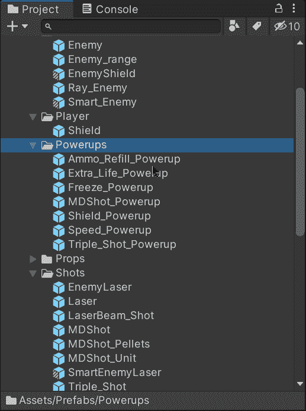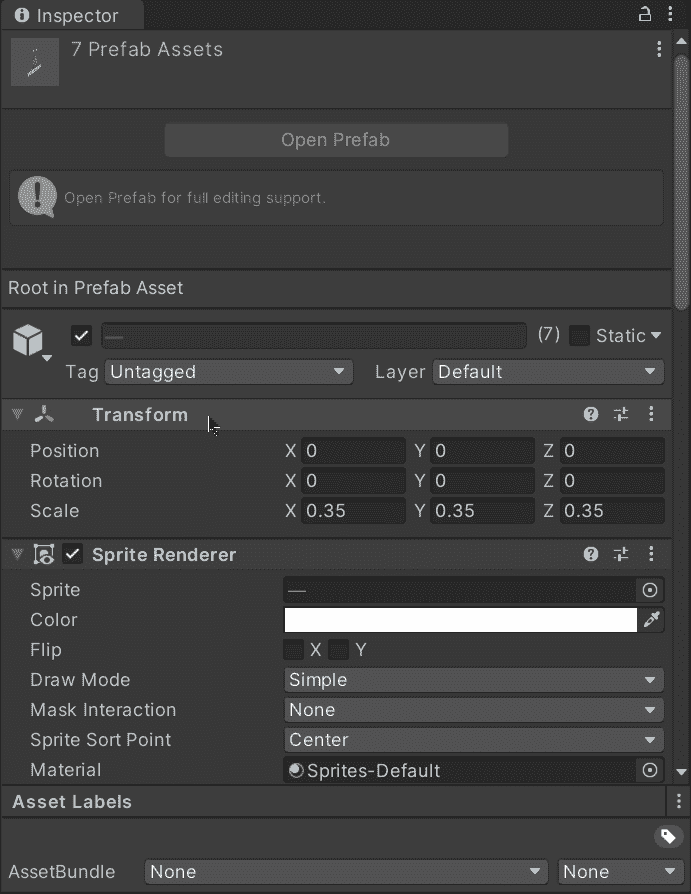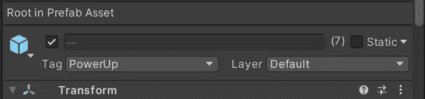

最后，让我们打开**射击**职业，并添加相应的条件，以检测何时射击来自敌人并与异能碰撞以摧毁他们两个:

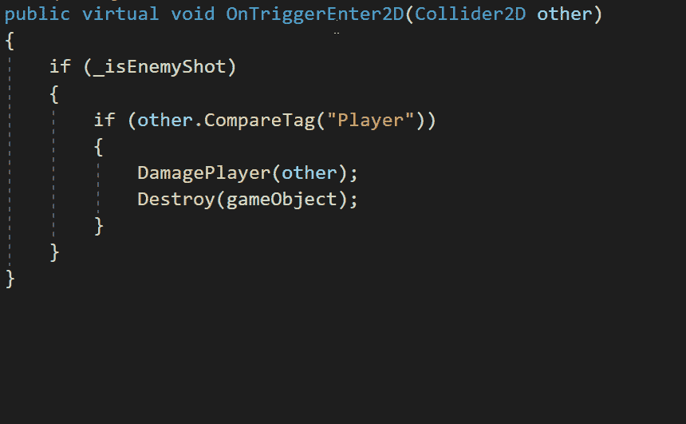

现在，如果我们尝试在场景中生成几个电源，我们将能够看到敌人在发现前方有电源时开枪摧毁它:

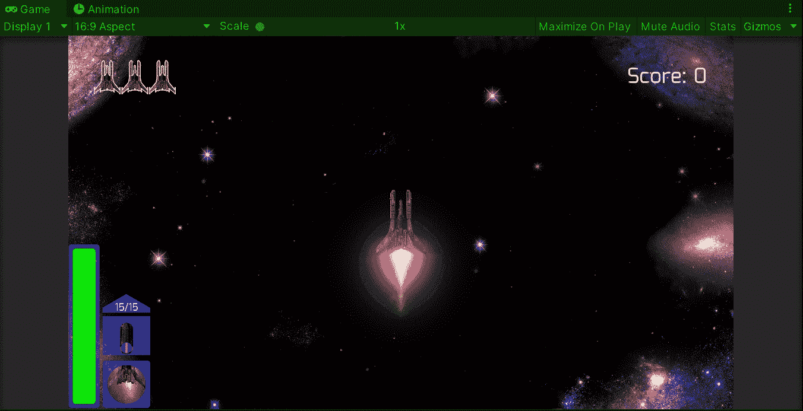

# 用视力繁殖敌人

现在，为了产生能探测到能量的敌人，让我们把空的游戏对象变成一个预置:

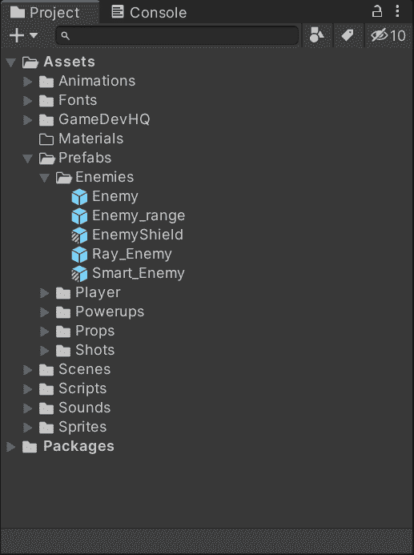

然后，让我们打开 spawn manager 脚本并添加 2 个新变量:

*   敌人的观点

这个变量将存储一个新的预置的参考，检测电源。

*   查看概率

这个变量将存储敌人能够探测到电源开启的概率。

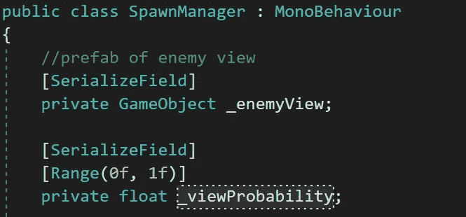

现在，由于**【serialize field】**，我们可以通过检查器修改变量来选择概率并拖动各自的预置:

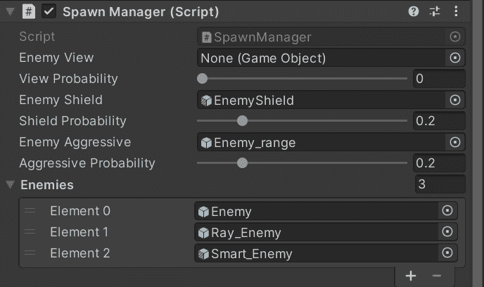

然后，为了产生一个有“视觉”的新敌人，让我们比较概率值和 **Random.value** 来实例化预设，该预设检测到作为每个产生的新敌人的孩子的通电:

现在，如果我们在 Unity 中运行游戏，我们将能够看到一些敌人检测到电源并射击他们:

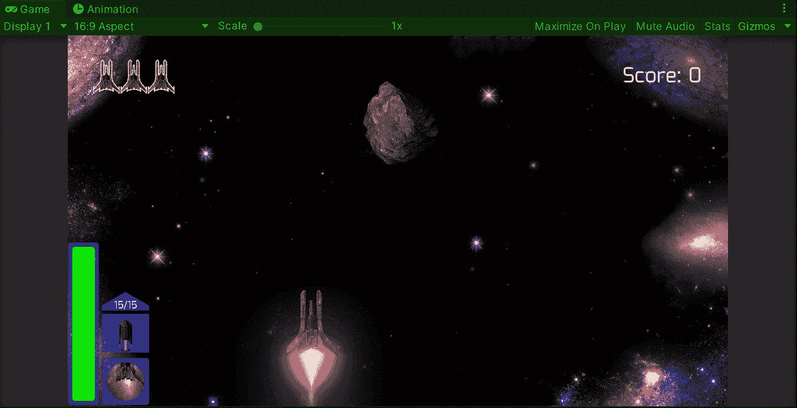

就这样，我们实现了一个检测电源的敌人！:d .我会在下一篇文章中看到你，在那里我会展示更多添加到我的 Unity 太空射击游戏中的功能。

> *如果你想了解我更多，欢迎登陆*[***LinkedIn***](https://www.linkedin.com/in/fas444/)**或访问我的* [***网站***](http://fernandoalcasan.com/) *:D**