# 实现太空射击游戏的特点-敌人波

> 原文：<https://medium.com/nerd-for-tech/implementing-space-shooter-game-features-enemy-waves-2eff7d12407?source=collection_archive---------16----------------------->

## 统一指南

## 快速回顾 Unity 中添加到太空射击游戏的新功能

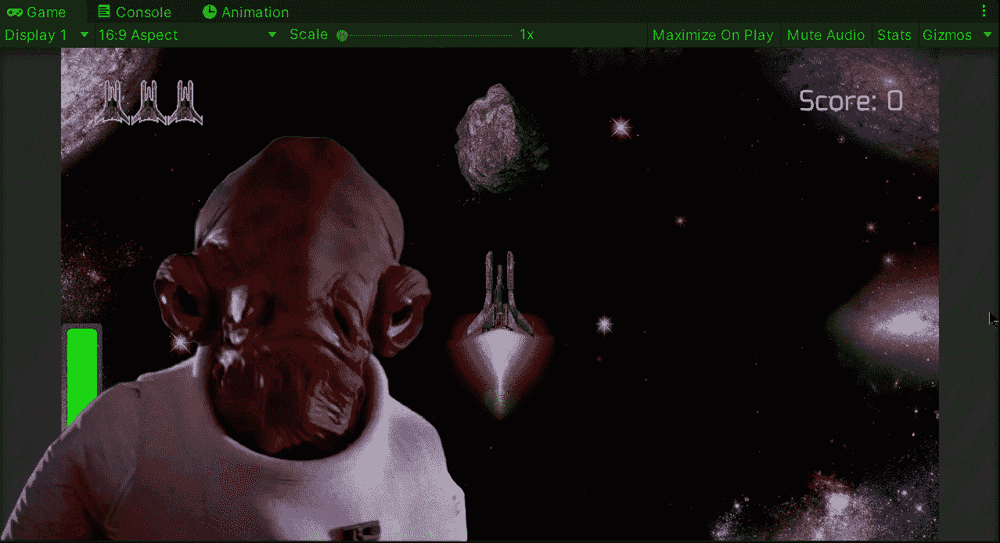

**目标**:实现一个新系统，在 Unity 的太空射击游戏中产生敌人。

在上一篇文章中，我用 Unity 为我的太空射击游戏中的敌人实现了一个新的移动行为。现在是时候实施一个新的系统来产生不同的敌人了。

# 波浪警告

在以前的一篇文章中，我介绍了如何制作一个复古游戏 over behavior，当玩家被摧毁时，它会给游戏 over 警告一个闪烁的行为:

 [## 在 Unity 中实现对行为的复古游戏

### 关于如何在 Unity 中为你的游戏创建一个复古游戏行为的快速指南

medium.com](/nerd-for-tech/implementing-a-retro-game-over-behavior-in-unity-fb126c76c4bf) 

我使用了协程来实现这种效果，但是现在，我将使用另一种方法来实现相同的行为，并使它有可能在两个或更多的文本元素中使用，而不必定制相应的方法。

首先，让我们为波浪警告添加一个新的文本元素:

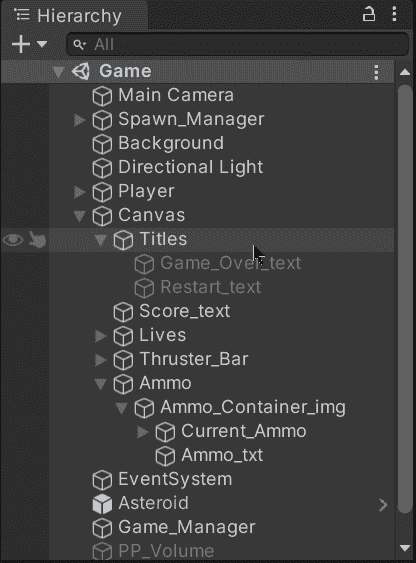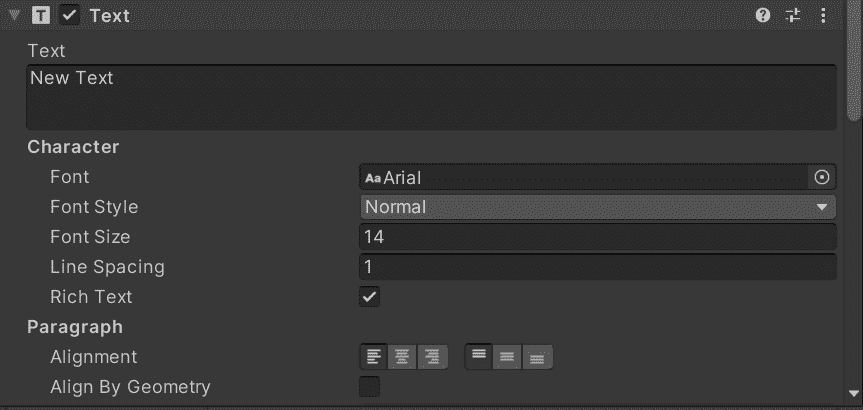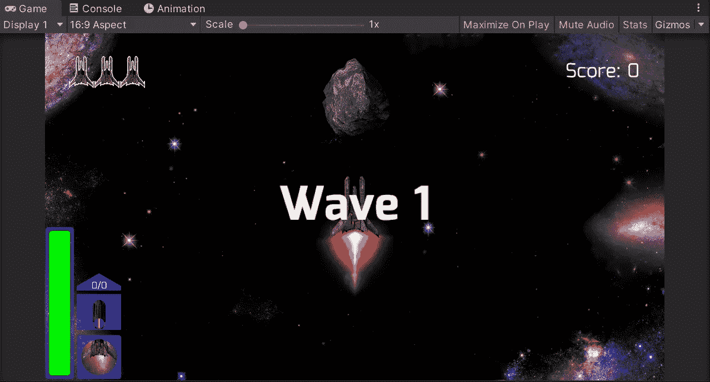

> 注意:我给我的游戏添加了一个新的字体，如果你想添加一个新的字体，你可以点击[网站选择一个你喜欢的。别忘了检查字体的许可。](https://fonts.google.com/)

下一个方法是在游戏执行时处理游戏回溯行为的协程:

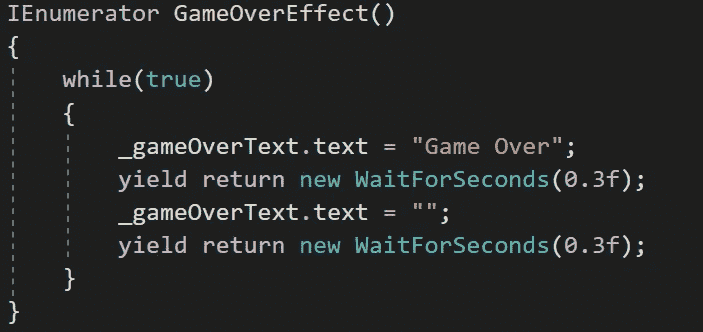

现在，在去掉协程之后，让我们[为文本元素中的闪烁效果创建一个新的动画](/nerd-for-tech/animating-sprites-in-unity-9d02762bde96)。为此，我们需要在一个动画窗口中创建它，在这里我们将选择添加**文本。启用**属性，并在整个关键帧中修改它以实现闪烁效果:

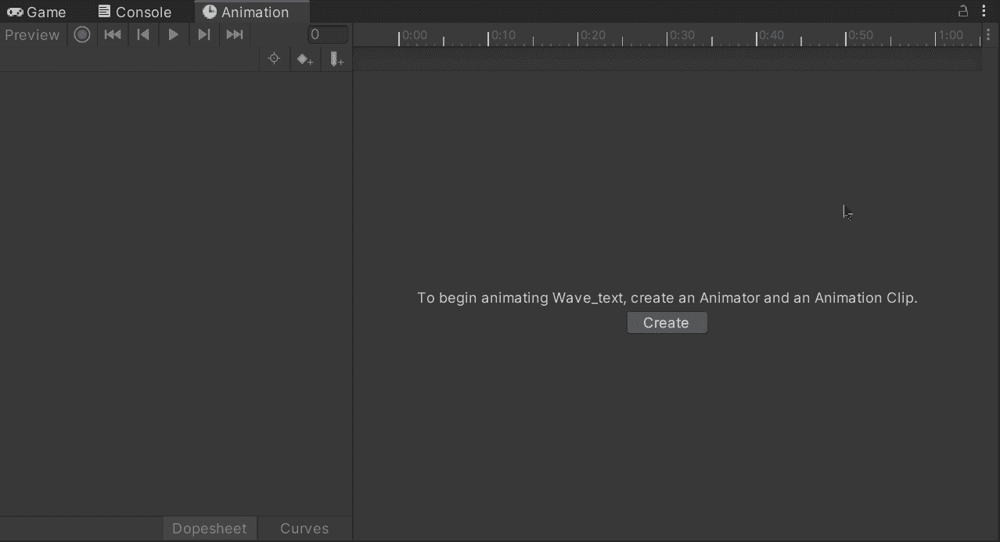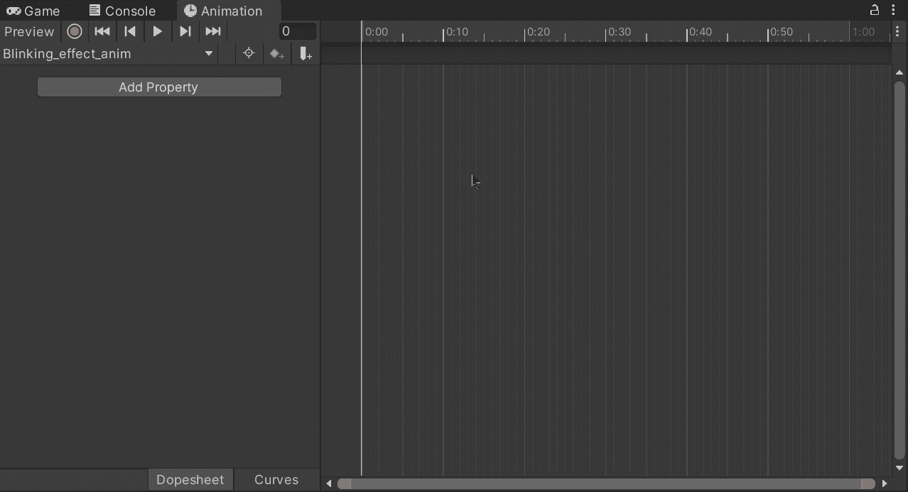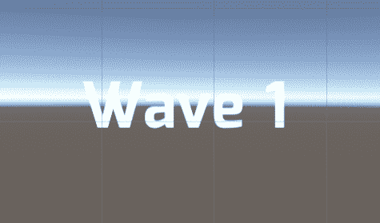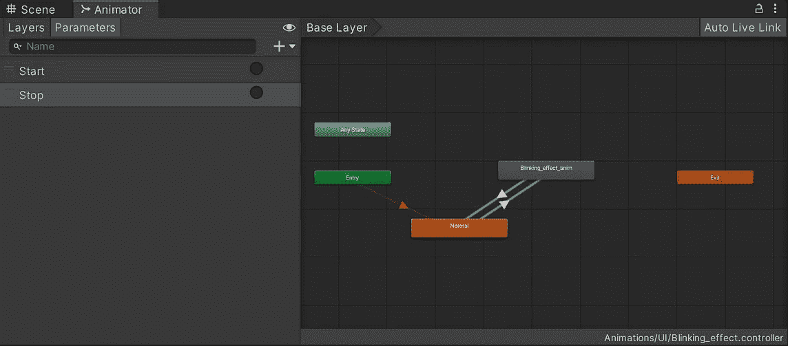

此外，为了控制闪烁的动画状态，我给动画控制器添加了一个**开始**和一个**停止**触发器。

然后，为了在调用 **Stop** 触发器后禁用相应的文本元素，我向闪烁动画状态添加了一个新的行为脚本:

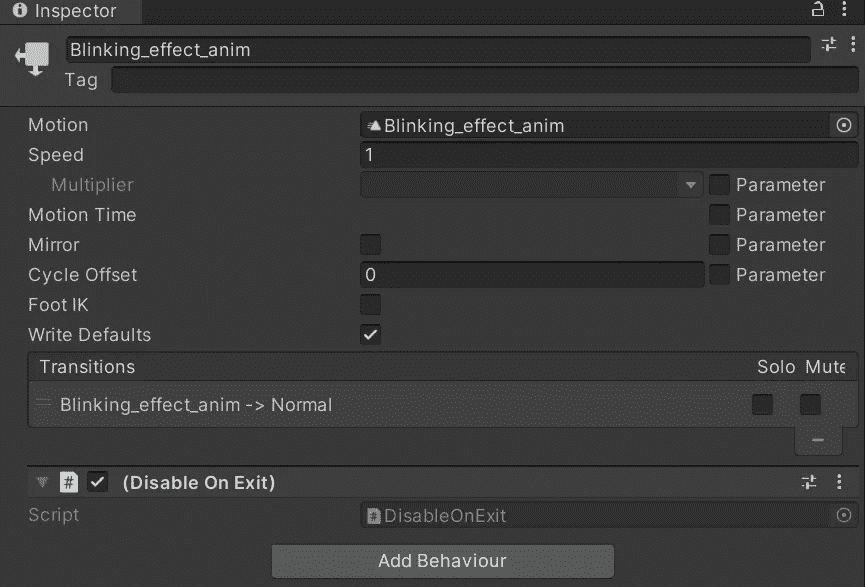

该脚本需要从**statemachinehaviation**继承并附加到状态，当文本元素离开闪烁状态时(即 **Stop** 触发器被设置时)将禁用游戏对象:

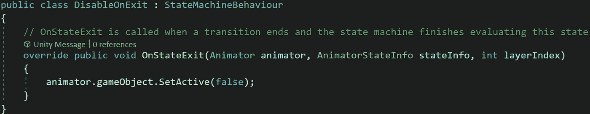

如果您想了解更多关于该课程的信息，您可以访问 Unity 文档:

 [## 状态机行为

### unity engine/Inherits from:ScriptableObject/建议更改感谢您帮助我们提高质量…

docs.unity3d.com](https://docs.unity3d.com/ScriptReference/StateMachineBehaviour.html) 

这样，我们可以确保控制闪烁动画的时间，就像这样:

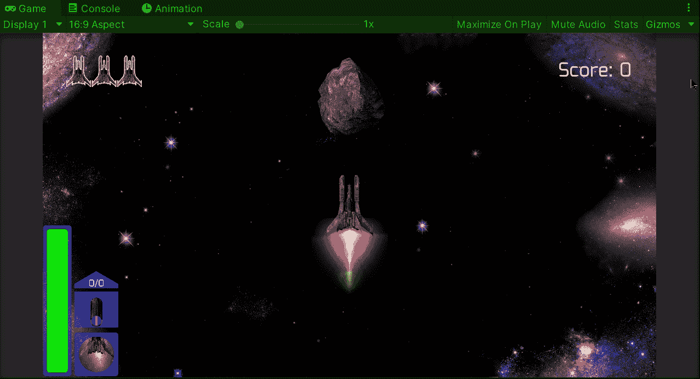

# Wave 实现

为了实现敌人的浪潮，让我们打开产卵管理器脚本并修改当前的敌人产卵协程，以接收要产卵的敌人数量以及在产卵每个敌人之前各自等待的延迟:

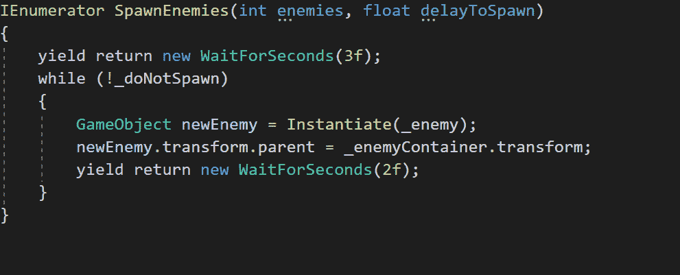

因此，为了初始化一个新的波，我们需要提供各自的参数:

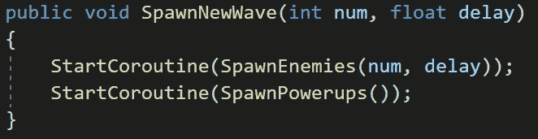

现在，让我们打开游戏管理器脚本:

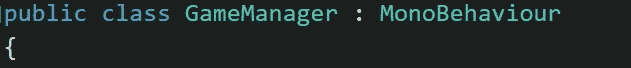

这里，我们需要一些变量来管理 wave 系统，并引用 spawn 管理器:

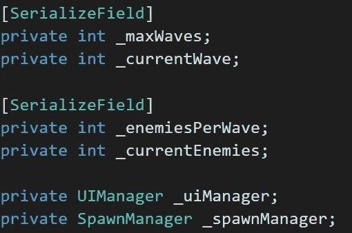

这样，我们可以通过检查器编辑波数和每波增加的敌人数:

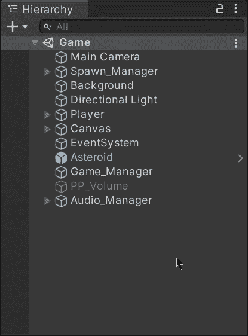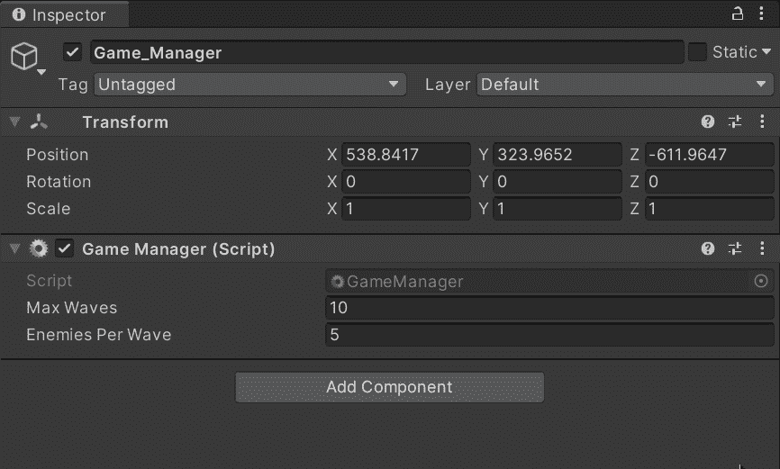

现在，为了管理 wave 警告和 wave 生成，让我们使用一个新的协程，它将使用 UI 管理器显示警告，然后使用 spawn 管理器生成新的 wave:

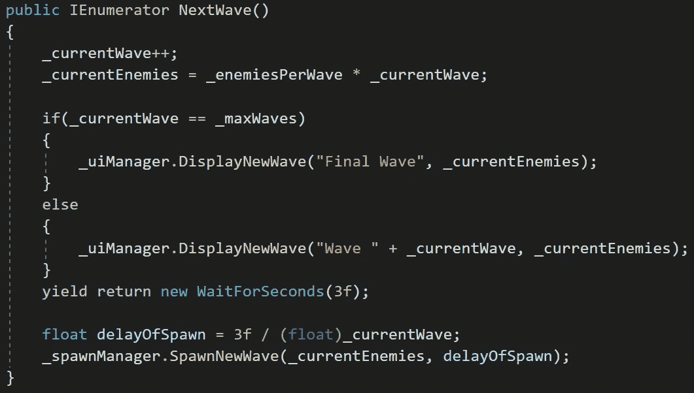

为了处理当前的波动，让我们使用一个新的公共方法，它将在被破坏之前被一个敌人调用。这样我们就可以更新每一波要消灭的敌人，并在他们被消灭后调用下一波:

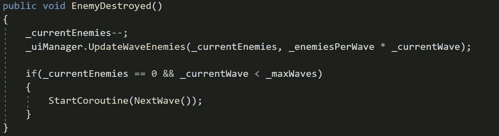

最后，让我们添加一个公共方法，当它被调用时启动游戏:

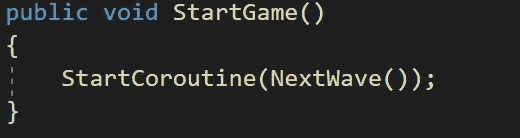

现在，如果我们在摧毁小行星后调用此方法，我们将看到波浪警告和系统按预期工作:

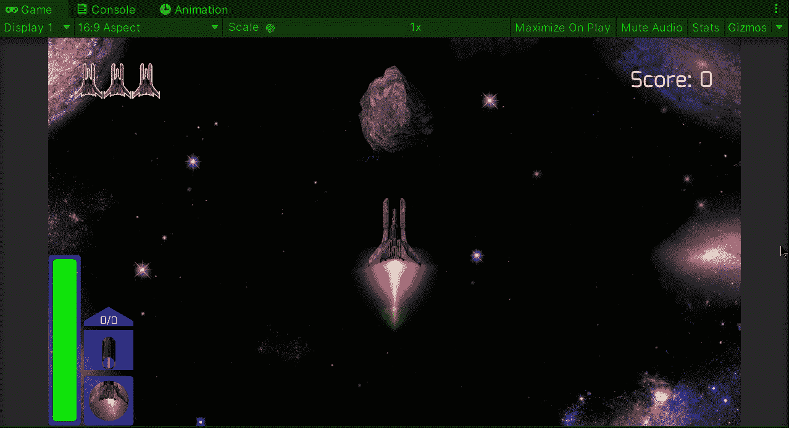

就是这样，我们实现了一个波系统来产生敌人！:d .我会在下一篇文章中看到你，在那里我会展示更多添加到我的 Unity 太空射击游戏中的功能。

> *如果你想更多地了解我，欢迎登陆*[***LinkedIn***](https://www.linkedin.com/in/fas444/)**或访问我的* [***网站***](http://fernandoalcasan.com/) *:D**