# 实现太空射击游戏功能-规避策略

> 原文：<https://medium.com/nerd-for-tech/implementing-space-shooter-game-features-evasive-maneuver-3dc197eb7947?source=collection_archive---------20----------------------->

## 统一指南

## Unity 空间射击游戏新增功能快速回顾

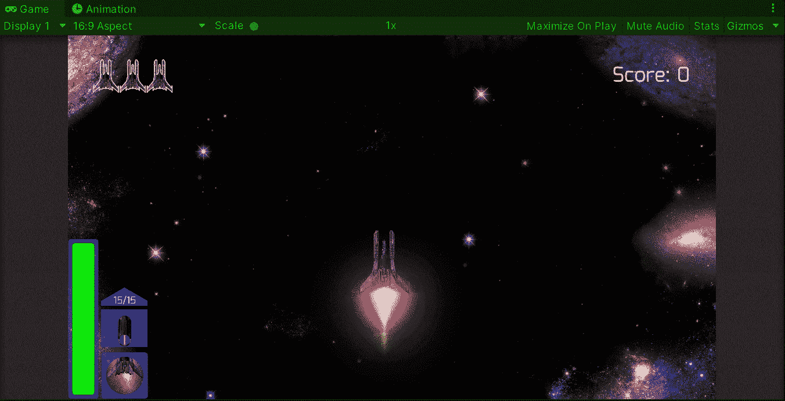

**目标**:在 Unity 的太空射击游戏中，为敌人实施躲避行为，以避免射击。

在之前的帖子中，我[在我的 Unity 太空射击游戏中为玩家实现了一种吸引能量的方式](/nerd-for-tech/implementing-space-shooter-game-features-attract-power-ups-83b3666daffe)。现在是时候对一些敌人实施规避行为，以避免玩家的射击。

# 识别镜头

为了识别玩家的射击，让我们使用 **EnemyRange** 类，它在[一个旧帖子](/nerd-for-tech/implementing-space-shooter-game-features-aggressive-enemies-bc123d1e1ed1)中被用来检测玩家，并给敌人一个聪明的行为来尝试撞击它:

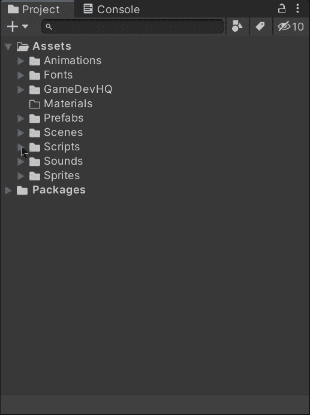

在本课中，我们使用 **OnTriggerEnter2D** 的方法来探测敌人周围一定范围内的对撞机。在这种情况下，我们只是检查属于标记为“*玩家”*的游戏对象的碰撞器:

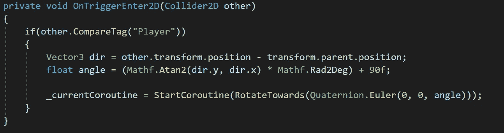

因此，为了识别玩家镜头的碰撞体，让我们加入一个新的条件，检查属于标记为“*玩家镜头*”的游戏对象的碰撞体:

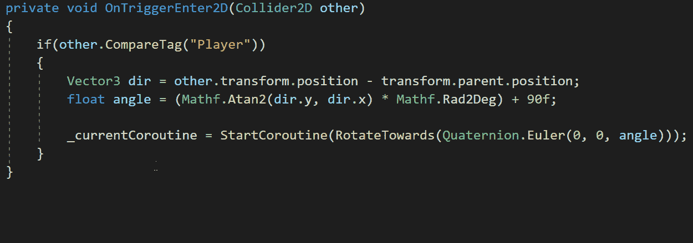

# 回避行为

让我们检查游戏的下一帧，我们有玩家向它前面的敌人射击:

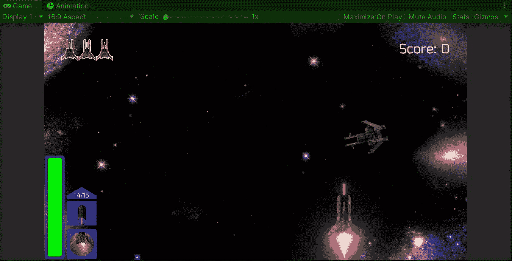

如果我们转到场景视图，我们将能够看到射击碰撞器刚刚触发了 **EnemyRange** 类的**ontrigerenterra2d**方法。正如你所看到的，我们在场景中有一些颜色线，这些将在我们将要做的事情中起到重要作用，以避免镜头:

*   红线

计算子弹进入**敌人区域**碰撞器的方向。

*   黄色标线

通过在红线向量和 Z 轴向量之间做叉积，我们就能得到这条线，它代表垂直方向。有了这个方向，我们可以告诉敌人在子弹击中它之前向那个方向移动。

*   绿线

这条线代表了镜头和 Z 轴之间的另一个垂直方向，我们也可以使用这个方向来移动并尝试避免镜头。

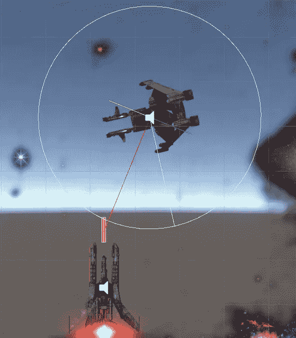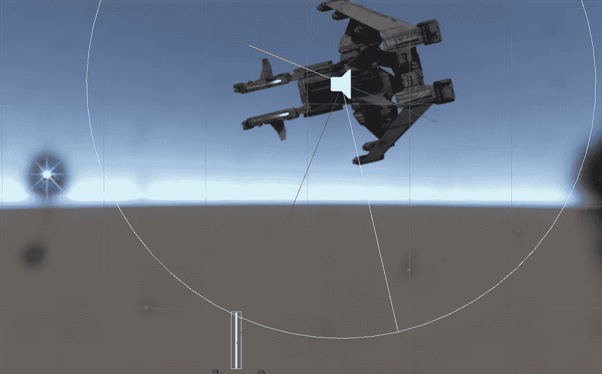

为了更好地形象化，让我们看下一张图片:

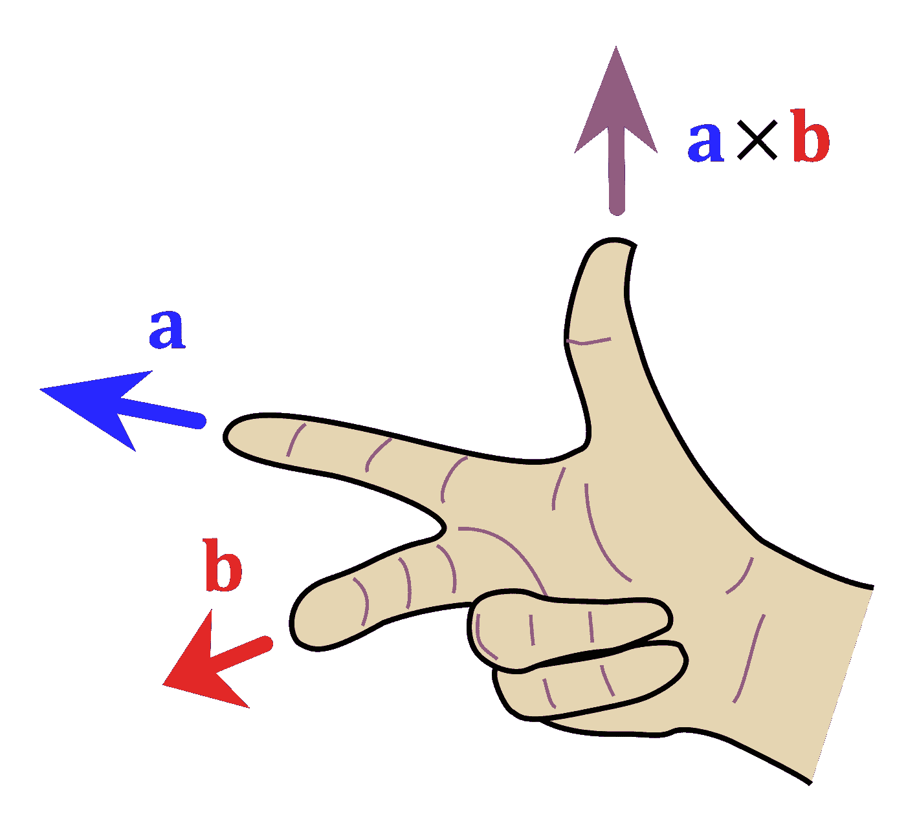

图片来自[维基百科](https://en.wikipedia.org/wiki/Cross_product#/media/File:Right_hand_rule_cross_product.svg)

叉积返回一个新向量，该向量垂直于所用的两个向量。在这种情况下，我们可以说向量 *a* (蓝色)是 Z 轴向量(0，0，1)，向量 *b* (红色)是从射击到敌人的方向。因此，通过使用这些向量的叉积，我们获得了移动敌人的垂直方向，并试图避免射击。

## 敌人靶场等级

让我们打开 **EnemyRange** 类并创建一些新变量:

*   回避范围

该变量将存储沿垂直方向的回避机动的长度。我们可以使用**【serialize field】**通过 inspector 修改它的值。

*   避免延误

该变量将存储在进行另一次规避机动之前等待的期望延迟。

*   耽搁

这个变量将作为协程中要返回的值，这样我们就不会因为创建新的 **WaitForSeconds** 而浪费更多的内存。

*   避免

这个变量将指示敌人是否正在躲避射击。

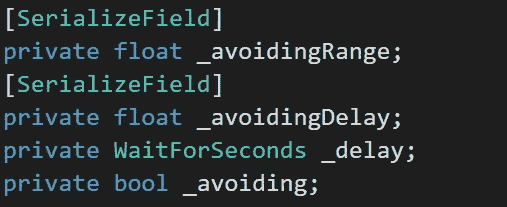

现在，在 **Start** 方法中，让我们初始化变量，以在避免一个快照后返回各自的协程内部:

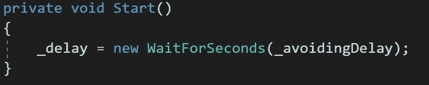

接下来，让我们再次使用 **OnTriggerEnter2D** 方法，在这里我们检查被识别的碰撞器是否用“ *PlayerShot* 标记:

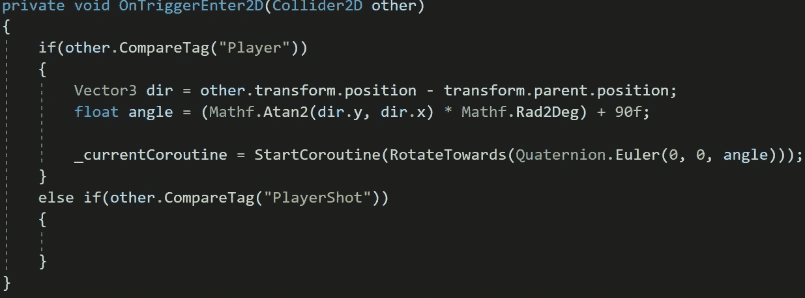

然后，为了获得垂直方向，让我们通过减去各自的位置来获得从射击到敌人的方向。之后，让我们使用**矢量 3。Cross** 方法获得方向和**向量 3.forward** (代表 Z 轴(0，0，1))的叉积。最后再补充一下**。最后归一化**以获得矢量的方向:

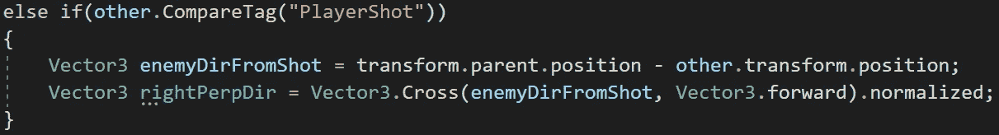

现在，要选择使用垂直方向向左或向右移动，让我们通过比较 **Random.value** 和返回向左或向右方向来选择一个:

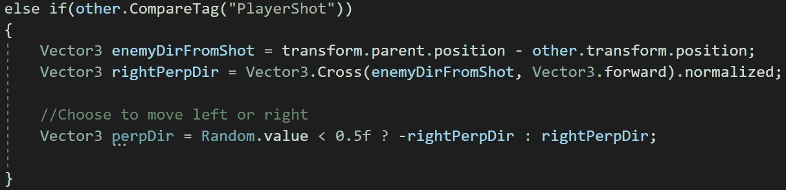

接下来，让我们创建一个新的协程，它接收垂直方向并将其添加到敌人的位置。然后，我们返回延迟变量以在执行另一个回避策略之前等待:

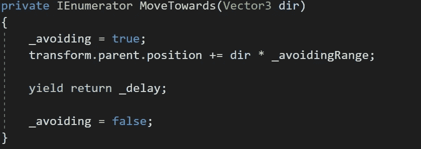

最后，在我们获得垂直方向移动后，我们称之为协程。为了避免启动其他协程，让我们检查一下敌人此刻是否没有躲避射击:

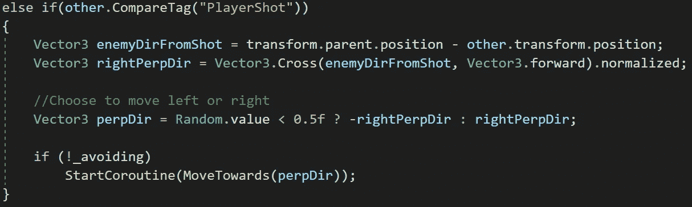

现在，如果我们在 Unity 中运行游戏，我们将能够看到敌人如预期的那样避开了射击:

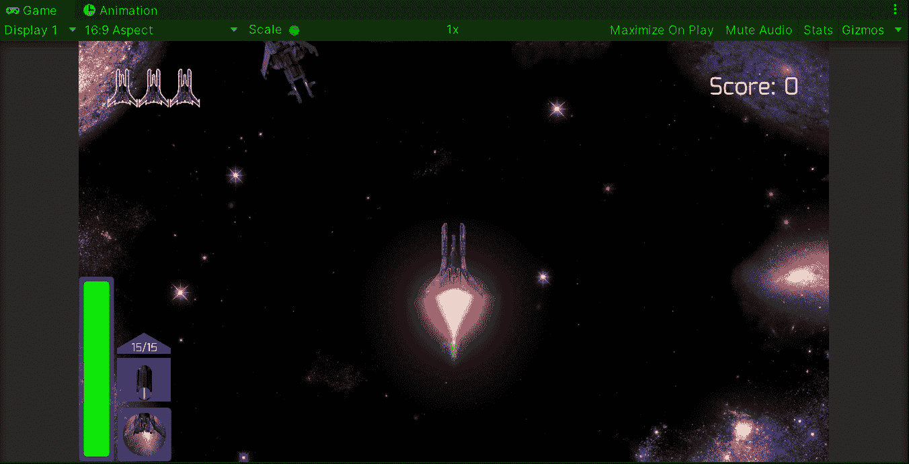

> 注意:我们也可以使用 **Vector3。将敌人顺利转移到新方向的方法。**

# 实现行为

因为我们使用 **EnemyRange** 类来实现新的回避行为，所以让我们创建两个新的 bool 变量来指示脚本是打算跟随玩家还是回避镜头:

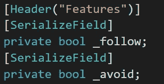

这样，我们可以在检查器中修改预设的各个属性:

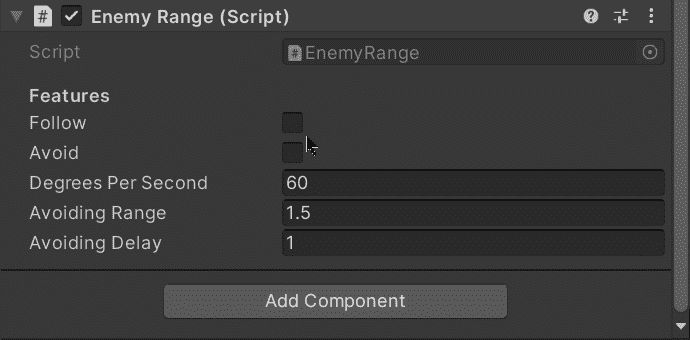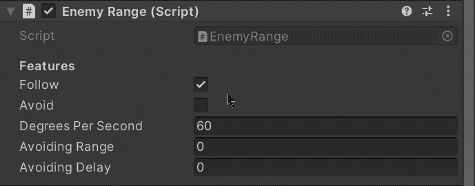

让我们制作一个新的变体预设，它有一个避免射击的脚本和一个跟随玩家的脚本:

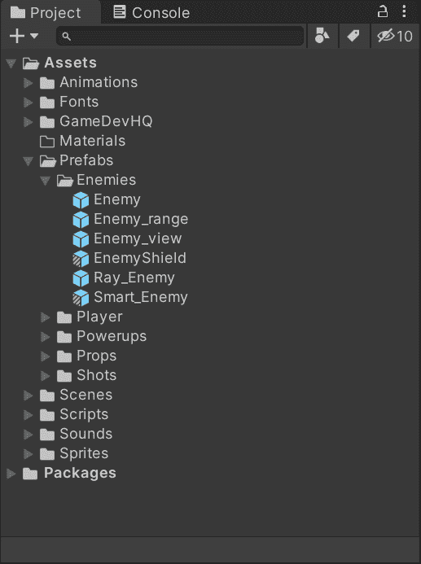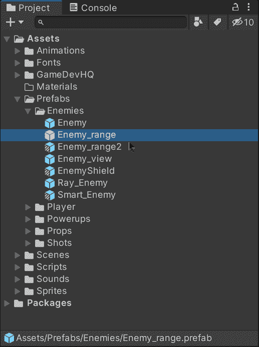

为了处理这些行为，我们可以在 **OnTriggerEnter2D** 方法的条件中添加相应的布尔值:

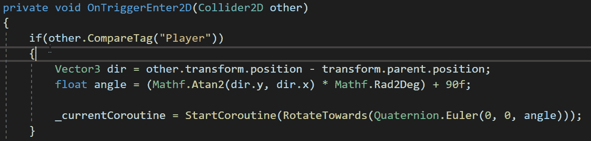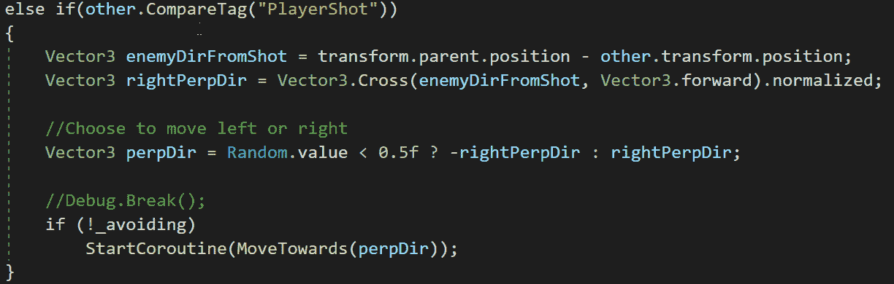

现在，为了实现 waves 中的行为，让我们打开 spawn manager 脚本并创建一个新变量来存储对新预设的引用，以避免快照:

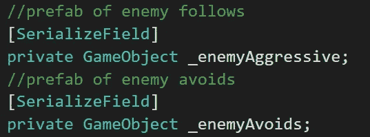

enemyAggresive 变量存储对以下行为预置的引用。

然后，为了表示每个敌人具有各自行为的概率，让我们使用浮点数:

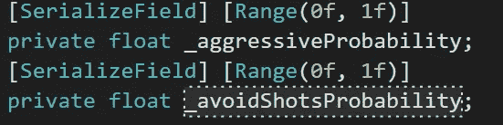

然后，在产生敌人的方法中，让我们将概率值与 **Random.value** 进行比较，以决定新的躲避行为是否应该实例化为敌人的子游戏对象:

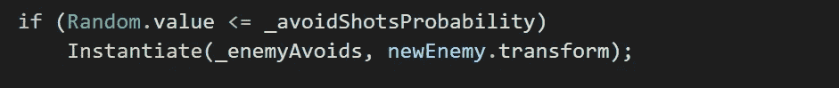

最后，在检查器中，让我们添加各自的预设并修改概率值:

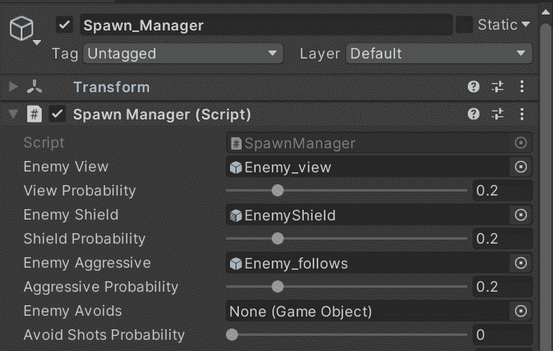

现在，如果我们在 Unity 中运行游戏，我们将能够看到躲避射击或试图撞击玩家的敌人:

就是这样，我们实现了一个新的行为，以避免镜头！:d .我会在下一篇文章中看到你，在那里我会展示更多添加到我的 Unity 太空射击游戏中的功能。

> *如果你想了解我更多，欢迎登陆*[***LinkedIn***](https://www.linkedin.com/in/fas444/)**或访问我的* [***网站***](http://fernandoalcasan.com/) *:D**