# 实现空间射击游戏功能-额外的生活

> 原文：<https://medium.com/nerd-for-tech/implementing-space-shooter-game-features-extra-life-a670cc82f2b9?source=collection_archive---------14----------------------->

## 统一指南

## Unity 空间射击游戏新增功能快速回顾

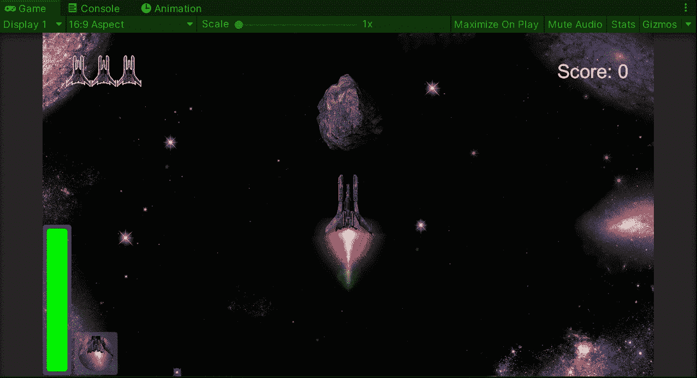

**目标**:用 Unity 实现一个太空射击游戏的生命值提升物品。

在之前的帖子中，我[在我的 Unity 太空射击游戏中为玩家的盾牌](/nerd-for-tech/implementing-space-shooter-game-features-shield-strength-1fd3c5c18ee3)实现了一个力量可视化器。现在是时候实现一个新的提供健康或额外寿命的项目了。

首先，就像我们在[的旧帖子](/nerd-for-tech/creating-a-power-up-for-your-game-in-unity-6810d73376a1)中所做的那样，让我们通过将相应的精灵拖入场景中来创建启动项目:

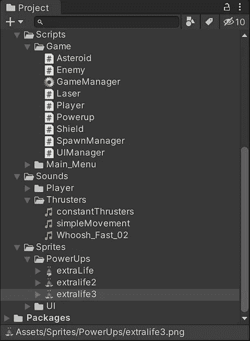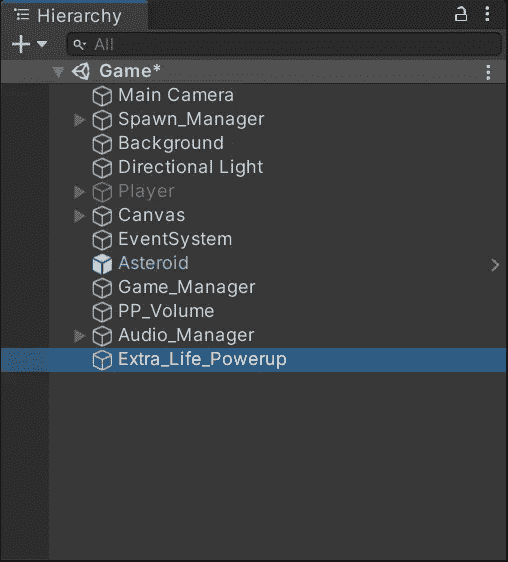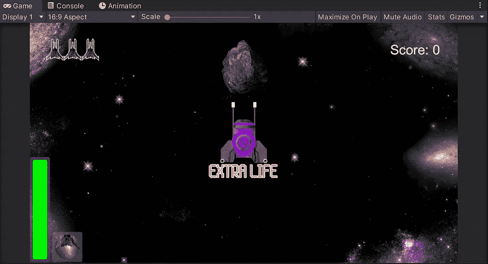

然后，让我们在检查器中添加我们需要的组件(碰撞器、刚体和启动脚本):

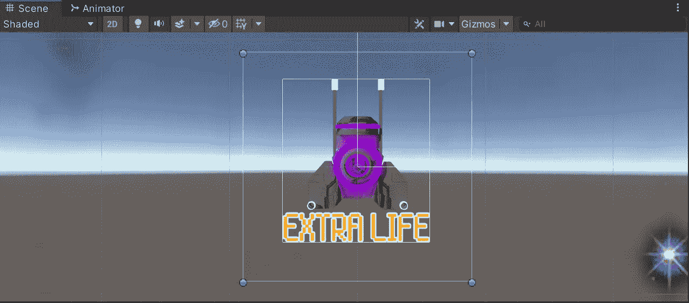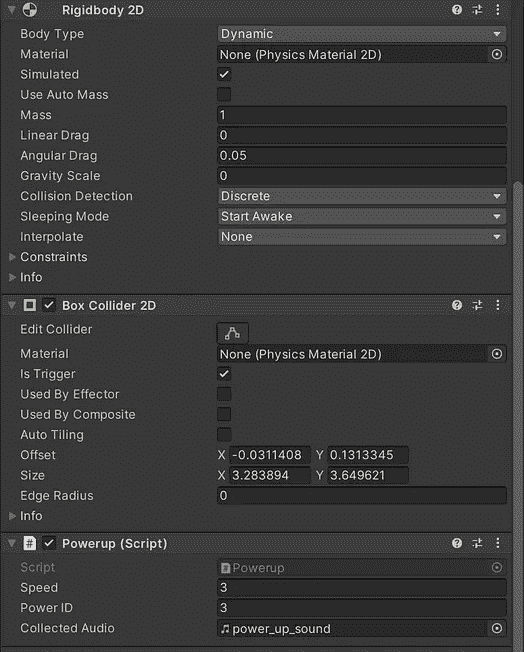

由于已经有 3 个其他加电，额外寿命将在加电脚本中以数字 3 作为电源 ID。

现在让我们把它拖到各自的文件夹中来创建它的预置:

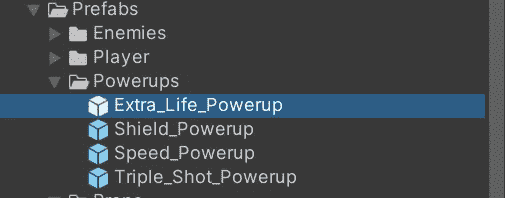

## 衍生管理器脚本

然后，选择产卵管理器并将预置添加到我们在之前[创建的能量阵列中:](/nerd-for-tech/creating-a-power-up-for-your-game-in-unity-6810d73376a1)

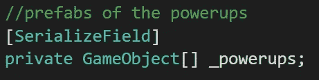

这是 Spawn Manager 脚本中的数组。

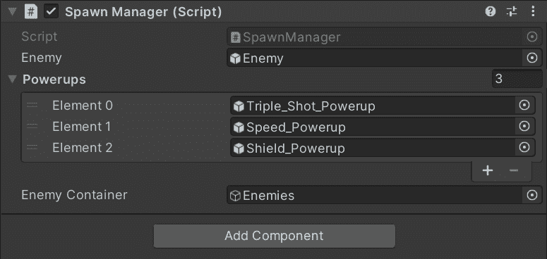

该阵列现在将有 4 次通电。

然后，在 Spawn Manager 脚本中，让我们在脚本中添加相应的加电次数，以便随机生成包括它:

你也可以使用**数组。长度**值，以避免使用硬编码数字。

## 通电脚本

现在，让我们打开加电脚本，并在 switch 语句中添加相应的调用，该调用在加电与播放器冲突时检查电源 ID:

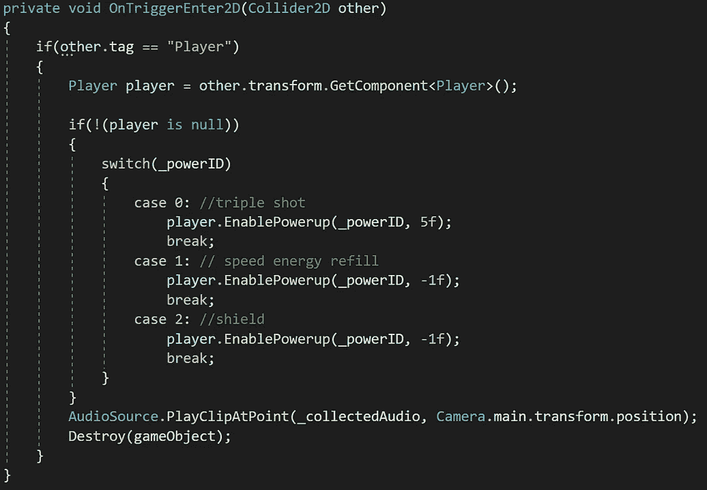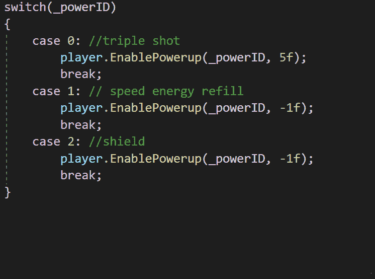

第二个参数表示上电持续的时间。负值表示不需要取消加电。

## 玩家脚本

然后，让我们打开播放器脚本，在 **EnablePowerup** 方法中添加加电案例。我们将为玩家添加额外的生命，然后在启动时更新 UI 中的数字:

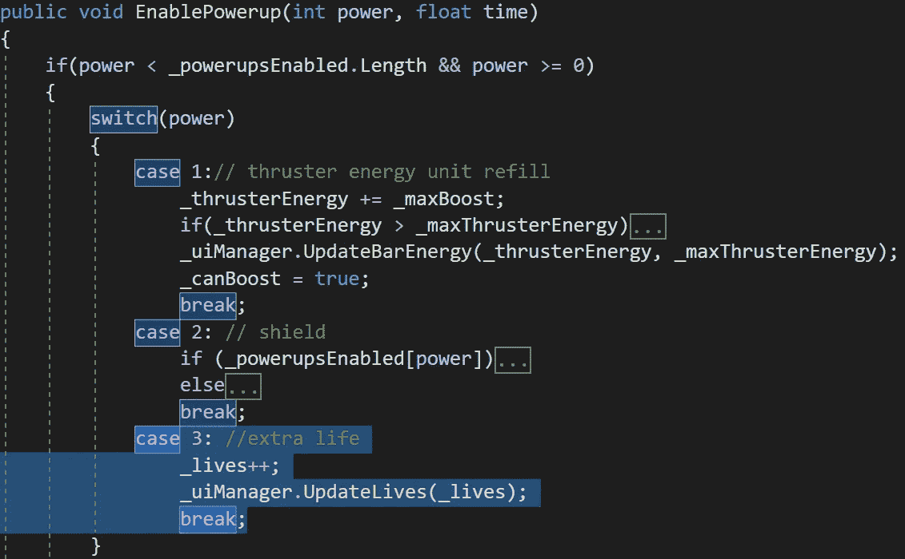

## UI 管理器脚本

现在，为了指示玩家何时获得额外的生命，让我们在画布中创建一个新的文本元素，并把它放在生命显示器之后:

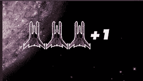

文本元素将显示玩家收集的额外生命的数量。

然后，在 UI 管理器脚本中，让我们创建一个新变量来存储对文本元素的引用:

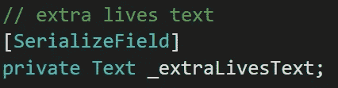

使用**【serialize field】**能够从检查器中拖动值。

现在，在检查器中，将文本元素拖动到 UI 管理器脚本组件中:

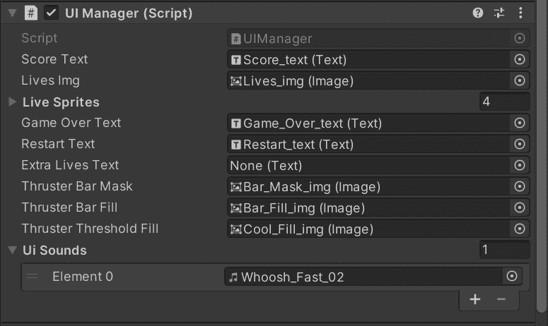

最后，让我们在更新 UI 管理器中的生命的函数中添加相应的条件，以使用新的文本元素显示额外的生命:

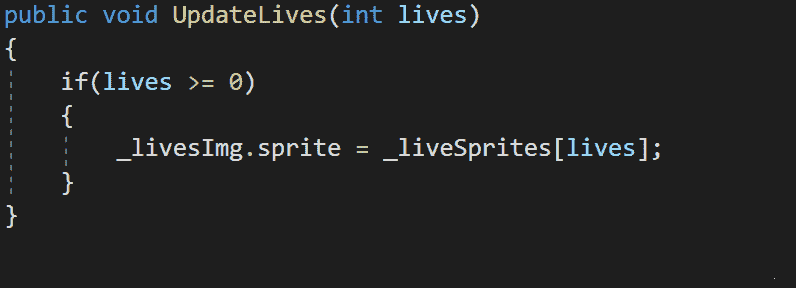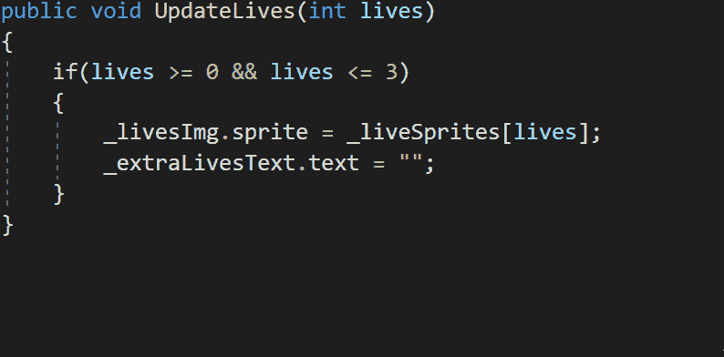

现在，如果我们运行游戏，我们会看到当玩家收集额外生命能量物品时，会显示额外生命:

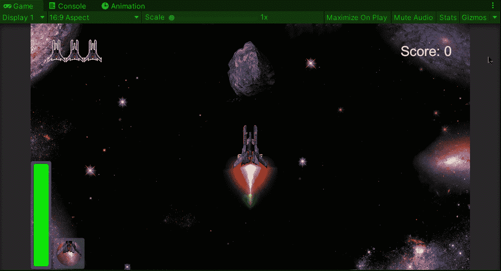

## 玩家脚本

现在，为了让新的能量物品有治疗效果，我们可以在每次收集额外生命时关闭玩家的伤害观察器。让我们在播放器脚本中添加一个新函数来处理它:

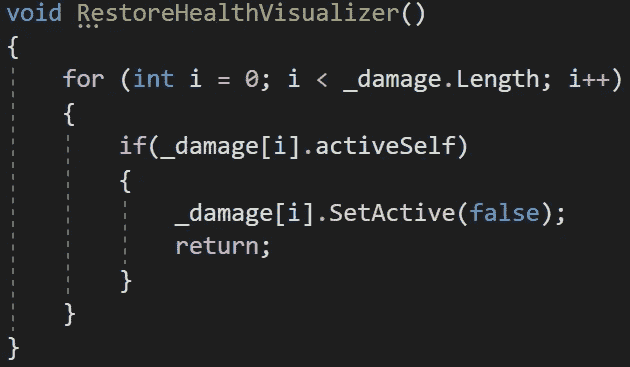

使用 **return** 将结束函数，以避免在数组中搜索更多的元素。

然后，让我们在收集上电后添加相应的呼叫:

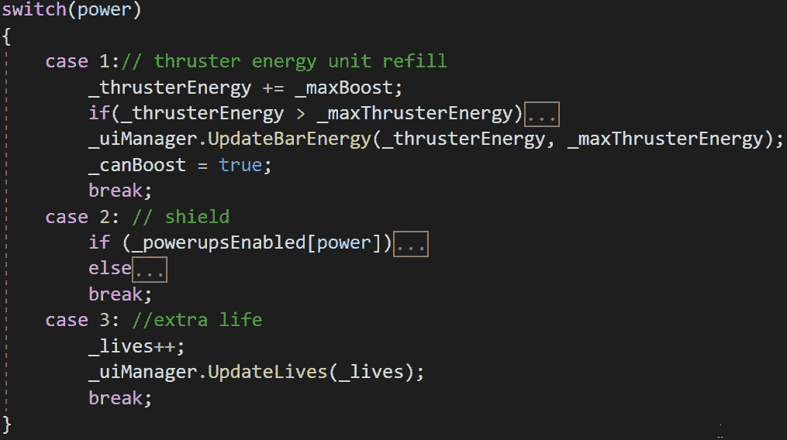

如果我们运行游戏，我们会看到当玩家收集到能量物品时，伤害可视化器被关闭:

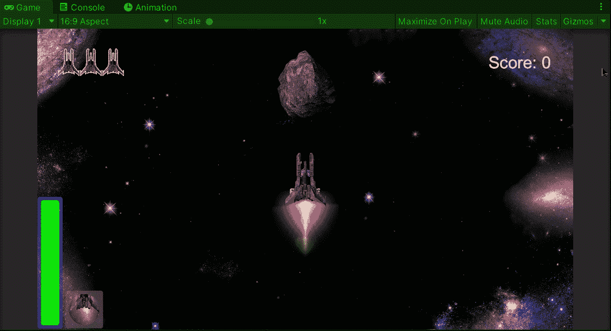

就这样，我们实现了一个健康启动项目！:d .我会在下一篇文章中看到你，在那里我会展示更多添加到我的 Unity 太空射击游戏中的功能。

> *如果你想了解我更多，欢迎登陆*[***LinkedIn***](https://www.linkedin.com/in/fas444/)**或访问我的* [***网站***](http://fernandoalcasan.com/) *:D**