# 实现太空射击游戏功能-最终 boss

> 原文：<https://medium.com/nerd-for-tech/implementing-space-shooter-game-features-final-boss-a03390c9b327?source=collection_archive---------11----------------------->

## 统一指南

## Unity 空间射击游戏新增功能快速回顾

**目标**:用 Unity 实现一款太空射击游戏中的最终 boss。

在之前的帖子中，我在 Unity 的太空射击游戏中[实现了一个追踪操场上最近的敌人](/nerd-for-tech/implementing-space-shooter-game-features-homing-shot-7820726f5538)的新镜头。现在是时候实施游戏的最终 boss 了。

# 新资产

就像我在以前的帖子中说过的，我们需要加入新的精灵来创建最终的 boss，它的动画和它的特定镜头。如果你不知道在哪里创建或获得新的精灵，那么我推荐你使用一个免费的在线程序(像我一样):

 [## 图片编辑:Pixlr.com——免费在线图片编辑

### 登录/注册欢迎使用 Pixlr 的免费高级照片编辑器。点击打开照片按钮开始编辑…

pixlr.com](https://pixlr.com/e/) 

此外，如果你不知道如何在 Unity 中添加精灵或动画，你可以查看这些旧帖子:

 [## 在 Unity 中从原型升级为艺术品

### 关于从原型升级到 Unity 艺术作品的详细指南

fas444.medium.com](https://fas444.medium.com/upgrading-from-a-prototype-to-a-work-of-art-in-unity-4f3c0435501d)  [## 在 Unity 中制作精灵动画

### 关于如何在 Unity 中制作精灵动画的快速指南

medium.com](/nerd-for-tech/animating-sprites-in-unity-9d02762bde96)  [## 在 Unity 中为你的游戏制造爆炸

### 关于如何在 Unity 中使用动画精灵创建爆炸的快速指南

medium.com](/nerd-for-tech/creating-explosions-for-your-game-in-unity-889e9c373d14) 

## 老板精灵

为了创建和动画制作最终的 boss，我决定创建 100 多个精灵。这些精灵由 3 个动画片段组成，最终的 boss 可以移动、射击和传送。

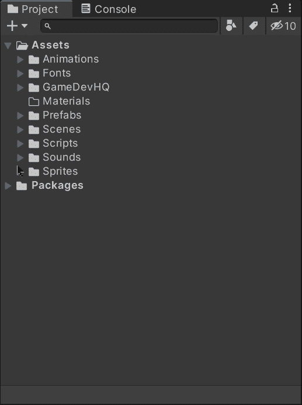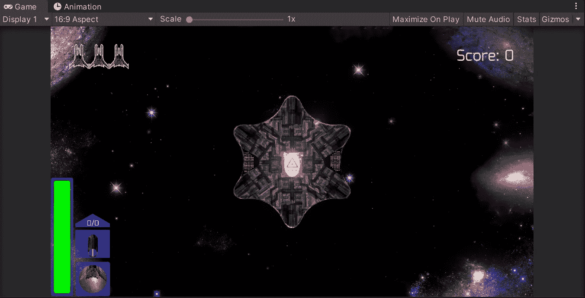

使用动画视图，我们可以修改每一帧中最终 boss 的精灵，以应用动画剪辑:

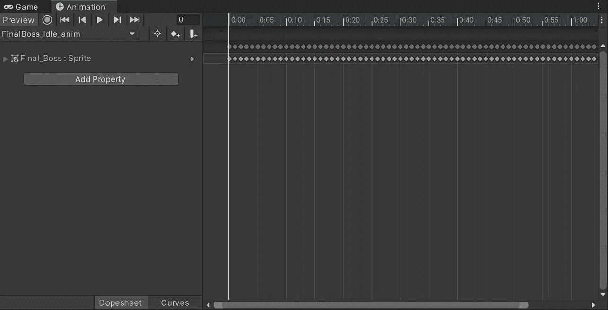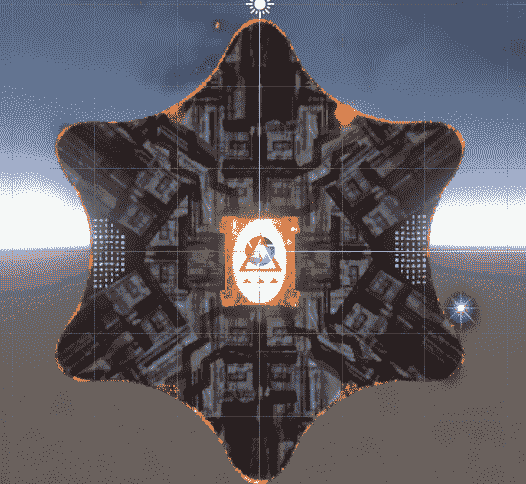

此外，在 Animator 视图中，我们可以使用参数来控制动画的状态或最终 boss 的行为。正如你在下一张图中看到的，最终的 boss 将能够从最初的空闲状态攻击、瞬移或被摧毁:

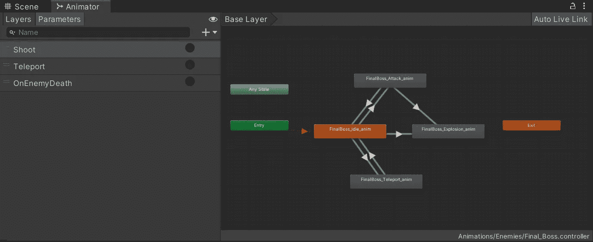

然后，像其他敌人一样，我们需要添加各自的组件(刚体，碰撞器，动画，音频源和脚本)来处理游戏机制:

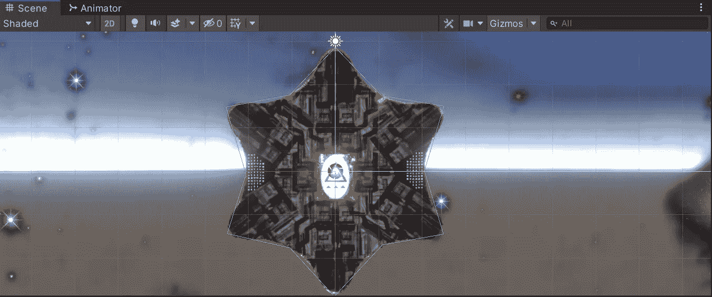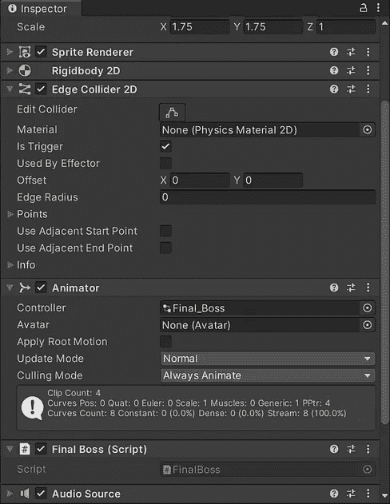

## 新镜头

现在，为了创建最终老板的特定镜头，我创建了一个单独的精灵来匹配老板侧面的小点:

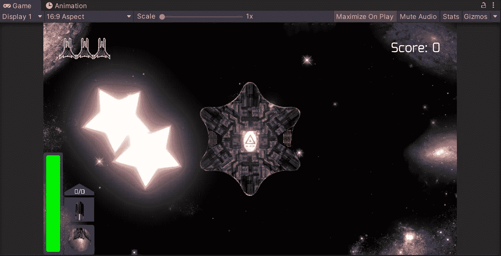

为了实现它，我调整了游戏对象的大小，并添加了相应的组件来处理游戏机制。该镜头将向其旋转所指向的方向移动。此外，为了让照片看起来像流星，我决定添加一个**轨迹渲染器**:

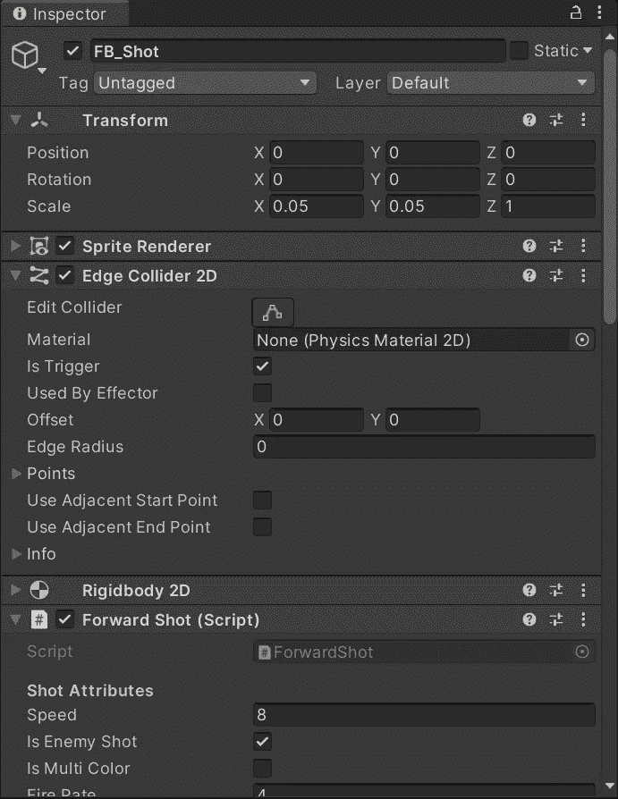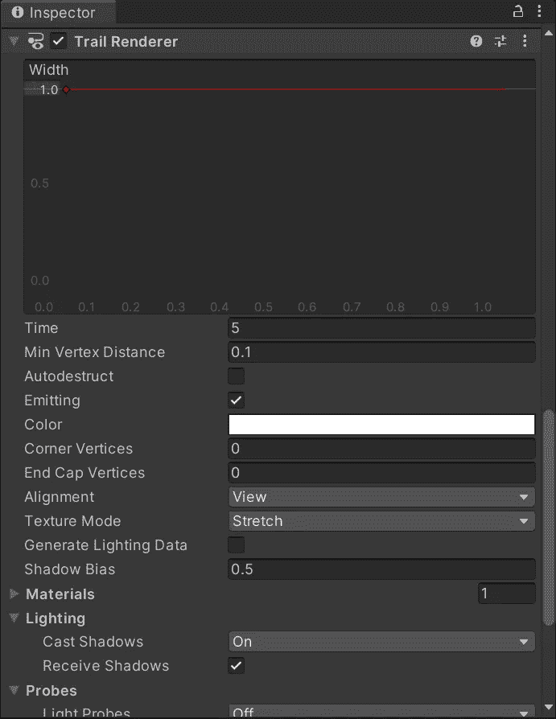

如果您想了解更多关于轨迹渲染器组件的信息，您可以访问 Unity 文档:

 [## 轨迹渲染器

### 你如何在整个工作流程中使用文档？请参加本次调查，与我们分享您的体验。切换到…

docs.unity3d.com](https://docs.unity3d.com/Manual/class-TrailRenderer.html) 

然后为了让这个镜头更危险，我创建了一个新的预置，有更多的单元指向不同的方向移动:

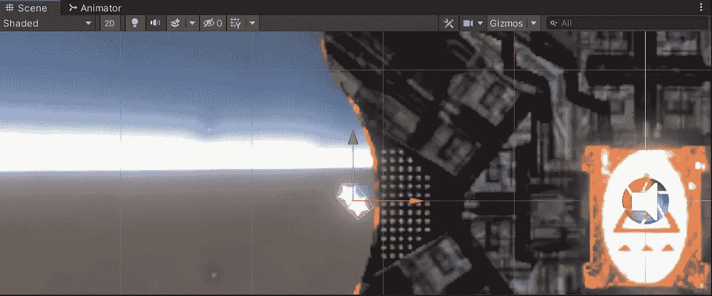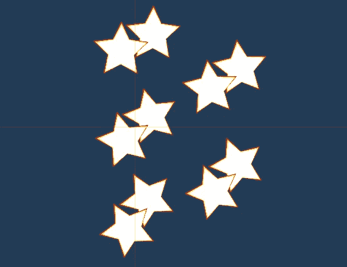

## 传送入口

最后，为了让瞬移看起来更详细，我决定使用另一个精灵，它会在 boss 瞬移时出现:

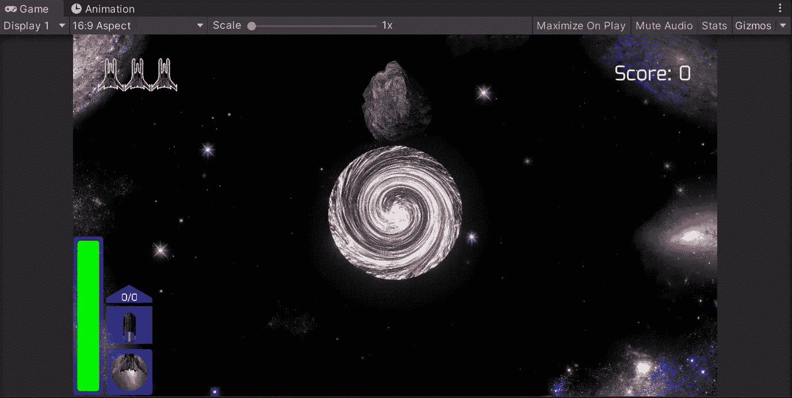

为了让它看起来更好，我决定通过动画视图改变帧的旋转和缩放值来制作动画:

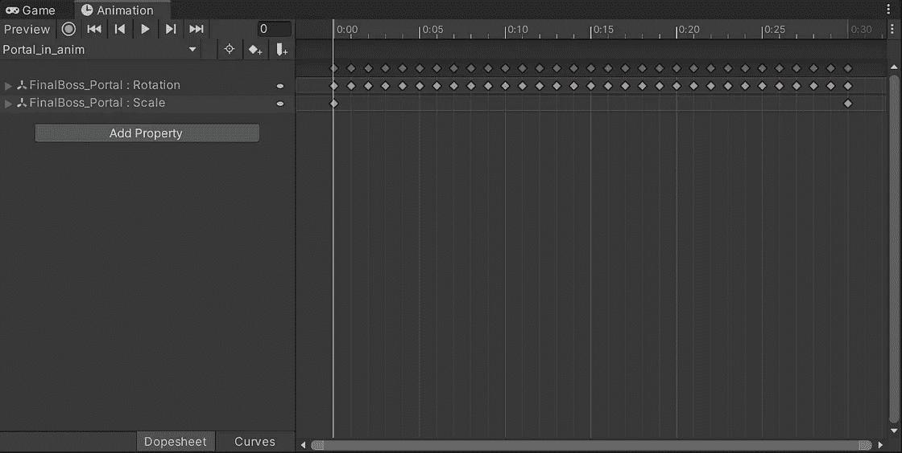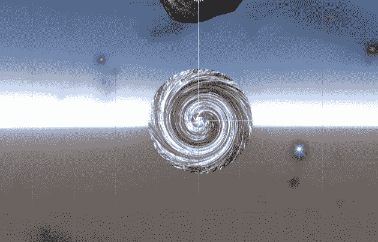

# 实现 boss

为了实现最终 boss，让我们创建一个从**敌人**类继承而来的**最终 Boss** 类:

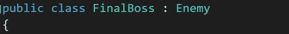

现在，为了处理当老板在类外受到损害时会发生什么，让我们创建一个公共静态**动作**委托，它接收一个浮点值来指示老板拥有的生命的 *%* :

不要忘记在脚本的顶部包含**系统**名称空间，以便能够处理**动作**委托:

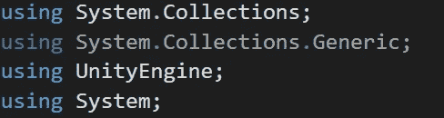

我们将向 **UI 管理器**类中的**动作**委托添加一个方法，该方法接收生命的百分比，并将使用该值更新表示生命的 UI 元素:

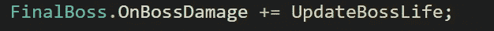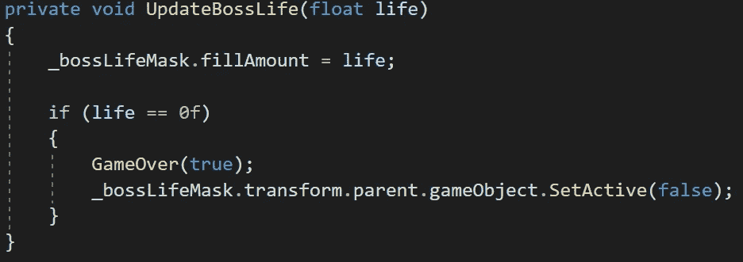

如果您想了解有关动作代表的更多信息，可以访问 Microsoft 文档:

 [## 动作委托(系统)

### 封装具有单个参数且不返回值的方法。通用公共委托无效操作(T…

docs.microsoft.com](https://docs.microsoft.com/en-us/dotnet/api/system.action-1?view=net-5.0) 

然后，我们需要创建下一个变量来存储 boss 属性:

*   行为延迟

这个变量会存储 boss 等待选择另一个行为(瞬移或者攻击)的时间。

*   拍摄延迟

这个变量会存储射击前后 boss 等待保持移动的时间。

*   难度系数

此变量将存储应用于 boss 行为难度的%值。比如值 0.1，boss 瞬移，旋转，射个 10%快。

*   每秒度数

这个变量将存储凸台每秒旋转的度数。

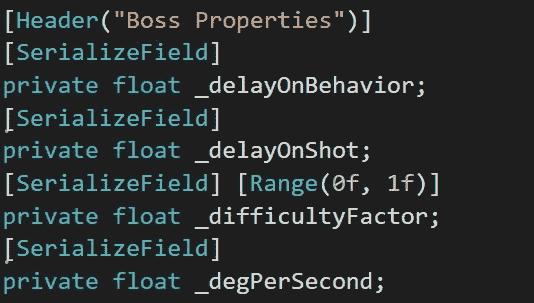

现在，让我们创建这些变量来处理 boss 机制:

*   门户|结束门户

这个变量将存储一个引用，当 boss 传送时，我们将产生这个引用。

*   行为之间的延迟|镜头

这些变量将帮助处理选择 boss 行为的协程。一个会返回等待另一个行为，一个会在 boss 出手前后返回等待。

*   马克斯活着

该变量将存储最终 boss 的初始寿命值，以便能够计算剩余寿命的 *%* 。

*   门户位置

这个变量将存储被选择来传送 boss 的位置。在这个位置，我们将实例化终端入口，在老板传送到那里之前警告玩家。

*   射击

这个变量将指示老板此刻是否正在拍摄。

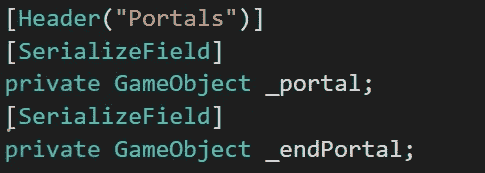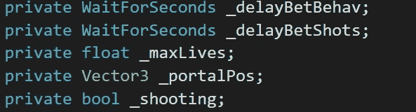

现在，在 **Start** 方法中(它是父类的覆盖)，让我们初始化变量来处理 boss 机制。同样，让我们设置 boss 的初始位置，然后启动一个协程将它移向一个新位置，使它看起来像是它进入操场的入口:

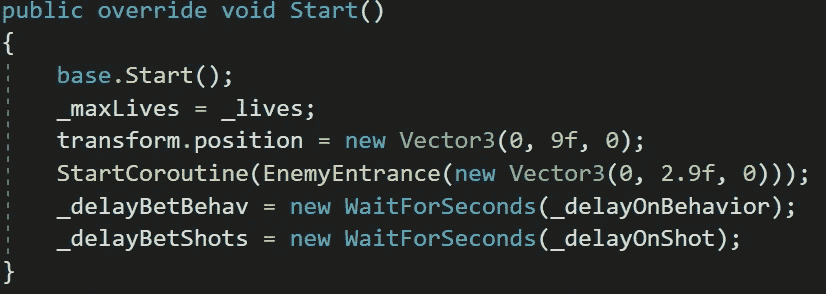

处理 boss 进入运动场的入口的协程接收移动的位置，并通过使用**向量 3。move origing**方法，将凸台向那个位置移动。最后，我们启动协程来选择老板的行为，直到它被破坏:

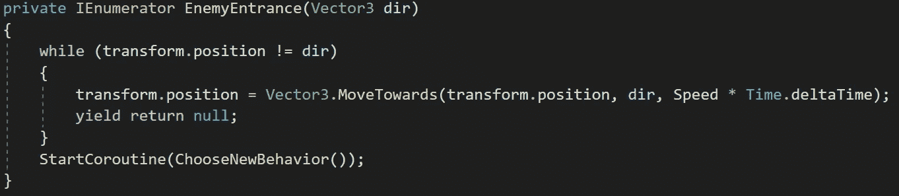

然后，在**更新**方法(它是父类的一个覆盖)中，我们确保 boss 在不拍摄时旋转:

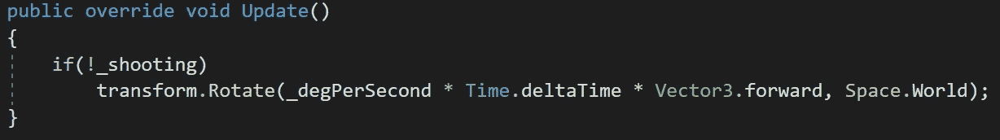

然后，在为 boss 选择新行为的协程中，我们使用一个 **while** 循环每隔一定时间选择一个新行为，直到 boss 被销毁。因为我们只有两种可能的行为(攻击或传送),我们可以使用 **Random 来随机选择。范围**方法。

当我们选择了一个行为时，我们使用一个 switch 语句来设置 animator 组件中相应的触发器。我们有 3 个触发器来处理动画剪辑流:

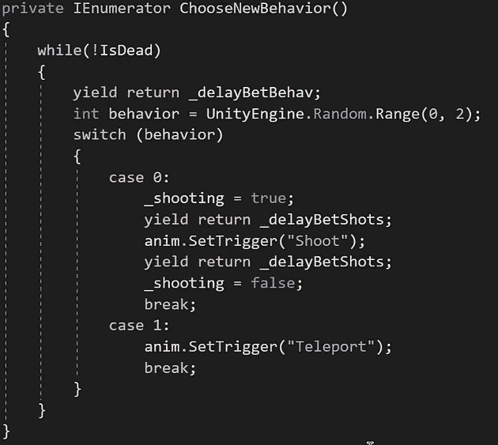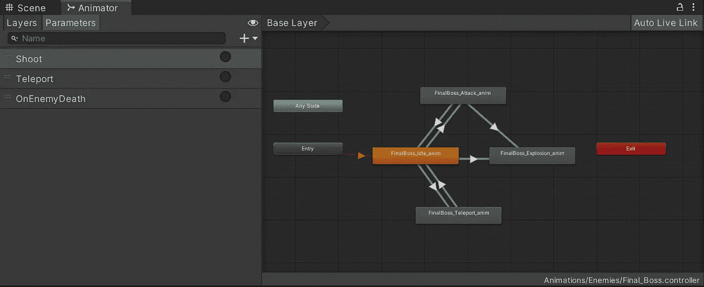

在每个动画中，我们使用**动画事件**来调用某一帧中的方法。

当老板播放射击动画时，我们调用下一个方法。在这个方法中，我们确保通过给它们相应的旋转，在凸台的两侧实例化新的镜头:

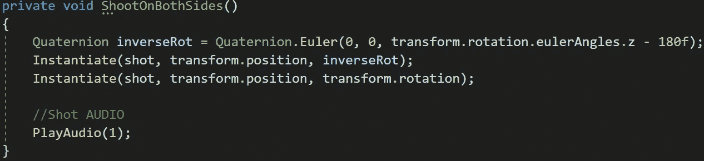

另一方面，如果老板正在播放传送动画，我们在不同的帧中调用两种不同的方法:

*   在第一帧中，我们调用 **DisplayPortals** 方法，用操场中的新位置实例化初始和结束门户。
*   然后，在动画剪辑的一半，我们调用 **MoveEnemy** 方法，用结束入口的位置来改变 boss 的位置。

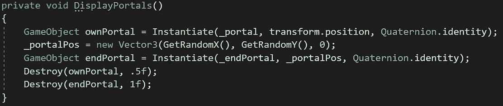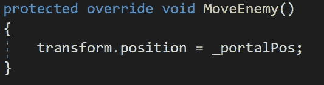

现在，为了处理 boss 损坏，我们使用 **OnTriggerEnter2D** 方法(它是父类的一个覆盖)来检查 boss 是否与玩家或玩家的镜头发生碰撞。

> 注意到我们称之为**基地是很重要的。来自父类的 OnTriggerEnter2D** 方法，该方法处理最后的生命减法。

首先，我们检查静态的**动作**委托是否不为空来执行它，并发送剩余的生命的 *%* 作为参数。然后，如果剩余的寿命是 10 的倍数，我们就调用一个给 boss 增加难度的方法。

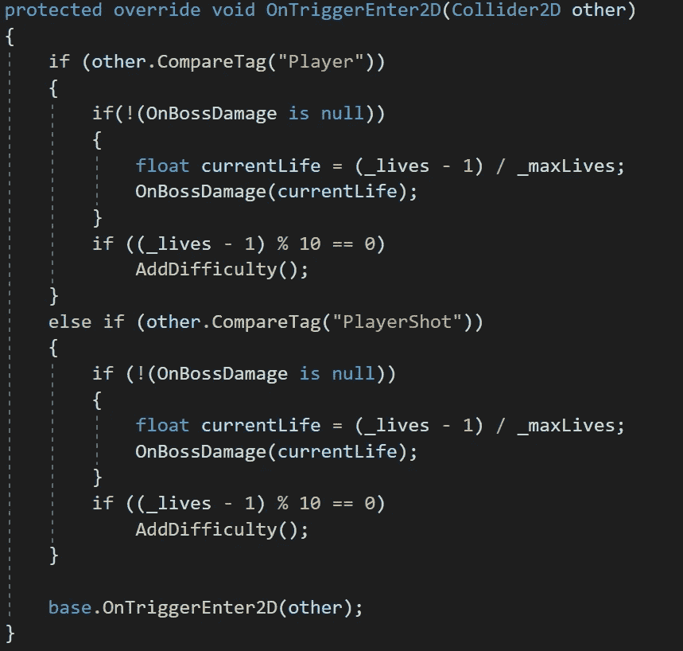

给老板增加难度的方法确保:

*   增加每秒的度数来旋转凸台
*   减少选择另一种行为之前的等待时间
*   减少拍摄前后的等待时间

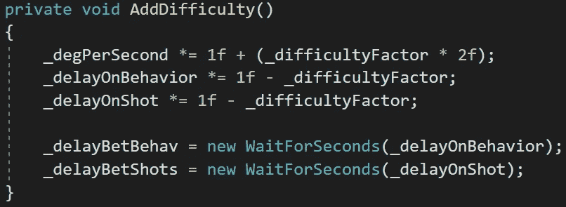

现在，如果我们在 Unity 中运行脚本，我们将能够在最后一波中与老板作战:

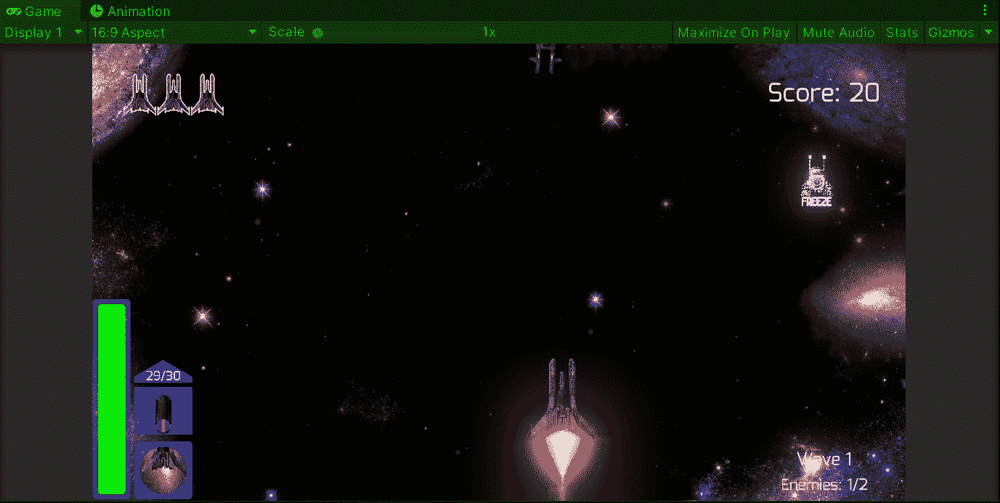

为了展示老板的生活，我决定使用一个简单的图像，带有一个决定水平显示多少的遮罩。如果你想知道它是如何工作的，你可以访问这个旧帖子:

 [## 实现太空射击游戏功能-推进器

### Unity 空间射击游戏新增功能快速回顾

medium.com](/nerd-for-tech/implementing-space-shooter-game-features-thrusters-67aa02b314b6) 

就这样，我们实现了游戏的最终 boss！:d .我将在下一篇文章中看到你，在那里我将展示如何用 Unity 构建你的游戏。

> *如果你想更多地了解我，欢迎登陆*[***LinkedIn***](https://www.linkedin.com/in/fas444/)**或访问我的* [***网站***](http://fernandoalcasan.com/) *:D**