# 实现太空射击游戏功能-冻结开机

> 原文：<https://medium.com/nerd-for-tech/implementing-space-shooter-game-features-freezing-power-up-ee65fb79115c?source=collection_archive---------25----------------------->

## 统一指南

## Unity 空间射击游戏新增功能快速回顾

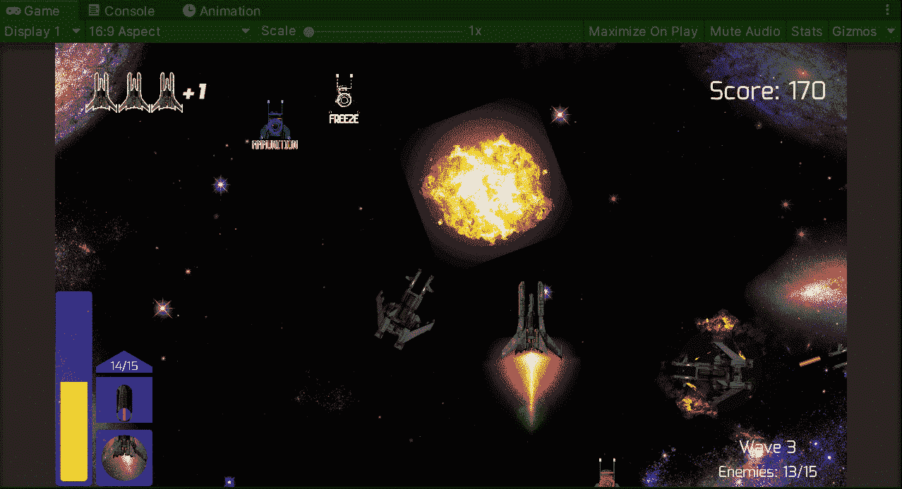

**目标**:在 Unity 的太空射击游戏中实施一个伤害玩家的负面加电物品。

在之前的帖子中，我[在我的太空射击游戏 Unity 中实现了一个新的产卵系统](/nerd-for-tech/implementing-space-shooter-game-features-enemy-waves-2eff7d12407)。现在是时候实施一个如果被收集会对玩家产生负面影响的加电了。

# 新精灵

首先，我们需要包含新的精灵来可视化新的启动项目和播放器中相应的效果。如果你不知道在哪里创建或获得新的精灵，那么我推荐你使用一个免费的在线程序(像我一样):

 [## 图片编辑:Pixlr.com-免费在线图片编辑

### 登录/注册欢迎使用 Pixlr 的免费高级照片编辑器。点击打开照片按钮开始编辑…

pixlr.com](https://pixlr.com/e/) 

## 冻结效应

为了在播放器中显示冻结效果，我将使用这些精灵创建一个新的动画:

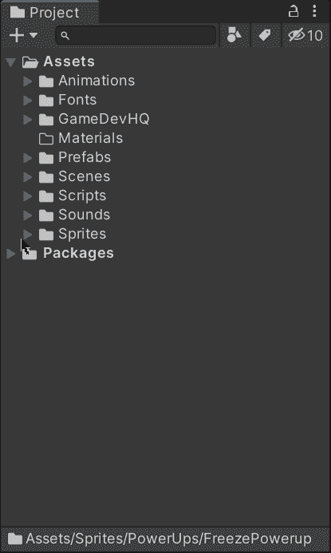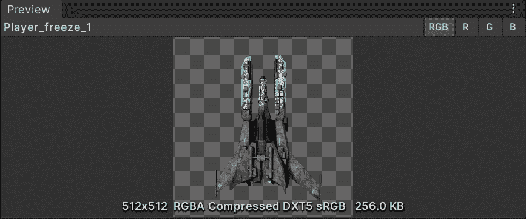

如果你不知道如何在 Unity 中制作精灵动画，你可以看看我以前的帖子:

 [## 在 Unity 中制作精灵动画

### 关于如何在 Unity 中制作精灵动画的快速指南

medium.com](/nerd-for-tech/animating-sprites-in-unity-9d02762bde96) 

一旦我创建了动画，我需要确定精灵流的关键帧，以便正确地产生效果:

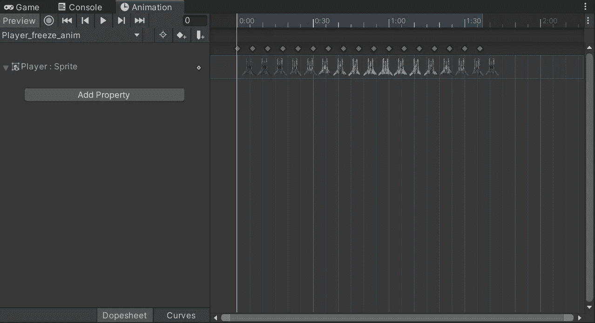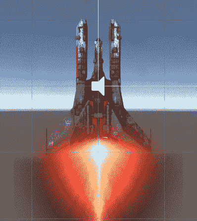

此外，为了在玩家收集加电时显示动画，我们需要通过添加触发动画的触发器来修改动画控制器，然后返回到玩家的正常状态:

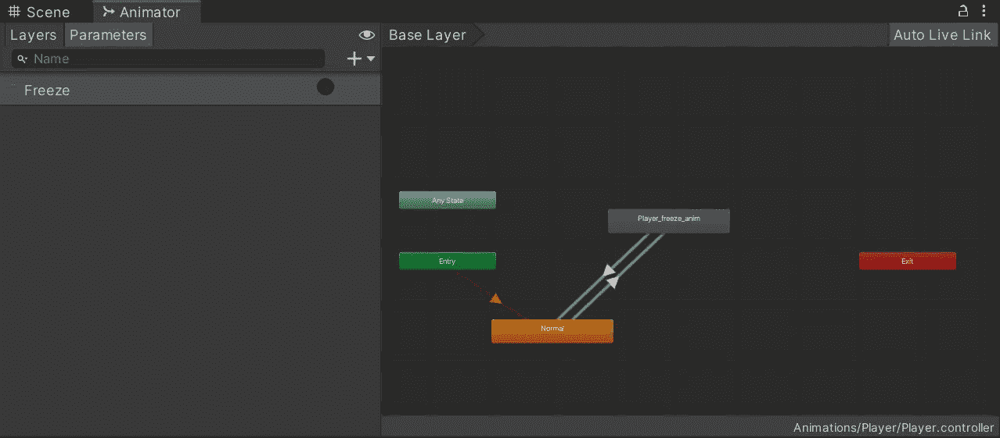

## 冻结开机项目

现在，让我们通过使用新精灵来给游戏添加各自的能量。如果你不知道如何在 Unity 中实现加电，你可以在这里访问我的旧帖子:

 [## 在 Unity 中为你的游戏创造动力

### 关于如何在你的 Unity 游戏中实现一个增强道具的快速指南

medium.com](/nerd-for-tech/creating-a-power-up-for-your-game-in-unity-6810d73376a1) 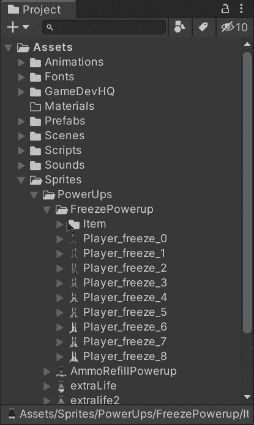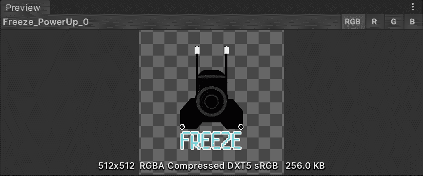

让我们创建和修改新动画的关键帧，并将相应的组件添加到通电中:

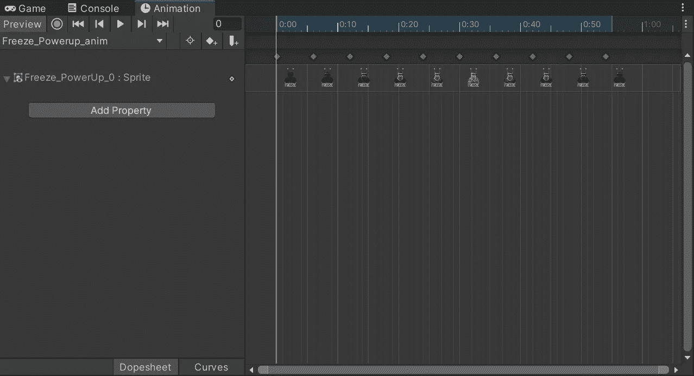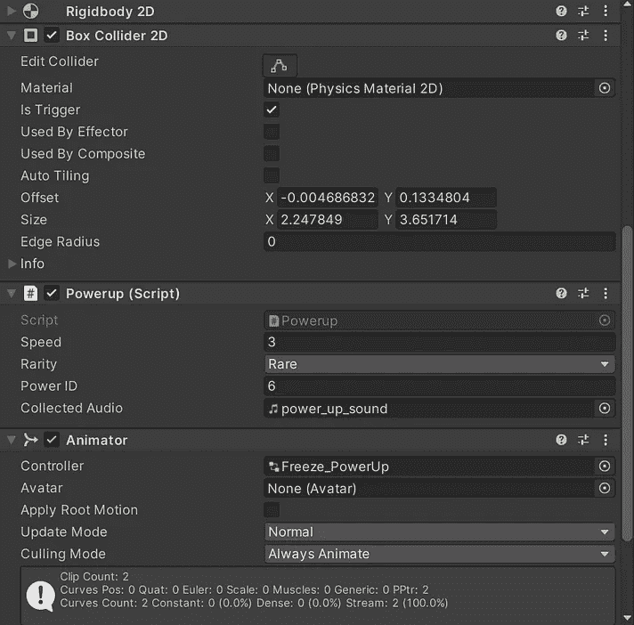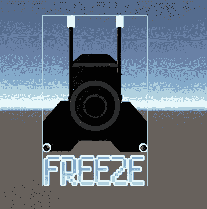

一旦组件满足了我们的需求，让我们制作一个预置的电源，并将其添加到繁殖管理器的电源阵列中进行繁殖:

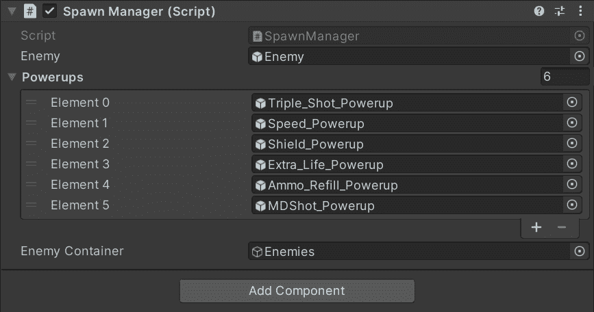

# 实施加电

为了实现加电并可视化其效果，让我们打开**加电**脚本，并在处理与玩家冲突的 switch 语句中添加新的 case:

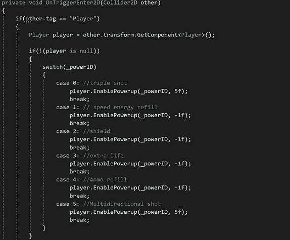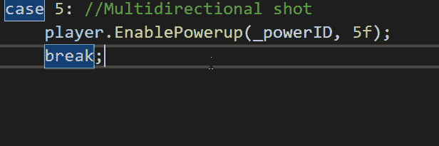

第二个参数允许我们选择加电是否是暂时的以及持续多长时间。

然后，让我们打开**播放器**脚本并创建一个新变量来保存对附加到播放器的 animator 组件的引用，我们将在 **Start** 方法中使用 [**GetComponent**](https://fas444.medium.com/script-communication-in-unity-getcomponent-2225ff937a32) 对其进行初始化:

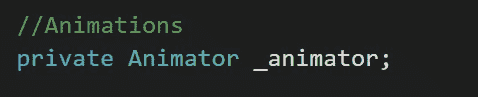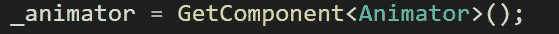

然后，在启用和处理加电效果的方法中，让我们为新的冻结加电添加各自的情况。该效果将通过修改速度变量和触发动画来停止玩家的移动并显示冻结效果:

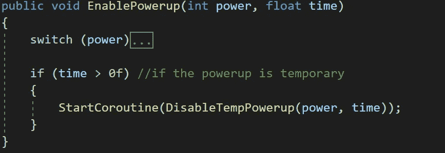

最后，在被调用来禁用临时加电的方法中，让我们将原始值应用于速度变量:

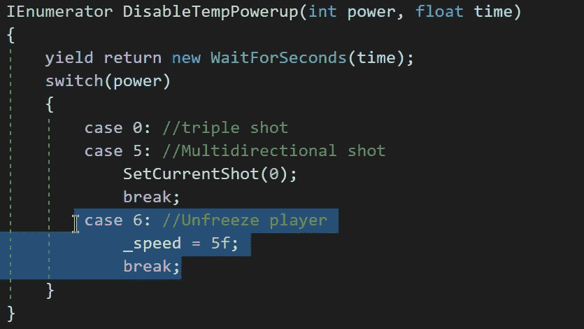

现在，如果我们在 Unity 中运行游戏，我们将会看到电源启动会产生并在玩家身上应用预期的冻结效果几秒钟:

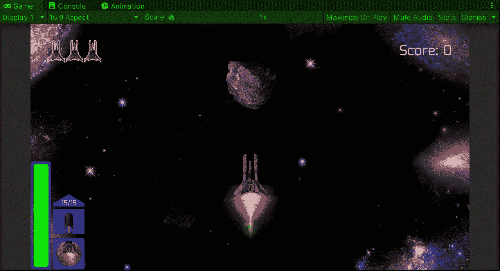

就这样，我们实施了一个负加电来冻结玩家！:d .我会在下一篇文章中看到你，在那里我会展示更多添加到我的 Unity 太空射击游戏中的功能。

> *如果你想更多地了解我，欢迎登陆*[***LinkedIn***](https://www.linkedin.com/in/fas444/)**或访问我的* [***网站***](http://fernandoalcasan.com/) *:D**