# 实现太空射击游戏的功能-寻的射击

> 原文：<https://medium.com/nerd-for-tech/implementing-space-shooter-game-features-homing-shot-7820726f5538?source=collection_archive---------11----------------------->

## 统一指南

## 快速回顾 Unity 中添加到太空射击游戏的新功能

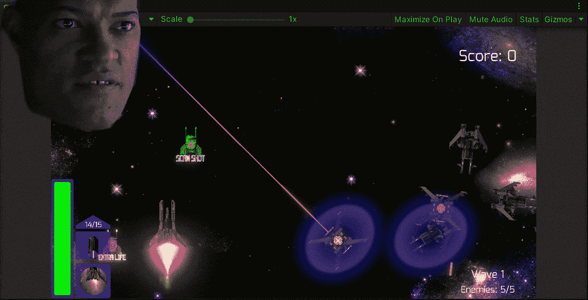

**目标**:在 Unity 的太空射击游戏中，实现跟随最近敌人的新射击。

在之前的帖子中，我在 Unity 的太空射击游戏中为敌人实现了一个行为来躲避玩家的射击。现在是时候实施一个镜头，跟随最近的敌人摧毁它。

# 新资产

就像我在以前的一些帖子中说过的，我们需要加入新的精灵来创建新的镜头和它的能量项目。如果你不知道在哪里创建或获得新的精灵，那么我推荐你使用一个免费的在线程序(像我一样):

 [## 图片编辑:Pixlr.com——免费在线图片编辑

### 登录/注册欢迎使用 Pixlr 的免费高级照片编辑器。点击打开照片按钮开始编辑…

pixlr.com](https://pixlr.com/e/) 

此外，如果你不知道如何在 Unity 中添加精灵或动画，你可以查看这些旧帖子:

 [## 在 Unity 中从原型升级为艺术品

### 关于从原型升级到 Unity 艺术作品的详细指南

fas444.medium.com](https://fas444.medium.com/upgrading-from-a-prototype-to-a-work-of-art-in-unity-4f3c0435501d)  [## 在 Unity 中制作精灵动画

### 关于如何在 Unity 中制作精灵动画的快速指南

medium.com](/nerd-for-tech/animating-sprites-in-unity-9d02762bde96)  [## 在 Unity 中为你的游戏制造爆炸

### 关于如何在 Unity 中使用动画精灵创建爆炸的快速指南

medium.com](/nerd-for-tech/creating-explosions-for-your-game-in-unity-889e9c373d14) 

## 新加电项目

让我们首先添加玩家将收集的启动物品以启用扫描射击。我们需要添加相应的组件来使其工作:

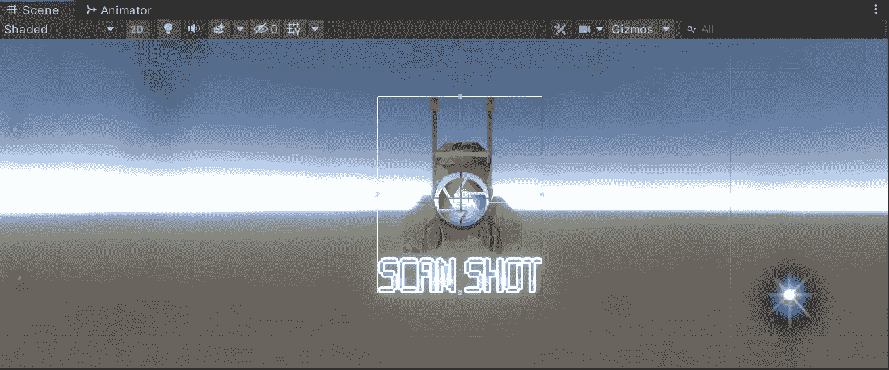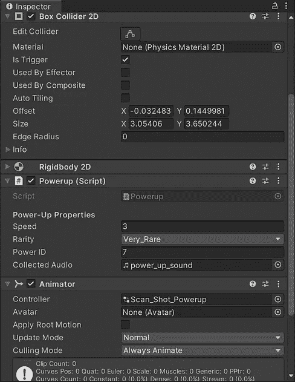

然后，正如[在](/nerd-for-tech/animating-sprites-in-unity-9d02762bde96)之前所做的，让我们通过在动画剪辑中使用几个精灵来制作精灵的动画:

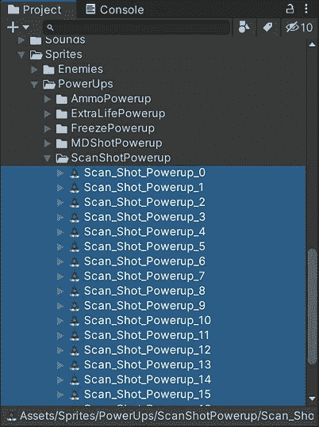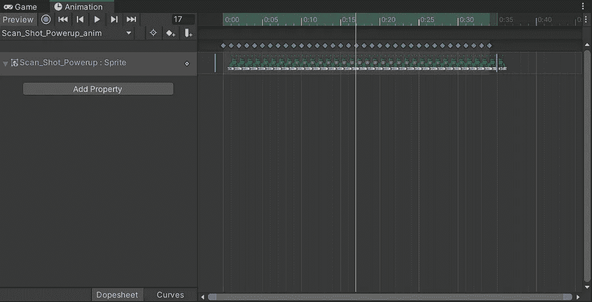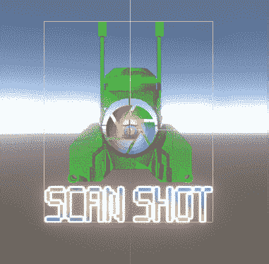

## 新镜头

现在，让我们用新的精灵创建新的镜头。我们还需要添加相应的组件:

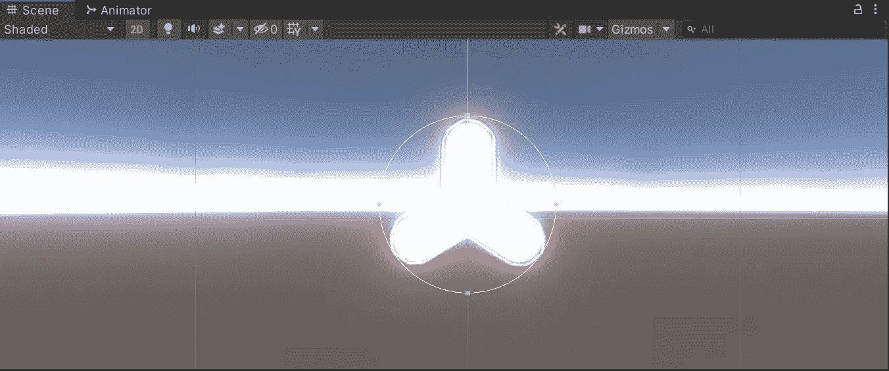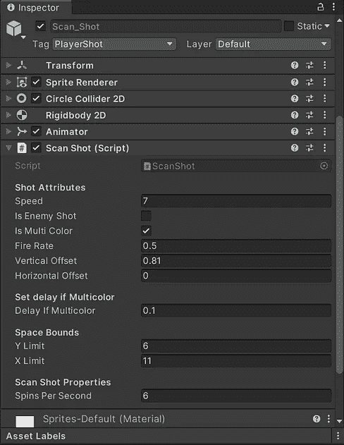

同样，让我们使用新的精灵为它创建一个新的动画剪辑:

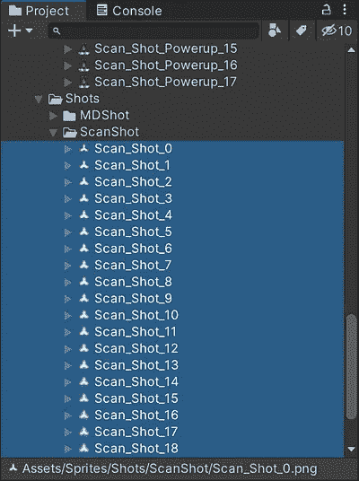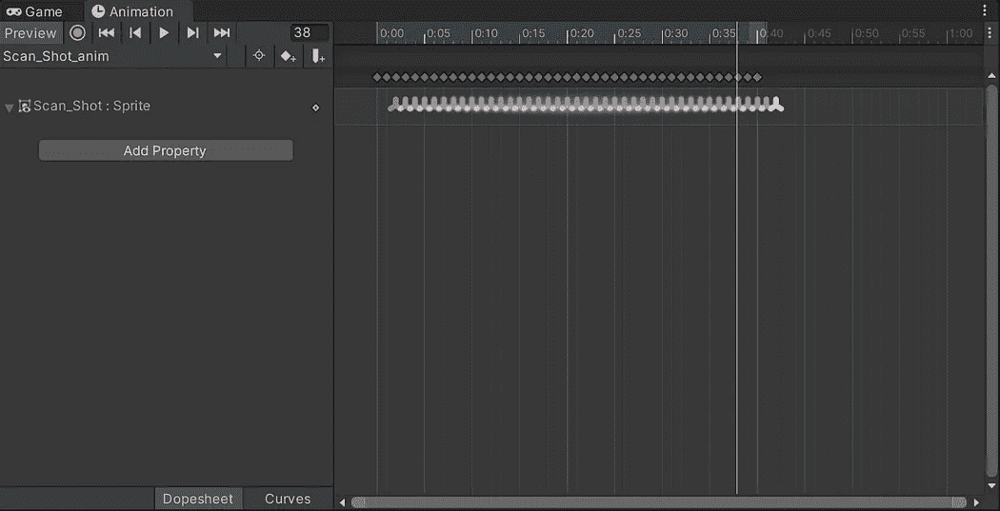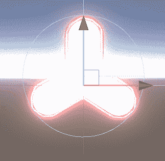

# 射击行为

## 扫描镜头类别

为了实现镜头行为，让我们创建一个名为 **ScanShot** 的新类，它将从 **ForwardShot** 类继承，以便在没有敌人跟随的情况下使镜头向前移动:

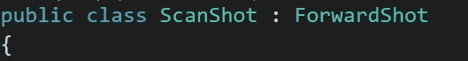

然后，让我们创建两个新变量:

*   每秒旋转数

这个变量将存储新镜头每秒旋转多少次的值。通过使用**【serialize field】**我们能够通过检查器修改值。

*   敌人扫描

该变量将存储操场上最近敌人的**变换**组件的参考。

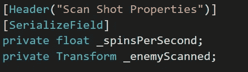

因为快照的基类有一个虚拟的 **Update** 方法，如果没有发现敌人，我们可以覆盖父类的 **Update** 方法来改变行为。

在我们的方法中，我们将空检查敌人扫描变量来选择射击行为。

*   如果敌人不存在，我们就从父类(第二张图片)调用 Update 方法，让镜头前移。
*   否则，如果敌人存在，我们就旋转镜头，使用 **Vector3。移向**使镜头以 150%的速度移向被扫描的玩家:

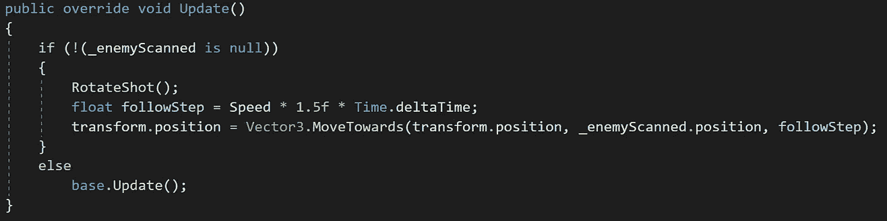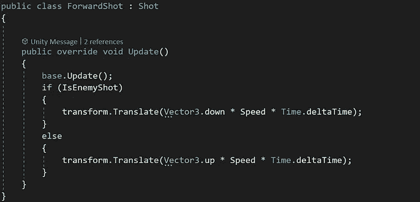

在旋转镜头的方法中，我们将每秒的旋转数乘以以度为单位的完整旋转数和**时间δ时间**，以获得每秒在正向矢量上旋转的度数:

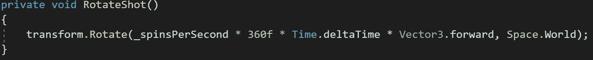

## 衍生管理器类

现在，让我们打开 **SpawnManager** 职业来创建一个在操场上找回最近的敌人的方法。

为此，我们需要包括**系统**和**系统。Linq** 在类库之上:

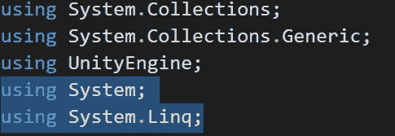

然后，让我们创建:

*   一个静态的**列表**来存储产生的敌人的**变换**组件。
*   静态 **Func** 接收**矢量 3** 位置并检索离该位置最近的敌人的**变换**;

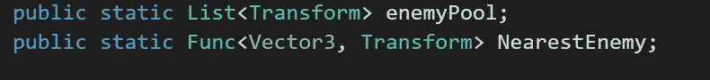

如果你想知道**函数**是如何工作的，你可以访问 C#的微软文档:

 [## 功能委托(系统)

### 封装没有参数的方法，并返回由 TResult 参数指定的类型的值…

docs.microsoft.com](https://docs.microsoft.com/en-us/dotnet/api/system.func-1?view=net-5.0) 

现在，在**开始**的方法中，让我们:

*   初始化敌人的**列表**
*   将 **Func** 分配给 Lambda 表达式(或匿名函数)，该表达式接收 **Vector3** ( *pos* )并使用 **FirstOrDefault** 方法检索(通过使用 LINQ)列表的第一个**转换**或空值。通过在敌人列表中使用 **OrderBy** 方法，我们将能够按照我们选择的任何条件对列表进行排序，在本例中是到敌人的距离。

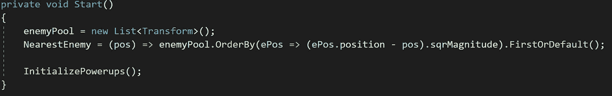

如果你想知道语言集成查询(LINQ)是如何工作的，你可以访问微软文档:

 [## 语言整合查询(LINQ) (C#)

### 语言集成查询(LINQ)是一组基于查询功能集成的技术的名称…

docs.microsoft.com](https://docs.microsoft.com/en-us/dotnet/csharp/programming-guide/concepts/linq/) 

接下来，在生成敌人的方法中，我们必须确保我们添加了每个新生成的敌人的变换组件:

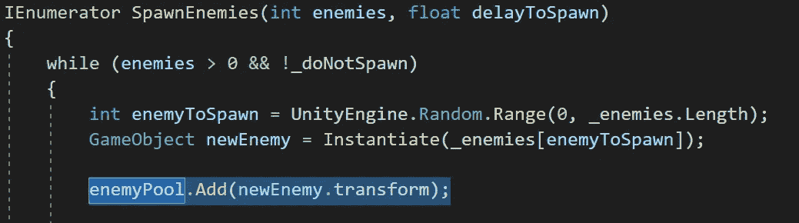

## 敌人行为类

此外，为了避免引用错误，让我们打开**敌人行为**类，并确保当敌人被消灭时，我们从静态**列表**中移除相应的转换:

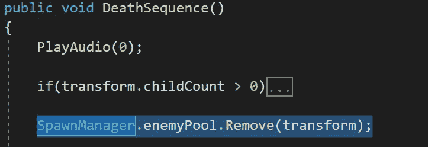

## 扫描镜头类别

现在，让我们返回到 **ScanShot** 类，并创建一个新方法，通过使用来自 **SpawnManager** 类的静态 **Func** 来返回转换或空值:

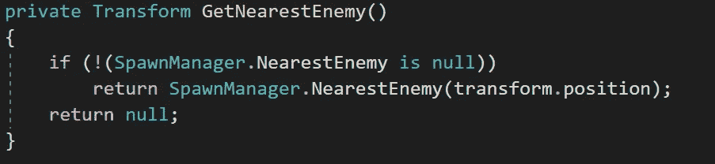

然后，让我们使用 **FixedUpdate** 方法来检查检索与物理系统协调的最近的敌人:

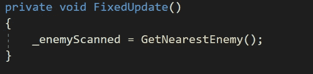

现在，如果我们在 Unity 中运行游戏，我们会看到加电项目和新射击按预期工作:

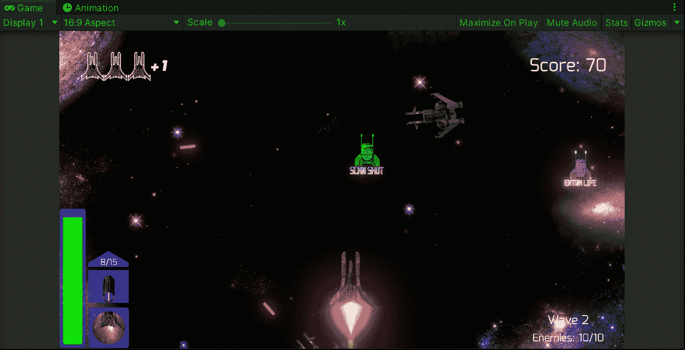

就这样，我们实现了一个跟随最近敌人的新镜头！:d .我会在下一篇文章中看到你，在那里我会展示更多添加到我的 Unity 太空射击游戏中的功能。

> *如果你想了解我更多，欢迎登陆*[***LinkedIn***](https://www.linkedin.com/in/fas444/)**或访问我的* [***网站***](http://fernandoalcasan.com/) *:D**