# 实现太空射击游戏功能-激光束敌人

> 原文：<https://medium.com/nerd-for-tech/implementing-space-shooter-game-features-laser-beam-enemy-7ce3ec430d72?source=collection_archive---------13----------------------->

## 统一指南

## Unity 空间射击游戏新增功能快速回顾

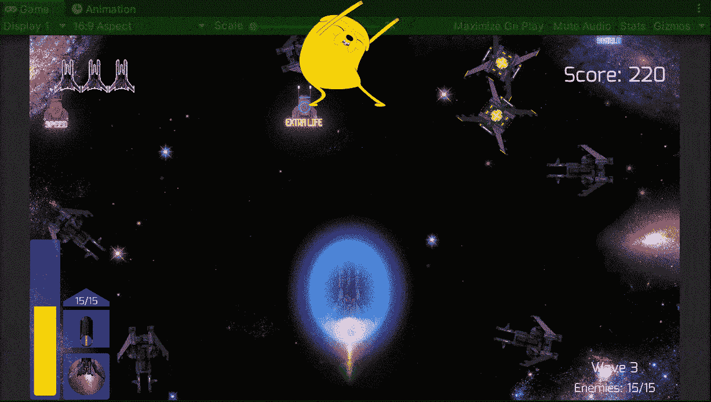

**目标**:用 Unity 实现一个太空射击游戏的新射击新敌人。

在之前的帖子中，我[在我的 Unity 太空射击游戏中实现了一个当玩家收集到](/nerd-for-tech/implementing-space-shooter-game-features-freezing-power-up-ee65fb79115c)能量时冻结玩家的能量。现在是时候用一种新的射击方式来实现一个新的敌人，让游戏变得更加复杂。

# 新资产

为了实现一个新的敌人，我设法用我已有的资源创造了新的精灵。如果你不知道在哪里创建或获得新的精灵，那么我建议你(像上一篇文章一样)使用一个免费的在线程序:

 [## 图片编辑:Pixlr.com——免费在线图片编辑

### 登录/注册欢迎使用 Pixlr 的免费高级照片编辑器。点击打开照片按钮开始编辑…

pixlr.com](https://pixlr.com/e/) 

## 新的敌人精灵

这些是我用来制造新敌人的精灵:

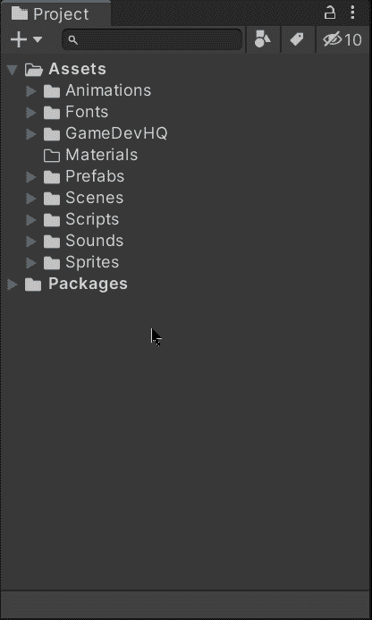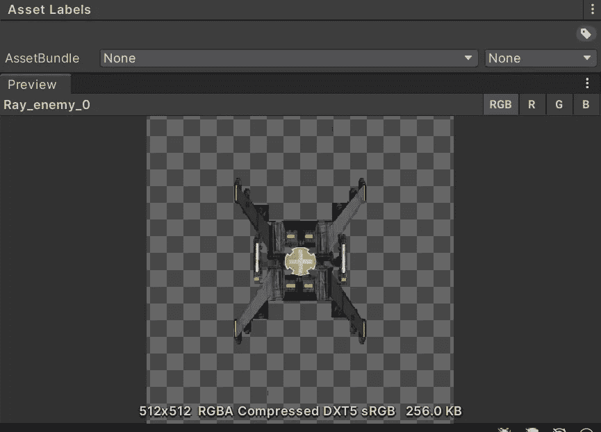

我为敌人做了 3 个不同的动画:

*   敌人移动时的默认动画
*   当敌人被消灭时的动画
*   当敌人要发射激光束时的动画

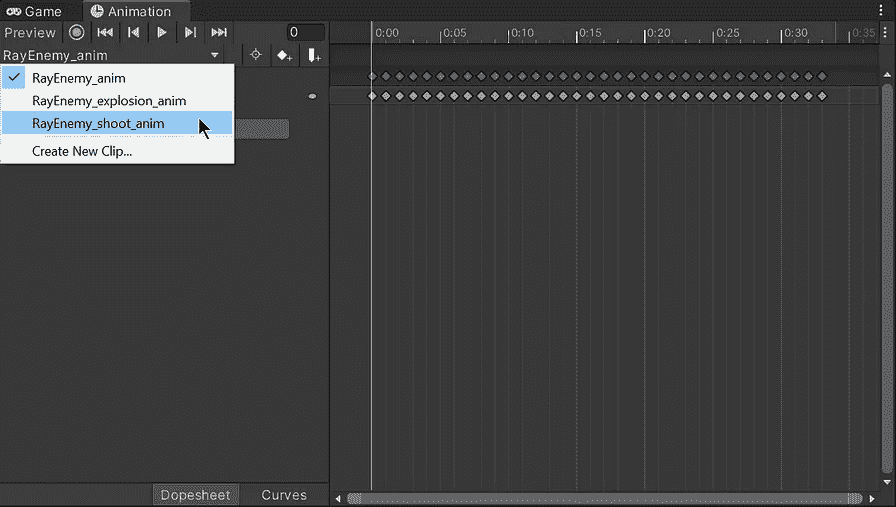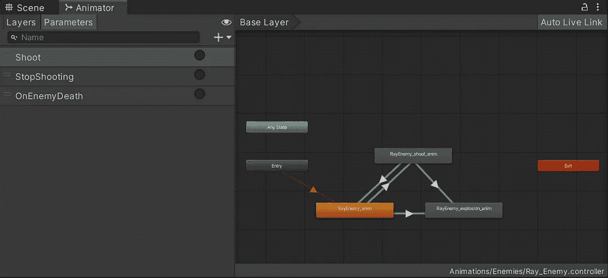

我使用各自动画控制器中的触发器来管理不同的动画。

然后，我在检查员中添加了敌人拥有的各个组件:

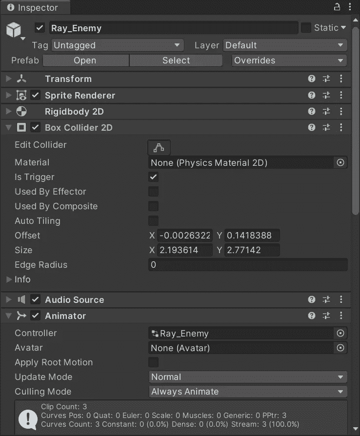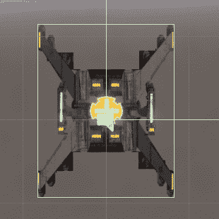

这些是来自新敌人的组件和动画。

如果你不知道如何在 Unity 中添加精灵或动画，你可以查看这些旧帖子:

 [## 在 Unity 中从原型升级为艺术品

### 关于从原型升级到 Unity 艺术作品的详细指南

fas444.medium.com](https://fas444.medium.com/upgrading-from-a-prototype-to-a-work-of-art-in-unity-4f3c0435501d)  [## 在 Unity 中制作精灵动画

### 关于如何在 Unity 中制作精灵动画的快速指南

medium.com](/nerd-for-tech/animating-sprites-in-unity-9d02762bde96)  [## 在 Unity 中为你的游戏制造爆炸

### 关于如何在 Unity 中使用动画精灵创建爆炸的快速指南

medium.com](/nerd-for-tech/creating-explosions-for-your-game-in-unity-889e9c373d14) 

# 新敌人

现在，为了实现新的敌人行为，我创建了 2 个新脚本:

*   弧形敌人

这个脚本允许敌人以弧形路径移动。

*   激光束敌人

这个脚本处理发射激光束的敌人的行为。

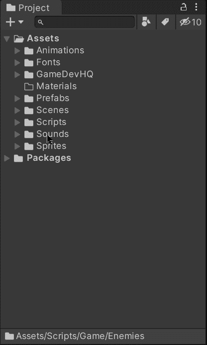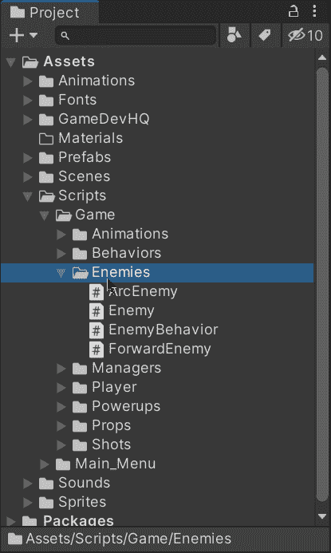

## 弧敌级

> 注:不，与[宿敌乐队](https://www.archenemy.net/en/)无关😝，但是我不得不接受我喜欢他们的一些歌。

这个类将实现我们敌人的移动行为，所以它需要从**敌人行为**类继承(我在[一个更老的帖子](https://fas444.medium.com/implementing-space-shooter-game-features-enemy-behavior-a784cb1d8af0)中使用了这个类):

然后，让我们使用下一个变量:

*   抬前轮速度

这个变量将存储敌人的旋转速度。

*   旋转角

这个变量将存储每秒旋转敌人的角度。

*   平移方向

这个变量将存储 Vector3 方向轴来移动敌人。

*   平移旋转

这个变量将存储矢量 3 方向轴来旋转敌人。

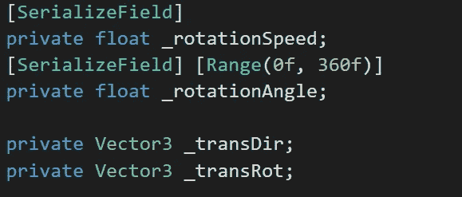

现在，在 **Start** 方法中，让我们覆盖来自父类的虚拟方法(但仍然调用它),以选择操场中外观的一侧，并选择开始移动的方向和旋转:

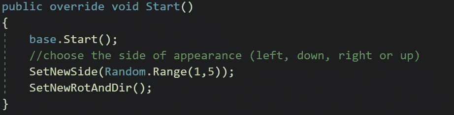

**SetNewSide** 方法在父类中，帮助改变敌人游戏对象的位置。然后， **SetNewRotAndDir** 方法就在这个类中，它帮助选择方向轴，以弧形路径移动和旋转:

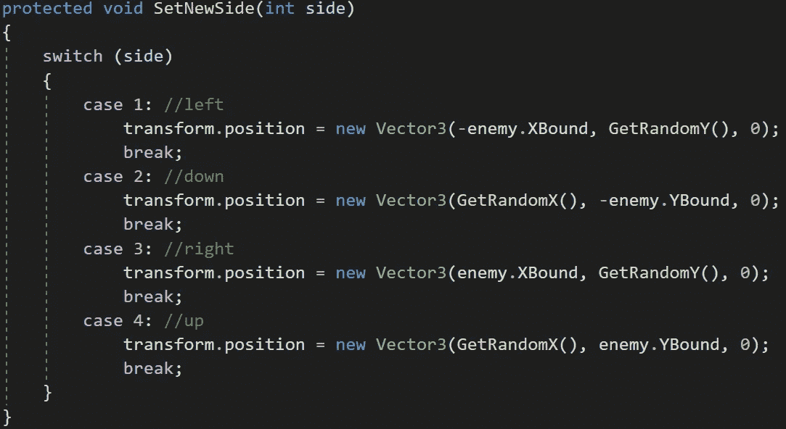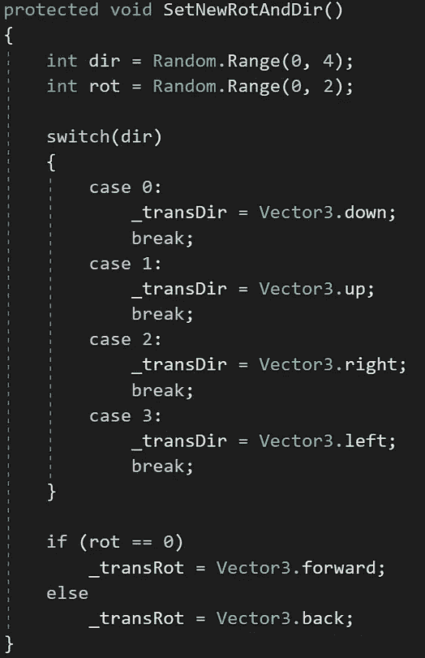

然后，对于**更新**方法，我们调用 **MoveEnemy** 方法每帧移动敌人。由于 **Update** 方法在父类中是虚拟的，我们需要使用一个覆盖来移动敌人:

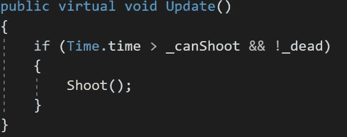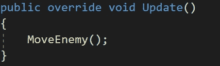

父类中的**更新**方法(第一个)和该类中的**更新**方法(第二个)。

**MoveEnemy** 方法也是父类中的虚方法，所以我们需要使用一个 override 来移动这个类中的敌人，但是我们也使用了 **base。敌方**调用先从父类执行方法:

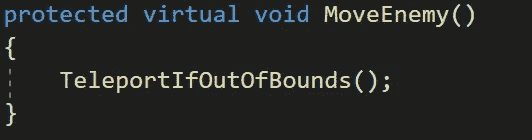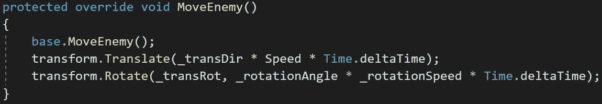

父类中的 **MoveEnemy** 方法(第一个)和该类中的 **MoveEnemy** 方法(第二个)。

现在，如果我们用 Unity 运行游戏，我们会看到敌人以弧形路径移动:

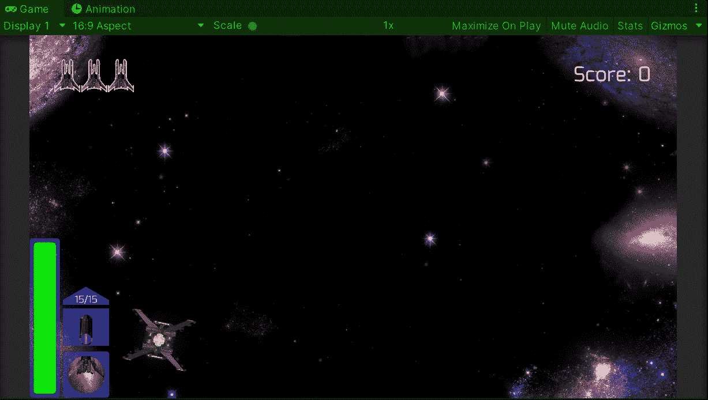

## 激光束敌人级

现在，为了实现发射激光束的敌人的移动行为，让我们在这个新脚本中继承 **ArcEnemy** 类:

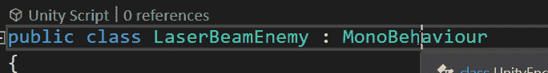

我们需要使用这些变量来处理新敌人的行为:

*   等待拍摄

该变量将存储每次敌人移动时发射激光束前的等待时间。

*   耽搁

这个变量将帮助我们在协程中使用它返回各自的等待时间(以秒为单位)。

*   拍摄持续时间

这个变量也将帮助我们在协同作战中让敌人呆在原地，直到激光束消失。

*   正在拍摄

这个变量将存储敌人的状态，以了解它是在射击还是在移动。

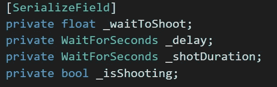

为了处理这个移动，我们需要覆盖父类的 **MoveEnemy** 方法(它以弧形路径移动敌人),并用 **isShooting** 变量来限定它的移动。这样，我们可以确保玩家只在不发射激光束时才移动:

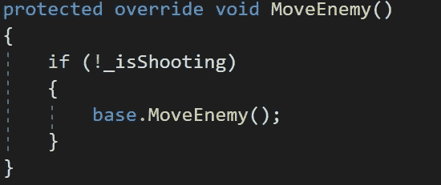

现在，对于 **Start** 方法，让我们覆盖父类方法(但仍然调用它)并初始化各自的变量来帮助协程。第一个延迟将使用 Unity 编辑器中检查器指示的浮动变量进行初始化，而第二个延迟将使用附加到镜头预设引用的脚本中的值进行初始化，该引用来自 **EnemyBehavior** 父类。

一旦变量被初始化，让我们开始敌人的射击程序:

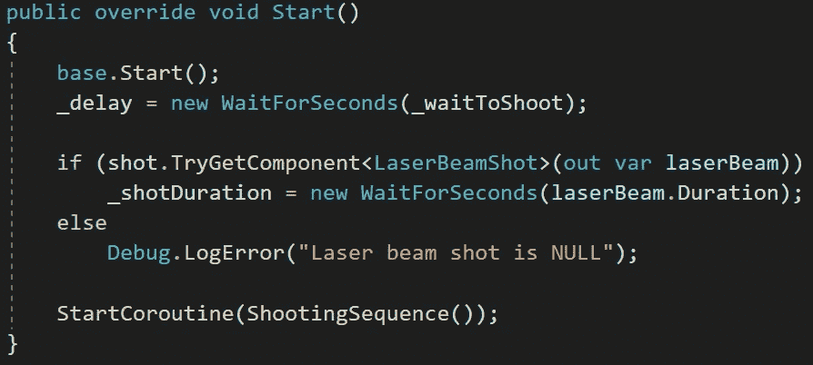

**射击序列**协程将等待第一次延迟，然后通过将 **isShooting** 变量设置为真来停止敌人的移动，并通过在 animator 引用中设置各自的触发器来启动射击动画(这也来自于**enemy behavior**parent**类):**

**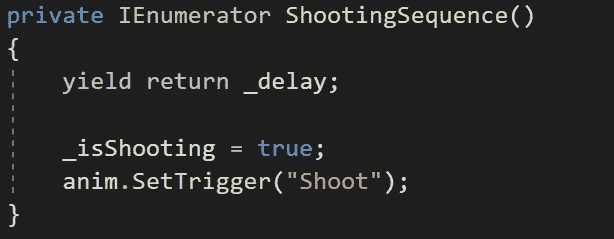**

**以下是敌人各自的触发和动画流程:**

**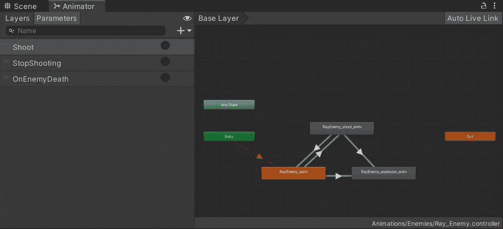**

**当**拍摄序列**协程在 animator 中设置**拍摄**触发器时，这将改变状态以触发拍摄动画。在这个动画中，我们将使用动画事件，这将调用一个新的方法来实例化我们敌人的一侧或两侧的相应镜头。**

**在下一张图中，您将能够看到动画的一些关键帧中的事件。这样，我们可以确保生成的激光束与显示要拍摄的一面的精灵相协调:**

**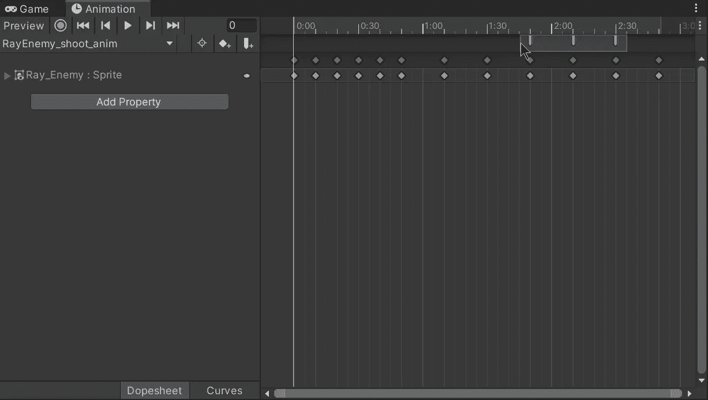****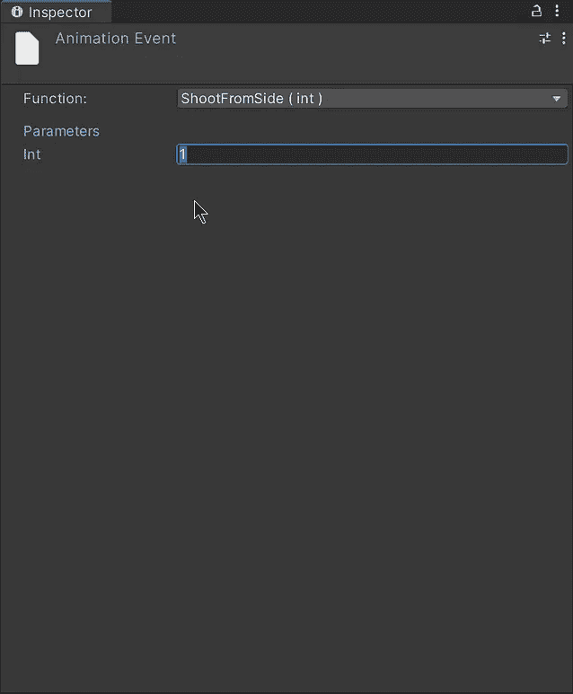**

**通过修改与事件一起发送的值，我们可以在关键帧的各个精灵中区分敌人的两侧。**

**如果您想了解更多关于动画事件的信息，您可以访问 Unity 文档:**

** [## 使用动画事件

### 你如何在整个工作流程中使用文档？请参加本次调查，与我们分享您的体验。你可以…

docs.unity.cn](https://docs.unity.cn/Manual/script-AnimationWindowEvent.html) 

在关键帧处调用的方法将是 **ShootFromTheSide** ，它将接收侧面的编号以实例化激光束。

由于只有两方可以射击，我们将通过使用 **Random.value** 来确保每一方都有 33%的机会射击。如果结果小于 *.33* ，该方法将继续，但如果结果大于此数，它将返回。如果没有一方决定拍摄，那么我们将确保他们都在最后一个关键帧拍摄，而不依赖于随机值。

无论如何，如果该方法继续，它会将动画速度设置为 0，以在激光束射出时显示关键帧的精灵:

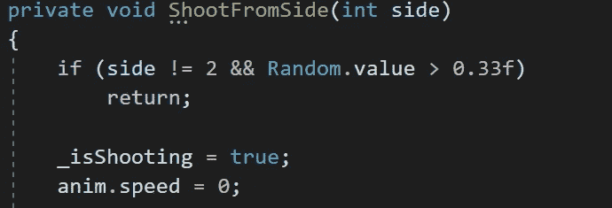

然后，为了正确实例化快照，我们需要调整位置和旋转，以匹配 sprite 尺寸和**实例化**方法参数中的一些变量。

举例来说，让我们用 switch 语句检查相应的一侧，并通过播放镜头的相应声音并启动协程停止拍摄序列来完成:

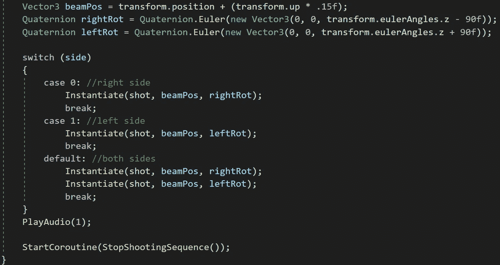

最后，用下一个协程停止拍摄动画，让我们等到镜头消失。要停止它，让我们将动画速度设置为正常状态，并将触发器设置为返回正常动画。

然后，让我们改变旋转和移动的方向，开始一个新的拍摄序列:

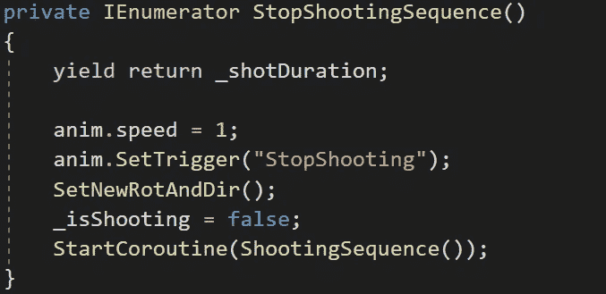

# 新镜头

现在，为了处理激光束行为，让我们创建一个新的脚本:

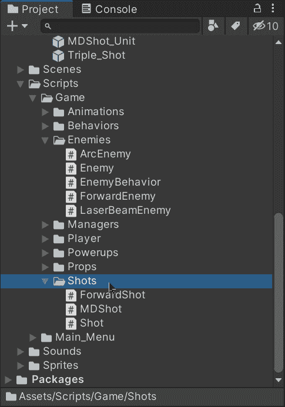

让我们让新类继承 **Shot** 类:

我们将使用这个新类中的下一个变量:

*   持续时间

该变量将存储破坏激光束前的等待时间。我们将能够通过检查器修改它，并使用同名的公共属性获取它的值。

*   范围

这个变量将存储光线投射的长度，我们将使用它来检测空间中的碰撞器。

*   线条

该变量将存储一个对线渲染器组件的引用，该组件将附加到快照以显示激光束。

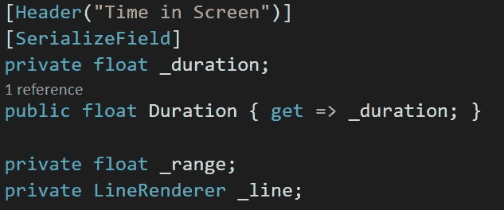

我们需要通过检查器修改镜头预置的值:

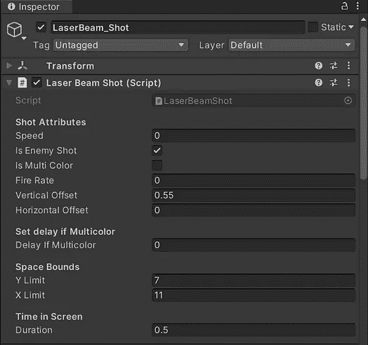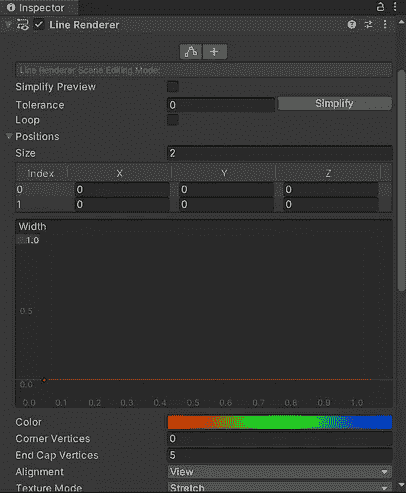

镜头预设将有一个**激光光束镜头**脚本和一个**线渲染器**附加。

首先，我们将覆盖 **Shot** 类的虚拟 **Start** 方法(但仍然调用它)。在这里，我们将初始化我们的 Raycastand 的范围，并使用 **GetComponent** 获取对 line renderer 组件的引用。

然后，我们将使用 **Physics2D。RaycastAll** 在一个数组中获取在我们的光线投射范围内被击中的所有物体(用碰撞器),这样我们就可以检查它们的标签并采取相应的行动。

如果 hit 识别操场碰撞体，我们将通过设置我们的线渲染器的初始和最终位置，使用 hit 的距离来显示从敌人到操场边界的线。

如果 hit 也识别玩家碰撞器，我们将调用对玩家造成伤害的方法。

最后，附加了这个脚本的激光束预置将在持续时间变量中设置的时间后被销毁:

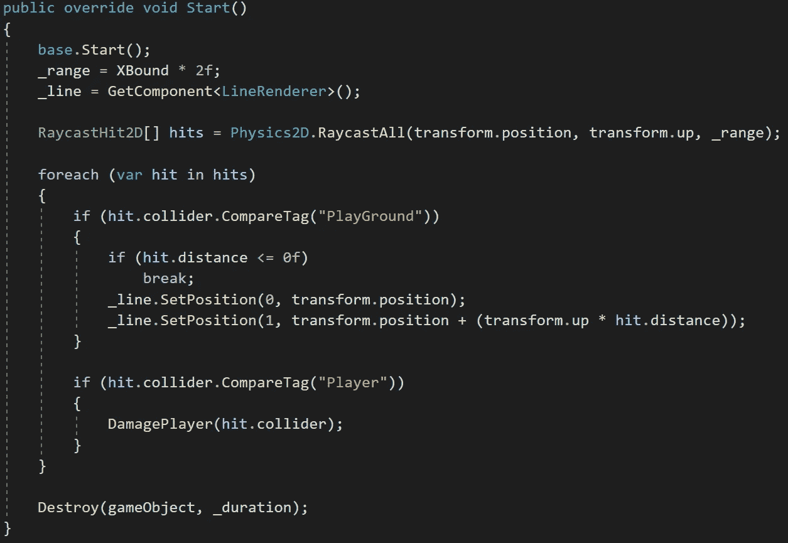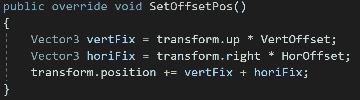

> 注意:这个方法是从 **Shot** 类的 **Start** 方法中调用的，这个类的 **Start** 方法是使用 **base 调用的。**开始()开始。

如果您想了解更多关于 **Raycast** 和 **RaycastAll** 的信息，您可以访问 unity 文档:

 [## 物理 2D。光线投射

### 你如何在整个工作流程中使用文档？请参加本次调查，与我们分享您的体验。建议一个…

docs.unity3d.com](https://docs.unity3d.com/ScriptReference/Physics2D.Raycast.html)  [## 物理 2D。射线铸造

### 光线投射在概念上类似于从空间中的一点沿着特定方向发射的激光束。任何…

docs.unity3d.com](https://docs.unity3d.com/ScriptReference/Physics2D.RaycastAll.html) 

现在，如果我们在 Unity 中运行游戏，我们会看到敌人发射激光束并以弧形路径移动:

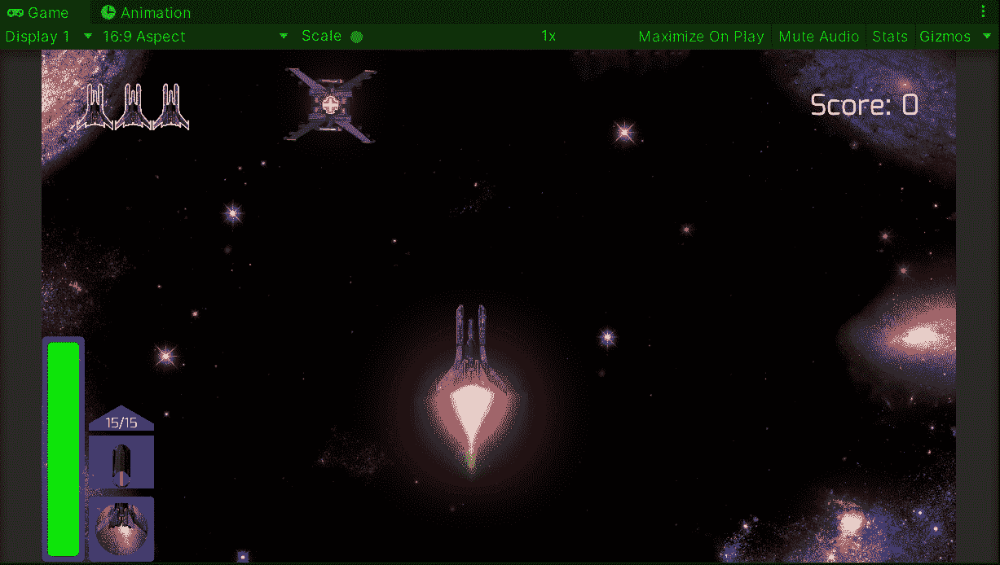

就这样，我们用新的镜头和新的行为实现了一个新的敌人！:d .我会在下一篇文章中看到你，在那里我会展示更多添加到我的 Unity 太空射击游戏中的功能。

> *如果你想更多地了解我，欢迎登陆*[***LinkedIn***](https://www.linkedin.com/in/fas444/)**或访问我的* [***网站***](http://fernandoalcasan.com/) *:D****