# 实现太空射击游戏功能-多方向射击

> 原文：<https://medium.com/nerd-for-tech/implementing-space-shooter-game-features-multi-direction-shot-bb9bf00f46fc?source=collection_archive---------16----------------------->

## 统一指南

## Unity 空间射击游戏新增功能快速回顾

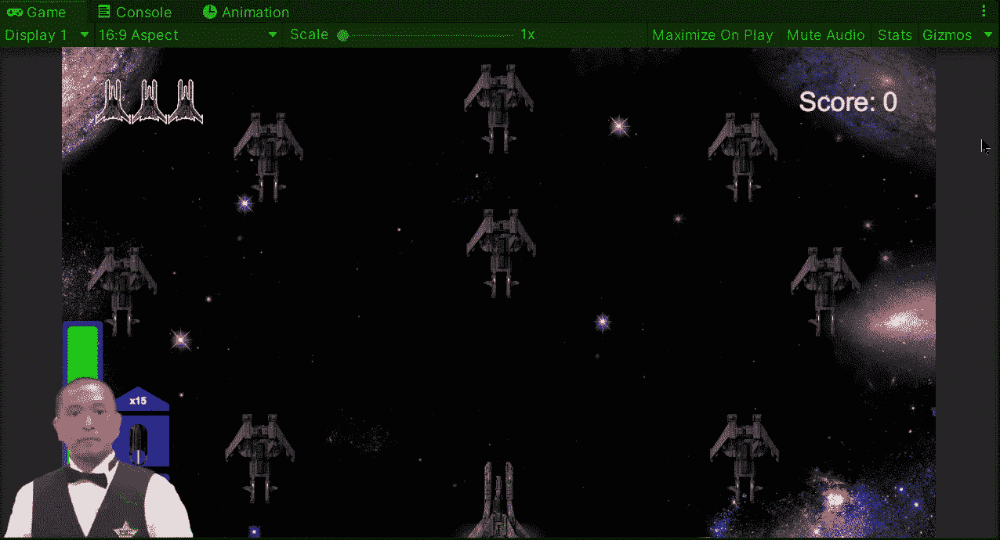

**目标**:用 Unity 实现一款太空射击游戏的新型射击。

在之前的帖子中，我[在我的 Unity 太空射击游戏中实现了一个相机抖动效果](https://fas444.medium.com/implementing-space-shooter-game-features-camera-shake-51c6eb02704a)。现在是时候为玩家飞船实现一种新的射击方式了。

# 新资产

首先，让我们得到新的精灵来实现新的镜头。如果你没有任何版本的软件来创建它们，你总是可以使用一个免费的，就像我用的这个:

 [## 图片编辑:Pixlr.com-免费在线图片编辑

### 登录/注册欢迎使用 Pixlr 的免费现代照片编辑器。点击打开照片按钮开始编辑…

pixlr.com](https://pixlr.com/x/) 

此外，如果你不知道如何创建镜头、电源或动画，你可以查看这些旧帖子以获得参考:

 [## 在 Unity 中实例化和销毁游戏对象

### 在 Unity 中为你的游戏实例化和销毁游戏对象的快速指南

fas444.medium.com](https://fas444.medium.com/how-to-instantiate-destroy-gameobjects-in-unity-e8830cddd58f)  [## 在 Unity 中为你的游戏创造动力

### 关于如何在你的 Unity 游戏中实现一个增强道具的快速指南

medium.com](/nerd-for-tech/creating-a-power-up-for-your-game-in-unity-6810d73376a1)  [## 在 Unity 中制作精灵动画

### 关于如何在 Unity 中制作精灵动画的快速指南

medium.com](/nerd-for-tech/animating-sprites-in-unity-9d02762bde96) 

## 新镜头

这是新的射击精灵，当它击中一个敌人时，会变成弹丸射击继续摧毁周围的敌人:

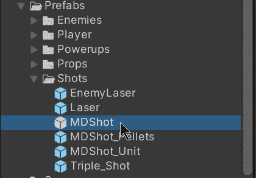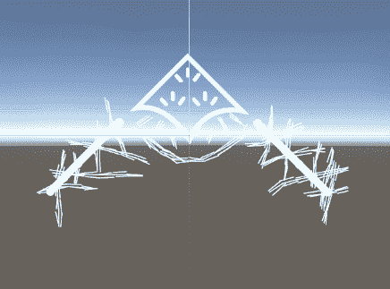

制作一个预置来从玩家脚本中实例化它。

## 弹丸射击

这是新射击的弹丸，当新射击击中敌人时，它将被实例化为另一个方向:

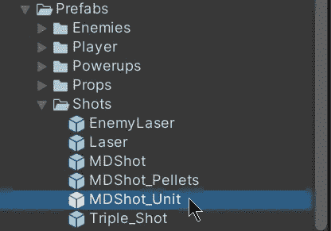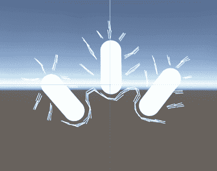

## 预制颗粒

这是一个预设，包括新镜头的各个小球，当实例化时，它们将前往 8 个不同的方向打击其他敌人:

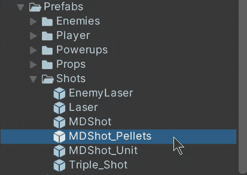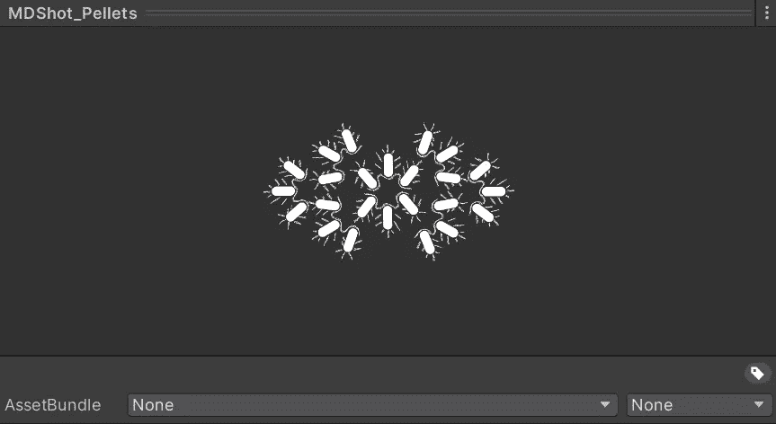

## 通电项目

这是一个新的增强物品，当它被玩家收集时，可以进行 5 秒钟的多方向新射击:

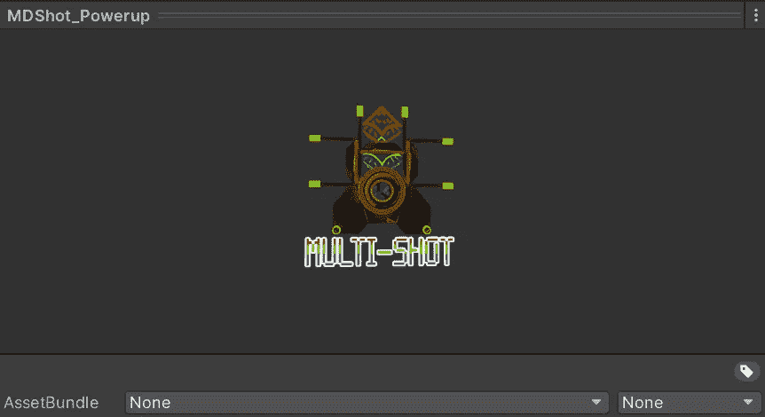

# 实现新镜头

现在，为了实现新的镜头行为。让我们创建 3 个新脚本:

*   发射
*   向前射门
*   MDShot

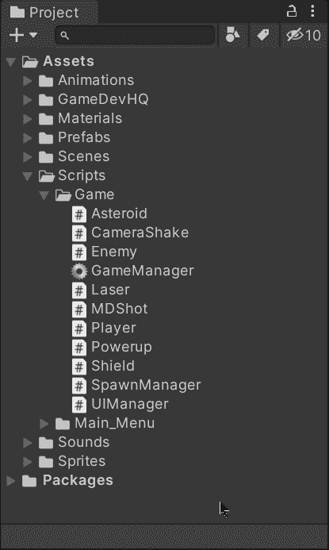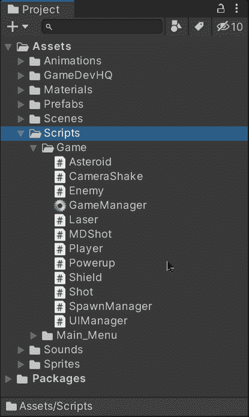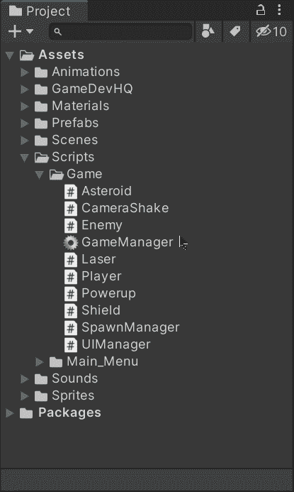

## 铅球课

这个类不会继承自[**monobehavior**](https://docs.unity3d.com/ScriptReference/MonoBehaviour.html)。它将作为主类来包含游戏中一个镜头可能拥有的所有属性，就像:

*   速度
*   属性(玩家或敌人射击)
*   彩色动画
*   消防费
*   要实例化的偏移量
*   要实例化的空间界限

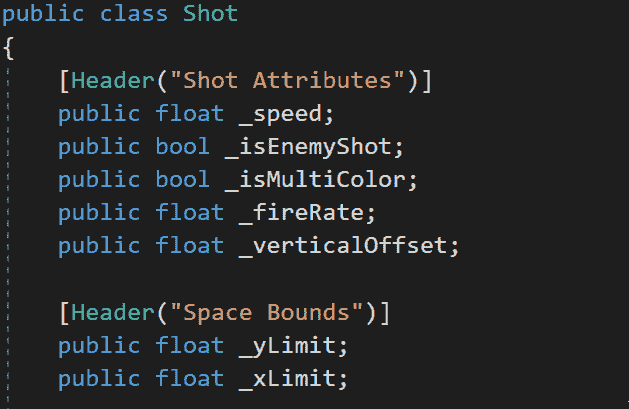

为了能够在检查器中修改每个镜头的属性，让我们使用**【系统。【T9]serializable]上面的类声明:**

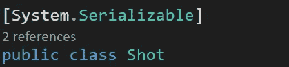

## 前锋级别

这个类将处理空间中沿一条直线移动的镜头的行为，就像将要包含的激光和多方向镜头一样。

我们需要从[**monobehavior**](https://docs.unity3d.com/ScriptReference/MonoBehaviour.Start.html)**继承的类能够修改这个脚本附加到的游戏对象。然后，我们可以使用 **Shot** 类来修改和使用 Shot 的属性。最后，如果我们想用不同的颜色来制作这个镜头的动画，我们需要通过 gameobject 的**精灵渲染器**组件来修改精灵的颜色。**

****

**如果镜头被设置为动画，我们将需要初始化各自的**精灵渲染器**和**延迟**来在空间中旅行时改变颜色。然后我们需要调用各自的[协程](https://fas444.medium.com/using-coroutines-in-unity-5fa1d51e0055)来开始改变颜色:**

**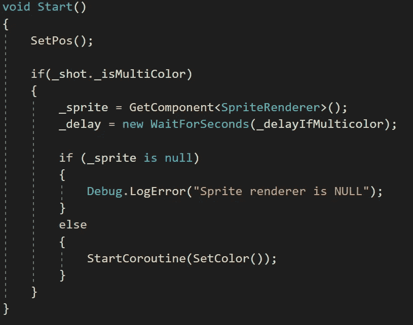****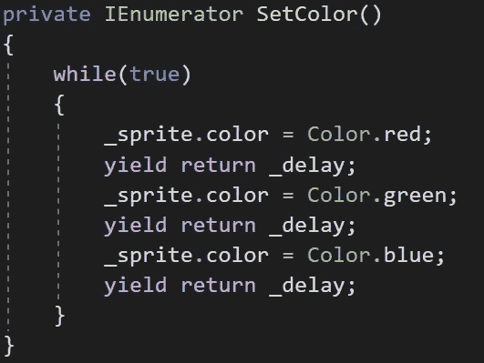**

**然后，为了在一行中处理移动，根据镜头的属性，让我们在**更新**方法中移动各自的镜头:**

**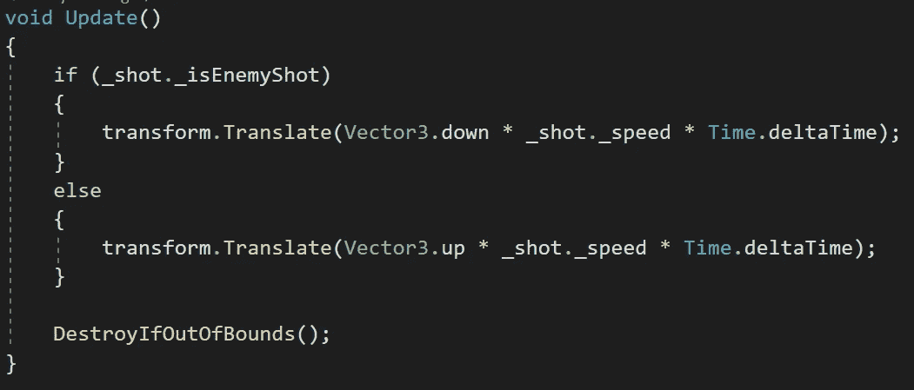**

**如果快照移动到在 **Shot** 类中声明的空间边界之外，它将被销毁。**

## **多方向射击类**

**现在，为了处理带有新镜头的小球实例，让我们从 **ForwardShot** 类继承同样的行为，但是让我们在带有这个脚本的镜头与敌人碰撞时实例化小球:**

**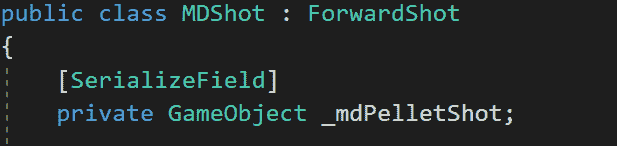****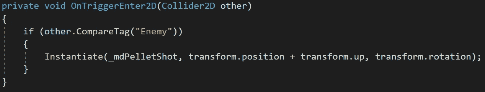**

> **注意:我没有使用虚方法或覆盖，因为在这种情况下， **ForwardShot** 类不使用 OnTriggerEnter2D 方法。**

**如果我将 **MDShot** 脚本附加到新镜头，当我在游戏中使用它时，小球将被实例化:**

**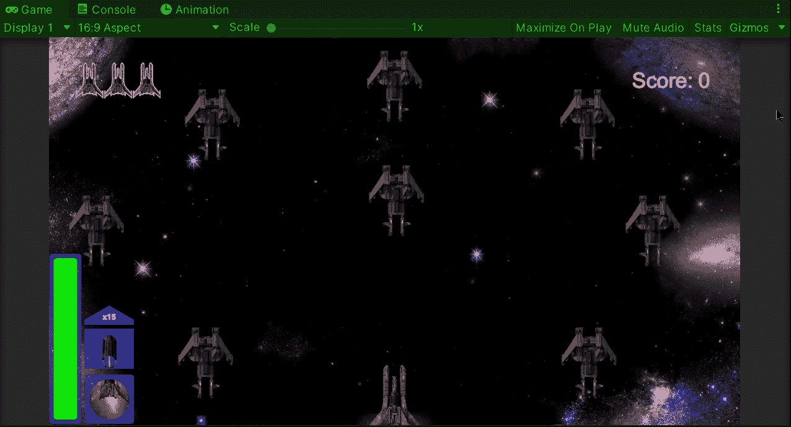**

# **启用新镜头**

**现在，为了实现 5 秒钟的多方向拍摄，让我们修改各自的脚本:**

## **玩家等级**

**让我们创建一个新的数组来存储玩家可以拥有的不同类型的镜头。此外，让我们保留一个对当前快照的引用，以便我们可以在需要时实例化它:**

**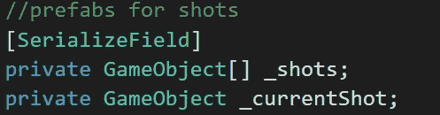****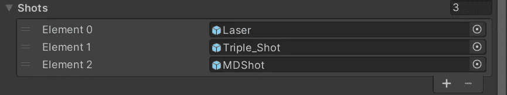**

**然后，让我们创建一些方法来处理快照的选择及其各自的行为:**

**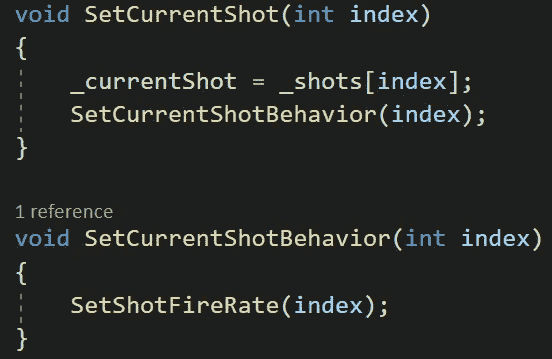**

**用下一个方法，我们将确保**射击**类中包含的射速影响玩家:**

**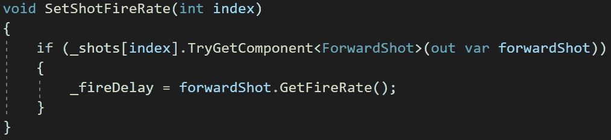**

**然后，为了在收集加电时启用相应的快照，让我们调用上面的方法之一，将数组中的快照编号作为参数:**

**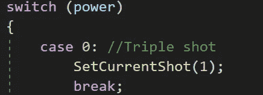****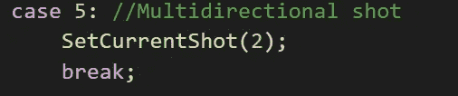****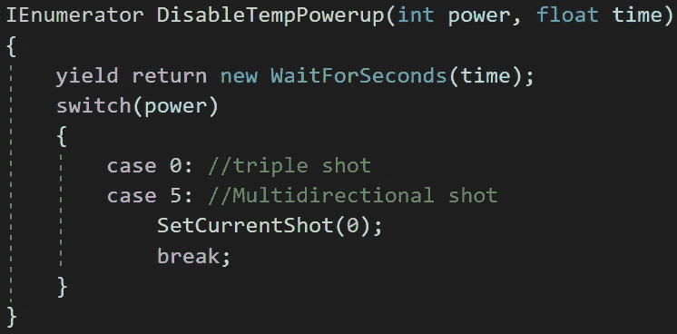**

**在协程中禁用快照时，将再次选择默认快照(激光)。**

**现在，当玩家射击时，我们将实例化选定的镜头:**

**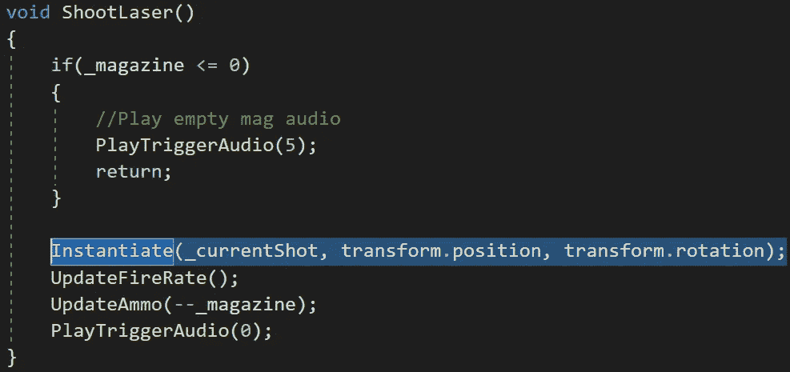**

## **通电等级**

**此外，为了根据稀有度产生异能，让我们用一个**枚举**从检查员那里选择稀有度:**

**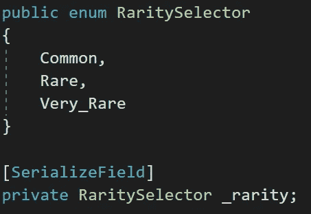****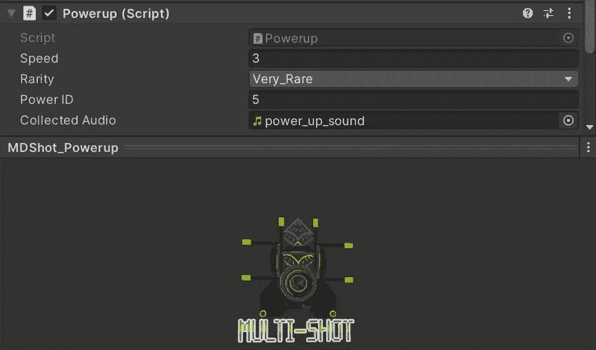**

## **衍生管理器类**

**让我们通过创建新列表，按照稀有程度来划分不同的异能:**

**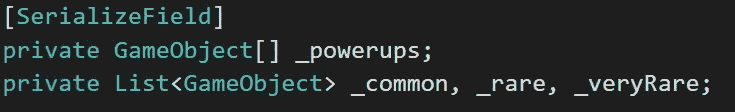**

**在 **Start** 方法中，让我们调用下一个方法来初始化列表并用各自的加电填充它们。要选择正确的列表，我们可以从加电物品预设中附带的**加电**脚本组件中获得稀有度:**

**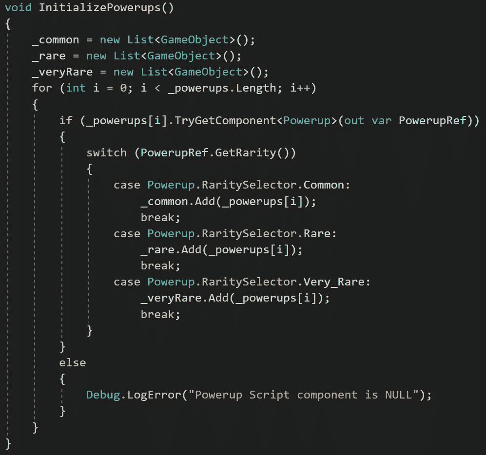**

**现在，为了根据稀有概率产生一个随机能力，让我们创建一个新的方法来返回相应的预置物品:**

**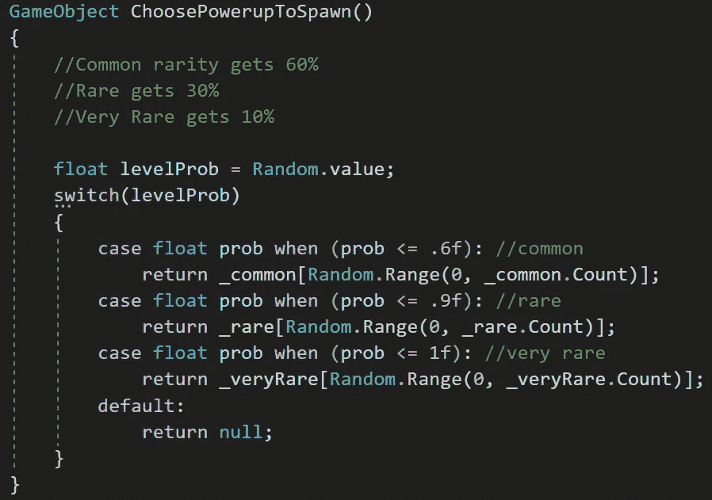**

**最后，让我们在相应的协程中实例化新的加电时调用该方法:**

**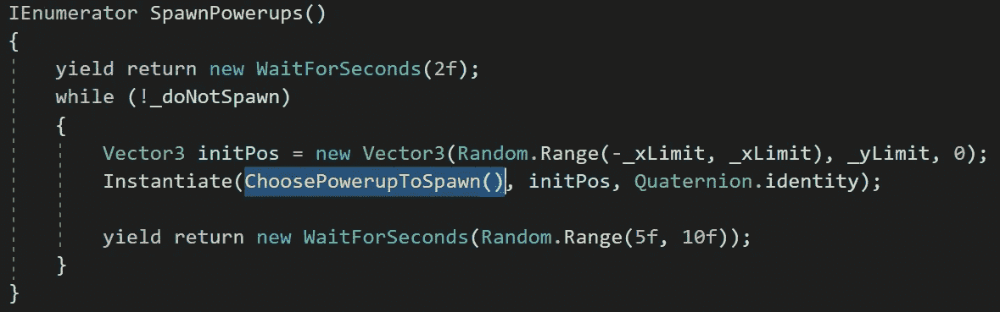**

**现在，如果我们在 Unity 中运行游戏，我们将能够毫无困难地使用多方向拍摄:**

**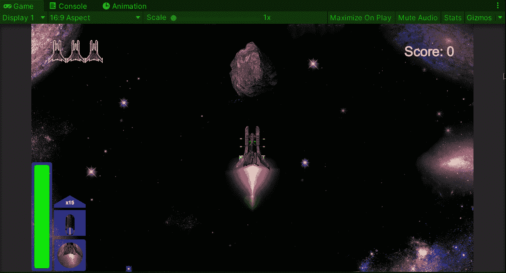**

**就这样，我们实现了一个新的镜头！:d .我会在下一篇文章中看到你，在那里我会展示更多添加到我的 Unity 太空射击游戏中的功能。**

> ***如果你想了解我更多，欢迎登陆*[***LinkedIn***](https://www.linkedin.com/in/fas444/)**或访问我的* [***网站***](http://fernandoalcasan.com/) *:D****